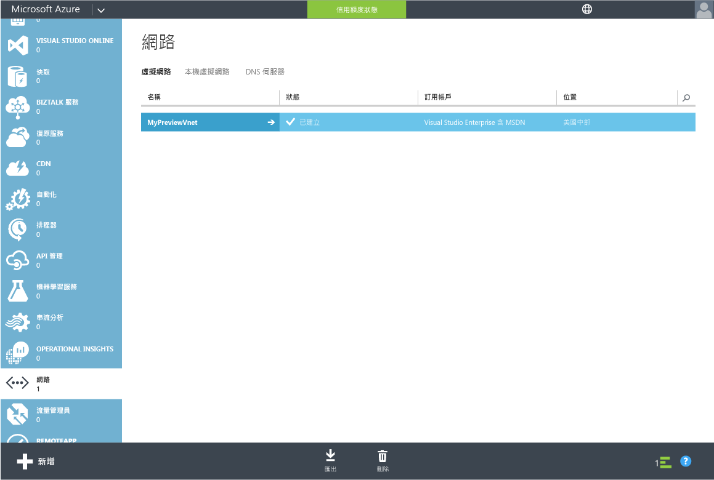
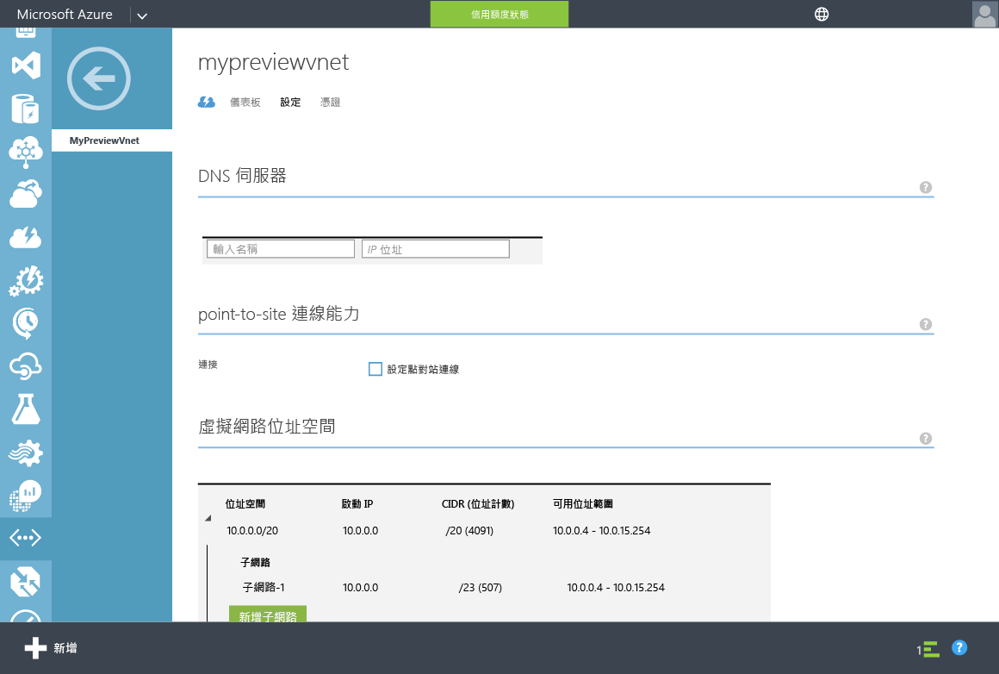
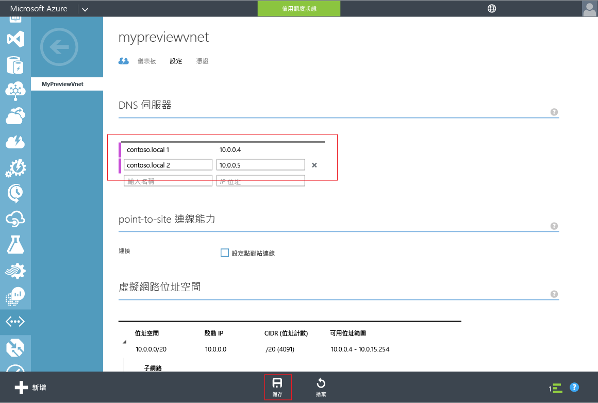

# 更新 Azure 虛擬網路的 DNS 設定
## 工作 4 - 更新 Azure 虛擬網路的 DNS 設定
在先前的組態工作中，您已成功為目錄啟用 Azure Active Directory Domain Services。 下一個工作是確保虛擬網路內的電腦可以連線並取用這些服務。 在本文中，您可以更新虛擬網路的 DNS 伺服器設定，以指向虛擬網路上可以使用 Azure Active Directory Domain Services 的兩個 IP 位址。

> [!NOTE]
> 在您已啟用目錄的 Azure Active Directory Domain Services 之後，請記下在您目錄的 [設定] 索引標籤上顯示之 Azure Active Directory Domain Services 的 IP 位址。
>
>

若要為已啟用 Azure Active Directory Domain Services 的虛擬網路更新 DNS 伺服器設定，請執行下列作業︰

1. 前往 [Azure 傳統入口網站](https://manage.windowsazure.com)。
2. 在左側窗格中，選取 [網路]。  
    隨即開啟 [網路] 視窗。

    
3. 在 [虛擬網路] 索引標籤上，選取已啟用 Azure Active Directory Domain Services 的虛擬網路，以檢視其內容。
4. 按一下 [設定]  索引標籤。

    
5. 已在 [DNS 伺服器] 區段中，輸入您目錄的 [設定] 索引標籤之 [網域服務] 中所顯示的兩個 IP 位址。
6. 若要儲存此虛擬網路的 DNS 伺服器設定，請在頁面底部之工作窗格上按一下 [儲存]。

   

> [!NOTE]
> 網路中的虛擬機器只會在重新啟動時取得新的 DNS 設定。 如果您希望它們立即取得更新後的 DNS 設定，請透過入口網站、PowerShell 或 CLI 觸發重新啟動。
>
>

## 後續步驟
工作 5：[啟用 Azure Active Directory Domain Services 的密碼同步處理](active-directory-ds-getting-started-password-sync.md)

