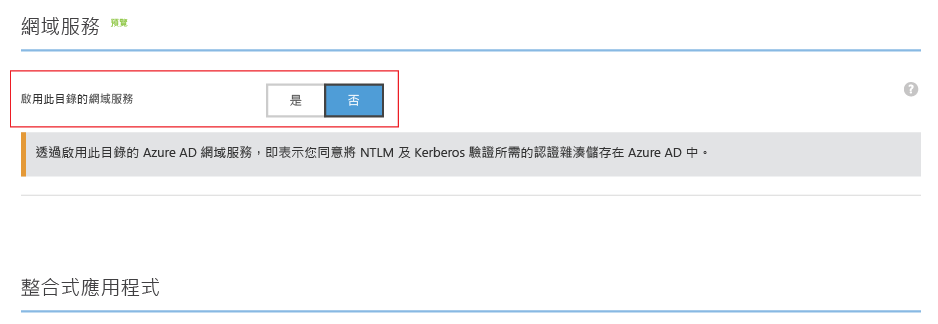
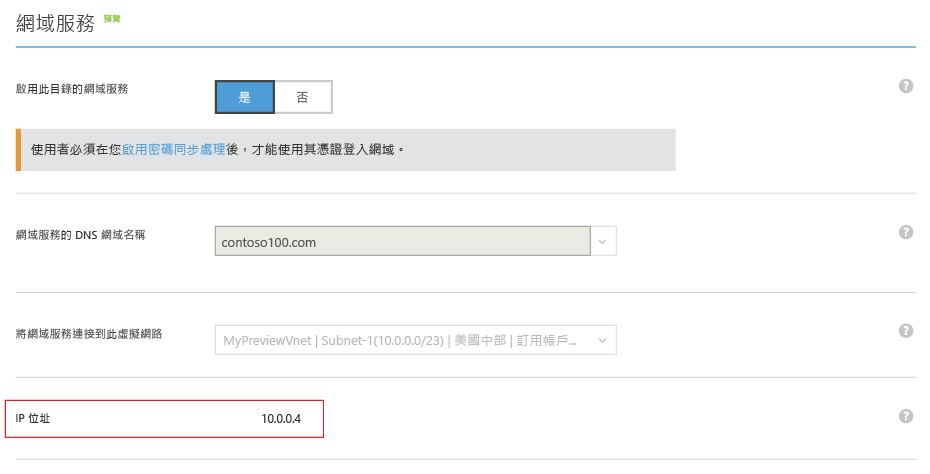
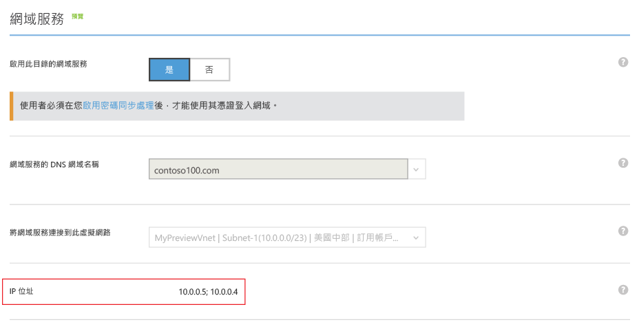

<properties
	pageTitle="Azure AD 網域服務：啟用 Azure AD 網域服務 | Microsoft Azure"
	description="開始使用 Azure Active Directory 網域服務"
	services="active-directory-ds"
	documentationCenter=""
	authors="mahesh-unnikrishnan"
	manager="stevenpo"
	editor="curtand"/>

<tags
	ms.service="active-directory-ds"
	ms.workload="identity"
	ms.tgt_pltfrm="na"
	ms.devlang="na"
	ms.topic="get-started-article"
	ms.date="09/21/2016"
	ms.author="maheshu"/>

# 啟用 Azure AD 網域服務

## 工作 3：啟用 Azure AD 網域服務
在此工作中，您會針對目錄啟用 Azure AD 網域服務。執行下列組態步驟，針對您的目錄啟用 Azure AD 網域服務。

1. 瀏覽到 **Azure 傳統入口網站** ([https://manage.windowsazure.com](https://manage.windowsazure.com))。

2. 在左窗格中，選取 [Active Directory] 節點。

3. 選取您要啟用 Azure AD 網域服務的 Azure AD 租用戶 (目錄)。

    

4. 按一下 [設定] 索引標籤。

    

5. 向下捲動到標題為**網域服務**的區段。

    

6. 將標題為**啟用此目錄的網域服務**的選項切換至 [是]。您會注意到頁面上出現了更多適用於 Azure AD 網域服務的組態選項。

    

    > [AZURE.NOTE] 當您針對租用戶啟用 Azure AD 網域服務時，Azure AD 會產生並儲存驗證使用者所需的 Kerberos 和 NTLM 認證雜湊。

7. 指定**網域服務的 DNS 網域名稱**。

   - 根據預設，將會選取目錄的預設網域名稱 (亦即以 **.onmicrosoft.com** 網域尾碼為結束)。

   - 清單包含所有已針對 Azure AD 目錄設定的網域，包括您在 [網域] 索引標籤中設定的已驗證以及未驗證的網域。

   - 此外，您也可以輸入自訂網域名稱將它新增至此清單中。在此範例中，我們輸入了自訂網域名稱 'contoso100.com'

     > [AZURE.WARNING] 請確定您指定之網域名稱的網域前置詞 (例如 'contoso100.com' 網域名稱中的 'contoso100') 不超過 15 個字元。您無法建立網域前置詞超過 15 個字元的「Azure AD 網域服務」網域。

8. 下一個步驟是選取您想要在其中使用「Azure AD 網域服務」的虛擬網路。在標題為**將網域服務連接到此虛擬網路**的下拉式清單中，選取您建立的虛擬網路。

   - 請確定您指定的虛擬網路屬於「Azure AD 網域服務」所支援的 Azure 區域。

   - 請參閱[依區域提供的 Azure 服務](https://azure.microsoft.com/regions/#services/)頁面，以了解可使用 Azure AD 網域服務的 Azure 區域。

   - 屬於不支援 Azure AD 網域服務區域的虛擬網路，不會出現在下拉式清單中。

   - 同樣地，使用 Azure Resource Manager 建立的虛擬網路也不會出現在下拉式清單中。Resource Manager 型虛擬網路目前不為 Azure AD 網域服務所支援。

9. 確定虛擬網路中還沒有您為受管理網域選擇的 DNS 網域名稱。具體來說，請檢查是否有下列情況︰

   - 您在虛擬網路上已有 DNS 網域名稱相同的網域。

   - 您選取的虛擬網路已透過 VPN 連線到內部部署網路，而您在內部部署網路上有 DNS 網域名稱相同的網域。

   - 您在虛擬網路上已有具有該名稱的雲端服務。

10. 若要啟用 Azure AD 網域服務，請按一下頁面下方工作窗格中的 [儲存]。

11. 針對您的目錄啟用 Azure AD 網域服務時，此頁面會顯示 [擱置中...] 狀態。

    

    > [AZURE.NOTE] 「Azure AD 網域服務」可針對您的受管理網域提供高可用性。啟用 Azure AD 網域服務後請注意，可在虛擬網路上使用網域服務的 IP 位址會逐一顯示。一旦服務針對您的網域啟用高可用性之後，第二個 IP 位址便會立即顯示。在針對您的網域設定高可用性並使它成為作用中狀態時，您應該會在 [設定] 索引標籤的 [網域服務] 區段中看到兩個 IP 位址。

12. 大約 20-30 分鐘後，您會在 [設定] 頁面的 [IP 位址] 欄位中看見可在您虛擬網路上使用「網域服務」的第一個 IP 位址。

    

13. 若您的網域可支援高可用性，則您會在頁面上看見兩個 IP 位址。這些都是可在您所選虛擬網路上使用 Azure AD 網域服務的 IP 位址。記下這些 IP 位址，以更新您虛擬網路的 DNS 設定。這個步驟會讓虛擬網路上的虛擬機器連線到網域，以進行像是加入網域等作業。

    

> [AZURE.NOTE] 根據 Azure AD 租用戶大小而定 (使用者的數目、群組等)，租用戶的內容需要一些時間才會出現在 Azure AD 網域服務中。這個同步處理程序會在背景執行。對於具有成千上萬個物件的大型租用戶，則可能需要一到兩天的時間，所有使用者、群組成員資格和認證才會出現在 Azure AD 網域服務中。

 

## 工作 4 - 更新 Azure 虛擬網路的 DNS 設定
下一個組態工作是[更新 Azure 虛擬網路的 DNS 設定](active-directory-ds-getting-started-dns.md)。

<!---HONumber=AcomDC_0928_2016-->