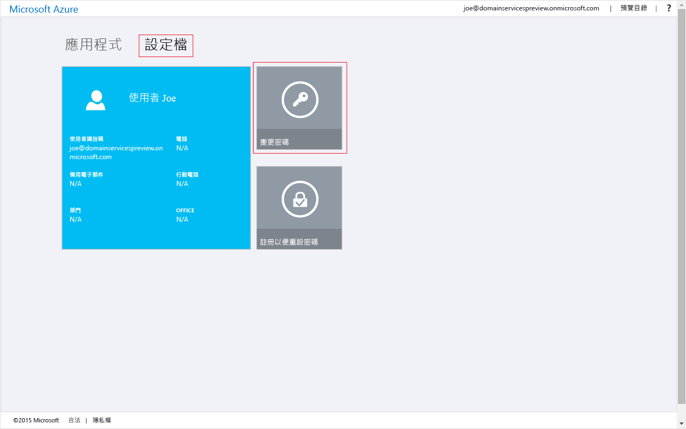
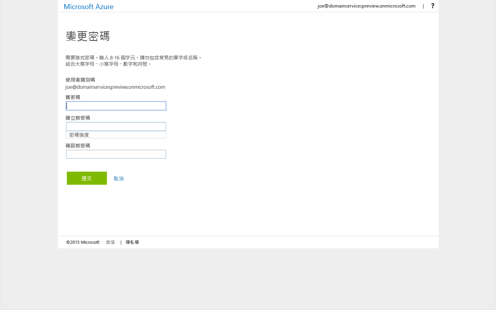

# 啟用 Azure AD 網域服務的密碼同步處理
在先前工作中，您無法為 Azure AD 租用戶啟用 Azure AD 網域服務。 下一項工作是啟用 NTLM 和 Kerberos 驗證所需的認證雜湊，以同步處理到 Azure AD 網域服務。 設定認證同步處理後，使用者即可使用他們的公司認證來登入受管理的網域。

根據組織有僅限雲端的 Azure AD 租用戶，或已設定為使用 Azure AD Connect 來與內部部署目錄同步處理，所需的步驟會有所不同。

 

> [!div class="op_single_selector"]
> * [僅限雲端的 Azure AD 租用戶](active-directory-ds-getting-started-password-sync.md)
> * [已同步處理的 Azure AD 租用戶](active-directory-ds-getting-started-password-sync-synced-tenant.md)
>
>

 

## 工作 5︰為僅限雲端的 Azure AD 租用戶啟用 AAD 網域服務的密碼同步處理
Azure AD 網域服務需要適合於 NTLM 和 Kerberos 驗證之格式的認證雜湊，才能在受管理的網域上驗證使用者。 除非您針對租用戶啟用 Azure AAD 網域服務，否則 Azure AD 不會以 Kerberos 和 NTLM 驗證所需的格式產生或儲存認證雜湊。 基於明顯的安全性考量，Azure AD 也不會儲存任何純文字形式的認證。 因此，Azure AD 沒辦法根據使用者的現有認證來產生這些 NTLM 或 Kerberos 認證雜湊。

> [!NOTE]
> 如果您的組織有僅限雲端的 Azure AD 租用戶，則需要使用 Azure AD 網域服務的使用者必須變更其密碼。
>
>

此密碼變更程序會在 Azure AD 中產生 Azure AD 網域服務進行 Kerberos 和 NTLM 驗證所需的認證雜湊。 您可以針對租用戶中所有需要使用 Azure AD 網域服務的使用者來使其密碼過期，或者指示這些使用者變更他們的密碼。

### 為僅限雲端的 Azure AD 租用戶啟用 NTLM 和 Kerberos 認證雜湊產生功能
以下是您需要提供使用者才能變更其密碼的指示：

1. 在 [http://myapps.microsoft.com](http://myapps.microsoft.com)瀏覽至組織的 [Azure AD 存取面板] 頁面。
2. 選取此頁面上的 [設定檔]  索引標籤。
3. 按一下此頁面上的 [變更密碼]  圖格。

    

   > [!NOTE]
   > 如果您在 [存取面板] 頁面上看不到 [變更密碼] 選項，請確定您的組織已設定 [Azure AD 中的密碼管理](../active-directory/active-directory-passwords-getting-started.md)。
   >
   >
4. 在 [變更密碼]  頁面上，輸入您現有 (舊的) 密碼，然後輸入新密碼並加以確認。 按一下 [提交] 。

    

當您變更密碼之後，新的密碼短時間內就能在 Azure AD 網域服務中使用。 幾分鐘 (通常大約 20 分鐘) 之後，您就能使用最近變更的密碼來登入已加入受管理網域的電腦。

 

## 相關內容
* [如何更新自己的密碼](../active-directory/active-directory-passwords-update-your-own-password.md#reset-your-password)。)
* [在 Azure AD 中開始使用密碼管理](../active-directory/active-directory-passwords-getting-started.md)。
* [為同步處理的 Azure AD 租用戶啟用 AAD 網域服務的密碼同步處理](active-directory-ds-getting-started-password-sync-synced-tenant.md)
* [Administer an Azure AD Domain Services managed domain (管理 Azure AD 網域服務受管理的網域)](active-directory-ds-admin-guide-administer-domain.md)
* [將 Windows 虛擬機器加入 Azure AD 網域服務受管理的網域](active-directory-ds-admin-guide-join-windows-vm.md)
* [將 Red Hat Enterprise Linux 虛擬機器加入 Azure AD 網域服務受管理的網域](active-directory-ds-admin-guide-join-rhel-linux-vm.md)

