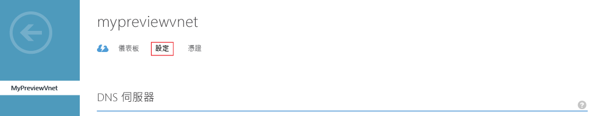
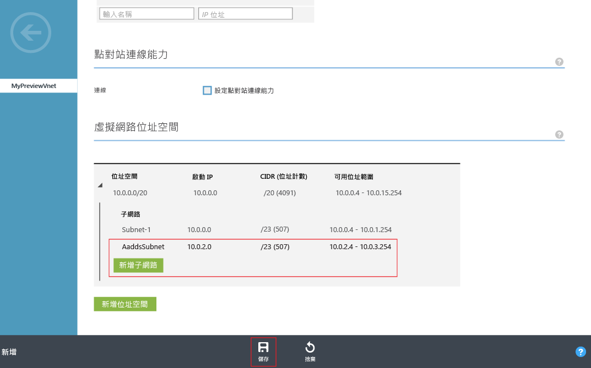

# 為 Azure Active Directory Domain Services 建立或選取虛擬網路
## 開始之前
請參閱 [Azure Active Directory Domain Services 的網路考量](active-directory-ds-networking.md)。

## 工作 2：建立 Azure 虛擬網路
下一個組態工作是建立 Azure 虛擬網路與其中的子網路。 您可在虛擬網路內的這個子網路中啟用 Azure Active Directory Domain Services。 如果您現在有慣用的虛擬網路，就可以略過此步驟。

> [!NOTE]
> 請確定您建立或選擇與 Azure Active Directory Domain Services 搭配使用的 Azure 虛擬網路，會屬於 Azure Active Directory Domain Services 所支援的 Azure 區域。 如需可使用 Azure Active Directory Domain Services 的 Azure 區域清單，請參閱[依區域提供的 Azure 服務](https://azure.microsoft.com/regions/#services/)頁面。
>
>請記下虛擬網路的名稱，以確保當您在後續設定步驟中啟用 Azure Active Directory Domain Services 時，就能選取正確的虛擬網路。

若要建立您要啟用 Azure Active Directory Domain Services 的 Azure 虛擬網路，請依照下列這些設定指示︰

1. 前往 [Azure 傳統入口網站](https://manage.windowsazure.com)。
2. 在左側窗格中，選取 [網路]。

      
    **虛擬網路**視窗隨即開啟。
3. 在視窗底部的工作窗格中，按一下 [新增]。

    
4. 按一下 [網絡服務]，然後選取 [虛擬網路]。
    
    
5. 若要建立虛擬網路，按一下 [快速建立]。
    
6. 指定虛擬網路的**名稱**，並考慮執行下列步驟︰ 
    * 您可以選擇針對此網路設定 [位址空間] 或 [最大的 VM 計數]。 
    * 您現在可以讓 **DNS 伺服器**設定保留為 [無]。 您可以在啟用 Azure Active Directory Domain Services 之後更新設定。
7. 在 [位置] 下拉式清單中選取支援的 Azure 區域。  
    如需可使用 Azure Active Directory Domain Services 的 Azure 區域清單，請參閱[依區域提供的 Azure 服務](https://azure.microsoft.com/regions/#services/)頁面。
8. 若要建立虛擬網路，請按一下 [建立虛擬網路]。

    
9. 建立虛擬網路後，請選取虛擬網路的名稱，然後按一下 [設定] 索引標籤。

    
10. 在 [虛擬網路位址空間] 下，按一下 [新增子網路]，然後將子網路名稱指定為 **AaddsSubnet**。 

    

11. 若要建立子網路，按一下 [儲存]。

## 後續步驟
工作 3︰[啟用 Azure Active Directory Domain Services](active-directory-ds-getting-started-enableaadds.md)

