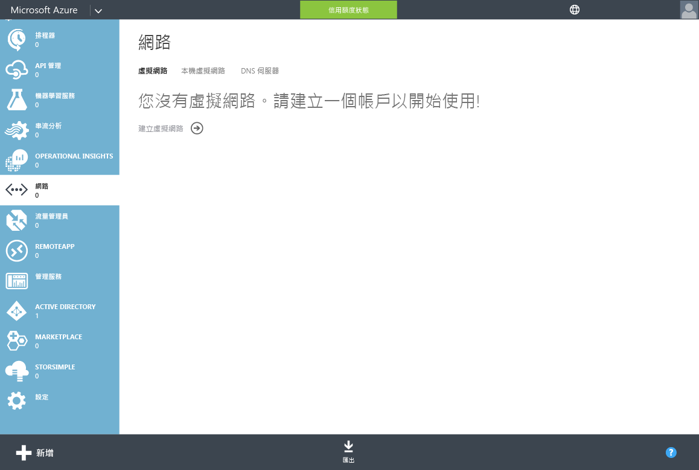
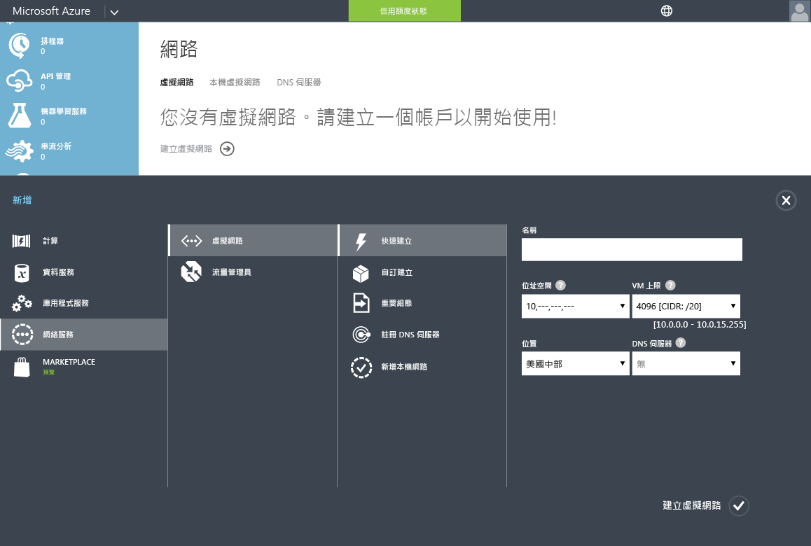
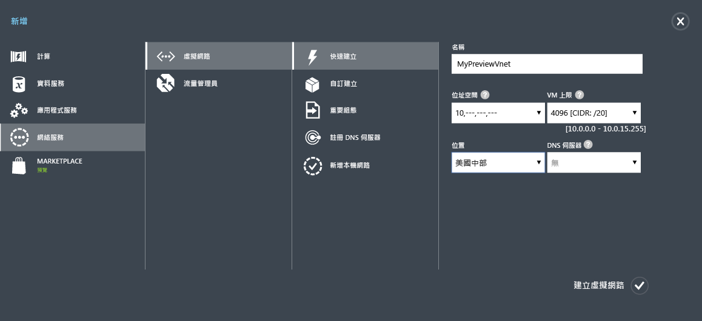

<properties
	pageTitle="Azure AD 網域服務：建立或選取虛擬網路 | Microsoft Azure"
	description="開始使用 Azure Active Directory 網域服務"
	services="active-directory-ds"
	documentationCenter=""
	authors="mahesh-unnikrishnan"
	manager="stevenpo"
	editor="curtand"/>

<tags
	ms.service="active-directory-ds"
	ms.workload="identity"
	ms.tgt_pltfrm="na"
	ms.devlang="na"
	ms.topic="get-started-article"
	ms.date="09/20/2016"
	ms.author="maheshu"/>

# 為 Azure AD 網域服務建立或選取虛擬網路

## 選取 Azure 虛擬網路的指導方針
> [AZURE.NOTE] **開始之前**︰請參閱 [Azure AD 網域服務的網路考量](active-directory-ds-networking.md)。

## 工作 2：建立 Azure 虛擬網路
下一個設定工作是建立您想要啟用 Azure AD 網域服務的 Azure 虛擬網路。如果您現在已經有慣用的虛擬網路，就可以略過此步驟。

> [AZURE.NOTE] 請確定您建立或選擇與 Azure AD 網域服務搭配使用的 Azure 虛擬網路，會屬於 Azure AD 網域服務所支援的 Azure 區域。請參閱[依區域提供的 Azure 服務](https://azure.microsoft.com/regions/#services/)頁面，以了解可使用 Azure AD 網域服務的 Azure 區域。

請記下虛擬網路的名稱，如此一來，當您在後續設定步驟中啟用 Azure AD 網域服務時，就能選取正確的虛擬網路。

執行下列組態步驟，以建立您想要啟用 Azure AD 網域服務的 Azure 虛擬網路。

1. 瀏覽到 **Azure 傳統入口網站** ([https://manage.windowsazure.com](https://manage.windowsazure.com))。

2. 在左窗格中選取 [網路] 節點。

3. 在頁面底部的工作窗格中，按一下 [新增]。

    

4. 在 [網路服務] 節點中，選取 [虛擬網路]。

5. 按一下 [快速建立] 以建立虛擬網路。

    

6. 指定虛擬網路的**名稱**。您也可以選擇針對此網路設定 [位址空間] 或 [最大的 VM 計數]。您現在可以讓 DNS 伺服器設定保留為 [無]。此設定將在您啟用 Azure AD 網域服務之後更新。

7. 請確定您會在 [位置] 下拉式清單中選取支援的 Azure 區域。請參閱[依區域提供的 Azure 服務](https://azure.microsoft.com/regions/#services/)頁面，以了解可使用 Azure AD 網域服務的 Azure 區域。

8. 若要建立虛擬網路，請按一下 [建立虛擬網路] 按鈕。

    

 

## 工作 3 - 啟用 Azure AD 網域服務
下一個設定工作是[啟用 Azure AD 網域服務](active-directory-ds-getting-started-enableaadds.md)。

<!---HONumber=AcomDC_0921_2016-->