<properties
	pageTitle="Azure 中的 Active Directory Federation Services | Microsoft Azure"
	description="在本文件中，您將了解如何在 Azure 中部署 AD FS 以獲得高可用性。"
    keywords="AD FS 簡介, Azure, Azure AD Connect 概觀, Azure 中的 AD FS, iaas, ADFS"
	services="active-directory"
	documentationCenter=""
	authors="anandyadavmsft"
	manager="femila"
	editor=""/>

<tags
	ms.service="active-directory"
	ms.workload="identity"
	ms.tgt_pltfrm="na"
	ms.devlang="na"
	ms.topic="get-started-article"
	ms.date="07/13/2016"
	ms.author="anandy;billmath"/>

# Azure 中的 AD FS 部署 

AD FS 提供簡化、安全的身分識別同盟和 Web 單一登入 (SSO) 功能。與 Azure AD 或 O365 同盟可讓使用者使用內部部署認證進行驗證，並存取雲端中的所有資源。如此一來，就一定要有高可用性的 AD FS 基礎結構，以確保能夠存取內部部署和雲端中的資源。在 Azure 中部署 AD FS 有助於達成執行最低限度的工作所需要的高可用性。在 Azure 中部署 AD FS 有幾項優點，以下列出其中幾點︰

* **高可用性** – 憑借 Azure 可用性設定組的能力，您可以確保高可用性的基礎結構。
* **容易調整** – 需要更多效能？ 只要在 Azure 中按幾下，就能輕鬆地移轉至更強大的機器
* **跨異地備援** – 使用 Azure 異地備援，您可以確保基礎結構在全球各地均具有高可用性
* **容易管理** – 透過 Azure 入口網站中極簡化的管理選項，基礎結構管理起來既容易又省事

## 設計原則

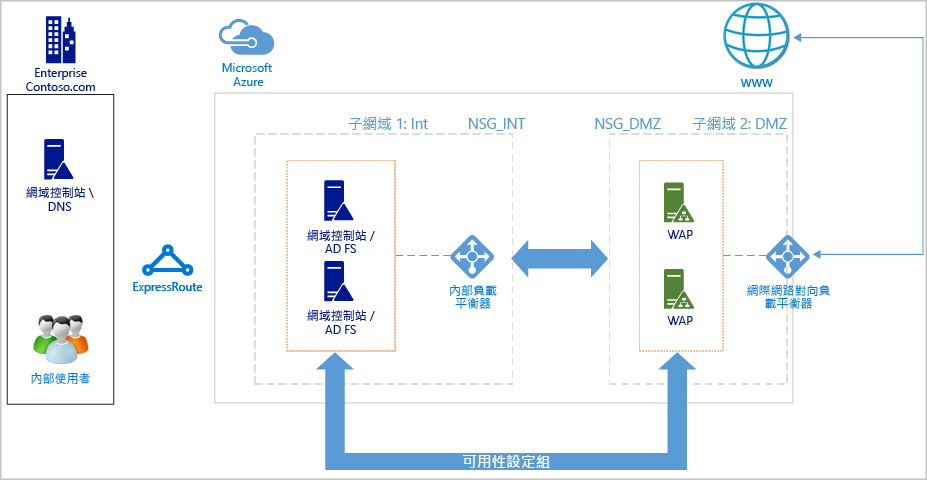

上圖顯示建議用來在 Azure 中部署 AD FS 基礎結構的基本拓撲。以下列出拓撲的各個元件背後的原理︰

* **DC/ADFS 伺服器**︰如果您的使用者人數少於 1,000 名，可以直接在網域控制站上安裝 AD FS 角色。如果不想影響網域控制站的效能，或者使用者人數超過 1,000 名，則請在不同伺服器部署 AD FS。
* **WAP 伺服器**︰一定要部署 Web 應用程式 Proxy 伺服器，才能讓不在公司網路內的使用者也可以連線到 AD FS。
* **DMZ**︰Web 應用程式 Proxy 伺服器將會置於 DMZ，而且 DMZ 與內部子網路之間只允許進行 TCP/443 存取。
* **負載平衡器**︰為了確保 AD FS 和 Web 應用程式 Proxy 伺服器具有高可用性，建議您針對 AD FS 伺服器使用內部負載平衡器，針對 Web 應用程式 Proxy 伺服器使用 Azure Load Balancer。
* **可用性設定組**︰為了提供 AD FS 部署備援，建議您將工作負載類似的兩個以上的虛擬機器分在同一個可用性設定組。這項組態可以確保在規劃或未規劃的維護事件發生期間，至少有一部虛擬機器可以使用。
* **儲存體帳戶**︰建議您擁有兩個儲存體帳戶。只擁有一個儲存體帳戶可能會產生單一失敗點，而且如果儲存體帳戶失效 (雖然不太可能發生)，則會無法使用部署。兩個儲存體帳戶則有助於讓每條故障路線有一個相關聯的儲存體帳戶。
* **網路隔離**︰請將 Web 應用程式 Proxy 伺服器部署在不同的 DMZ 網路。您可以將一個虛擬網路分割成兩個子網路，然後在隔離的子網路部署 Web 應用程式 Proxy 伺服器。您可以簡單地設定每個子網路的網路安全性群組設定，並只允許兩個子網路之間進行必要的通訊。下面會提供每種部署案例的其他詳細資料

##在 Azure 中部署 AD FS 的步驟

本節所述步驟會概述在 Azure 中部署如下所示的 AD FS 基礎結構的指南。

### 1\.部署網路

如上所述，您可以在單一虛擬網路中建立兩個子網路，或是建立兩個完全不同的虛擬網路 (VNet)。本文內容著重於部署單一虛擬網路，再將它分成兩個子網路。就目前來說，這個方法較為簡單，因為如果是兩個不同的 VNet，就必須要有 VNet 對 VNet 閘道才能進行通訊。

**1.1 建立虛擬網路**

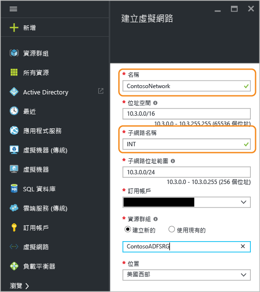
	
在 Azure 入口網站中選取虛擬網路，然後只需要按一下就可以立即部署虛擬網路和一個子網路。INT 子網路也會定義好，立即可供要新增的 VM 使用。下一個步驟是在網路中新增另一個子網路，也就是 DMZ 子網路。為了建立 DMS 子網路，請直接

* 選取新建立的網路
* 在屬性中選取子網路
* 在子網路面板中，按一下新增按鈕
* 提供用來建立子網路的子網路名稱和位址空間資訊

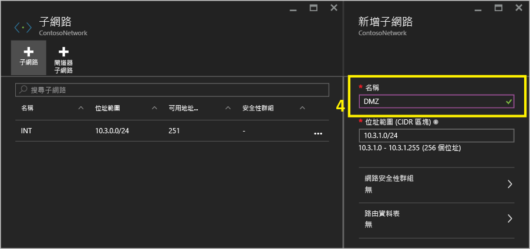

**1.2.建立網路安全性群組**

網路安全性群組 (NSG) 包含存取控制清單 (ACL) 規則的清單，可允許或拒絕虛擬網路中 VM 執行個體的網路流量。NSG 可與子網路或該子網路內的個別 VM 執行個體相關聯。當 NSG 與子網路相關聯時，ACL 規則便會套用至該子網路中的所有 VM 執行個體。為了進行本指南，我們會建立兩個 NSG︰分別提供給內部網路和 DMZ 使用。其各自的標籤為 NSG\_INT 和 NSG\_DMZ。

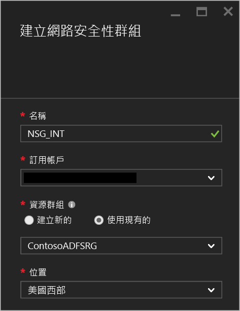

建立好 NSG 之後，其輸入和輸出規則皆為 0。一旦各自伺服器上的角色安裝好並正常運作，就可以根據所需的安全性層級建立輸入和輸出規則。

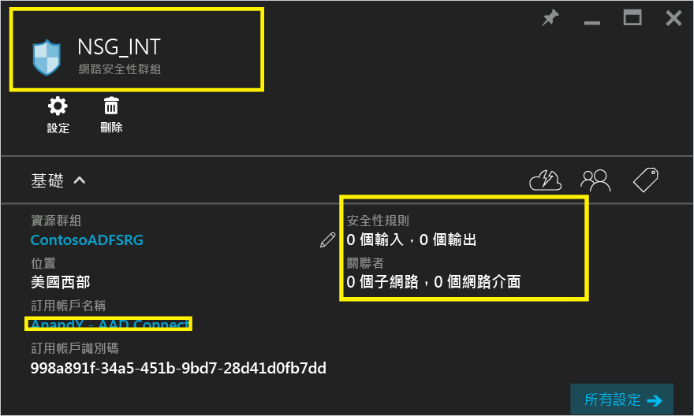

建立好所有 NSG 之後，請建立 NSG\_INT 與子網路 INT 的關聯，以及 NSG\_DMZ 與子網路 DMS 的關聯。下面提供了範例螢幕擷取畫面︰

* 按一下 [子網路] 以開啟子網路的面板
* 選取要與 NSG 關聯的子網路

完成設定後，[子網路] 面板看起來應該會像下圖︰

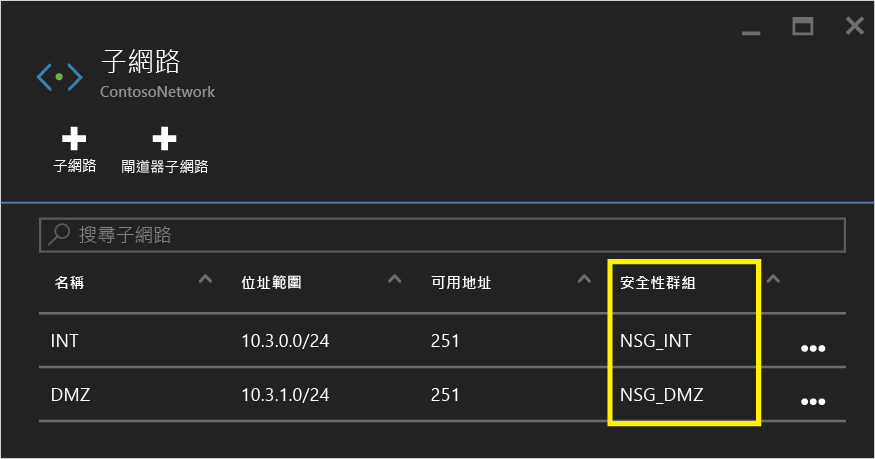

**1.3.建立與內部部署的連線**

我們必須要連線至內部部署，才能在 Azure 中部署網域控制站 (DC)。Azure 提供了各種連線選項，供您將內部部署基礎結構連接到 Azure 基礎結構。

* 點對站
* 虛擬網路站對站
* ExpressRoute

建議您使用 ExpressRoute。ExpressRoute 可讓您在 Azure 資料中心和內部部署或共置環境中的基礎結構之間建立私人連接。ExpressRoute 連線不會經過公用網際網路。相較於透過網際網路的一般連線，其可提供更為可靠、速度更快、延遲更低且安全性更高的網際網路連線。雖然建議的是使用 ExpressRoute，您也可以選擇任何最適合貴組織的連線方法。若要深入了解 ExpressRoute 以及使用 ExpressRoute 的各種連線選項，請閱讀 [ExpressRoute 技術概觀](https://aka.ms/Azure/ExpressRoute)。

### 2\.建立儲存體帳戶

為了維持高可用性，並避免依賴單一儲存體帳戶，您可以建立兩個儲存體帳戶。將每個可用性設定組中的機器分成兩個群組，然後為每個群組指派不同的儲存體帳戶。請記住，您只需要支付實際使用的儲存體費用。

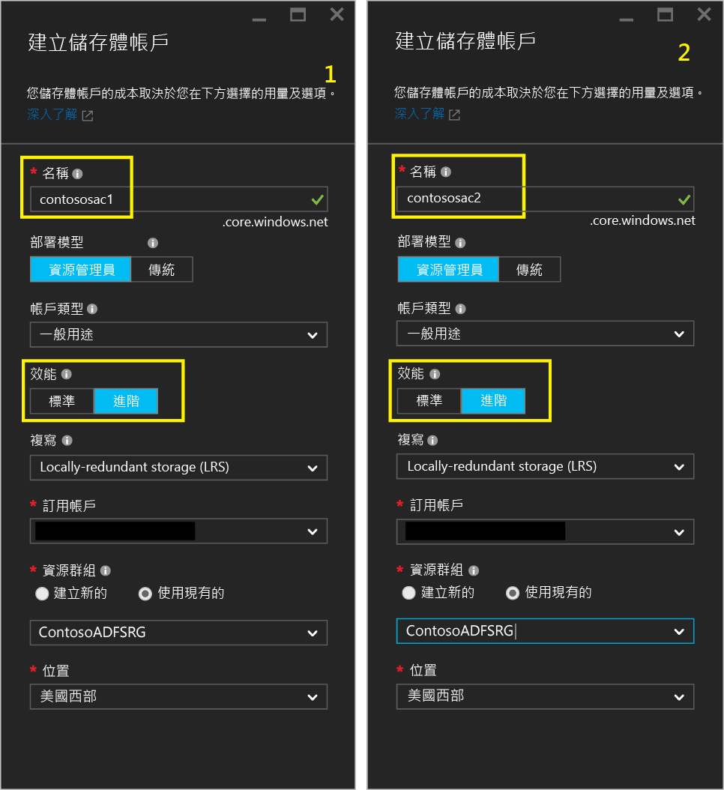

### 3\.建立可用性設定組

針對每個角色 (DC/AD FS 和 WAP) 建立可用性設定組，讓每個可用性設定組至少包含 2 部機器。這有助於讓每個角色達到更高的可用性。在建立可用性設定組時，必須要決定下列項目︰
* **容錯網域**︰相同容錯網域中的虛擬機器會共用相同的電源和實體網路交換器。建議最少準備 2 個容錯網域。預設值為 3 個，在進行此部署時，您可以讓此設定保持原本的預設值。
* **更新網域**︰在更新期間，屬於相同更新網域的機器會一起重新啟動。您至少需要 2 個更新網域。預設值為 5 個，在進行此部署時，您可以讓此設定保持原本的預設值。

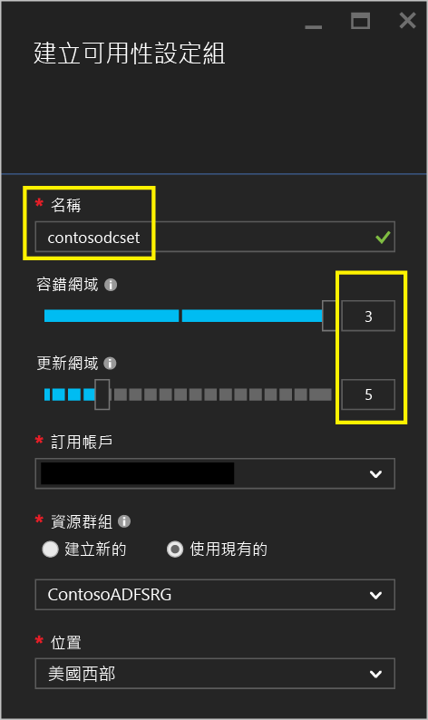

建立下列可用性設定組

| 可用性設定組 | 角色 | 容錯網域 | 更新網域 |
|:----------------:|:----:|:-----------:|:-----------|
| contosodcset | DC/ADFS | 3 | 5 |
| contosowapset | WAP | 3 | 5 |

### 4\.部署虛擬機器
下一個步驟是部署虛擬機器，在基礎結構中裝載不同角色。每個可用性設定組中建議至少要有兩部機器。基本部署需要建立六部虛擬機器。

| 機器 | 角色 | 子網路 | 可用性集合 | 儲存體帳戶 | IP 位址 |
|:-----:|:-----:|:-----:|:-----:|:-----:|:-----:|
|contosodc1|DC/ADFS|INT|contosodcset|contososac1|靜態|
|contosodc2|DC/ADFS|INT|contosodcset|contososac2|靜態|
|contosowap1|WAP|DMZ|contosowapset|contososac1|靜態|
|contosowap2|WAP|DMZ|contosowapset|contososac2|靜態|

您可能已注意到我們還未指定 NSG。這是因為 Azure 可讓您在子網路層級使用 NSG。然後，您可以使用與子網路或 NIC 物件相關聯的個別 NSG 來控制機器的網路流量。如需詳細資訊，請閱讀[什麼是網路安全性群組 (NSG)](https://aka.ms/Azure/NSG)。如果您要管理 DNS，建議使用靜態 IP 位址。您可以使用 Azure DNS，並改為在網域的 DNS 記錄中依機器的 Azure FQDN 查閱新的機器。部署完成之後，虛擬機器的窗格看起來應該會像下圖︰

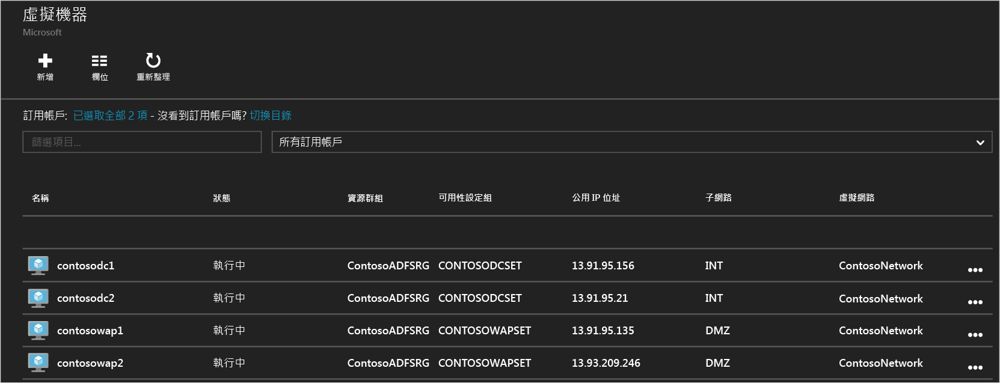

### 5\.設定網域控制站/AD FS 伺服器
 為了驗證連入要求，AD FS 必須連絡網域控制站。為了節省進行驗證時從 Azure 連線到內部部署 DC 的昂貴成本，建議您在 Azure 中部署網域控制站的複本。為了達到高可用性，建議您建立至少包含 2 個網域控制站的可用性設定組。

|網域控制站|角色|儲存體帳戶|
|:-----:|:-----:|:-----:|
|contosodc1|複本|contososac1|
|contosodc2|複本|contososac2|

* 使用 DNS 將兩部伺服器升階為複本網域控制站
* 使用伺服器管理員安裝 AD FS 角色來設定 AD FS 伺服器。

###6\.部署內部負載平衡器 (ILB)

**6.1.建立 ILB**

若要部署 ILB，請在 Azure 入口網站選取負載平衡器，然後按一下新增 (+)。
>[AZURE.NOTE] 如果在功能表中看不到 [負載平衡器]，請按一下入口網站左下角的 [瀏覽]，並向下捲動到看到 [負載平衡器] 為止。接著，按一下黃色星號即可將它新增至功能表。現在，請選取新的負載平衡器圖示以開啟面板，開始設定負載平衡器。

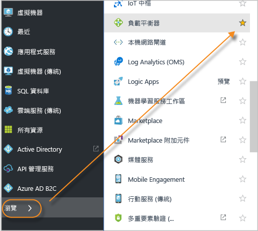

* **名稱**︰將負載平衡器命名為適合的名稱
* **配置**︰由於此負載平衡器將放置在 AD FS 伺服器前面，目的是用來進行內部網路連線，因此請選取 [內部]
* **虛擬網路**︰選擇要在其中部署 AD FS 的虛擬網路
* **子網路**︰在此選擇內部子網路
* **IP 位址指派**︰動態

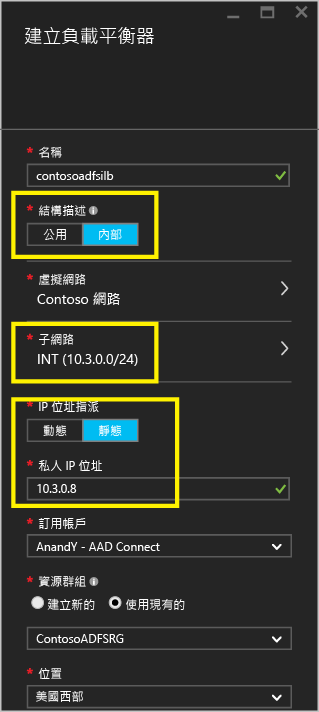
 
按一下建立並部署 ILB 之後，您應該就會在負載平衡器清單中看到它︰

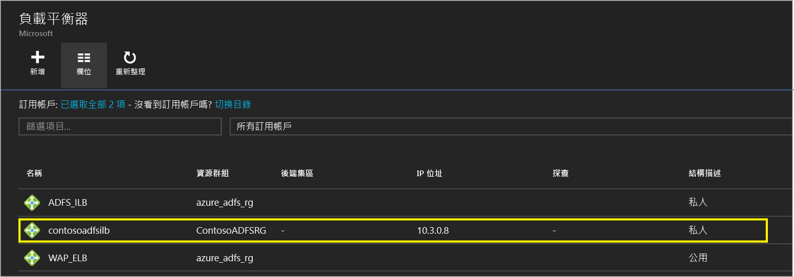
 
下一個步驟是設定後端集區和後端探查。

**6.2.設定 ILB 後端集區**

在 [負載平衡器] 面板中選取新建立的 ILB。這會開啟 [設定] 面板。
1.	在 [設定] 面板中選取後端集區
2.	在 [新增後端集區] 面板中，按一下 [新增虛擬機器]
3.	此時您會看到一個面板供您選擇可用性設定組
4.	選擇 AD FS 可用性設定組

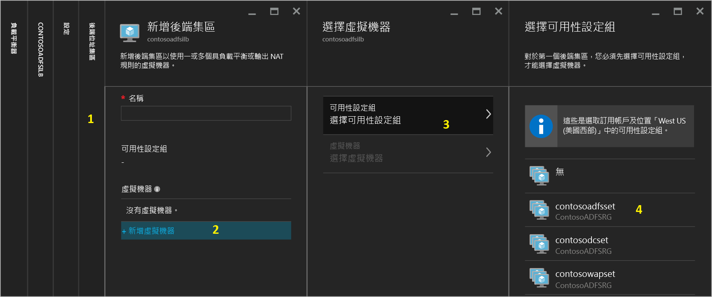
 
**6.3.設定探查**

在 ILB 的 [設定] 面板中，選取 [探查]。
1.	按一下 [新增]
2.	提供探查的詳細資料 a.**名稱**︰探查名稱 b.**通訊協定**：TCP c.**連接埠**：443 (HTTPS) d.**間隔**：5 (預設值) – 這是 ILB 在後端集區中探查機器的間隔 e.**狀況不良臨界值限制**：2 (預設值) – 這是連續探查失敗臨界值，達到此臨界值之後，ILB 就會將後端集區中的機器宣告為沒有回應，並停止對它傳送流量。

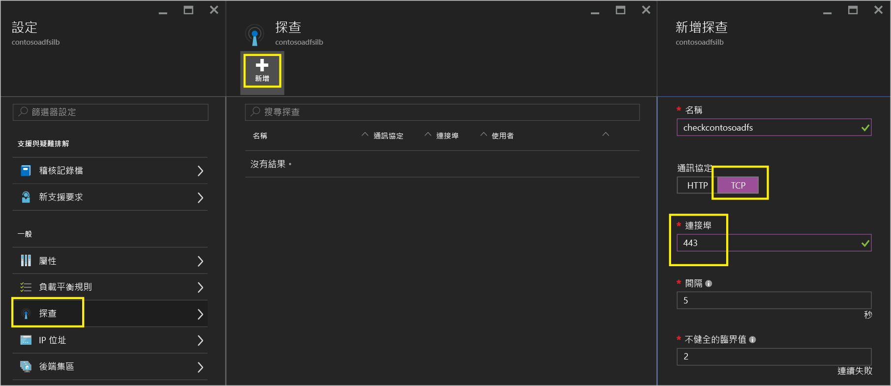
 
**6.4.建立負載平衡規則**

為了有效平衡流量，應該為 ILB 設定負載平衡規則。若要建立負載平衡規則，
1.	在 ILB 的 [設定] 面板中選取 [負載平衡規則]
2.	按一下 [負載平衡規則] 面板中的 [新增]
3.	在 [新增負載平衡規則] 面板中 a.**名稱**︰提供規則名稱 b.**通訊協定**︰選取 [TCP] c.**連接埠**：443 d.**後端連接埠**：443 e.**後端集區**︰選取稍早為 AD FS 叢集建立的集區 f.**探查**︰選取稍早為 AD FS 伺服器建立的探查

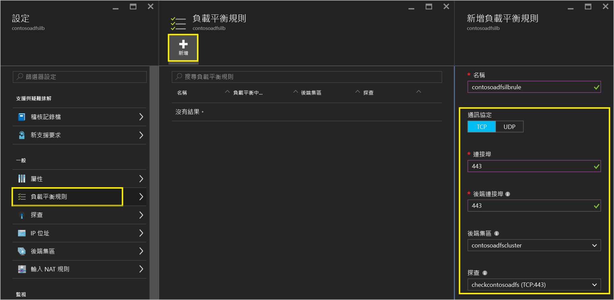

**6.5.更新 ILB 的 DNS**

移至 DNS 伺服器，為 ILB 建立 CNAME。CNAME 應適用於 IP 位址指向 ILB 的 IP 位址的同盟服務。例如，如果 ILB DIP 位址是 10.3.0.8，而所安裝的同盟服務是 fs.contoso.com，則請為指向 10.3.0.8 的 fs.contoso.com 建立 CNAME。這可確保所有與 fs.contoso.com 有關的通訊都在 ILB 結束，並且會受到適當路由處理。

###7\.設定 Web 應用程式 Proxy 伺服器

**7.1.設定 Web 應用程式 Proxy 伺服器以連線到 AD FS 伺服器**

為了確保 Web 應用程式 Proxy 伺服器能夠連線到 ILB 背後的 AD FS 伺服器，請在 %systemroot%\\system32\\drivers\\etc\\hosts 建立 ILB 的記錄。請注意，辨別名稱 (DN) 應該是同盟服務名稱，例如 fs.contoso.com。而且 IP 項目應該是 ILB 的 IP 位址 (如範例中的 10.3.0.8) 的項目。

**7.2.安裝 Web 應用程式 Proxy 角色**

在確定 Web 應用程式 Proxy 伺服器能夠連線到 ILB 背後的 AD FS 伺服器之後，您可以接著安裝 Web 應用程式 Proxy 伺服器。Web 應用程式 Proxy 伺服器不可加入網域。請選取「遠端存取」角色，將 Web 應用程式 Proxy 角色安裝在兩個 Web 應用程式 Proxy 伺服器上。伺服器管理員會引導您完成 WAP 安裝。如需如何部署 WAP 的詳細資訊，請閱讀[安裝和設定 Web 應用程式 Proxy 伺服器](https://technet.microsoft.com/library/dn383662.aspx)。

###8\.部署網際網路對向 (公用) 負載平衡器

**8.1.建立網際網路對向 (公用) 負載平衡器**
 
在 Azure 入口網站中選取 [負載平衡器]，然後按一下 [新增]。在 [建立負載平衡器] 面板中，輸入下列資訊
1. **名稱**︰負載平衡器的名稱
2. **配置**︰公用 – 此選項會告知 Azure，此負載平衡器需要公用位址。
3. **IP 位址**︰建立新的 IP 位址 (動態)

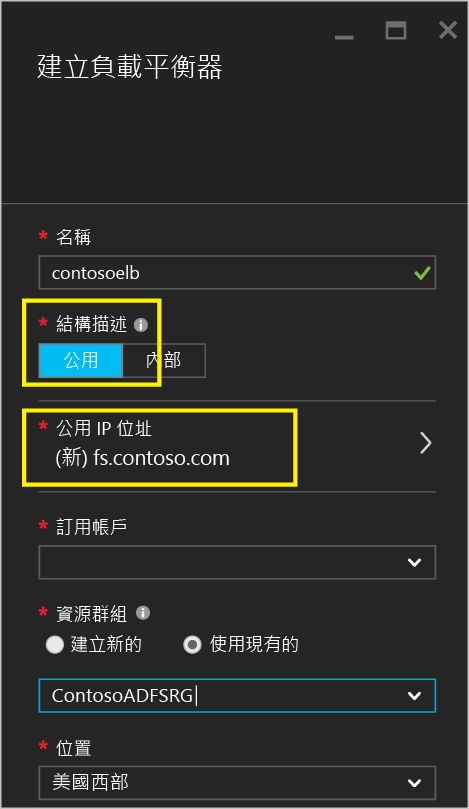

部署之後，負載平衡器就會出現在 [負載平衡器] 清單中。

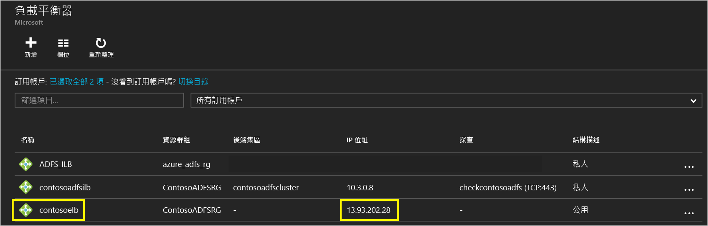
 
**8.2.對公用 IP 指派 DNS 標籤**

在 [負載平衡器] 面板中按一下新建立的負載平衡器項目，以顯示組態的面板。遵循下列步驟來設定公用 IP 的 DNS 標籤︰
1.	按一下 [公用 IP 位址]。這會開啟公用 IP 與其設定的面板
2.	按一下 [組態]
3.	提供 DNS 標籤。這會成為您可以從任何地方存取的公用 DNS 標籤，例如 contosofs.westus.cloudapp.azure.com。您可以在外部 DNS 中新增用於同盟服務的項目 (例如 fs.contoso.com)，以解析為外部負載平衡器的 DNS 標籤 (contosofs.westus.cloudapp.azure.com)。

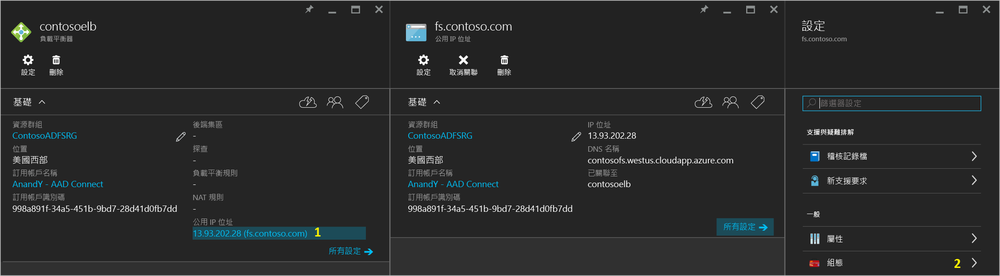

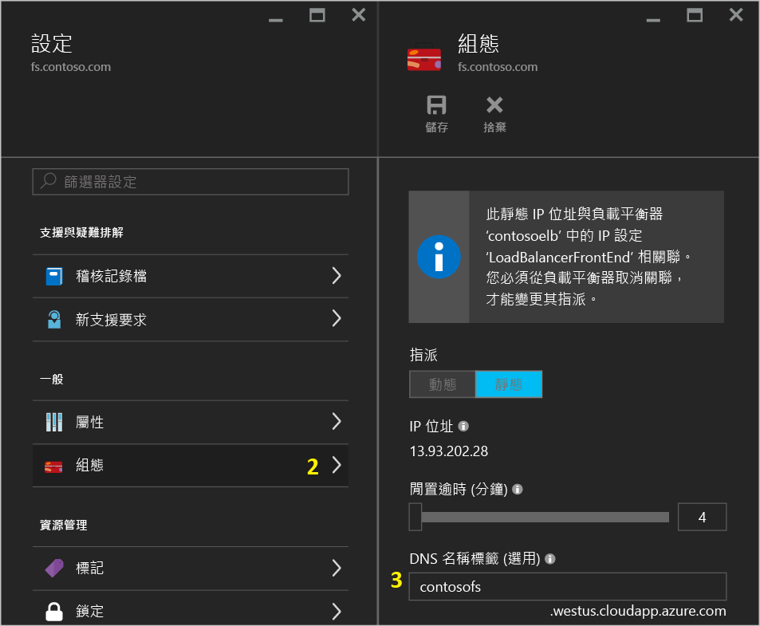

**8.3.設定網際網路對向 (公用) 負載平衡器的後端集區**

遵循和建立內部負載平衡器相同的步驟，將網際網路對向 (公用) 負載平衡器的後端集區設定為 WAP 伺服器的可用性設定組。例如，contosowapset。

 
**8.4.設定探查**

遵循和設定內部負載平衡器相同的步驟來設定 WAP 伺服器後端集區的探查。

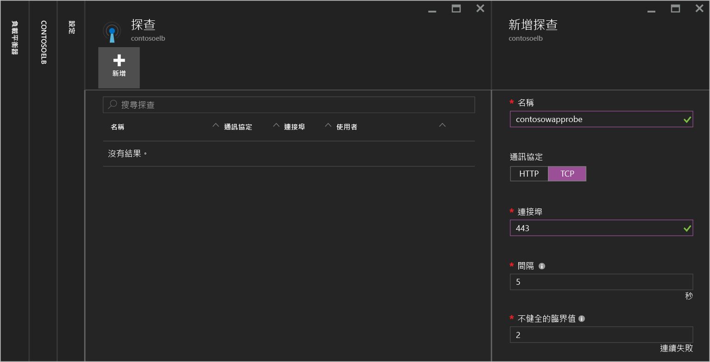
 
**8.5.建立負載平衡規則**

遵循和 ILB 中相同的步驟來設定 TCP 443 的負載平衡規則。

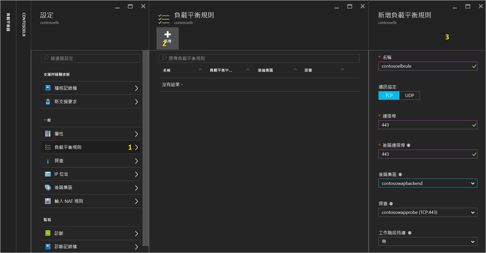
 
###9\.保護網路

**9.1.保護內部子網路**

整體來說，您需要下列規則來有效率地保護內部子網路 (依如下所示順序)

|規則|說明|Flow|
|:----|:----|:------:|
|AllowHTTPSFromDMZ| 允許來自 DMZ 的 HTTPS 通訊 | 輸入 |
|DenyAllFromDMZ| 此規則會封鎖所有從 DMZ 到內部子網路的流量。規則 AllowHTTPSFromDMZ 已經會負責確保 HTTPS 通訊能夠完成，其他流量則會被此規則封鎖 | 輸入 |
|DenyInternetOutbound| 不得存取網際網路 | 輸出 |

[註解]：<> () [註解]：<> (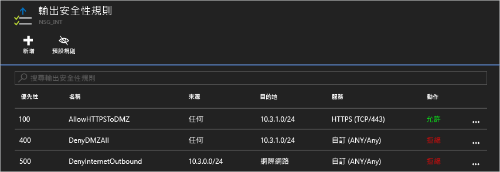)
 
**9.2.保護 DMZ 子網路**

|規則|說明|Flow|
|:----|:----|:------:|
|AllowHttpsFromVirtualNetwork| 允許來自虛擬網路的 HTTPS | 輸入 |
|AllowHTTPSInternet| 允許從網際網路到 DMZ 的 HTTPS | 輸入|
|DenyingressexceptHTTPS| 封鎖 HTTPS 以外來自網際網路的任何流量 | 輸入 |
|DenyOutToInternet|	HTTPS 以外流向網際網路的任何流量都會遭到封鎖 | 輸出 |

[註解]：<> (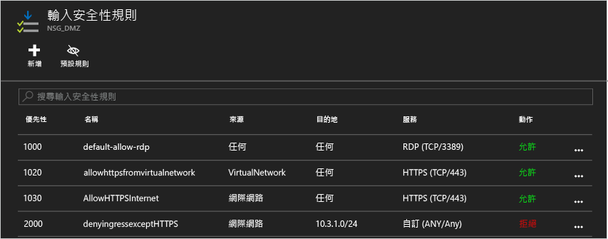) [註解]：<> (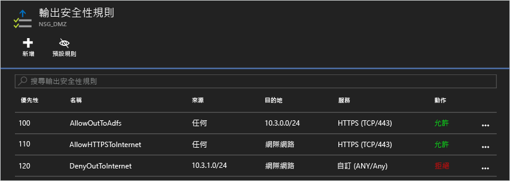)

>[AZURE.NOTE] 如果需要用戶端使用者憑證驗證 (使用 X509 使用者憑證的 clientTLS 驗證)，則 AD FS 需要啟用 TCP 連接埠 49443 以供輸入存取。

###10\.測試 AD FS 登入

要測試 AD FS，最簡單的方法是使用 IdpInitiatedSignon.aspx 網頁。為了能夠執行此作業，必須在 AD FS 屬性上啟用 IdpInitiatedSignOn。請遵循下列步驟來確認 AD FS 設定
1.	使用 PowerShell 在 AD FS 伺服器上執行以下 Cmdlet，將它設定為啟用。Set-AdfsProperties -EnableIdPInitiatedSignonPage $true
2.	從任何外部機器存取 https://adfs.thecloudadvocate.com/adfs/ls/IdpInitiatedSignon.aspx
3.	您應該會看到如下圖的 AD FS 網頁︰

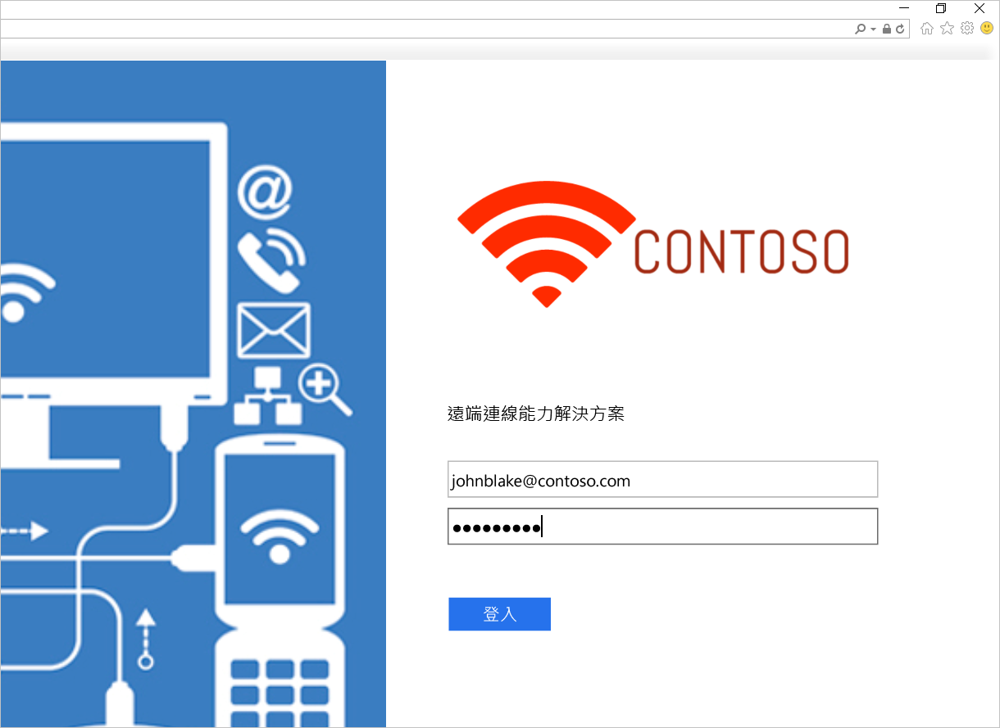

成功登入時，它會提供您如下所示的成功訊息︰

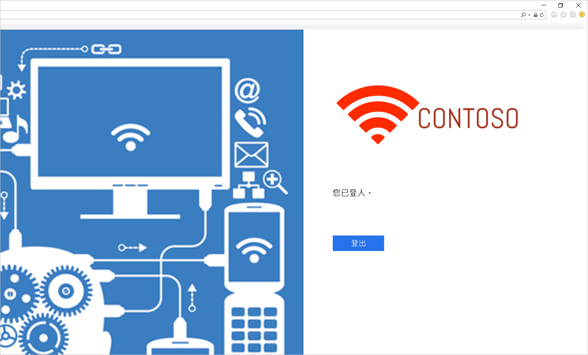

## 其他資源
* [可用性設定組 (Availability Sets)](https://aka.ms/Azure/Availability)
* [Azure 負載平衡器](https://aka.ms/Azure/ILB)
* [內部負載平衡器](https://aka.ms/Azure/ILB/Internal)
* [網際網路對向負載平衡器](https://aka.ms/Azure/ILB/Internet)
* [儲存體帳戶](https://aka.ms/Azure/Storage)
* [Azure 虛擬網路](https://aka.ms/Azure/VNet)
* [AD FS 和 Web 應用程式 Proxy 連結](http://aka.ms/ADFSLinks)

## 後續步驟

* [整合內部部署身分識別與 Azure Active Directory](active-directory-aadconnect.md)
* [使用 Azure AD Connect 設定和管理 AD FS](active-directory-aadconnectfed-whatis.md)

<!---HONumber=AcomDC_0727_2016-->