# 自訂 Azure AD Connect 安裝
當您想要更多安裝選項時，可使用 Azure AD Connect **自訂設定**。如果您有多個樹系，或如果您想要設定未涵蓋在快速安裝中的選用功能，可使用它。只要是[**快速安裝**](active-directory-aadconnect-get-started-express.md)選項不能滿足部署或拓撲的情況，就可使用它。

在開始安裝 Azure AD Connect 之前，請務必要[下載 Azure AD Connect](http://go.microsoft.com/fwlink/?LinkId=615771) 並完成 [Azure AD Connect：硬體和必要條件](active-directory-aadconnect-prerequisites.md)中的必要條件步驟。另外，也請確定您具有 [Azure AD Connect 帳戶與權限](active-directory-aadconnect-accounts-permissions.md)中所述的必要帳戶。

如果自訂的設定不符合拓撲，例如若要升級 DirSync，請參閱[相關文件](#related-documentation)中的其他案例。

## Azure AD Connect 的自訂設定安裝
### 快速設定
在此頁面上，按一下 [自訂] 以啟動自訂設定安裝。

### 安裝必要的元件
安裝同步處理服務時，您可以將選用組態區段保持未核取狀態，Azure AD Connect 會自動設定所有項目。它會設定 SQL Server 2012 Express LocalDB 執行個體、建立適當的群組，以及指派權限。如果您想要變更預設值，則可以使用下表了解可用的選用組態選項。

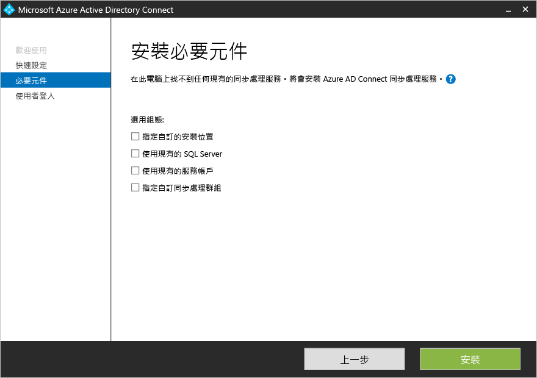

| 選用組態 | 說明 |
| --- | --- |
| 使用現有的 SQL Server |可讓您指定 SQL Server 名稱和執行個體名稱。如果您已經有想要使用的 ad 資料庫伺服器，請選擇這個選項。如果您的 SQL Server 未啟用瀏覽，請在 [執行個體名稱] 中輸入執行個體名稱加上逗號及連接埠號碼。 |
| 使用現有的服務帳戶 |Azure AD Connect 預設會建立本機服務帳戶，以供同步處理服務使用。密碼是自動產生的，但安裝 Azure AD Connect 的人員並不知道。如果您使用遠端 SQL Server 或使用需要驗證的 Proxy，您需要在網域中有一個服務帳戶並知道密碼。在這類情況下，請輸入要使用的服務帳戶。請確定執行安裝的使用者為 SQL 中的 SA，才可建立服務帳戶的登入。請參閱 [Azure AD Connect 帳戶與權限](active-directory-aadconnect-accounts-permissions.md#custom-settings-installation) |
| 指定自訂同步群組 |Azure AD Connect 預設會在安裝同步處理服務時，建立四個伺服器的本機群組。這些群組如下：[系統管理員] 群組、[操作員] 群組、[瀏覽] 群組和 [密碼重設群組]。您可以在此指定自己的群組。群組必須位於伺服器本機上，不能位於網域中。 |

### 使用者登入
在安裝必要元件後，系統會要求您選取使用者的單一登入方法。下表提供可用選項的簡短說明。如需登入方法的完整說明，請參閱[使用者登入](active-directory-aadconnect-user-signin.md)。

| 單一登入選項 | 說明 |
| --- | --- |
| 密碼同步處理 |使用者可使用他們在內部部署網路中使用的相同密碼登入 Microsoft Cloud 服務，例如 Office 365。使用者密碼會以密碼雜湊的形式同步至 Azure AD，並在雲端中進行驗證。詳細資訊請參閱[密碼同步處理](active-directory-aadconnectsync-implement-password-synchronization.md)。 |
| 與 AD FS 同盟 |使用者可使用他們在內部部署網路中使用的相同密碼登入 Microsoft Cloud 服務，例如 Office 365。系統會將使用者重新導向至他們的內部部署 AD FS 執行個體以進行登入，並在內部部署中進行驗證。 |
| 請勿設定 |不會安裝和設定任何功能。如果您已經有第三方的同盟伺服器或另一個現有的適當方案，請選擇此選項。 |

### 連接至 Azure AD
在 [連接至 Azure AD] 畫面中，輸入全域系統管理員的帳戶和密碼。如果您在前一個頁面選取 [與 AD FS 同盟]，請勿以您打算啟用同盟的網域中的帳戶登入。建議使用隨附於 Azure AD 目錄的預設 **onmicrosoft.com** 網域中的帳戶。

此帳戶只會用來在 Azure AD 中建立服務帳戶，而且在精靈完成後便不會使用。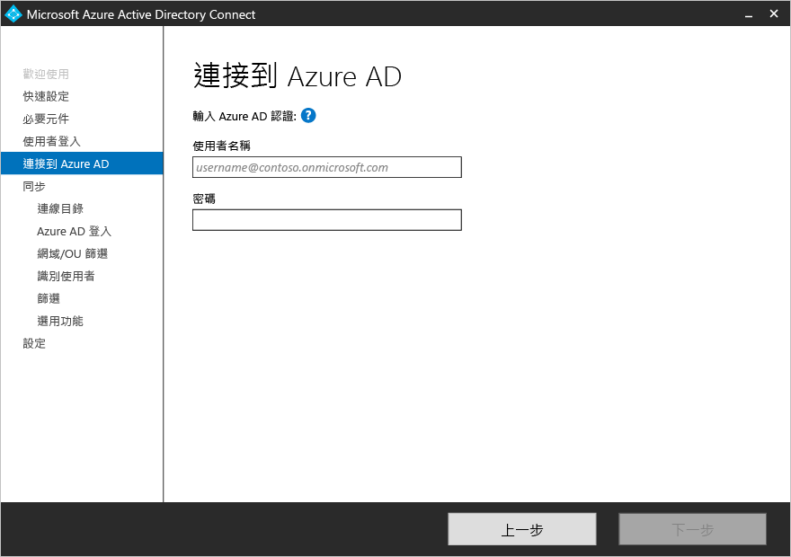

如果您的全域管理員帳戶已啟用 MFA，您需要在登入快顯視窗中再次提供密碼，並完成 MFA 認證。認證可能是提供驗證碼或撥打電話。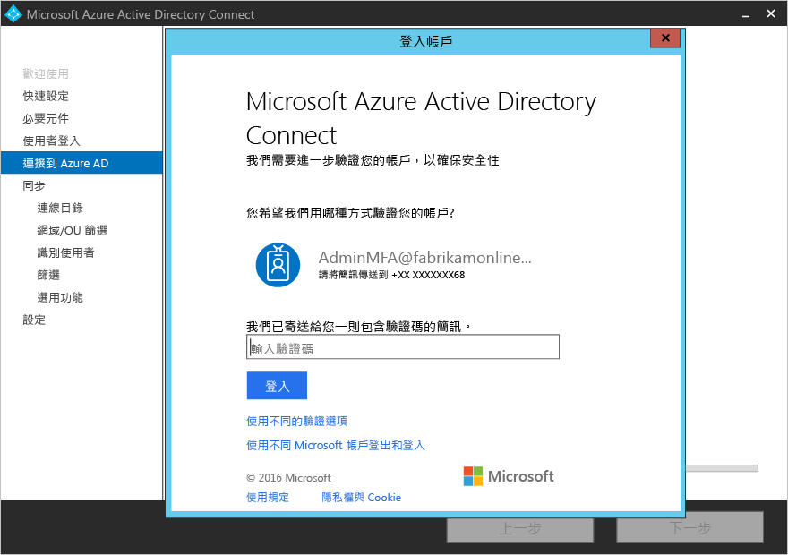

全域管理員帳戶也可以啟用 [Privileged Identity Management](active-directory-privileged-identity-management-getting-started.md)。

如果您收到錯誤訊息，而且有連線問題，請參閱[針對連線問題進行疑難排解](active-directory-aadconnect-troubleshoot-connectivity.md)。

## [同步] 一節的頁面
### 連接您的目錄
若要連接到您的 Active Directory 網域服務，Azure AD Connect 需要具有足夠權限的帳戶認證。您可以用 NetBios 或 FQDN 格式輸入網域部分，也就是 FABRIKAM\\syncuser 或 fabrikam.com\\syncuser。此帳戶可以是一般使用者帳戶，因為我們只需要預設的讀取權限。不過，視您的情況而定，也可能需要更多權限。如需詳細資訊，請參閱 [Azure AD Connect 帳戶與權限](active-directory-aadconnect-accounts-permissions.md#create-the-ad-ds-account)

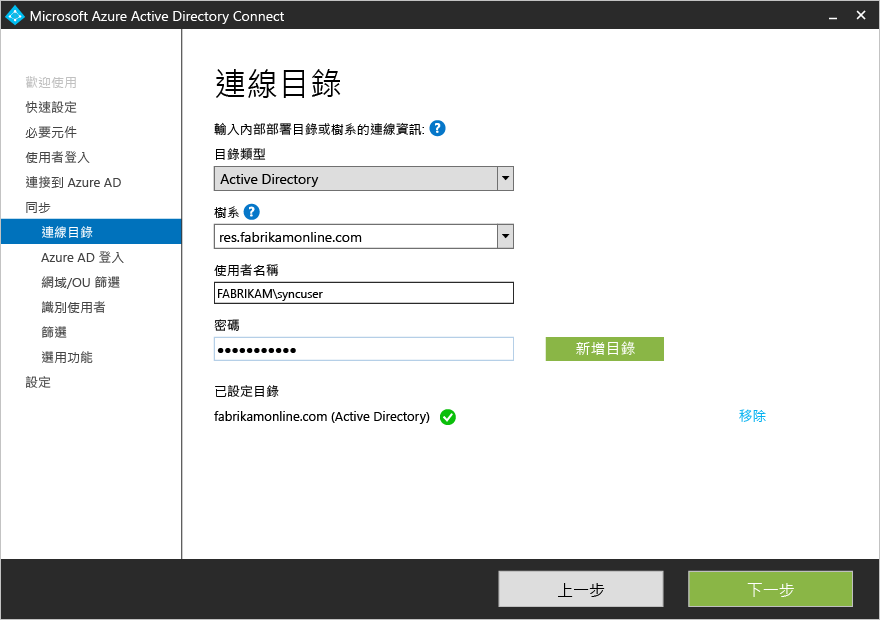

### Azure AD 登入組態
此頁面可讓您檢閱內部部署 AD DS 中存在的 UPN 網域，以及已在 Azure AD 中驗證的 UPN 網域。此頁面也可讓您設定要用於 userPrincipalName 的屬性。

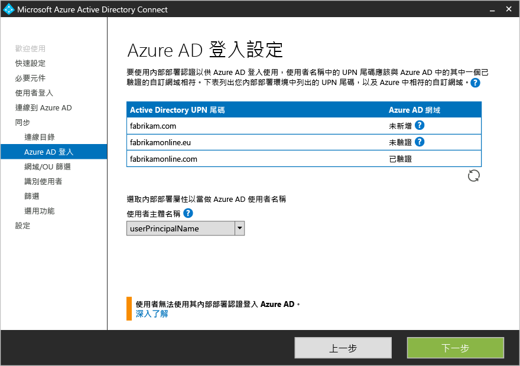 檢閱每一個標示為**未新增**和**未驗證**的網域。確定您所使用的網域皆已在 Azure AD 中完成驗證。驗證好網域時，按一下 [重新整理] 符號。如需詳細資訊，請參閱[新增並驗證網域](active-directory-add-domain.md)

**UserPrincipalName**：屬性 userPrincipalName 是使用者登入 Azure AD 和 Office 365 時會使用的屬性。使用的網域 (也稱為 UPN 尾碼)，應該會在同步處理使用者前於 Azure AD 中進行驗證。Microsoft 建議保留預設屬性 userPrincipalName。如果此屬性不可路由傳送且無法驗證，則可以選取另一個屬性。例如，您可以選取電子郵件做為保存登入識別碼的屬性。使用 userPrincipalName 之外的其他屬性稱為**替代 ID**。替代 ID 屬性值必須遵循 RFC822 標準。替代 ID 可以搭配密碼同步和同盟來使用。

> [!WARNING]
> 使用替代 ID 會與所有 Office 365 工作負載不相容。如需詳細資訊，請參閱[設定替代的登入 ID](https://technet.microsoft.com/library/dn659436.aspx)。
> 
> 

### 網域和 OU 篩選
預設會同步所有網域和 OU。如果您不想將部分網域或 OU 同步處理至 Azure AD，您可以取消選取這些網域和 OU。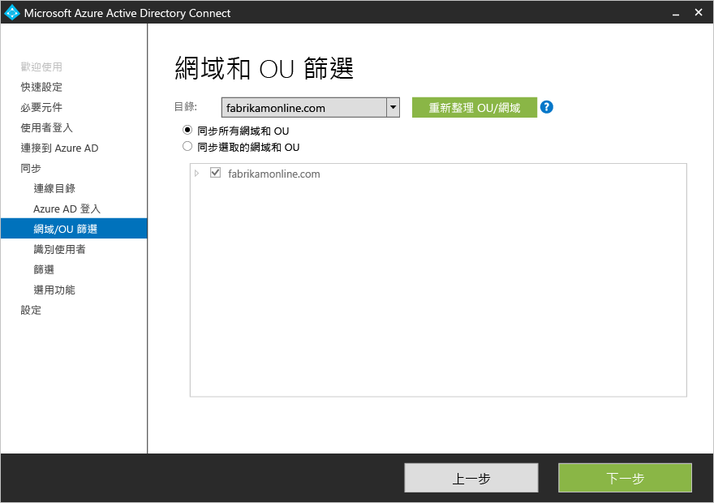 精靈的這個頁面將會設定網域型篩選。如需詳細資訊，請參閱[網域型篩選](active-directory-aadconnectsync-configure-filtering.md#domain-based-filtering)。

由於防火牆限制，也可能無法連線到某些網域。依預設不會選取這些網域，而且會有警告。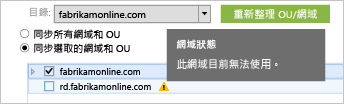 如果您看到此警告，請確定這些網域確實無法連線，因此預期會有警告。

### 唯一識別您的使用者
跨樹系比對功能可讓您定義 AD DS 樹系中的使用者在 Azure AD 中的顯示方式。使用者可能會在整個樹系中只顯示一次，或是具有啟用和停用帳戶的組合。使用者也可能顯示為某些樹系中的連絡人。

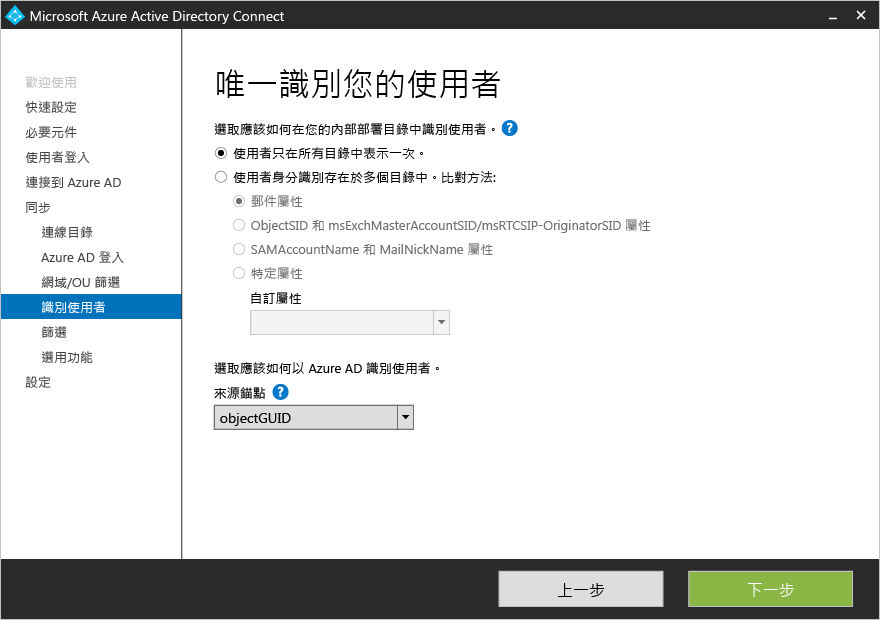

| 設定 | 說明 |
| --- | --- |
| [使用者在所有樹系中只會顯示一次](active-directory-aadconnect-topologies.md#multiple-forests-separate-topologies) |在 Azure AD 中，所有使用者會都建立為個別物件。在 Metaverse 中這些物件不會聯結。 |
| [郵件屬性](active-directory-aadconnect-topologies.md#multiple-forests-full-mesh-with-optional-galsync) |如果郵件屬性在不同樹系中具有相同的值，則此選項就會聯結使用者和連絡人。如果已透過 GALSync 建立了您的連絡人，請使用此選項。 |
| [ObjectSID 與 msExchangeMasterAccountSID/ msRTCSIP-OriginatorSid](active-directory-aadconnect-topologies.md#multiple-forests-account-resource-forest) |此選項會聯結帳戶樹系中已啟用的使用者與資源樹系中已停用的使用者。在 Exchange 中，此組態稱為連結信箱。如果您只使用 Lync 而 Exchange 不存在資源樹系中，也可以使用此選項。 |
| sAMAccountName 與 MailNickName |此選項會在預期可以找到使用者登入 ID 的屬性中聯結。 |
| 特定的屬性 |此選項可讓您選取您的屬性。**限制：**確定選擇的是已可在 Metaverse 中找到的屬性。如果您選擇自訂屬性 (並非在 Metaverse 中)，精靈將無法完成。 |

**來源錨點**：屬性 sourceAnchor 是使用者物件存留期間都不會變更的屬性。它是連結內部部署使用者與 Azure AD 中使用者的主要金鑰。因為無法改變屬性，所以您必須規劃並使用好的屬性。objectGUID 就是不錯的選項。只要使用者帳戶沒有在樹系/網域之間移動，此屬性就不會改變。若在多樹系環境中，您會在樹系間移動帳戶時，就必須使用另一個屬性，例如 employeeID 屬性。請避免使用會在某人結婚或變更指派時改變的屬性。因為不可以使用帶有 @ 符號的屬性，所以無法使用 email 和 userPrincipalName。屬性也有區分大小寫，因此在樹系間移動物件時，請務必保留大寫/小寫。二進位屬性會以 base64 編碼，但其他屬性類型則會維持未編碼狀態。在同盟情況以及部分 Azure AD 介面中，此屬性也稱為 immutableID。您可以在[設計概念](active-directory-aadconnect-design-concepts.md#sourceAnchor)中找到關於來源錨點的詳細資訊。

### 根據群組進行同步處理篩選
篩選群組功能可讓您只同步處理一小部分的物件來進行試驗。若要使用這項功能，請在內部部署 Active Directory 中建立此目的專用的群組。然後新增應該同步處理至 Azure AD 做為直接成員的使用者和群組。您稍後可以在此群組中新增和移除使用者，藉此維護應該要顯示在 Azure AD 中的物件清單。所有您想要同步處理的物件，都必須是直接隸屬於群組的成員。使用者、群組、連絡人及電腦/裝置全都必須是直接成員。系統不會解析巢狀群組成員資格。當您新增群組做為成員時，只會新增群組本身而不會新增其成員。

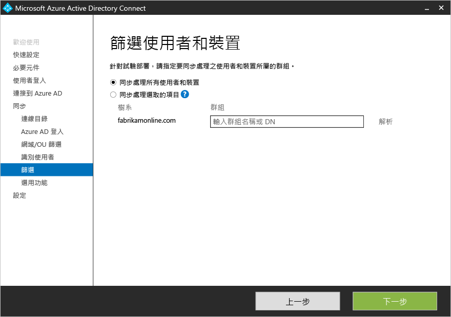

> [!WARNING]
> 這項功能僅適用於支援試驗部署。請勿將其用於成熟的生產部署。
> 
> 

在成熟的生產部署中，維護含有所有要同步處理之物件的單一群組將非常困難。您應該改用[設定篩選](active-directory-aadconnectsync-configure-filtering.md)中的其中一種方法。

### 選用功能
此畫面可讓您針對特定情況選取選用功能。

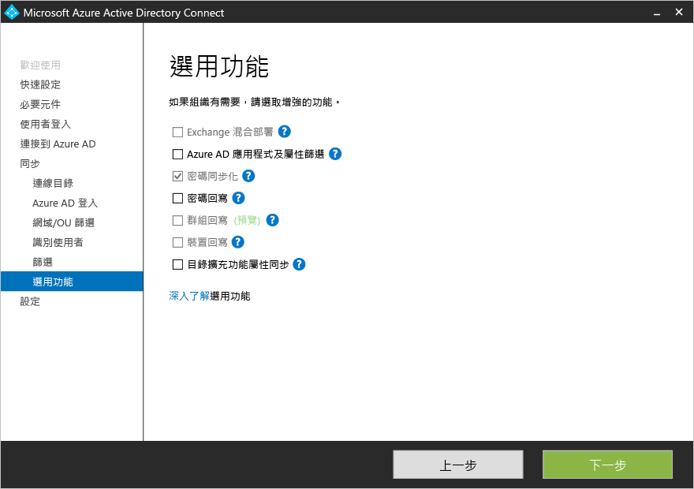

> [!WARNING]
> 如果您目前啟用 DirSync 或 Azure AD Sync，請不要在 Azure AD Connect 中啟動任何回寫功能。
> 
> 

| 選用功能 | 說明 |
| --- | --- |
| Exchange 混合部署 |Exchange 混合部署功能允許在內部部署和 Office 365 中並存 Exchange 信箱。Azure AD Connect 會將一組特定的[屬性](active-directory-aadconnectsync-attributes-synchronized.md#exchange-hybrid-writeback)從 Azure AD 同步處理回內部部署目錄。 |
| Azure AD 應用程式和屬性篩選 |透過啟用 Azure AD 應用程式和屬性篩選，即可調整這組同步處理的屬性。這個選項會在精靈中另外新增兩個組態頁面。如需詳細資訊，請參閱 [Azure AD 應用程式和屬性篩選](#azure-ad-app-and-attribute-filtering)。 |
| 密碼同步處理 |如果您選取同盟做為登入解決方案，您可以啟用此選項。密碼同步處理可做為備份選項。如需其他資訊，請參閱[密碼同步處理](active-directory-aadconnectsync-implement-password-synchronization.md)。 |
| 密碼回寫 |透過啟用密碼回寫，在 Azure AD 中產生的密碼變更會回寫至內部部署目錄。如需詳細資訊，請參閱[開始使用密碼管理](active-directory-passwords-getting-started.md)。 |
| 群組回寫 |如果您使用 [Office 365 群組] 功能，就可以在內部部署的 Active Directory 中顯示這些群組。只有當您內部部署的 Active Directory 中已經有 Exchange 時，才能使用此選項。如需詳細資訊，請參閱[群組回寫](active-directory-aadconnect-feature-preview.md#group-writeback)。 |
| 裝置回寫 |在條件式存取情況下，可讓您將 Azure AD 中的裝置物件回寫到內部部署的 Active Directory。如需詳細資訊，請參閱[在 Azure AD Connect 中啟用裝置回寫](active-directory-aadconnect-feature-device-writeback.md)。 |
| 目錄擴充屬性同步處理 |透過啟用目錄擴充屬性同步處理，指定的屬性將會同步處理至 Azure AD。如需詳細資訊，請參閱[目錄擴充](active-directory-aadconnectsync-feature-directory-extensions.md)。 |

### Azure AD 應用程式和屬性篩選
如果您想要限制要將哪些屬性同步處理至 Azure AD，請先選取您將會使用的服務。如果您在此頁面上進行組態變更，則必須重新執行安裝精靈來明確選取新的服務。

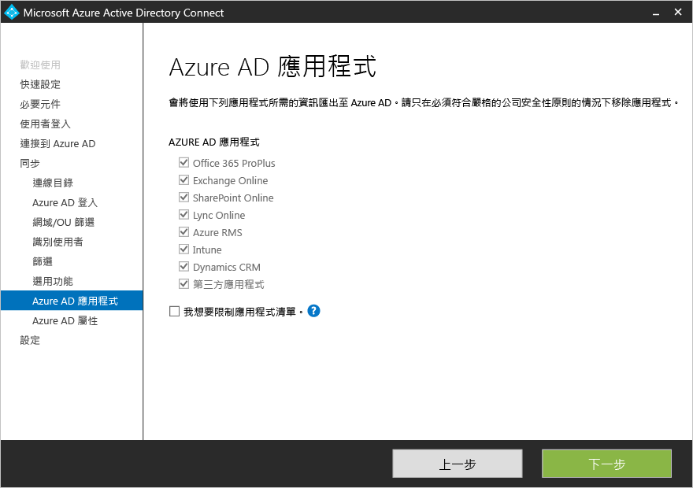

根據在上一個步驟中選取的服務，此頁面會顯示將同步處理的所有屬性。這份清單是正在同步處理的所有物件類型的組合。如果其中有一些您不需要同步處理的特定屬性，您可以取消選取那些屬性。

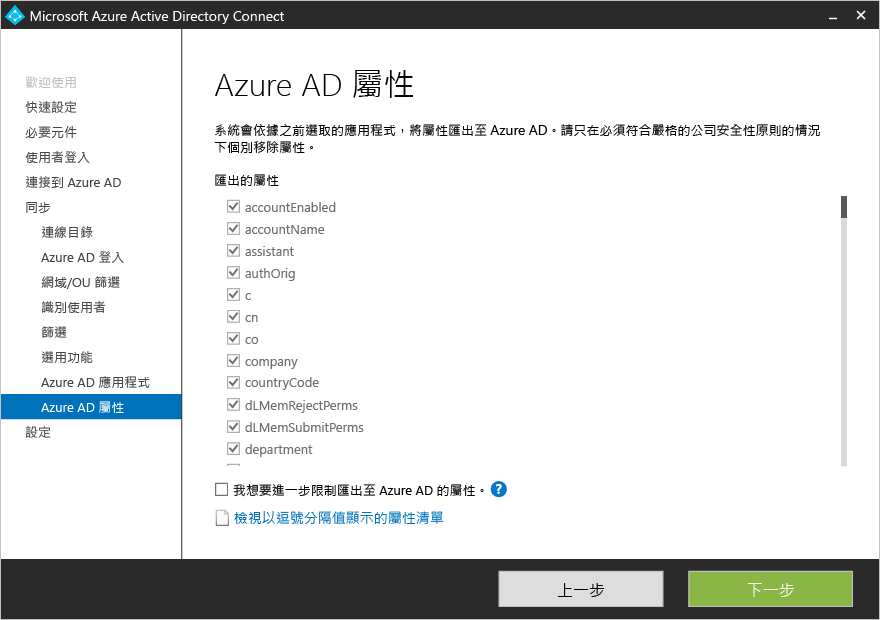

> [!WARNING]
> 移除可能影響功能的屬性。如需最佳作法和建議，請參閱[同步處理的屬性](active-directory-aadconnectsync-attributes-synchronized.md#attributes-to-synchronize)。
> 
> 

### 目錄擴充屬性同步處理
您可以使用組織新增的自訂屬性或 Active Directory 中的其他屬性在 Azure AD 中擴充結構描述。若要使用這項功能，請選取 [選用功能] 頁面上的 [目錄擴充屬性同步處理]。您可以在此頁面上選取更多要同步處理的屬性。

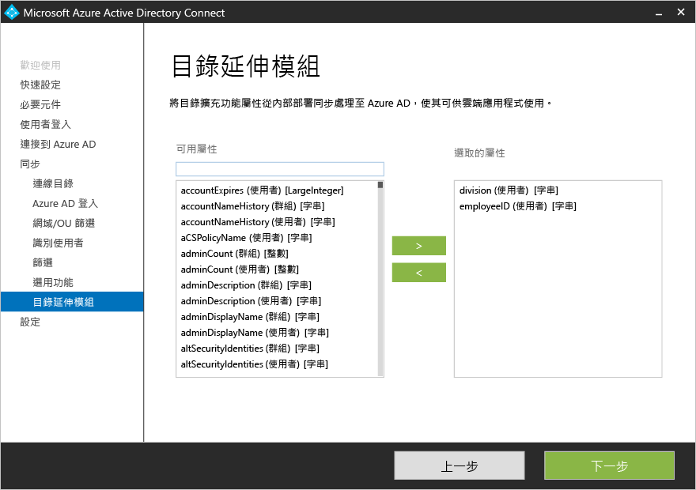

如需詳細資訊，請參閱[目錄擴充](active-directory-aadconnectsync-feature-directory-extensions.md)。

## 設定與 AD FS 同盟
只要簡單按幾下，即可使用 Azure AD Connect 設定 AD FS。進行設定之前必須先具備下列項目。

* 做為同盟伺服器的 Windows Server 2012 R2 伺服器，且已啟用遠端管理
* 做為 Web 應用程式 Proxy 伺服器的 Windows Server 2012 R2 伺服器，且已啟用遠端管理
* 您想要使用的 Federation Service 名稱 (例如 sts.contoso.com) 的 SSL 憑證

### AD FS 組態必要條件
若要使用 Azure AD Connect 設定 AD FS 伺服器陣列，請確定已在遠端伺服器啟用 WinRM。此外，請完成[表 3 - Azure AD Connect 和同盟伺服器/WAP](active-directory-aadconnect-ports.md#table-3---azure-ad-connect-and-federation-serverswap) 中列出的連接埠需求。

### 建立新的 AD FS 伺服器陣列或使用現有的 AD FS 伺服器陣列
您可以使用現有的 AD FS 伺服器陣列，或選擇建立新的 AD FS 伺服器陣列。如果您選擇建立新的伺服器陣列，就必須提供 SSL 憑證。如果 SSL 憑證有密碼保護，則系統會提示您輸入密碼。

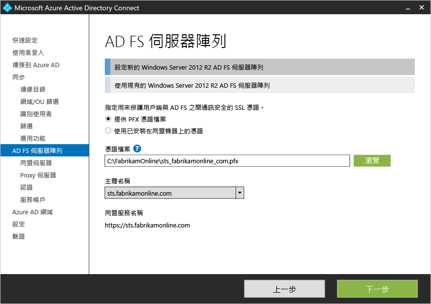

如果您選擇使用現有的 AD FS 伺服器陣列，將會前往設定 AD FS 與 Azure AD 之間信任關係的畫面。

### 指定 AD FS 伺服器
輸入想要在其中安裝 AD FS 的伺服器。您可以根據容量規劃需求，加入一或多部伺服器。請先將所有伺服器加入 Active Directory，再執行這項設定。Microsoft 建議安裝一部專門用於測試和試驗部署的 AD FS 伺服器。然後在完成初始設定之後透過再次執行 Azure AD Connect，新增及部署更多伺服器以符合您的調整需求。

> [!NOTE]
> 請先確認所有伺服器均已加入 AD 網域，再執行這項設定。
> 
> 

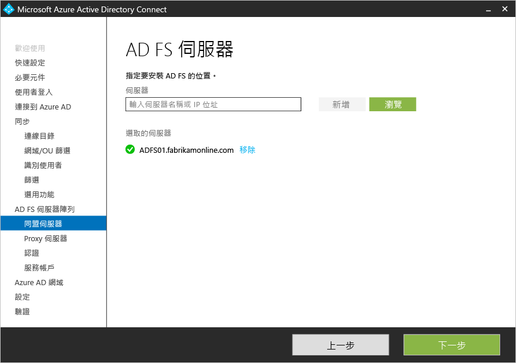

### 指定 Web 應用程式 Proxy 伺服器
輸入您要做為 Web 應用程式 Proxy 伺服器的伺服器。Web 應用程式 Proxy 伺服器會部署在您的 DMZ (外部網路對應) 中，且支援來自外部網路的驗證要求。您可以根據容量規劃需求，加入一或多部伺服器。Microsoft 建議安裝一部專門用於測試和試驗部署的 Web 應用程式 Proxy 伺服器。然後在完成初始設定之後透過再次執行 Azure AD Connect，新增及部署更多伺服器以符合您的調整需求。我們建議準備同樣數目的 Proxy 伺服器，以滿足來自內部網路的驗證需求。

> [!NOTE]
> <li> 如果您使用的帳戶不是 AD FS 伺服器上的本機系統管理員，則系統會提示您提供系統管理員認證。</li>
> <li> 執行此步驟之前，請確認 Azure AD Connect 伺服器和 Web 應用程式 Proxy 伺服器之間有 HTTP/HTTPS 連線。</li>
> <li> 請確認 Web 應用程式伺服器和 AD FS 伺服器之間的 HTTP/HTTPS 連線是否允許流入驗證要求。</li>
> 
> 

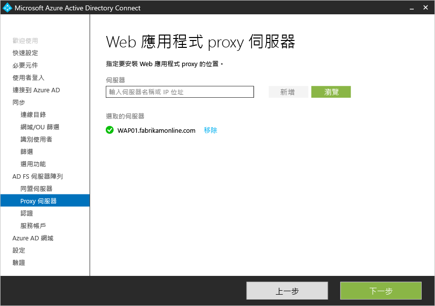

系統會提示您輸入認證，讓 Web 應用程式伺服器可以建立與 AD FS 伺服器的安全連線。這些認證必須是 AD FS 伺服器上的本機系統管理員。

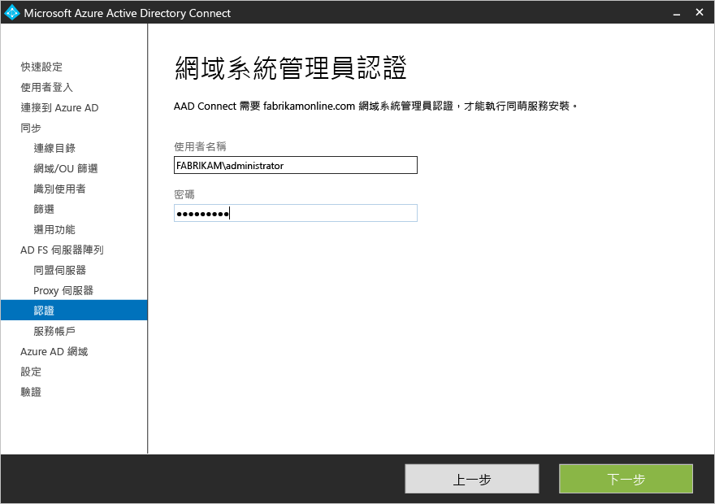

### 指定 AD FS 服務的服務帳戶
AD FS 服務需要網域服務帳戶來驗證使用者，以及在 Active Directory 中查閱使用者資訊。它可支援兩種類型的服務帳戶：

* **群組受管理服務帳戶**：在 Windows Server 2012 的 Active Directory 網域服務中導入。此類型的帳戶可為 AD FS 之類的服務提供單一帳戶，而不需要定期更新帳戶密碼。如果您在 AD FS 伺服器所屬的網域中已經有 Windows Server 2012 網域控制站，請使用此選項。
* **網域使用者帳戶**：此類型的帳戶會要求您提供密碼，並在密碼變更或到期時定期更新密碼。只有當您在 AD FS 伺服器所屬的網域中沒有 Windows Server 2012 網域控制站時，才能使用此選項。

如果您選取了 [群組受管理服務帳戶]，而這項功能從未在 Active Directory 中使用過，系統會提示您輸入企業系統管理員認證。這些認證會用來啟動金鑰存放區，並在 Active Directory 中啟用這項功能。

### 選取您想要建立同盟的 Azure AD 網域
此組態會用來設定 AD FS 與 Azure AD 之間的同盟關係。它會設定 AD FS 將安全性權杖簽發給 Azure AD，並將 Azure AD 設定為信任來自此特定 AD FS 執行個體的權杖。此頁面只能讓您在初始安裝中設定單一網域。您可稍後再次執行 Azure AD Connect 以設定其他網域。

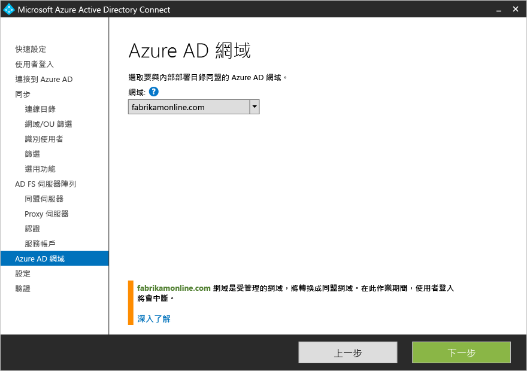

### 驗證所選取用於同盟的 Azure AD 網域
當您選取要同盟的網域時，Azure AD Connect 會提供您所需資訊以供您驗證尚未驗證的網域。請參閱[新增並驗證網域](active-directory-add-domain.md)以了解如何使用這項資訊。

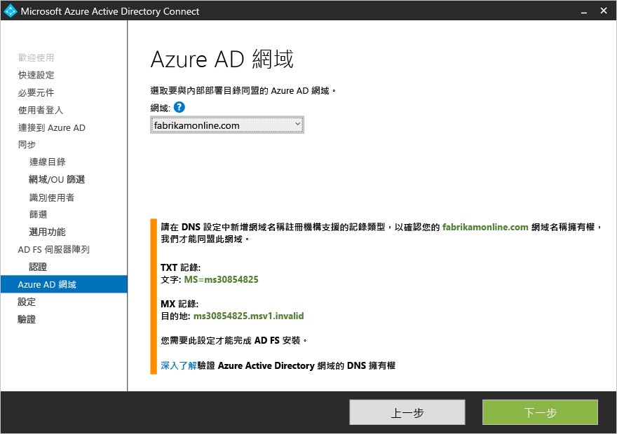

> [!NOTE]
> AD Connect 會嘗試在設定階段驗證網域。如果您繼續進行設定，但未加入必要的 DNS 記錄，精靈將無法完成設定。
> 
> 

## 設定並確認頁面
設定會在此頁面上進行。

> [!NOTE]
> 在繼續安裝之前，如果已設定同盟，請確定您已設定[同盟伺服器的名稱解析](active-directory-aadconnect-prerequisites.md#name-resolution-for-federation-servers)。
> 
> 

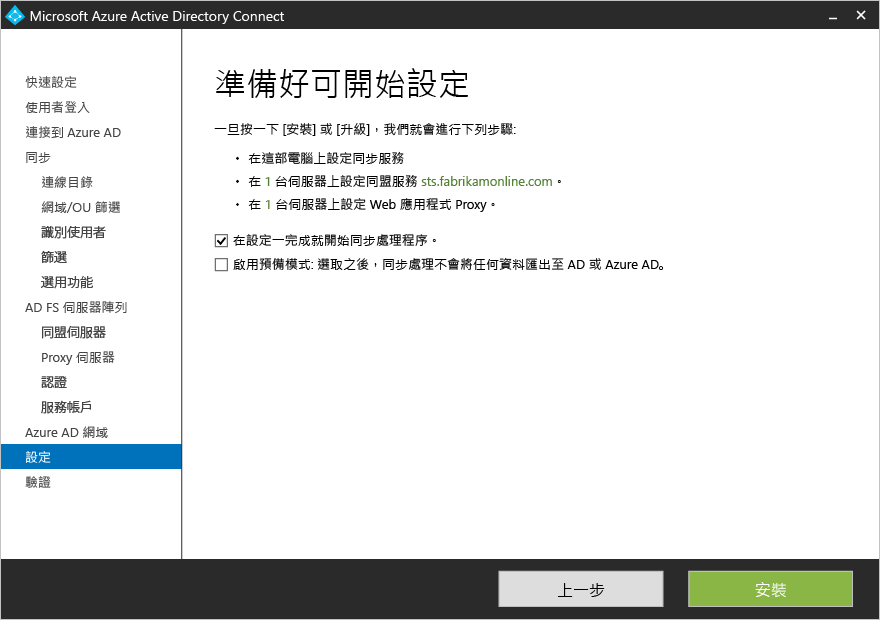

### 預備模式
您可以在預備模式下同時設定新的同步處理伺服器。僅支援將一部同步處理伺服器匯出到雲端中的一個目錄。但如果您想要從另一部伺服器移動，例如執行 DirSync 的伺服器，可以啟用預備模式中的 Azure AD Connect。啟用時，同步處理引擎會照常匯入和同步處理資料，但它不會將任何項目匯出至 Azure AD 或 AD。在預備模式下，將會停用功能密碼同步處理和密碼回寫。

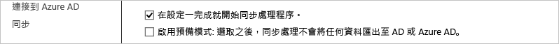

在預備模式中，可以對同步處理引擎進行所需的變更，並檢閱要匯出的項目。當此組態看起來設定良好時，請再次執行安裝精靈，並停用預備模式。資料現在會從這個伺服器匯出至 Azure AD。同時請務必停用其他伺服器，如此才能只讓一部伺服器主動匯出。

如需詳細資訊，請參閱[預備模式](active-directory-aadconnectsync-operations.md#staging-mode)。

### 驗證同盟組態
當您按一下 [驗證] 按鈕時，Azure AD Connect 會為您驗證 DNS 設定。

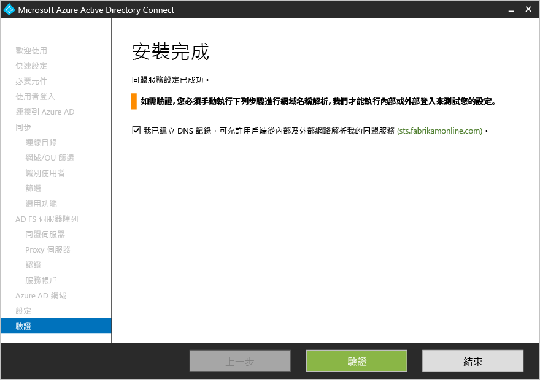

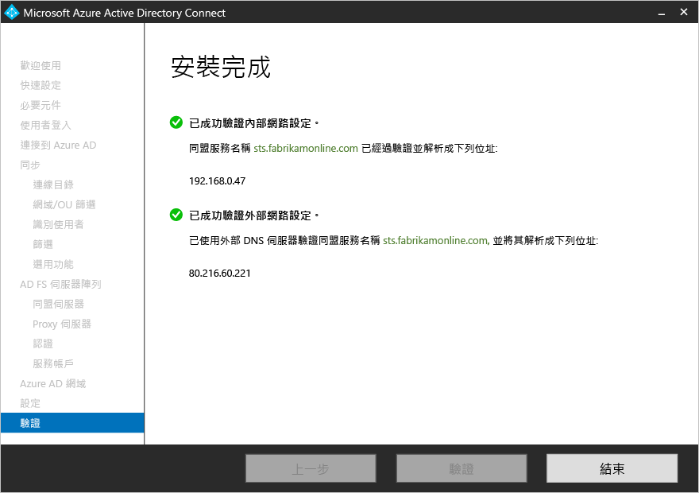

此外，請執行下列驗證步驟：

* 驗證您可以從內部網路中已加入網域之電腦上的瀏覽器進行登入：連線到 https://myapps.microsoft.com，並使用您已登入的帳戶驗證登入。內建的 AD DS 系統管理員帳戶未同步處理，不能用於驗證。
* 驗證您可以從外部網路的裝置登入。在家用電腦或行動裝置上連線到 https://myapps.microsoft.com，並提供您的認證。
* 驗證豐富型用戶端登入。連線到 https://testconnectivity.microsoft.com，選擇 [Office 365] 索引標籤，然後選擇 [Office 365 單一登入測試]。

## 後續步驟
安裝完成之後，請先登出 Windows 再重新登入，才能使用 Synchronization Service Manager 或同步處理規則編輯器。

安裝了 Azure AD Connect 之後，您可以[驗證安裝和指派授權](active-directory-aadconnect-whats-next.md)。

深入了解這些在安裝時啟用的功能︰[防止意外刪除](active-directory-aadconnectsync-feature-prevent-accidental-deletes.md)和 [Azure AD Connect Health](active-directory-aadconnect-health-sync.md)。

深入了解這些常見主題︰[排程器和如何觸發同步處理](active-directory-aadconnectsync-feature-scheduler.md)。

深入了解[整合內部部署身分識別與 Azure Active Directory](active-directory-aadconnect.md)。

## 相關文件
| 主題 |
| --- | --- |
| Azure AD Connect 概觀 |
| 使用快速設定進行安裝 |
| 從 DirSync 升級 |
| 用於安裝的帳戶 |

<!---HONumber=AcomDC_0914_2016-->