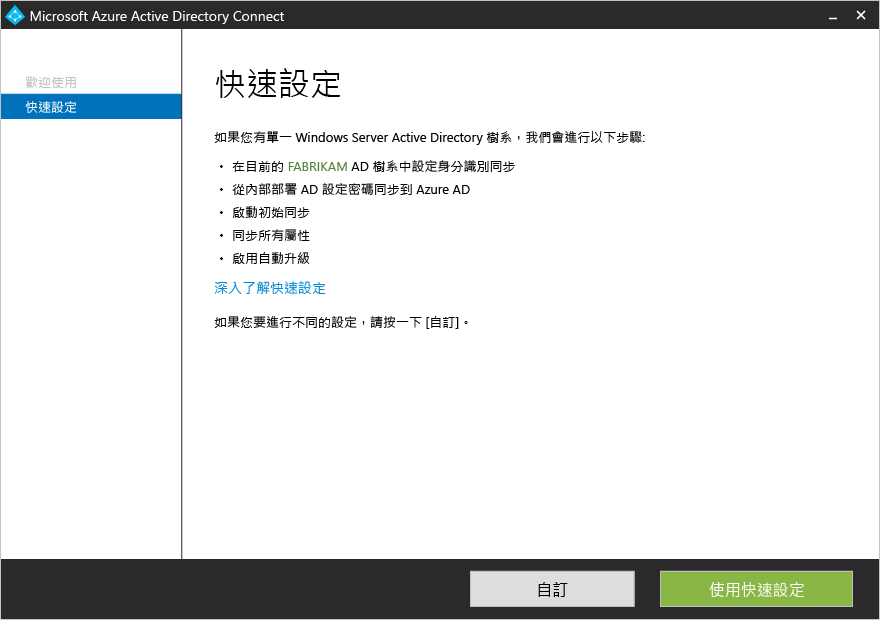
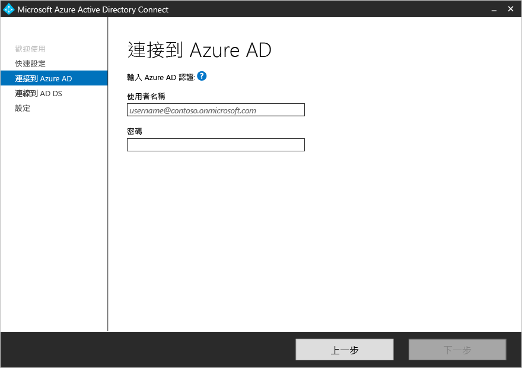
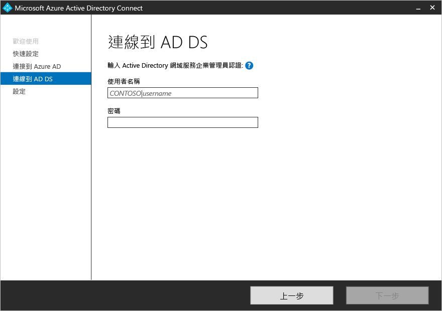
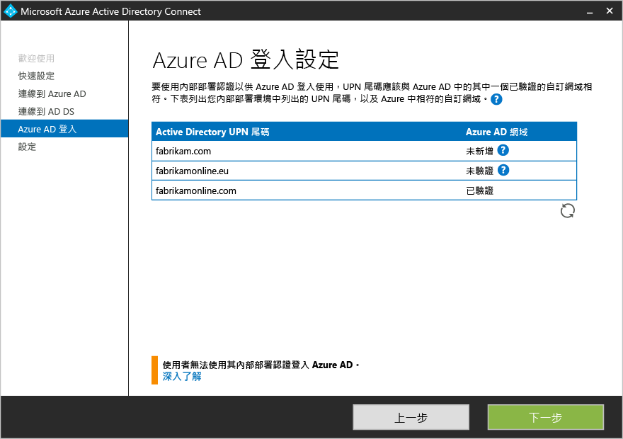
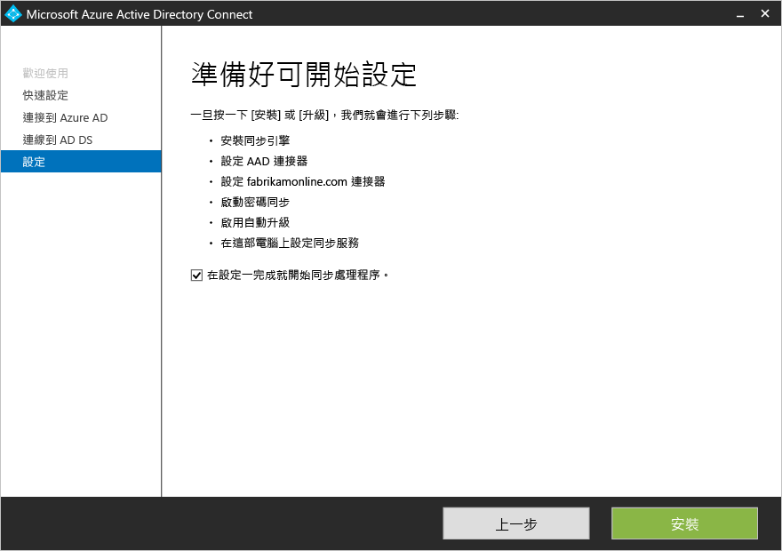

<properties
	pageTitle="Azure AD Connect：開始使用快速設定 | Microsoft Azure"
	description="了解如何下載、安裝和執行 Azure AD Connect 的安裝精靈。"
	services="active-directory"
	documentationCenter=""
	authors="billmath"
	manager="stevenpo"
	editor="curtand"/>

<tags
	ms.service="active-directory"
	ms.workload="identity"
	ms.tgt_pltfrm="na"
	ms.devlang="na"
	ms.topic="get-started-article"
	ms.date="05/10/2016"
	ms.author="billmath;andkjell"/>

# 使用快速設定開始使用 Azure AD Connect
本主題協助您開始使用 Azure Active Directory Connect。本文件說明 Azure AD Connect 的快速安裝。快速設定會用在單一樹系拓撲中，並搭配密碼同步處理功能。只要簡短地按幾下即可將內部部署目錄擴充至雲端。

## 相關文件
如果您尚未閱讀[整合內部部署身分識別與 Azure Active Directory](active-directory-aadconnect.md) 上的文件，下表提供相關主題的連結。在開始安裝之前，您需要閱讀以粗體顯示的前兩個主題。

| 主題 | |
| --------- | --------- |
| **下載 Azure AD Connect** | [下載 Azure AD Connect](http://go.microsoft.com/fwlink/?LinkId=615771) |
| **硬體和必要條件** | [Azure AD Connect：硬體和必要條件](active-directory-aadconnect-prerequisites.md) |
| 使用自訂設定進行安裝 | [自訂 Azure AD Connect 安裝](active-directory-aadconnect-get-started-custom.md) |
| 從 DirSync 升級 | [從 Azure AD Sync 工具 (DirSync) 升級](active-directory-aadconnect-dirsync-upgrade-get-started.md) |
| 安裝之後 | [驗證安裝和指派授權](active-directory-aadconnect-whats-next.md) |
| 用於安裝的帳戶 | [Azure AD Connect 帳戶與權限的詳細資訊](active-directory-aadconnect-accounts-permissions.md) |

## 快速安裝 Azure AD Connect
**快速設定**是預設選項，並且會用在最常見的部署案例。當您使用快速設定時，Azure AD Connect 會為單一樹系拓撲部署同步處理。[密碼同步處理](active-directory-aadconnectsync-implement-password-synchronization.md)已啟用，而且可以讓您的使用者使用其內部部署密碼來登入雲端。[自動升級](active-directory-aadconnect-feature-automatic-upgrade.md)已啟用，這可減輕您的維護工作。若使用 [快速設定]，當安裝完成時便會自動開始同步處理 (不過您可以選擇不進行此步驟)。

### 使用快速設定安裝 Azure AD Connect

1. 以本機系統管理員身分登入您想要安裝 Azure AD Connect 的伺服器。請在您想要做為同步處理伺服器的伺服器上進行此步驟。
2. 瀏覽並按兩下 **AzureADConnect.msi**。
3. 在 [歡迎] 畫面上，選取同意授權條款的方塊，然後按一下 [繼續]。
4. 在 [快速設定] 畫面上，按一下 [使用快速設定]。
5. 在 [連接到 Azure AD] 畫面上，輸入您的 Azure AD 的全域系統管理員使用者名稱和密碼。按 [下一步]。 如果您收到錯誤訊息，而且有連線問題，請參閱[針對連線問題進行疑難排解](active-directory-aadconnect-troubleshoot-connectivity.md)。
6. 在 [連接到 AD DS] 畫面上輸入企業系統管理員帳戶的使用者名稱和密碼。您可以用 NetBios 或 FQDN 格式輸入網域部分，也就是 FABRIKAM\\administrator 或 fabrikam.com\\administrator。按 [下一步]。
7. 如果您的 UPN 網域已在內部部署 Active Directory 中註冊卻不存在或尚未驗證，便會出現此頁面。如果內部部署 AD DS 中的 UPN 網域皆已驗證，則不會出現此頁面。 如果您看到此頁面，請檢閱每一個標示為**未新增**和**未驗證**的網域。確定您所使用的網域皆已在 Azure AD 中完成驗證。驗證好網域時，按一下 [重新整理] 符號。如需詳細資訊，請參閱[新增並驗證網域](active-directory-add-domain.md)
8. 在 [準備好設定] 畫面中，按一下 [安裝]。
	- 在 [準備設定] 頁面上，您可以取消選取 [設定一完成，即開始同步處理程序] 核取方塊。如果您想要進行其他設定 (例如[篩選](active-directory-aadconnectsync-configure-filtering.md))，應該取消選取此核取方塊。若您取消選取此選項，精靈會設定同步處理，但是會讓排程器保持停用。在您重新執行安裝精靈以手動啟用排程器之前，排程器將不會執行。
	- 此外，您也可以選取對應 [Exchange 混合式部署] 的核取方塊，以設定其同步處理服務。如果您打算在雲端和內部部署均設置 Exchange 信箱，請啟用此選項。
9. 當安裝完成時，按一下 [結束]。
10. 安裝完成之後，請先登出再重新登入，才能使用 Synchronization Service Manager 或同步處理規則編輯器。

如需使用快速安裝的影片，請參閱：

>[AZURE.VIDEO azure-active-directory-connect-express-settings]

## 後續步驟
安裝了 Azure AD Connect 之後，您可以[驗證安裝和指派授權](active-directory-aadconnect-whats-next.md)。

深入了解[整合內部部署身分識別與 Azure Active Directory](active-directory-aadconnect.md)。

<!---HONumber=AcomDC_0518_2016-->