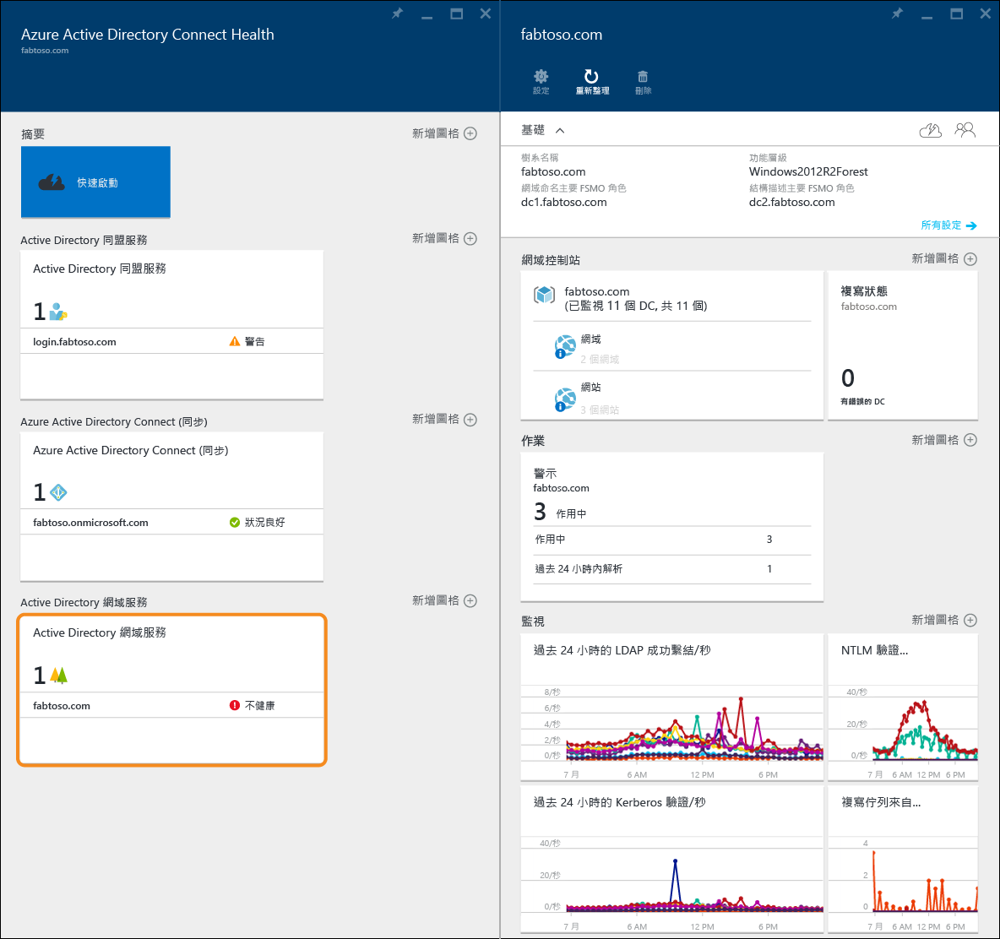
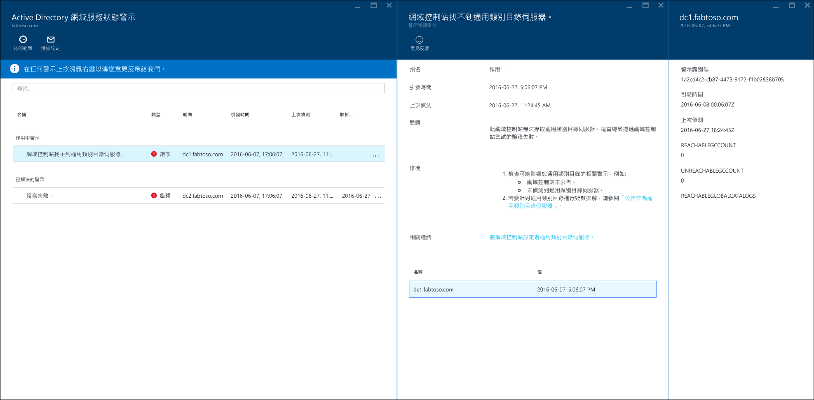
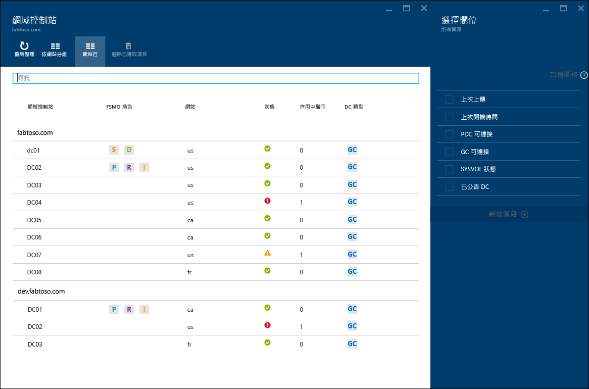
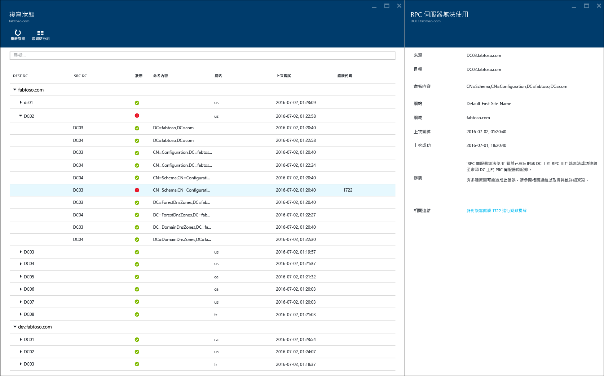
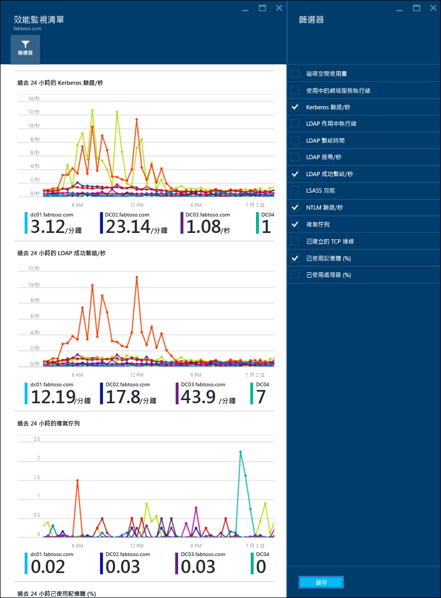

<properties
	pageTitle="使用 Azure AD Connect Health 搭配 AD DS | Microsoft Azure"
	description="這是 Azure AD Connect Health 頁面，其中討論如何監視 AD DS。"
	services="active-directory"
	documentationCenter=""
	authors="arluca"
	manager="samueld"
	editor="curtand"/>

<tags
	ms.service="active-directory"
	ms.workload="identity"
	ms.tgt_pltfrm="na"
	ms.devlang="na"
	ms.topic="get-started-article"
	ms.date="07/14/2016"
	ms.author="arluca"/>

# 在 AD DS 使用 Azure AD Connect Health
下列文件適用於使用 Azure AD Connect Health 來監視 Active Directory 網域服務。這包含安裝在 Windows Server 2008 R2、Windows Server 2012 及 Windows Server 2012 R2 上的 AD DS。

如需使用 Azure AD Connect Health 來監視 AD FS 的詳細資訊，請參閱[在 AD FS 使用 Azure AD Connect Health](active-directory-aadconnect-health-adfs.md)。此外，如需使用 Azure AD Connect Health 來監視 Azure AD Connect (同步處理) 的詳細資訊，請參閱 [使用適用於同步處理的 Azure AD Connect Health](active-directory-aadconnect-health-sync.md)。

## 適用於 AD DS 的 Azure AD Connect Health 警示
適用於 AD DS 的 Azure AD Connect Health 中的 [警示] 區段提供作用中和已解決的警示清單，與您的網域控制站相關。選取作用中或已解決的警示將會開啟新的刀鋒視窗，內含其他資訊和解決步驟以及支援文件的連結。每個警示類型可以有一或多個執行個體，會對應到受該特定警示影響的各個網域控制站。在靠近警示刀鋒視窗的底部，您可以選取受影響的網域控制站，會開啟一個新的刀鋒視窗，內含與該特定警示執行個體相關的其他詳細資訊。

可在此刀鋒視窗內啟用警示電子郵件通知，以及在檢視中變更時間範圍。展開時間範圍可查看先前已解決的警示。

## 網域控制站
此儀表板提供環境的拓撲檢視，以及關鍵作業計量和每個受監視網域控制站的健康狀態。顯示的計量有助於快速識別任何可能需要進一步調查的網域控制站。根據預設，僅會顯示資料行的子集；不過按一下資料行命令即可取得整組資料行。選取您最想關注的資料行，即可在儀表板中單一且輕鬆地檢視 AD DS 環境的健康狀態。

網域控制站可依其各別的網域或網站分組，有助您瞭解環境拓撲。最後，如果連按兩下刀鋒視窗的標頭，儀表板將會最大化以利用可用的螢幕畫面。這在顯示數個資料行時特別好用。

## 複寫狀態
此儀表板可檢視複寫狀態和受監視網域控制站的複寫拓撲。最新的複寫嘗試狀態會列出來，並附上針對所發現錯誤的有用文件。選取帶有錯誤的網域控制站將會開啟新的刀鋒視窗，內含其他資訊和解決步驟以及疑難排解文件的連結。

## 監視
這項功能提供不同效能計數器的圖形化趨勢，這是從每個受監視的網域控制站持續收集而來。網域控制站的效能可以輕鬆地和樹系中所有其他受監視的網域控制站進行比較。此外，您可以看到各種效能計數器並排，在環境中針對問題進行疑難排解時這很有用。

根據預設，已預先選取四個效能計數器；不過，您可以按篩選命令並選取或取消選取任何想要的效能計數器。此外，如果按一下特定的效能計數器圖形會開啟新的刀鋒視窗，其中包含每個受監視網域控制站的各別資料點。

## 相關連結

* [Azure AD Connect Health](active-directory-aadconnect-health.md)
* [Azure AD Connect Health 代理程式安裝](active-directory-aadconnect-health-agent-install.md)
* [Azure AD Connect Health 操作](active-directory-aadconnect-health-operations.md)
* [在 AD FS 使用 Azure AD Connect Health](active-directory-aadconnect-health-adfs.md)
* [使用 Azure AD Connect Health 進行同步處理](active-directory-aadconnect-health-sync.md)
* [Azure AD Connect Health 常見問題集](active-directory-aadconnect-health-faq.md)
* [Azure AD Connect Health 版本歷程記錄](active-directory-aadconnect-health-version-history.md)

<!---HONumber=AcomDC_0720_2016-->