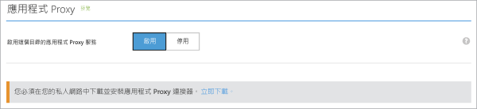

# 在 Azure 入口網站中啟用應用程式 Proxy
本文將逐步引導您完成為 Azure AD 中的雲端目錄啟用 Microsoft Azure AD 應用程式 Proxy 的步驟。

如果您不熟悉應用程式 Proxy 可協助您執行的工作，請深入了解 [如何為內部部署應用程式提供安全的遠端存取](active-directory-application-proxy-get-started.md)。

## 應用程式 Proxy 先決條件
您可以啟用並使用應用程式 Proxy 服務之前，必須具備：

* Microsoft Azure AD [基本或進階訂用帳戶](active-directory-editions.md) 以及您是全域管理員的 Azure AD 目錄。
* 執行 Windows Server 2012 R2 或 Windows 8.1 或更高版本的伺服器，您可以在該伺服器上安裝應用程式 Proxy 連接器。 伺服器會將要求傳送至雲端的應用程式 Proxy 服務，而且需要您所發佈之應用程式的 HTTP 或 HTTPS 連線。
  
  * 如需單一登入已發佈的應用程式，這部電腦應該會加入與您要發佈的應用程式相同的 AD 網域中。 如需詳細資訊，請參閱[使用應用程式 Proxy 進行單一登入](active-directory-application-proxy-sso-using-kcd.md)
* 如果路徑中有防火牆，請確定防火牆已開啟，以便連接器可以對應用程式 Proxy 提出 HTTPS (TCP) 要求。 連接器會將這些連接埠與屬於高層級網域的子網域一起使用：msappproxy.net 和 servicebus.windows.net。 請務必開啟下列連接埠以 **輸出** 流量：
  
  | 連接埠號碼 | 說明 |
  | --- | --- |
  | 80 |為安全性驗證啟用輸出 HTTP 流量。 |
  | 443 |針對 Azure AD 啟用使用者驗證 (只有在連接器註冊程序才需要) |
  | 10100–10120 |啟用傳送回 Proxy 的 LOB HTTP 回應 |
  | 9352、5671 |為連入要求啟用連接器到 Azure 服務之間的通訊。 |
  | 9350 |針對連入要求選擇性地啟用較佳的效能。 |
  | 8080 |啟用連接器開機順序以及連接器自動更新 |
  | 9090 |啟用連接器註冊 (只有在連接器註冊程序才需要) |
  | 9091 |啟用連接器信任憑證自動更新 |
  
    如果您的防火牆根據原始使用者強制執行流量，請針對來自當做網路服務執行的 Windows 服務的流量，開放這些連接埠。 此外，請務必為 NT Authority\System 啟用連接埠 8080。
* 如果您的組織使用 Proxy 伺服器來連接網際網路，如需設定 Proxy 伺服器的詳細資訊，請看一下部落格文章[使用現有的內部部署 Proxy 伺服器](https://blogs.technet.microsoft.com/applicationproxyblog/2016/03/07/working-with-existing-on-prem-proxy-servers-configuration-considerations-for-your-connectors/)。

## 步驟 1：在 Azure AD 中啟用應用程式 Proxy
1. 在 [Azure 傳統入口網站](https://manage.windowsazure.com/)中，以系統管理員身分登入。
2. 移至 Active Directory，並選取您要啟用應用程式 Proxy 所在的目錄。
   
    
3. 在目錄頁面上選取 [設定]，然後向下捲動至 [應用程式 Proxy]。
4. 將 [啟用此目錄的應用程式 Proxy 服務] 切換為 [已啟用]。
   
    
5. 選取 [立即下載] 。 這會使您進入 [Azure AD 應用程式 Proxy 連接器下載] 。 閱讀並接受授權條款，然後按一下 [下載]  以儲存連接器的 Windows Installer 檔案 (.exe)。

## 步驟 2：安裝並註冊連接器
1. 在您根據必要條件所準備好的伺服器上執行 **AADApplicationProxyConnectorInstaller.exe** 。
2. 依照精靈中的指示進行安裝。
3. 在安裝期間，系統將提示您使用 Azure AD 租用戶的應用程式 Proxy 註冊連接器。
   
   * 提供您的 Azure AD 全域管理員認證。 您的全域管理員租用戶可能與您的 Microsoft Azure 認證不同。
   * 請確定註冊連接器的系統管理員與您啟用應用程式 Proxy 服務的位置在相同的目錄中。 例如，如果租用戶網域為 contoso.com，則系統管理員應該是 admin@contoso.com ，或該網域上的其他別名。
   * 如果 [IE 增強式安全性設定] 在您要安裝連接器的伺服器上設定為 [開啟]，可能會封鎖註冊畫面。 請依照錯誤訊息中的指示允許存取。 請確定已停用 [Internet Explorer 增強式安全性]。
   * 如果連接器註冊不成功，請參閱 [針對應用程式 Proxy 進行疑難排解](active-directory-application-proxy-troubleshoot.md)。  
4. 安裝完成後，會在您的伺服器中新增兩個新的服務：
   
   * **Microsoft AAD 應用程式 Proxy 連接器** 可啟用連線
     
     * **Microsoft AAD 應用程式 Proxy 連接器更新程式** 是自動更新服務，可定期檢查連接器新版本，並在需要時更新連接器。
     
     
5. 按一下安裝視窗中的 [完成]  。

如需連接器的相關資訊，請參閱[了解 Azure AD 應用程式 Proxy 連接器](application-proxy-understand-connectors.md)。 

為了實現高可用性，您應該至少部署兩個連接器。 若要部署更多連接器，請重複上面的步驟 2 和 3。 每個連接器都必須分別進行註冊。

如果您想要解除安裝連接器，請解除安裝連接器服務和更新程式服務。 重新啟動電腦，才能完全移除此服務。

## 後續步驟
您現在已經準備好 [使用應用程式 Proxy 發佈應用程式](active-directory-application-proxy-publish.md)。

如果您有位於不同網路或不同位置上的應用程式，您可以使用連接器群組將不同的連接器組織成邏輯單元。 深入了解 [使用應用程式 Proxy 連接器](active-directory-application-proxy-connectors.md)。

