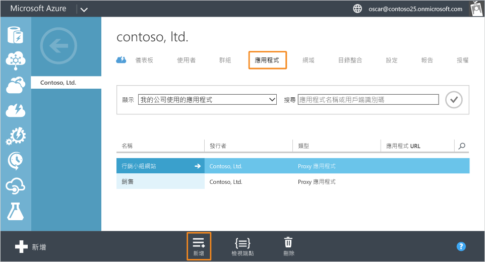
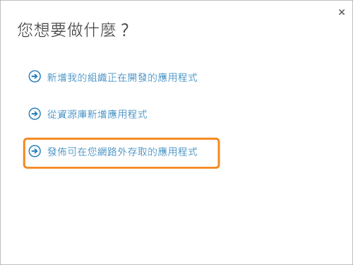
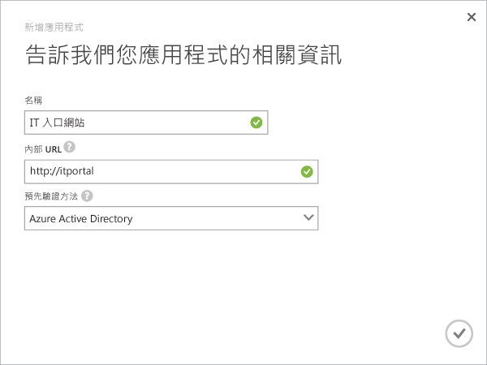
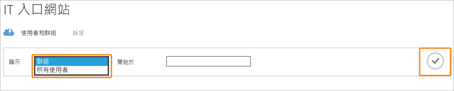
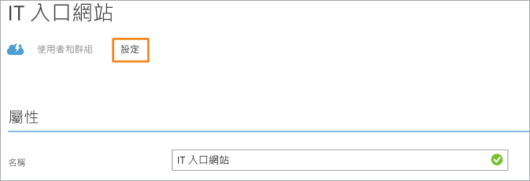

<properties
	pageTitle="使用 Azure AD 應用程式 Proxy 發佈應用程式 | Microsoft Azure"
	description="使用 Azure AD 應用程式 Proxy 將內部部署應用程式發佈至雲端。"
	services="active-directory"
	documentationCenter=""
	authors="kgremban"
	manager="femila"
	editor=""/>

<tags
	ms.service="active-directory"
	ms.workload="identity"
	ms.tgt_pltfrm="na"
	ms.devlang="na"
	ms.topic="get-started-article"
	ms.date="07/19/2016"
	ms.author="kgremban"/>

# 使用 Azure AD 應用程式 Proxy 發佈應用程式

Azure AD 應用程式 Proxy 可藉由發佈要透過網際網路存取的內部應用程式，協助您支援遠端背景工作。此時，您應該已在 [Azure 傳統入口網站中啟用應用程式 Proxy](active-directory-application-proxy-enable.md)。本文會逐步引導您發佈在區域網路上執行的應用程式，並提供從您的網路外部的安全遠端存取。完成本文之後，您便可以使用個人化資訊或安全性需求開始設定應用程式。

> [AZURE.NOTE] 應用程式 Proxy 是您升級至 Premium 或 Basic 版本的 Azure Active Directory 時才能使用的功能。如需詳細資訊，請參閱 [Azure Active Directory 版本](active-directory-editions.md)。

## 使用精靈發佈應用程式

1. 在 [Azure 傳統入口網站](https://manage.windowsazure.com/)中，以系統管理員身分登入。
2. 移至 Active Directory，並選取您啟用應用程式 Proxy 所在的目錄。

	

3. 按一下 [應用程式] 索引標籤，然後按一下畫面底部的 [新增] 按鈕

	

4. 選取 [發佈將可從您的網路外部存取的應用程式]。

	

5. 提供您的應用程式的下列資訊：

	- **名稱**：提供您的應用程式的易記名稱。該名稱在您的目錄中必須是唯一的。
	- **內部 URL**：應用程式 Proxy 連接器用來從您的私人網路存取應用程式的位址。您可以提供後端伺服器上要發佈的特定路徑，而伺服器的其餘部分則不發佈。如此一來，您可以在相同的伺服器上發佈不同的網站，並給予各自的名稱和存取規則。

		> [AZURE.TIP] 如果您發佈路徑，請確定其中包含您的應用程式的所有必要映像、指令碼和樣式表。例如，如果您的應用程式位於 https://yourapp/app 並使用位於 https://yourapp/media 的映像，您應該發佈 https://yourapp/ 做為路徑。

	- **預先驗證方法**︰應用程式 Proxy 在給予您的應用程式存取權前，用來驗證使用者的方式。從下拉式功能表選擇其中一個選項。

		- Azure Active Directory︰應用程式 Proxy 會重新導向使用者以使用 Azure AD 登入，進而驗證目錄和應用程式的權限。
		- 即時通行︰使用者不必進行驗證即可存取應用程式。

	

6. 若要完成精靈，請按一下畫面底部的核取記號。應用程式現在已在 Azure AD 中定義。

## 將使用者和群組指派給應用程式

為了讓使用者存取您發佈的應用程式，您必須以個別或群組方式指派他們。(請也記得指派自己的存取權。) 這需要每位使用者具有 Azure Basic 或更新版本的授權。您可以個別指派授權或指派給群組。如需詳細資訊，[將使用者指派給應用程式](active-directory-applications-guiding-developers-assigning-users.md)。

對於需要預先驗證的應用程式，這會授與使用該應用程式的權限。對於不需要預先驗證的應用程式，使用者仍可被指派至該應用程式，該應用程式才會出現在其應用程式清單中 (例如 MyApps)。

1. 完成 [新增應用程式] 精靈之後，您會看見您的應用程式的 [快速啟動] 頁面。若要管理誰有權存取此應用程式，請選取 [使用者和群組]。

	

2. 在您的目錄中搜尋特定群組，或顯示所有的使用者。若要顯示搜尋結果，請按一下核取記號。

  	

2. 選取您要指派給這個應用程式的每個使用者或群組，然後按一下 [指派]。系統會要求您確認此動作。

> [AZURE.NOTE] 若是整合式 Windows 驗證應用程式，您可以僅指派從內部部署 Active Directory 同步的使用者及群組。您無法為使用 Azure Active Directory 應用程式 Proxy 發佈的應用程式，指派使用 Microsoft 帳戶和來賓登入的使用者。請確定您的使用者使用與您要發佈的應用程式屬於相同網域的認證登入。

## 測試已發佈的應用程式

發佈您的應用程式後，您可以瀏覽至您所發佈的 URL 來進行測試。確定您可以存取，且應用程式會正確地呈現，以及所有一切如預期般運作。如果您遇到問題或收到錯誤訊息，請嘗試[疑難排解指南](active-directory-application-proxy-troubleshoot.md)。

## 設定您的應用程式

您可以修改已發佈的應用程式，或在 [設定] 頁面上設定進階選項。在此頁面上，您可藉由變更名稱或上傳標誌來自訂您的應用程式。您也可以管理存取規則，如預先驗證方法或 Multi-Factor Authentication。

使用 Azure Active Directory 應用程式 Proxy 發佈應用程式之後，這些應用程式會出現在 Azure AD 中的應用程式清單內，您可以在那裡進行管理。

如果您在發佈應用程式之後停用應用程式 Proxy 服務，便無法再從您的私人網路外部存取這些服務。這不會刪除應用程式。

若要檢視應用程式，並確定可以存取該應用程式，按兩下應用程式的名稱。如果已停用應用程式 Proxy 服務，而且無法使用應用程式，則會在畫面頂端出現一個警告訊息。

若要刪除某個應用程式，在清單中選取該應用程式，然後按一下 [刪除]。

## 後續步驟

- [使用您自己的網域名稱發行應用程式](active-directory-application-proxy-custom-domains.md)
- [啟用單一登入](active-directory-application-proxy-sso-using-kcd.md)
- [啟用條件式存取](active-directory-application-proxy-conditional-access.md)
- [使用宣告感知應用程式](active-directory-application-proxy-claims-aware-apps.md)

如需最新消息，請查閱[應用程式 Proxy 部落格](http://blogs.technet.com/b/applicationproxyblog/)

<!---HONumber=AcomDC_0921_2016-->