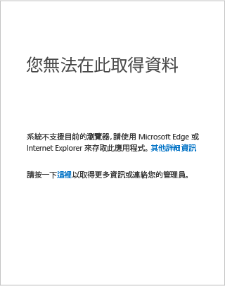
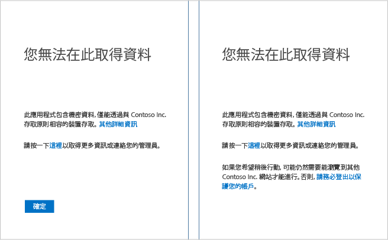

# 您無法在 Windows 裝置上從這裡前往該處

例如，在嘗試存取貴組織的 SharePoint Online 內部網路期間，您可能會碰到一個頁面指出「您無法從這裡前往該處」。 您會看到此頁面，因為您的系統管理員已設定條件式存取原則，以防止在某些情況下存取貴組織的資源。 雖然可能需要連絡技術支援或系統管理員才能解決此問題，但您可以先自行嘗試幾件事。

如果您使用 **Windows** 裝置，您應該檢查下列事項︰

- 您使用支援的瀏覽器？

- 您在裝置上執行支援的 Windows 版本？

- 您的裝置是否符合規範？

## 支援的瀏覽器

如果您的系統管理員已設定條件式存取原則，您只可以使用支援的瀏覽器來存取貴組織的資源。 在 Windows 裝置上，只支援 **Internet Explorer** 和 **Edge**。

查看錯誤頁面的詳細資料區段，即可輕鬆地識別您是否因為不支援的瀏覽器而無法存取資源︰

唯一的補救方式是根據您的裝置平台來使用應用程式所支援的瀏覽器。 如需支援的瀏覽器完整清單，請參閱[支援的瀏覽器](active-directory-conditional-access-supported-apps.md#supported-browsers)。  

## 支援的 Windows 版本

您裝置上的 Windows 作業系統必須符合下列敘述： 

- 如果您在裝置上執行 Windows 桌面作業系統，它必須是 Windows 7 或更新版本。
- 如果您在裝置上執行 Windows Server 作業系統，它必須是 Windows Server 2008 R2 或更新版本。 

## 符合規範的裝置

您的系統管理員可能已設定條件式存取原則，其只允許您從符合規範的裝置存取貴組織的資源。 為了符合規範，您的裝置必須加入內部部署 Active Directory 或加入您的 Azure Active Directory。

查看錯誤頁面的詳細資料區段，即可輕鬆地識別您是否因為裝置不符合規範而無法存取資源︰
 

### 您的裝置已加入內部部署 Active Directory？

**如果您的裝置已加入組織中的內部部署 Active Directory︰**

1. 確定您使用工作帳戶 (Active Directory 帳戶) 登入 Windows。
2. 透過虛擬私人網路 (VPN) 或 DirectAccess 連接到公司網路。
3. 連接之後，按 Windows 標誌鍵 + L 鍵來鎖定您的 Windows 工作階段。
4. 輸入您的工作帳戶認證，以將 Windows 工作階段解除鎖定。
5. 等候一分鐘，然後再次嘗試存取應用程式或服務。
6. 如果您看到相同的頁面，請按一下 [更多詳細資料] 連結，然後備妥詳細資料來連絡您的系統管理員。

### 您的裝置未加入內部部署 Active Directory？

如果您的裝置未加入內部部署 Active Directory 且執行的是 Windows 10，您有兩個選項︰

* 執行 Azure AD Join
* 將您的工作帳戶或學校帳戶新增至 Windows

如需這些選項有何差異的相關資訊，請參閱[在您的工作場所中使用 Windows 10 裝置](active-directory-azureadjoin-windows10-devices.md)。  
如果您的裝置：

- 屬於您的組織，您應該執行 Azure AD Join。
- 是個人裝置或 Windows 手機，您應該將您的工作或學校帳戶新增至 Windows。 

#### Windows 10 上的 Azure AD Join

將裝置加入至 Azure AD 的步驟會繫結您執行的 Windows 10 版本。 若要判斷 Windows 10 作業系統的版本，請執行 **winver** 命令︰ 

**Windows 10 年度更新 (版本 1607)：**

1. 開啟 [設定]  應用程式。
2. 按一下 [帳戶] > [存取工作或學校]。
3. 按一下 [ **連接**]。
4. 按一下 [將此裝置加入 Azure AD]。
5. 向您的組織驗證、提供多重要素驗證 (若提示的話)，然後依照顯示的步驟進行。
6. 登出，然後使用您的工作帳戶登入。
7. 再次嘗試存取應用程式。

**Windows 10 2015 年 11 月更新 (版本 1511)：**

1. 開啟 [設定]  應用程式。
2. 按一下 [系統] > [關於]。
3. 按一下 [加入 Azure AD] 。
4. 向您的組織驗證、提供多重要素驗證 (若提示的話)，然後依照顯示的步驟進行。
5. 登出，然後使用您的工作帳戶 (Azure AD 帳戶) 登入。
6. 再次嘗試存取應用程式。

#### 在 Windows 8.1 上的 Workplace Join

如果您的裝置未加入網域且執行的是 Windows 8.1，若要執行 [加入工作場所] 並在 Microsoft Intune 中註冊，請執行下列步驟：

1. 開啟 [電腦設定] 。
2. 按一下 [網路] > [工作場所]。
3. 按一下 [ **加入**]。
4. 向您的組織驗證、提供多重要素驗證 (若提示的話)，然後依照顯示的步驟進行。
5. 按一下 [開啟] 。
6. 再次嘗試存取應用程式。

#### 將您的工作帳戶或學校帳戶新增至 Windows 

**Windows 10 年度更新 (版本 1607)：**

1. 開啟 [設定]  應用程式。
2. 按一下 [帳戶] > [存取工作或學校]。
3. 按一下 [ **連接**]。
4. 向您的組織驗證、提供多重要素驗證 (若提示的話)，然後依照顯示的步驟進行。
5. 再次嘗試存取應用程式。

**Windows 10 2015 年 11 月更新 (版本 1511)：**

1. 開啟 [設定]  應用程式。
2. 按一下 [帳戶] > [您的帳戶]。
3. 按一下 [新增工作或學校帳戶] 。
4. 向您的組織驗證、提供多重要素驗證 (若提示的話)，然後依照顯示的步驟進行。
5. 再次嘗試存取應用程式。

## 後續步驟
[Azure Active Directory 條件式存取](active-directory-conditional-access.md)

