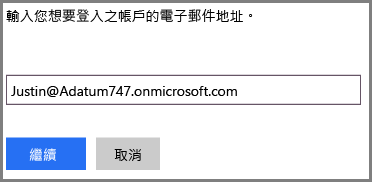
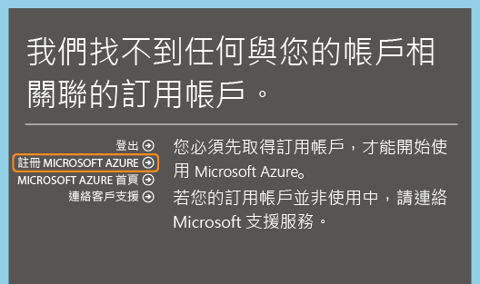
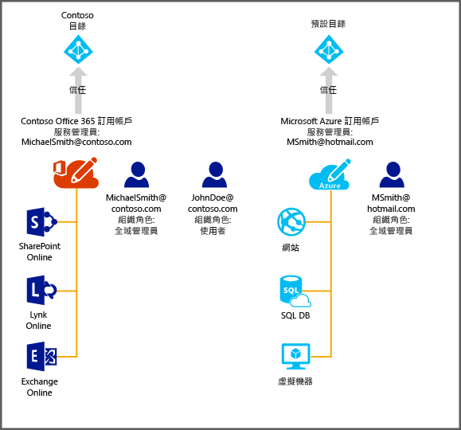

<properties
   pageTitle="在 Azure 中管理 Office 365 訂用帳戶的目錄 | Microsoft Azure"
   description="使用 Azure Active Directory 和 Azure 傳統入口網站管理 Office 365 訂用帳戶目錄"
   services="active-directory"
   documentationCenter=""
   authors="curtand"
   manager="femila"
   editor=""/>

<tags
   ms.service="active-directory"
   ms.devlang="na"
   ms.topic="get-started-article"
   ms.tgt_pltfrm="na"
   ms.workload="identity"
   ms.date="05/26/2016"
   ms.author="curtand"/>

# 在 Azure 中管理 Office 365 訂用帳戶的目錄。

本文說明如何管理針對 Office 365 訂用帳戶所建立的目錄，但我們將會使用 Azure 傳統入口網站。您必須是服務管理員或 Azure 訂用帳戶的共同管理員，才能登入 Azure 傳統入口網站。如果您還沒有 Azure 訂用帳戶

1. 您可以使用您用來登入 Office 365 的工作或學校帳戶來註冊。

系統找不到適用於 Azure 的對應訂用帳戶，但是您可以按一下 [註冊 Azure]，註冊表單中即會預先填入來自 Office 365 帳戶的相關資訊。根據預設，會將同一個帳戶指派給服務管理員角色。

完成 Azure 訂用帳戶之後，您便可以登入 Azure 傳統入口網站並存取 Azure 服務。按一下 Active Directory 延伸模組，以便管理用來驗證您 Office 365 使用者的相同目錄。

如果您已經擁有 Azure 訂用帳戶，則管理其他目錄的程序也很簡單。在此範例中，Michael Smith 可能擁有適用於 Contoso.com 的 Office 365 訂用帳戶。他也擁有使用其 Microsoft 帳戶 msmith@hotmail.com 所註冊的 Azure 訂用帳戶。在此情況下，他要管理兩個目錄。

 訂閱 | Office 365 | Azure
  -------------- | ------------- | -------------------------------
 顯示名稱 | Contoso | 預設 Azure Active Directory (Azure AD) 目錄
 網域名稱 | contoso.com | msmithhotmail.onmicrosoft.com

他想要在使用 Microsoft 帳戶登入 Azure 時，管理 Contoso 目錄中的使用者身分識別，如此就能啟用 Azure AD 功能，例如多重要素驗證 。下圖可能有助於說明此程序。

在此情況下，這兩個目錄是彼此獨立的。

## 管理兩個獨立的目錄
為了讓 Michael Smith 能夠在使用 msmith@hotmail.com 登入 Azure 時管理這兩個目錄，他必須完成下列步驟：

> [AZURE.NOTE]
只有當使用者使用 Microsoft 帳戶登入時，才能完成下列步驟。如果使用者使用工作或學校帳戶登入，則無法使用 [使用現有的目錄] 選項，因為工作或學校帳戶只能透過其主目錄 (也就是儲存工作或學校帳戶，且由公司或學校所擁有的目錄) 進行驗證。

1.	以 msmith@hotmail.com 身分登入 [Azure 傳統入口網站](https://manage.windowsazure.com)。
2.	依序按一下 [**新增**] > [**應用程式服務**] > [**Active Directory**] > [**目錄**] > [**自訂建立**]。
3.	按一下 [使用現有的目錄]，然後選取 [我現在已經可以登出] 核取方塊。
4.	以 Contoso.onmicrosoft.com 的全域管理員身分登入 Azure 傳統入口網站 (例如 msmith@contoso.com)。
5.	當系統出現 [搭配使用 Contoso 目錄和 Azure？] 提示時，按一下 [繼續]。
6.	按一下 [**立即登出**]。
7.	以 msmith@hotmail.com 身分登入 Azure 傳統入口網站。Contoso 目錄和預設目錄會出現在 Active Directory 延伸模組中。

完成這些步驟之後，msmith@hotmail.com 會成為 Contoso 目錄中的全域管理員。

## 以全域管理員身分管理資源
現在我們假設 Jane Doe 需要登入 Azure 傳統入口網站，並管理與 msmith@hotmail.com 的 Azure 訂用帳戶相關聯的網站和資料庫資源。在這麼做之前，Michael Smith 必須先完成下列額外步驟：

1.	使用 Azure 訂用帳戶的服務管理員帳戶登入 [Azure 傳統入口網站](https://manage.windowsazure.com) (在此範例中為 msmith@hotmail.com)。
2.	將訂用帳戶移轉至 Contoso 目錄：按一下 [設定] > [訂用帳戶] > 選取訂用帳戶 > [編輯目錄] > 選取 [Contoso (Contoso.com)]。在移轉過程中，如果有工作或學校帳戶是訂用帳戶的共同管理員，則將移除這類帳戶。
3.	新增 Jane Doe 做為訂用帳戶的共同管理員：按一下 [設定] > [系統管理員] > 選取訂用帳戶 > [新增] > 輸入 ****JohnDoe@Contoso.com**。

##後續步驟
如需訂用帳戶與目錄間的關聯性詳細資訊，請參閱[如何將訂用帳戶如何關聯至目錄](active-directory-how-subscriptions-associated-directory.md)。

<!---HONumber=AcomDC_0601_2016-->