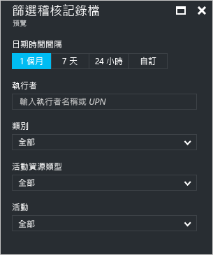
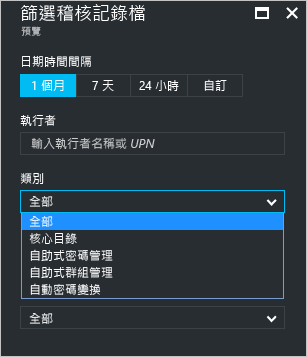
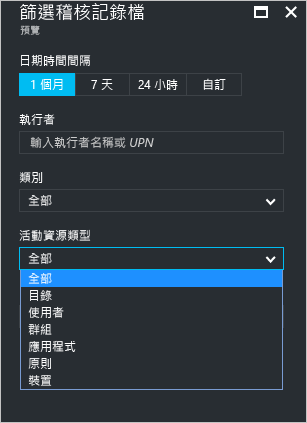
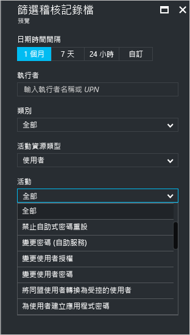
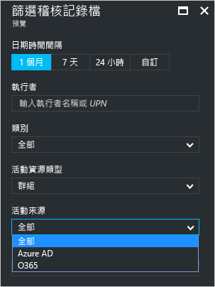

# Azure Active Directory 入口網站 (預覽版) 中的稽核活動報告

透過 Azure Active Directory [預覽版](active-directory-preview-explainer.md)中的報告，您可取得判斷您的環境執行狀況所需的所有資訊。

Azure Active Directory 中的報告架構包含下列元件：

- **活動** 
    - **登入活動** – 受管理應用程式和使用者登入活動的使用情況相關資訊
    - **稽核記錄** - 關於使用者和群組管理、受管理應用程式和目錄活動的系統活動資訊。
- **安全性** 
    - **有風險的登入** - 有風險的登入表示非使用者帳戶合法擁有者的某人嘗試登入。 如需詳細資訊，請參閱＜有風險的登入＞。
    - **標幟為有風險的使用者** - 有風險的使用者表示可能被盜用的使用者帳戶。 如需詳細資訊，請參閱＜標幟為有風險的使用者＞。

本主題提供稽核活動的概觀。
 
## 稽核記錄檔

Azure Active Directory 中的稽核記錄會提供符合規範的系統活動記錄。

Azure 入口網站中有三個主要類別可稽核相關活動︰

- 使用者和群組   

- 應用程式

- 目錄   

如需稽核報告活動的完整清單，請參閱 [稽核報告事件清單](active-directory-reporting-audit-events.md#list-of-audit-report-events)。

所有稽核資料的進入點是 [Azure Active Directory] 的 [活動] 區段中的 [稽核記錄檔]。

稽核記錄的清單檢視可顯示動作項目 (何者)、活動 (何事) 和目標。

按一下清單檢視中的項目，即可取得更多詳細資料。

## 使用者和群組稽核記錄檔

透過以使用者和群組為基礎的稽核報告，可以取得下列問題的解答︰

- 使用者已套用哪些類型的更新？

- 有多少使用者已變更？

- 有多少密碼已變更？

- 系統管理員已在目錄中執行哪些作業？

- 已新增的群組為何？

- 群組有成員資格變更嗎？

- 群組的擁有者已變更嗎？

- 指派給群組或使用者的授權為何？

如果您只想檢閱使用者和群組相關的稽核資料，您可以在 [使用者和群組] 的 [活動] 區段中的 [稽核記錄檔] 之下找到篩選過的檢視。

## 應用程式稽核記錄檔
透過以應用程式為基礎的稽核報告，可以取得下列問題的解答︰

* 已新增或更新的應用程式為何？
* 已移除的應用程式為何？
* 應用程式的服務原則已變更嗎？
* 應用程式的名稱已變更嗎？
* 誰已同意應用程式？

如果您只想檢閱應用程式相關的稽核資料，您可以在 [企業應用程式] 的 [活動] 區段中的 [稽核記錄檔] 之下找到篩選過的檢視。

## 篩選稽核記錄檔
您可以篩選登入，以使用下列欄位限制顯示的資料量：

- 日期和時間

- 動作項目的使用者主體名稱

- 類別

- 活動資源類型

- 活動

**類別**篩選可讓您根據下列類別縮小稽核報告的範圍：

- 核心目錄

- 自助密碼管理

- 自助式群組管理

- 自動密碼變換 

[活動資源類型] 清單的內容會繫結至此刀鋒視窗的進入點。  
如果您的進入點是 Azure Active Directory，此清單包含所有可能的活動類型︰

- 目錄

- User

- 群組 

- 應用程式 

- 原則

- 裝置

列出的活動是依照活動類型區分範圍。
例如，如果將 [使用者] 選取為 [活動類型]，則 [活動] 清單只會包含群組相關的活動。   

如果將 [群組] 選取為 [活動類型]，您就能取得其他篩選選項，讓您也能根據下列**活動來源**進行篩選：

- Azure AD

- O365

篩選稽核記錄檔項目的另一種方法是搜尋特定項目。

## 後續步驟
請參閱 [Azure Active Directory 報告指南](active-directory-reporting-guide.md)。

