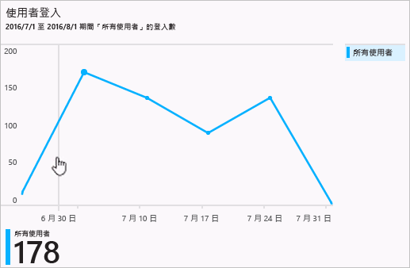
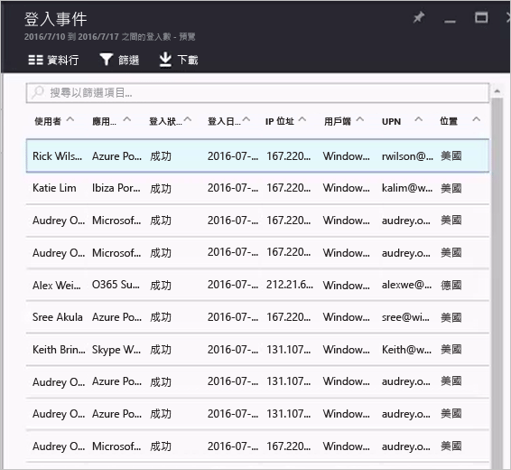

# Azure Active Directory 入口網站 (預覽版) 中的登入活動報告

透過 Azure Active Directory [預覽版](active-directory-preview-explainer.md)中的報告，您可取得判斷您的環境執行狀況所需的所有資訊。

Azure Active Directory 中的報告架構包含下列元件：

- **活動** 
    - **登入活動** – 受管理應用程式和使用者登入活動的使用情況相關資訊
    - **稽核記錄** - 關於使用者和群組管理、受管理應用程式和目錄活動的系統活動資訊。
- **安全性** 
    - **有風險的登入** - 有風險的登入表示非使用者帳戶合法擁有者的某人嘗試登入。 如需詳細資訊，請參閱＜有風險的登入＞。
    - **標幟為有風險的使用者** - 有風險的使用者表示可能被盜用的使用者帳戶。 如需詳細資訊，請參閱＜標幟為有風險的使用者＞。

本主題提供登入活動的概觀。

## 登入活動

利用使用者登入報告所提供的資訊，您可以找到下列問題的解答︰

* 使用者的登入模式為何？
* 一週內有多少使用者登入？
* 這些登入的狀態為何？

此資料的進入點是 [使用者和群組] 之下 [概觀] 區段中的使用者登入圖。

 

使用者登入圖會顯示在指定的時間週期中所有使用者的每週登入彙總。 時間週期的預設值是 30 天。

當您按一下登入圖中的某一天時，您會取得登入活動的詳細清單。

登入活動清單中的每一列會提供有關所選登入的詳細資訊，例如︰

* 誰已登入？
* 相關的 UPN 是什麼？
* 哪個應用程式是登入的目標？
* 登入的 IP 位址為何？
* 登入的狀態為何？

## 受管理應用程式的使用情況

利用登入資料以應用程式為主的檢視，您可以回答下列問題︰

* 誰在使用我的應用程式？
* 您的組織中排名前 3 個應用程式為何？
* 我最近已推出一個應用程式。 它的情況為何？

此資料的進入點是在 [企業應用程式] 之下 [概觀] 區段中的最近 30 天報告內您的組織中排名前 3 個應用程式。

 

應用程式使用圖會顯示在指定的時間週期中排名前 3 個應用程式的每週登入彙總。 時間週期的預設值是 30 天。

如果您想要，您可以將焦點設在特定的應用程式。

當您按一下應用程式使用圖中的某一天時，您會取得登入活動的詳細清單。

[登入]  選項會提供您的應用程式的所有登入事件的完整概觀。

使用欄位選擇器，可以選取您想要顯示的資料欄位。

## 篩選登入
您可以篩選登入，以使用下列欄位限制顯示的資料量：

* 日期和時間 
* 使用者的使用者主體名稱
* 應用程式名稱
* 用戶端名稱
* 登入狀態

篩選登入活動項目的另一種方法是搜尋特定項目。
此搜尋方法可讓您將登入的範圍設定為特定**使用者**、**群組**或**應用程式**。

## 後續步驟
請參閱 [Azure Active Directory 報告指南](active-directory-reporting-guide.md)。

