---

title: "Azure Active Directory 報告 | Microsoft Docs"
description: "列出 Azure Active Directory 的各種可用報告"
services: active-directory
documentationcenter: 
author: MarkusVi
manager: femila
editor: 
ms.assetid: 6141a333-38db-478a-927e-526f1e7614f4
ms.service: active-directory
ms.devlang: na
ms.topic: get-started-article
ms.tgt_pltfrm: na
ms.workload: identity
ms.date: 07/05/2017
ms.author: markvi
ms.translationtype: Human Translation
ms.sourcegitcommit: 2db2ba16c06f49fd851581a1088df21f5a87a911
ms.openlocfilehash: c7fe995f097c72ab5275249538fe2bb65efac256
ms.contentlocale: zh-tw
ms.lasthandoff: 05/09/2017

---
# Azure Active Directory 報告

*這份文件是 [Azure Active Directory 報告指南](active-directory-reporting-guide.md)的一部分。*

透過 Azure Active Directory 中的報告，您可以取得判斷您的環境執行狀況所需的資訊。

其中有兩個主要報告區域：

* **登入活動** – 受管理應用程式和使用者登入活動的使用情況相關資訊
* **稽核記錄檔** - 使用者和群組管理、受管理應用程式和目錄活動的相關系統活動資訊

視您所尋找的資料範圍而定，按一下 [Azure 入口網站](https://portal.azure.com)的服務清單中的 [使用者和群組] 或 [企業應用程式]，即可存取這些報告。

## 登入活動
### 使用者登入活動
利用使用者登入報告所提供的資訊，您可以找到下列問題的解答︰

* 使用者的登入模式為何？
* 一週內有多少使用者登入？
* 這些登入的狀態為何？

此資料的進入點是 [使用者和群組] 之下 [概觀] 區段中的使用者登入圖。

 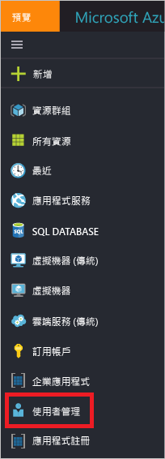

使用者登入圖會顯示在指定的時間週期中所有使用者的每週登入彙總。 時間週期的預設值是 30 天。

當您按一下登入圖中的某一天時，您會取得登入活動的詳細清單。

登入活動清單中的每一列會提供有關所選登入的詳細資訊，例如︰

* 誰已登入？
* 相關的 UPN 是什麼？
* 哪個應用程式是登入的目標？
* 登入的 IP 位址為何？
* 登入的狀態為何？

### 受管理應用程式的使用情況
利用登入資料以應用程式為主的檢視，您可以回答下列問題︰

* 誰在使用我的應用程式？
* 您的組織中排名前 3 個應用程式為何？
* 我最近已推出一個應用程式。 它的情況為何？

此資料的進入點是在 [企業應用程式] 之下 [概觀] 區段中的最近 30 天報告內您的組織中排名前 3 個應用程式。

 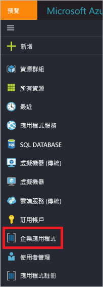

應用程式使用圖會顯示在指定的時間週期中排名前 3 個應用程式的每週登入彙總。 時間週期的預設值是 30 天。

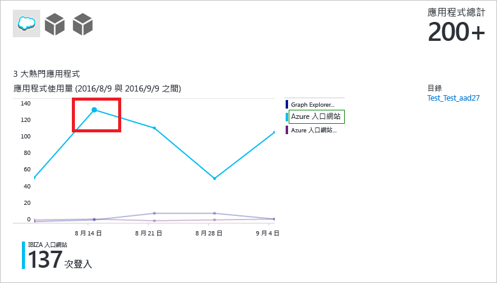

如果您想要，您可以將焦點設在特定的應用程式。

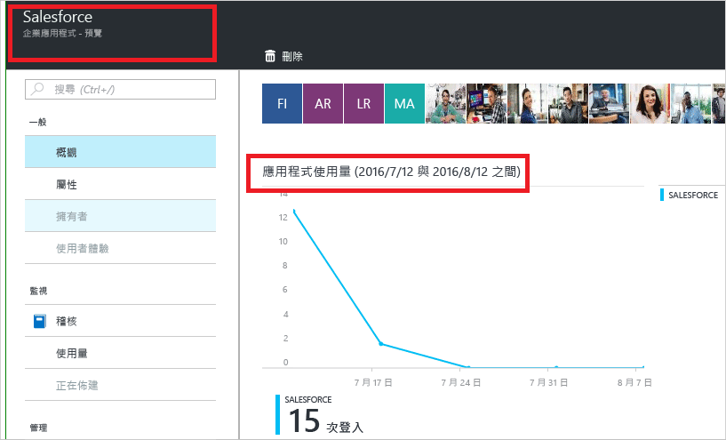

當您按一下應用程式使用圖中的某一天時，您會取得登入活動的詳細清單。

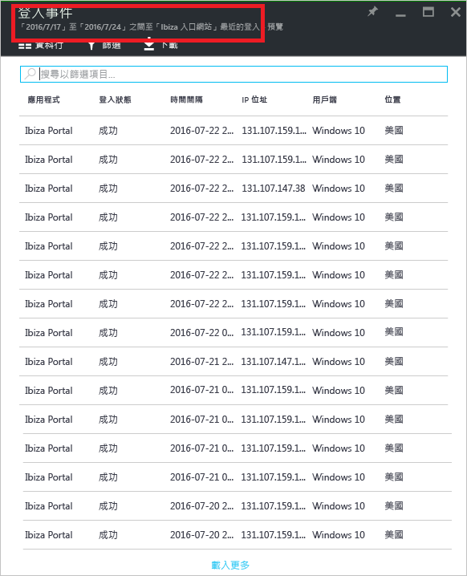

[登入]  選項會提供您的應用程式的所有登入事件的完整概觀。

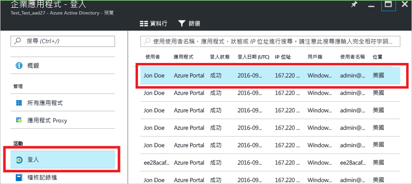

使用欄位選擇器，可以選取您想要顯示的資料欄位。

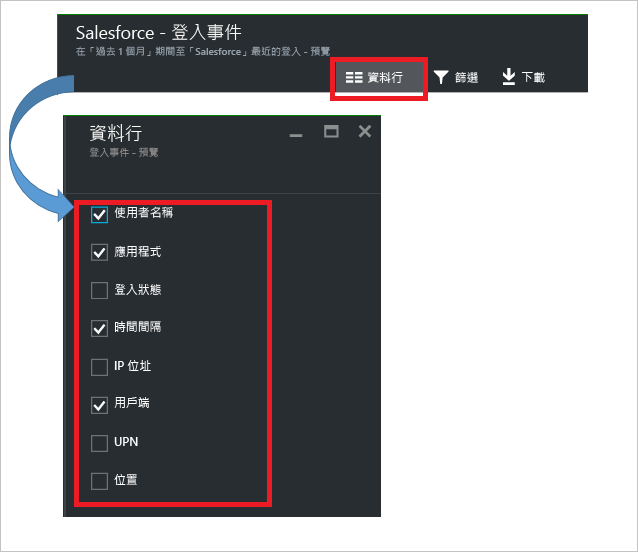

### 篩選登入
您可以篩選登入，以使用下列欄位限制顯示的資料量：

* 日期和時間 
* 使用者的使用者主體名稱
* 應用程式名稱
* 用戶端名稱
* 登入狀態

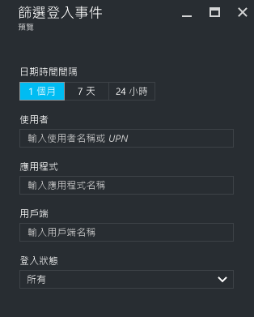

篩選登入活動項目的另一種方法是搜尋特定項目。
此搜尋方法可讓您將登入的範圍設定為特定**使用者**、**群組**或**應用程式**。

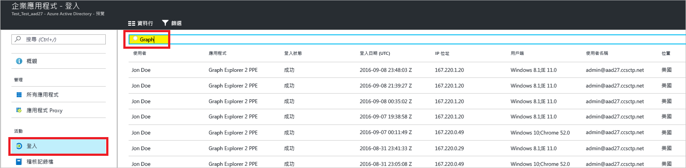

## 稽核記錄檔
Azure Active Directory 中的稽核記錄檔會提供系統活動的記錄以符合法規。

Azure 入口網站中有三個主要類別可稽核相關活動︰

* 使用者和群組   
* 應用程式
* 目錄   

如需稽核報告活動的完整清單，請參閱 [稽核報告事件清單](active-directory-reporting-audit-events.md#list-of-audit-report-events)。

所有稽核資料的進入點是 [Azure Active Directory] 的 [活動] 區段中的 [稽核記錄檔]。

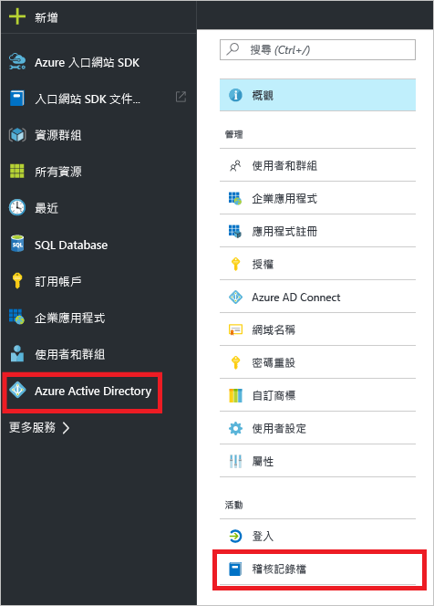

稽核記錄檔的清單檢視可顯示動作項目 (何者)、活動 (何事) 和目標。

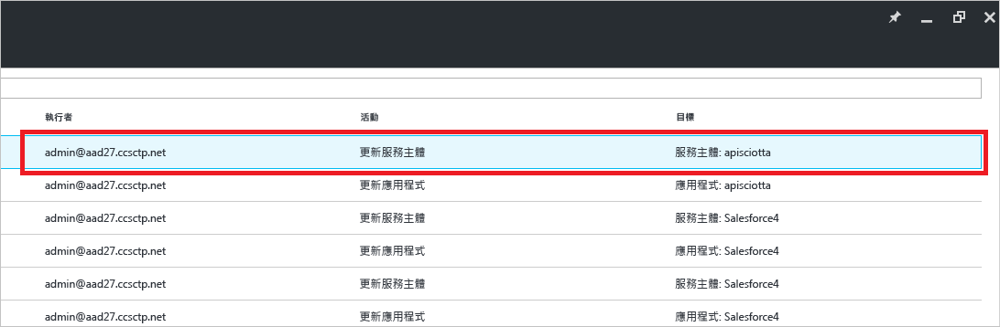

按一下清單檢視中的項目，即可取得更多詳細資料。

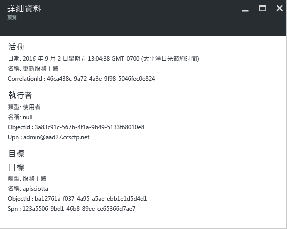

### 使用者和群組稽核記錄檔
透過以使用者和群組為基礎的稽核報告，可以取得下列問題的解答︰

* 使用者已套用哪些類型的更新？
* 有多少使用者已變更？
* 有多少密碼已變更？
* 系統管理員已在目錄中執行哪些作業？
* 已新增的群組為何？
* 群組有成員資格變更嗎？
* 群組的擁有者已變更嗎？
* 指派給群組或使用者的授權為何？

如果您只想檢閱使用者和群組相關的稽核資料，您可以在 [使用者和群組] 的 [活動] 區段中的 [稽核記錄檔] 之下找到篩選過的檢視。

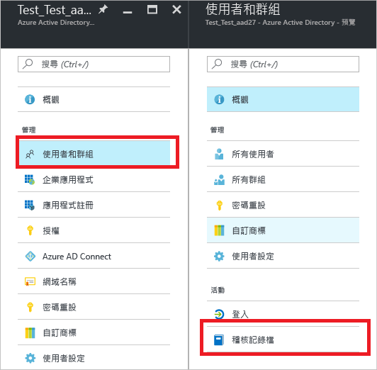

### 應用程式稽核記錄檔
透過以應用程式為基礎的稽核報告，可以取得下列問題的解答︰

* 已新增或更新的應用程式為何？
* 已移除的應用程式為何？
* 應用程式的服務原則已變更嗎？
* 應用程式的名稱已變更嗎？
* 誰已同意應用程式？

如果您只想檢閱應用程式相關的稽核資料，您可以在 [企業應用程式] 的 [活動] 區段中的 [稽核記錄檔] 之下找到篩選過的檢視。

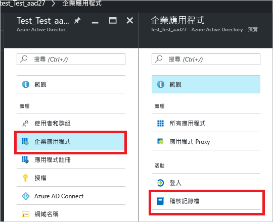

### 篩選稽核記錄檔
您可以篩選登入，以使用下列欄位限制顯示的資料量：

* 日期和時間
* 動作項目的使用者主體名稱
* 活動類型
* 活動

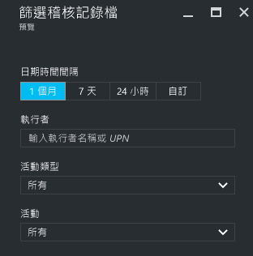

[活動類型] 清單的內容會繫結至此刀鋒視窗的進入點。  
如果您的進入點是 Azure Active Directory，此清單包含所有可能的活動類型︰

* 應用程式 
* 群組 
* User
* 裝置
* 目錄
* 原則
* 其他

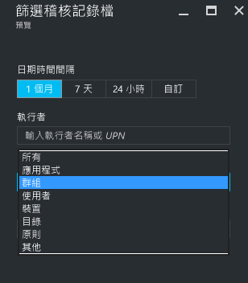

列出的活動是依照活動類型區分範圍。
例如，如果將 [群組] 選取為 [活動型別]，則 [活動] 清單只包含群組相關活動。   

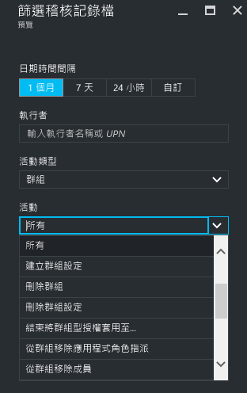

篩選稽核記錄檔項目的另一種方法是搜尋特定項目。

## 後續步驟
請參閱 [Azure Active Directory 報告指南](active-directory-reporting-guide.md)。

