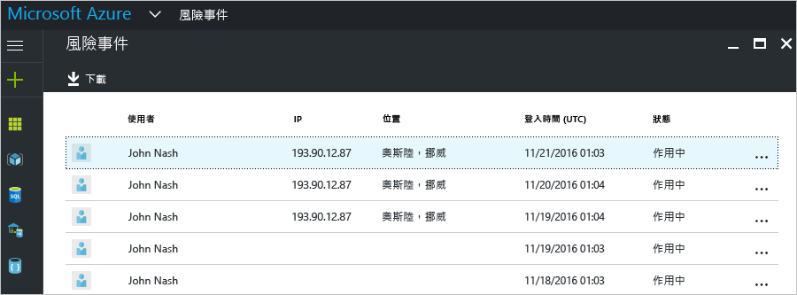
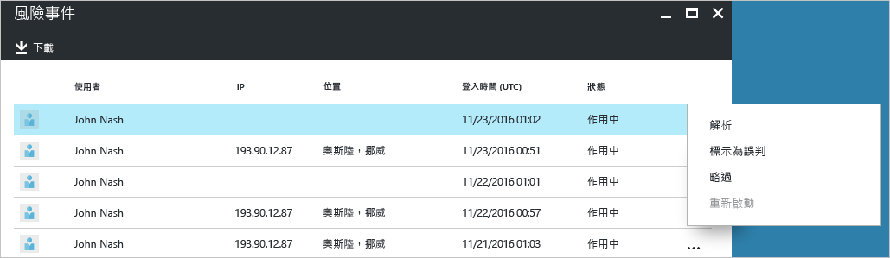
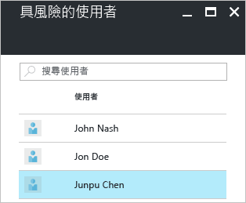
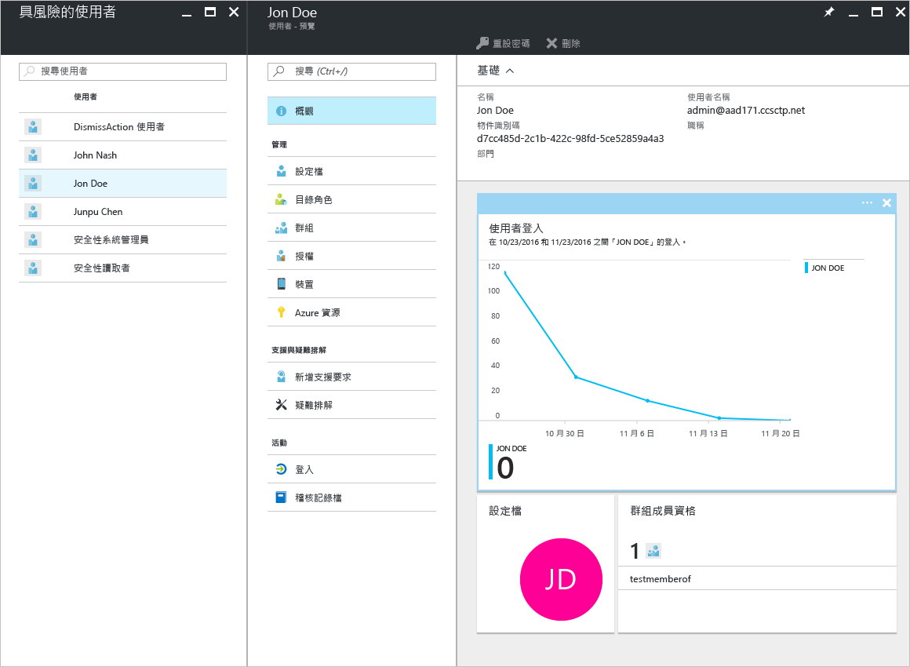

# Azure Active Directory 免費和基本版本中的安全性報告 - 預覽

利用 Azure Active Directory [預覽](active-directory-preview-explainer.md)中的安全性報告，您可以深入了解環境中使用者帳戶被盜用的可能性。 

Azure Active Directory 會偵測使用者帳戶相關的可疑動作。 針對每個偵測到的動作，將會建立一筆稱為「風險事件」的記錄。 如需詳細資訊，請參閱 [Azure Active 風險事件](active-directory-identity-protection-risk-events.md)。 

偵測到的風險事件用來計算︰

- **有風險的登入** - 有風險的登入表示非使用者帳戶合法擁有者的某人嘗試登入。 如需詳細資訊，請參閱[有風險的登入](active-directory-identityprotection.md#risky-sign-ins)。 

- **標幟為有風險的使用者** - 有風險的使用者表示可能被盜用的使用者帳戶。 如需詳細資訊，請參閱[標幟為有風險的使用者](active-directory-identityprotection.md#users-flagged-for-risk)。  

## 有風險的登入報告

Azure Active Directory 免費和基本版本會回報已偵測到的有風險使用者登入清單。 風險事件報告會提供：

- **使用者** - 登入作業期間所使用的使用者名稱
- **IP** - 用來連接至 Azure Active Directory 的裝置 IP 位址
- **位置** - 用來連接至 Azure Active Directory 的位置
- **登入時間** - 執行登入的時間
- **狀態** - 登入狀態

此報告會提供選項讓您下載報告資料。

在調查有風險的登入後，您可以採取下列動作形式，提供意見反應給 Azure Active Directory：

- 解決
- 標記為誤判
- 略過
- 重新啟動

如需詳細資訊，請參閱[手動關閉風險事件](active-directory-identityprotection.md#closing-risk-events-manually)。

## 具有風險的使用者報告

Azure Active Directory 免費版本會提供可能被盜用的使用者帳戶清單。 

按一下清單中的使用者會開啟相關的使用者資料刀鋒視窗。
針對有風險的使用者，請檢閱使用者的登入記錄，如有必要，請重設密碼。

## 後續步驟

- 如需 Azure Active Directory 報告的詳細資訊，請參閱 [Azure Active Directory 報告指南](active-directory-reporting-guide.md)。
- 如需 Azure Active Directory Identity Protection 的詳細資訊，請參閱 [Azure Active Directory Identity Protection](active-directory-identityprotection.md)。

<!--HONumber=Jan17_HO3-->

