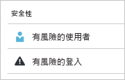
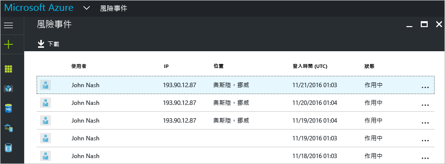
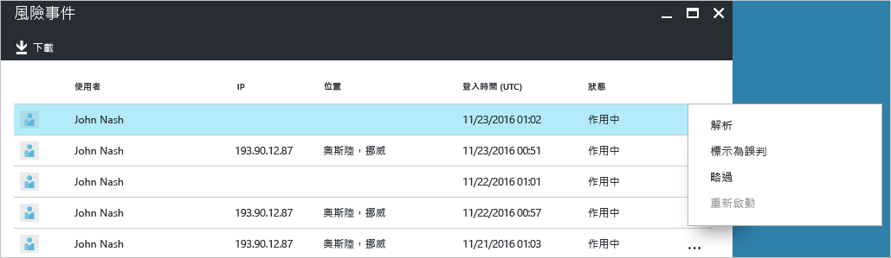
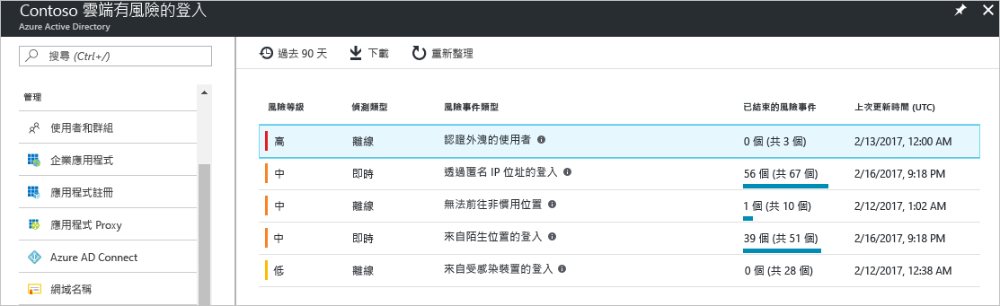
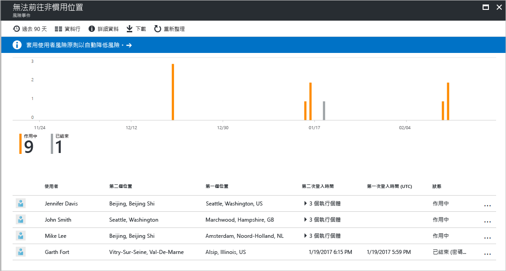
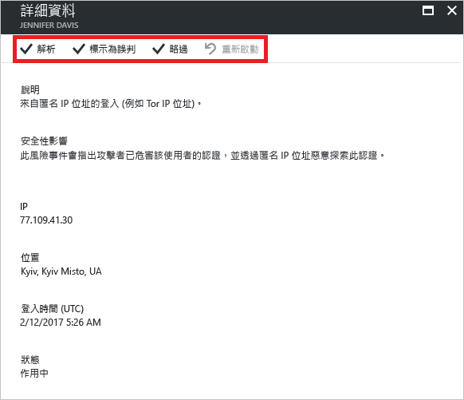

# Azure Active Directory 入口網站中有風險的登入報告

利用 Azure Active Directory (Azure AD) 中的安全性報告，您可以深入了解環境中使用者帳戶被盜用的可能性。 

Azure AD 會偵測使用者帳戶相關的可疑動作。 針對每個偵測到的動作，將會建立一筆稱為「風險事件」的記錄。 如需詳細資訊，請參閱 [Azure Active 風險事件](active-directory-identity-protection-risk-events.md)。 

偵測到的風險事件用來計算︰

- **有風險的登入** - 有風險的登入表示非使用者帳戶合法擁有者的某人嘗試登入。 如需詳細資訊，請參閱[有風險的登入](active-directory-identityprotection.md#risky-sign-ins)。 

- **標幟為有風險的使用者** - 有風險的使用者表示可能被盜用的使用者帳戶。 如需詳細資訊，請參閱[標幟為有風險的使用者](active-directory-identityprotection.md#users-flagged-for-risk)。  

在 [Azure 入口網站](https://portal.azure.com)中，您可以在 [Azure Active Directory] 刀鋒視窗的 [安全性] 區段中找到安全性報告。 

## Azure Active Directory 免費和基本版本

Azure Active Directory 免費和基本版本會為您的使用者提供已偵測到的有風險登入清單。 風險事件報告會提供：

- **使用者** - 登入作業期間所使用的使用者名稱
- **IP** - 用來連接至 Azure Active Directory 的裝置 IP 位址
- **位置** - 用來連接至 Azure Active Directory 的位置
- **登入時間** - 執行登入的時間
- **狀態** - 登入狀態

此報告會提供選項讓您下載報告資料。

在調查有風險的登入後，您可以採取下列動作形式，提供意見反應給 Azure Active Directory：

- 解決
- 標記為誤判
- 略過
- 重新啟動

如需詳細資訊，請參閱[手動關閉風險事件](active-directory-identityprotection.md#closing-risk-events-manually)。

## Azure Active Directory Premium Edition

Azure Active Directory Premium Edition 中有風險的登入報告可為您提供：

- 關於已偵測到之[風險事件類型](active-directory-identity-protection-risk-events.md)的彙總資訊

- 下載報告的選項

當您選取風險事件時，即會取得這個風險事件的詳細報告檢視，讓您能夠：

- 選擇設定[使用者風險補救原則](active-directory-identityprotection.md#user-risk-security-policy)  

- 檢閱風險事件的偵測時間軸  

- 檢閱已偵測到此風險事件的使用者清單

- [手動關閉風險事件](active-directory-identityprotection.md#closing-risk-events-manually)或重新啟動已手動關閉的風險事件。 

當您選取使用者時，即會取得這位使用者的詳細報告檢視，讓您能夠：

- 開啟 [所有登入] 檢視

- 重設使用者的密碼

- 關閉所有事件

- 調查針對該使用者報告的風險事件。 

若要調查風險事件，請從清單中選取一項。  
這會開啟這個風險事件的 [詳細資料] 刀鋒視窗。 在 [詳細資料] 刀鋒視窗中，您可以選擇[手動關閉風險事件](active-directory-identityprotection.md#closing-risk-events-manually)或重新啟動已手動關閉的風險事件。 

## 後續步驟

- 如需 Azure Active Directory Identity Protection 的詳細資訊，請參閱 [Azure Active Directory Identity Protection](active-directory-identityprotection.md)。

