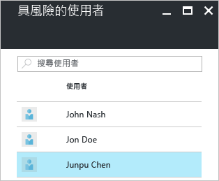
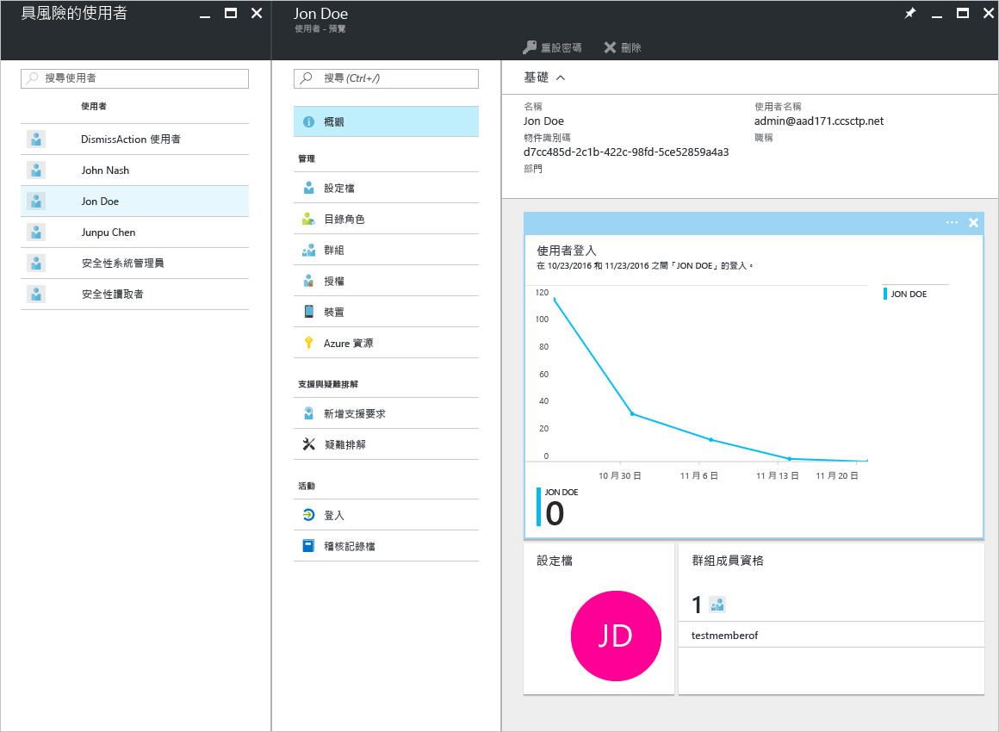
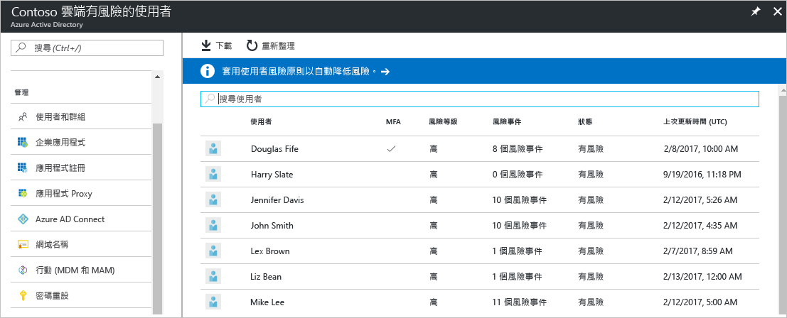
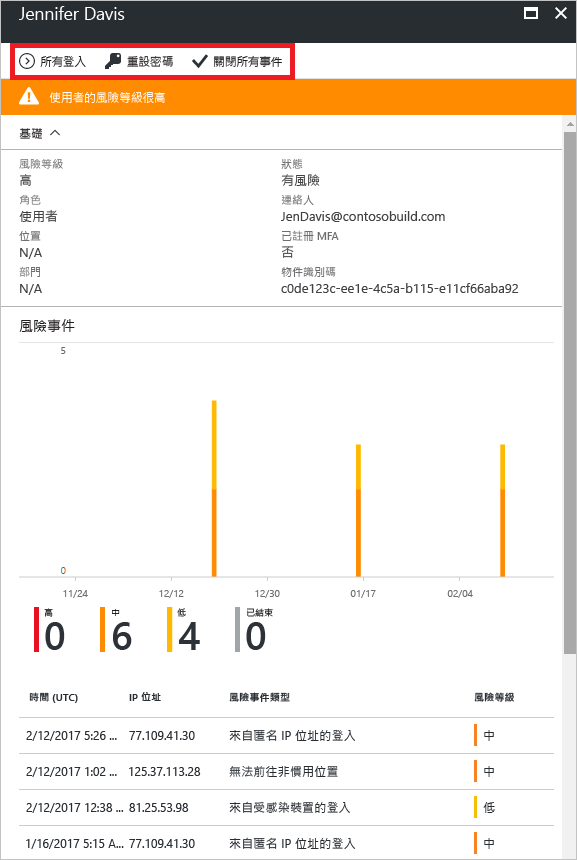

# Azure Active Directory 入口網站 (預覽版) 中有風險的安全性報告上的使用者

利用 Azure Active Directory [預覽](active-directory-preview-explainer.md)中的安全性報告，您可以深入了解環境中使用者帳戶被盜用的可能性。 

Azure Active Directory 會偵測使用者帳戶相關的可疑動作。 針對每個偵測到的動作，將會建立一筆稱為「風險事件」的記錄。 如需詳細資訊，請參閱 [Azure Active 風險事件](active-directory-identity-protection-risk-events.md)。 

偵測到的風險事件用來計算︰

- **有風險的登入** - 有風險的登入表示非使用者帳戶合法擁有者的某人嘗試登入。 如需詳細資訊，請參閱[有風險的登入](active-directory-identityprotection.md#risky-sign-ins)。 

- **標幟為有風險的使用者** - 有風險的使用者表示可能被盜用的使用者帳戶。 如需詳細資訊，請參閱[標幟為有風險的使用者](active-directory-identityprotection.md#users-flagged-for-risk)。  

在 Azure 入口網站中，您可以在 [Azure Active Directory] 刀鋒視窗的 [安全性] 區段中找到安全性報告。  

## Azure Active Directory 免費和基本版本

Azure Active Directory 免費和基本版本中有風險的報告上的使用者，會提供可能遭到盜用的使用者帳戶清單。 

選取使用者，即會開啟相關的使用者資料刀鋒視窗。
針對有風險的使用者，您可以檢閱使用者的登入記錄，如有必要，請重設密碼。

## Azure Active Directory Premium Edition

Azure Active Directory Premium Edition 中有風險的報告上的使用者可為您提供：

- 可能已遭盜用的[使用者帳戶清單](active-directory-identityprotection.md#users-flagged-for-risk) 

- 關於已偵測到之[風險事件類型](active-directory-identity-protection-risk-events.md)的彙總資訊

- 下載報告的選項

- 選擇設定[使用者風險補救原則](active-directory-identityprotection.md#user-risk-security-policy)  

當您選取使用者時，即會取得這位使用者的詳細報告檢視，讓您能夠：

- 開啟 [所有登入] 檢視

- 重設使用者的密碼

- 關閉所有事件

- 調查針對該使用者報告的風險事件。 

若要調查風險事件，請從清單中選取一項。  
這會開啟這個風險事件的 [詳細資料] 刀鋒視窗。 在 [詳細資料] 刀鋒視窗中，您可以選擇[手動關閉風險事件](active-directory-identityprotection.md#closing-risk-events-manually)或重新啟動已手動關閉的風險事件。 

## 後續步驟

- 如需 Azure Active Directory Identity Protection 的詳細資訊，請參閱 [Azure Active Directory Identity Protection](active-directory-identityprotection.md)。

