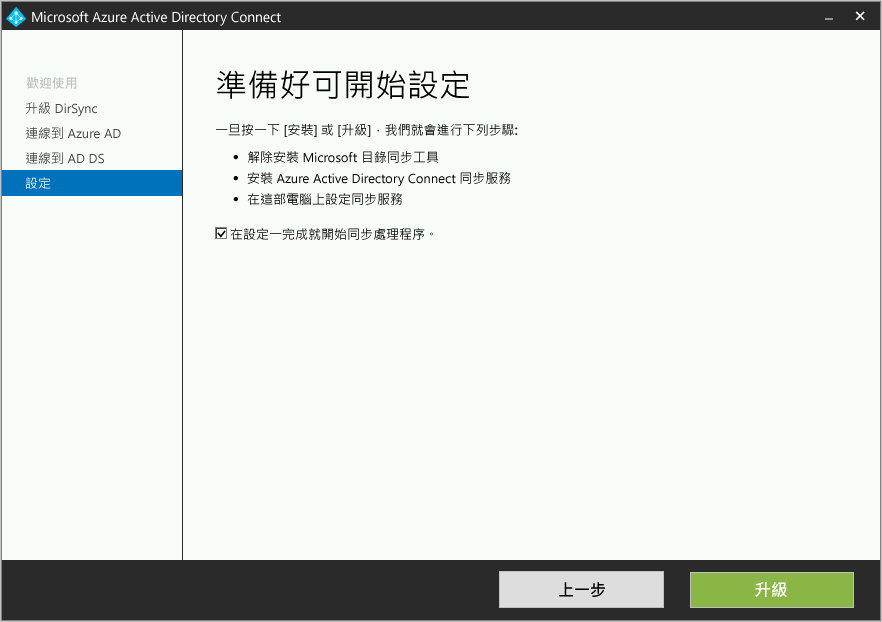

# Azure AD Connect︰從 DirSync 升級
Azure AD Connect 是 DirSync 的後續產品。 您會在本主題中了解可從 DirSync 升級的方式。 這些步驟不適用於從另一個版本的 Azure AD Connect 或從 Azure AD Sync 升級。

在開始安裝 Azure AD Connect 之前，請務必要[下載 Azure AD Connect](http://go.microsoft.com/fwlink/?LinkId=615771) 並完成 [Azure AD Connect：硬體和必要條件](active-directory-aadconnect-prerequisites.md)中的必要條件步驟。 特別是，您會想要閱讀下列各項，因為這些領域與 DirSync 有所不同︰

* 必要的 .Net 和 PowerShell 版本。 較新的版本必須位於與 DirSync 所需不同的伺服器上。
* Proxy 伺服器設定。 如果您使用 Proxy 伺服器連到網際網路，此設定必須在升級之前設定。 DirSync 一律使用為使用者設定的 Proxy 伺服器進行安裝，但 Azure AD Connect 使用電腦設定。
* 需要在 Proxy 伺服器中開啟的 URL。 基本的情況下，這些案例也支援這些 URL，需求都相同。 如果您想要使用 Azure AD Connect 隨附的任何新功能，必須開啟某些新的 URL。

> [!NOTE]
> 一旦您啟用新的 Azure AD Connect 伺服器開始將變更同步處理至 Azure AD，就不可再復原為使用 DirSync 或 Azure AD 同步。 不支援從 Azure AD Connect 降級至舊版用戶端，包括 DirSync 和 Azure AD 同步，因為可能會導致 Azure AD 中發生遺失資料等問題。

如果您不是要從 DirSync 升級，請參閱 [相關文件](#related-documentation) 中的其他案例。

## 從 DirSync 升級
根據您目前的 DirSync 部署，有不同的升級選項。 如果預期的升級時間少於&3; 小時，則建議您執行就地升級。 如果預期的升級時間超過&3; 小時，則建議您在另一部伺服器上進行平行部署。 如果您有超過 5 萬個物件，預估會花費超過 3 個小時來進行升級。

| 案例 |
| --- | --- |
| [就地升級](#in-place-upgrade) |
| [平行部署](#parallel-deployment) |

> [!NOTE]
> 當您規劃從 DirSync 升級至 Azure AD Connect 時，在升級之前請勿自行解除安裝 DirSync。 Azure AD Connect 會讀取和移轉來自 DirSync 的組態，並且在檢查伺服器之後解除安裝。

**就地升級**  
精靈會顯示完成升級的預期時間。 根據假設，估計需要 3 小時以完成具有 5 萬個物件 (使用者、連絡人和群組) 的資料庫升級。 如果您的資料庫中的物件數目少於 5 萬個，則 Azure AD Connect 建議就地升級。 如果您決定要繼續，在升級期間會自動套用目前的設定，您的伺服器會自動繼續執行作用中的同步處理。

如果您想要執行組態移轉及執行平行部署，則可以覆寫就地升級建議。 例如，您可能會利用這個機會來重新整理硬體和作業系統。 如需詳細資訊，請參閱[平行部署](#parallel-deployment)一節。

**平行部署**  
如果您有超過 5 萬個物件，則建議使用平行部署。 此部署可避免您的使用者經歷任何作業延遲。 Azure AD Connect 安裝會嘗試估計升級的停機；但是，如果您過去曾升級 DirSync，則您自己的經驗可能就是最佳指南。

### 要升級的支援 DirSync 組態
升級的 DirSync 支援下列組態變更：

* 網域和 OU 篩選
* 替代 ID (UPN)
* 密碼同步和 Exchange 混合式設定
* 您的樹系/網域與 Azure AD 設定
* 根據使用者屬性進行篩選

下列變更無法升級。 如果您具有此組態，升級會遭到封鎖：

* 不支援的 DirSync 變更，例如移除屬性和使用自訂延伸模組 DLL

在這些情況下，建議您在 [預備模式](active-directory-aadconnectsync-operations.md#staging-mode) 安裝新的 Azure AD Connect 伺服器，並確認舊的 DirSync 及新的 Azure AD Connect 設定。 使用自訂組態重新套用任何變更，如 [Azure AD Connect 同步處理自訂組態](active-directory-aadconnectsync-whatis.md)中所述。

DirSync 用於服務帳戶的密碼無法擷取且不會移轉。 這些密碼會在升級期間重設。

### 從 DirSync 升級至 Azure AD Connect 的高階步驟
1. 歡迎使用 Azure AD Connect
2. 目前 DirSync 組態的分析
3. 收集 Azure AD 全域管理員密碼
4. 收集企業系統管理員帳戶的認證 (僅在 Azure AD Connect 安裝期間使用)
5. Azure AD Connect 安裝
   * 解除安裝 DirSync (或暫時停用)
   * 安裝 Azure AD Connect。
   * 選擇性地開始同步處理

發生下列情況時，需要其他步驟：

* 您目前正在使用完整 SQL Server - 本機或遠端
* 您擁有超過 5 萬個物件的規模可進行同步處理

## 就地升級
1. 啟動 Azure AD Connect 安裝程式 (MSI)。
2. 檢閱並同意授權條款和隱私權注意事項。  
   
3. 按一下 [下一步] 以開始分析現有的 DirSync 安裝。  
   
4. 分析完成時，您會看到如何繼續的建議。  
   * 如果您使用 SQL Server Express 並且具有少於 5 萬個物件，則會顯示以下畫面：  
     
   * 如果您使用完整的 SQL Server for DirSync 功能，您會看到這個頁面：  
       
     系統會顯示有關 DirSync 所使用之現有 SQL Server 資料庫伺服器的資訊。 如果需要，請進行適當的調整。 按一下 [下一步]  繼續安裝。
   * 如果您有超過 5 萬個物件，您會看到這個畫面：  
       
     若要繼續進行就地升級，請按一下訊息旁的核取方塊：繼續在此電腦上升級 DirSync。
     若要改為執行[平行部署](#parallel-deployment)，請匯出 DirSync 組態設定並將組態移至新的伺服器。
5. 提供您目前用來連線到 Azure AD 之帳戶的密碼。 必須是 DirSync 目前使用的帳戶。  
     
   如果您收到錯誤訊息，而且有連線問題，請參閱 [針對連線問題進行疑難排解](active-directory-aadconnect-troubleshoot-connectivity.md)。
6. 提供 Active Directory 的企業系統管理員帳戶。  
   
7. 您現在已經可以進行設定。 當您按一下 [升級] 時，系統會解除安裝 DirSync，而 Azure AD Connect 會完成設定並開始同步處理。  
   
8. 安裝完成之後，請先登出 Windows 再重新登入，才能使用 Synchronization Service Manager、同步化規則編輯器，或嘗試任何其他組態變更。

## 平行部署
### 匯出 DirSync 組態
**平行部署超過 5 萬個物件**

如果您有超過 5 萬個物件，則 Azure AD Connect 安裝會建議進行平行部署。

將會顯示與下面類似的畫面：  

如果您想要繼續進行平行部署，則需要執行下列步驟：

* 按一下 [匯出設定]  按鈕。 在不同的伺服器上安裝 Azure AD Connect 時，這些設定會從目前的 DirSync 移轉到新的 Azure AD Connect 安裝。

順利匯出設定之後，即可結束 DirSync 伺服器上的 Azure AD Connect 精靈。 繼續進行下一個步驟 [在不同的伺服器上安裝 Azure AD Connect](#installation-of-azure-ad-connect-on-separate-server)

**平行部署少於 5 萬個物件**

如果您具有少於 5 萬個物件，但是仍然想要執行平行部署，則執行下列動作：

1. 執行 Azure AD Connect Installer (MSI)。
2. 當您看到 [歡迎使用 Azure AD Connect]  畫面時，請按一下視窗右上角的 "X" 結束安裝精靈。
3. 開啟命令提示字元。
4. 從 Azure AD Connect 的安裝位置 (預設值：C:\Program Files\Microsoft Azure Active Directory Connect)，執行下列命令： `AzureADConnect.exe /ForceExport`。
5. 按一下 [匯出設定]  按鈕。 在不同的伺服器上安裝 Azure AD Connect 時，這些設定會從目前的 DirSync 移轉到新的 Azure AD Connect 安裝。

順利匯出設定之後，即可結束 DirSync 伺服器上的 Azure AD Connect 精靈。 繼續進行下一個步驟以[在不同的伺服器上安裝 Azure AD Connect](#installation-of-azure-ad-connect-on-separate-server)。

### 在不同的伺服器上安裝 Azure AD Connect
在新的伺服器上安裝 Azure AD Connect 時，假設您想要執行 Azure AD Connect 的全新安裝。 因為您想要使用 DirSync 組態，所以有一些額外步驟：

1. 執行 Azure AD Connect Installer (MSI)。
2. 當您看到 [歡迎使用 Azure AD Connect]  畫面時，請按一下視窗右上角的 "X" 結束安裝精靈。
3. 開啟命令提示字元。
4. 從 Azure AD Connect 的安裝位置 (預設值：C:\Program Files\Microsoft Azure Active Directory Connect)，執行下列命令： `AzureADConnect.exe /migrate`。
   Azure AD Connect 安裝精靈會啟動，您會看到下列畫面：  
   
5. 選取從 DirSync 安裝所匯出的設定檔案。
6. 設定任何進階選項，包括：
   * Azure AD Connect 的自訂安裝位置。
   * 現有 SQL Server 執行個體 (預設值：Azure AD Connect 會安裝 SQL Server 2012 Express)。 請勿使用相同的資料庫執行個體做為您的 DirSync 伺服器。
   * 用來連接到 SQL Server 的服務帳戶 (如果您的 SQL Server 資料庫位於遠端，則這個帳戶必須是網域服務帳戶)。
     您可以在這個畫面上看到下列選項：  
     
7. 按 [下一步] 。
8. 在 [準備好設定] 頁面上，保持核取 [設定一完成，即開始同步處理程序]。 伺服器現在處於[預備模式](active-directory-aadconnectsync-operations.md#staging-mode)，讓變更不會匯出至 Azure AD。
9. 按一下 [Install] 。
10. 安裝完成之後，請先登出 Windows 再重新登入，才能使用 Synchronization Service Manager、同步化規則編輯器，或嘗試任何其他組態變更。

> [!NOTE]
> Windows Server Active Directory 和 Azure Active Directory 之間的同步處理作業會開始，但沒有變更會匯出到 Azure AD。 一次只能有一個作用中的同步處理工具匯出變更。 此狀態稱為[預備模式](active-directory-aadconnectsync-operations.md#staging-mode)。

### 確認 Azure AD Connect 已準備好開始同步處理
若要確認 Azure AD Connect 是否已準備好接收 DirSync，您必須從 [開始] 功能表的 [Azure AD Connect] 群組中開啟 [同步處理服務管理器]。

在應用程式中，移至 [作業]  索引標籤。 在此索引標籤上，確認已完成下列作業：

* 在 AD 連接器上匯入
* 在 Azure AD 連接器上匯入
* AD 連接器上的完整同步處理
* Azure AD 連接器上的完整同步處理

檢閱這些作業的結果，並確定沒有任何錯誤。

如果您想要查看並檢查即將匯出到 Azure AD 的變更，請閱讀如何在[預備模式](active-directory-aadconnectsync-operations.md#staging-mode)下驗證組態。 進行必要的組態變更，直到看不到非預期的任何項目。

當您完成這些步驟並對結果感到滿意時，您便已準備好從 DirSync 切換至 Azure AD。

### 解除安裝 DirSync (舊伺服器)
* 在 [程式和功能] 中，尋找 [Windows Azure Active Directory 同步作業工具]
* 解除安裝 [Windows Azure Active Directory 同步作業工具] 
* 解除安裝可能需要 15 分鐘的時間才能完成。

如果您想要稍後解除安裝 DirSync，您也可以暫時關閉伺服器或停用服務。 如果發生錯誤，此方法可讓您重新啟用它。 不過，下一個步驟應該不會失敗，所以不需要這麼做。

解除安裝或停用 DirSync 之後，沒有任何作用中的伺服器會匯出至 Azure AD。 在內部部署 Active Directory 中的任何變更繼續同步至 Azure AD 之前，您必須完成啟用 Azure AD Connect 的下一個步驟。

### 啟用 Azure AD Connect (新伺服器)
安裝之後，重新開啟 Azure AD Connect 時，您可以進行其他設定變更。 從 [開始] 功能表或桌面上的捷徑啟動 **Azure AD Connect** 。 請確定您未嘗試重新執行安裝 MSI。

您應該會看見下列內容：  

* 選取 [設定預備模式] 。
* 取消核取 [啟用預備模式]  核取方塊，即會關閉預備。

* 按一下 [下一步]  按鈕
* 在 [確認] 頁面上按一下 [安裝]  按鈕。

Azure AD Connect 現在是作用中的伺服器，您不可切換回使用現有的 DirSync 伺服器。

## 後續步驟
安裝了 Azure AD Connect 之後，您可以 [驗證安裝和指派授權](active-directory-aadconnect-whats-next.md)。

深入了解這些在安裝時啟用的新功能︰[自動升級](active-directory-aadconnect-feature-automatic-upgrade.md)、[防止意外刪除](active-directory-aadconnectsync-feature-prevent-accidental-deletes.md)和 [Azure AD Connect Health](../connect-health/active-directory-aadconnect-health-sync.md)。

深入了解這些常見主題︰[排程器和如何觸發同步處理](active-directory-aadconnectsync-feature-scheduler.md)。

深入了解 [整合內部部署身分識別與 Azure Active Directory](active-directory-aadconnect.md)。

