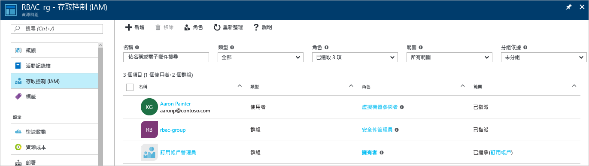
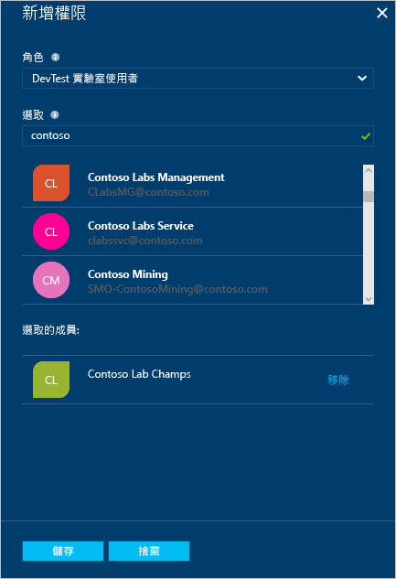

# 使用角色指派來管理 Azure 訂用帳戶資源的存取權
> [!div class="op_single_selector"]
> * [使用者或群組管理存取](role-based-access-control-manage-assignments.md)
> * [資源管理存取](role-based-access-control-configure.md)

Azure 角色型存取控制 (RBAC) 可以對 Azure 進行更細緻的存取權管理。 使用 RBAC，您可以僅授與使用者執行其作業所需的存取權。 本文將協助您在 Azure 入口網站中啟動並執行 RBAC。 如果您需要有關 RBAC 如何協助您管理存取權的詳細資訊，請參閱 [什麼是角色型存取控制](role-based-access-control-what-is.md)。

在每個訂用帳戶內，您可以授與最多 2000 個角色指派。 

## 檢視存取權
您可以從 [Azure 入口網站](https://portal.azure.com)的主要刀鋒視窗中查看有誰可以存取資源、資源群組或訂用帳戶。 例如，我們要查看有誰可以存取我們的其中一個資源群組︰

1. 選取左側導覽列中的 [資源群組]  圖示。  
    
2. 從 [資源群組]  刀鋒視窗選取資源群組的名稱。
3. 從左側功能表中選取 [存取控制 (IAM)]。  
4. [存取控制] 刀鋒視窗會列出已獲得資源群組存取權的所有使用者、群組和應用程式。  
   
    

請注意，[已指派] 存取權給有些使用者，而其他使用者則 [已繼承] 它。 存取權不是特別指派給資源群組，就是繼承自父訂用帳戶的指派。

> [!NOTE]
> 傳統訂用帳戶管理員和共同管理員可被視為新 RBAC 模型中訂用帳戶的擁有者。

## 新增存取權
您可從角色指派範圍內的資源、資源群組或訂用帳戶授與存取權。

1. 在 [存取控制] 刀鋒視窗上選取 [新增]。  
2. 從 [選取角色]  刀鋒視窗選取您要指派的角色。
3. 選取目錄中您要授與存取權的使用者、群組或應用程式。 您可以使用顯示名稱、電子郵件地址和物件識別碼來搜尋目錄。  
   
    
4. 選取 [確定]  以建立指派。 [新增使用者]  快顯視窗會追蹤進度。  
    

成功新增角色指派之後，該指派會出現在 [使用者]  刀鋒視窗上。

## 移除存取權
1. 使用 [存取控制] 刀鋒視窗上的核取方塊來選取一或多個角色指派。
2. 選取 [移除]。  
3. 將會顯示一個要求您確認動作的方塊。 選取 [是]  即可移除角色指派。

無法移除已繼承的指派。 如果您需要移除繼承的指派，將需要在建立角色指派的範圍進行移除。 在 [範圍] 資料行中 [繼承] 的旁邊有一個連結，會將您帶往已指派該角色的資源。 移至該處所列的資源來移除角色指派。

![使用者刀鋒視窗 - 繼承的存取存停用 [移除] 按鈕螢幕擷取畫面](./media/role-based-access-control-configure/remove-access2.png)

## 其他用來管理存取權的工具
除了 Azure 入口網站以外，您可以使用工具中的 Azure RBAC 命令來指派角色及管理存取權。  遵循下列連結，以深入了解 Azure RBAC 命令的先決條件並開始使用。

* [Azure PowerShell](role-based-access-control-manage-access-powershell.md)
* [Azure 命令列介面](role-based-access-control-manage-access-azure-cli.md)
* [REST API](role-based-access-control-manage-access-rest.md)

## 後續步驟
* [建立存取權變更歷程記錄報告](role-based-access-control-access-change-history-report.md)
* 請參閱 [RBAC 內建角色](role-based-access-built-in-roles.md)
* 定義您自己的 [Azure RBAC 中的自訂角色](role-based-access-control-custom-roles.md)

