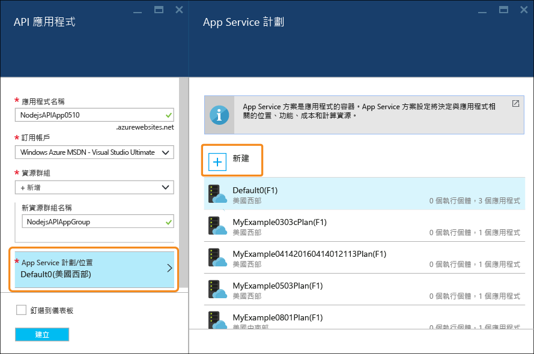
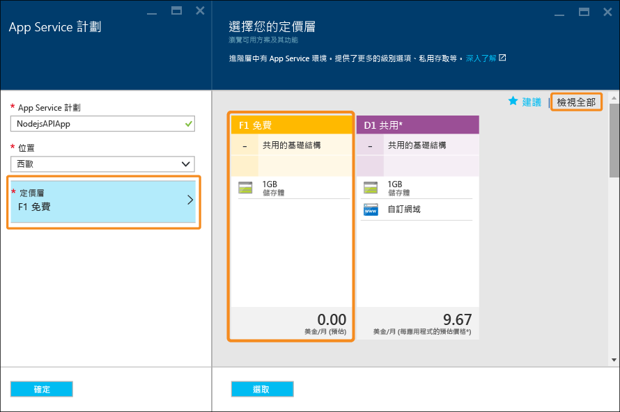

# 建置 Node.js RESTful API 並將它部署至 Azure 中的 API 應用程式
[!INCLUDE [app-service-api-get-started-selector](../../includes/app-service-api-get-started-selector.md)]

本教學課程示範如何建立簡易的 [Node.js](http://nodejs.org) API，並使用 [Git](http://git-scm.com) 將其部署至 [Azure App Service](../app-service/app-service-value-prop-what-is.md) 中的 [API 應用程式](app-service-api-apps-why-best-platform.md)。 您可以使用任何能夠執行 Node.js 的作業系統，而且您將會使用 cmd.exe 或 bash 之類的命令列工具來執行所有工作。

## 必要條件
1. Microsoft Azure 帳戶 ([在此申請免費帳戶](https://azure.microsoft.com/pricing/free-trial/))
2. [Node.js](http://nodejs.org) (此範例假設您有 Node.js 4.2.2 版)
3. [API 應用程式](https://git-scm.com/) 
4. [GitHub](https://github.com/) 帳戶

App Service 支援多種將程式碼部署至 API 應用程式的方式，而本教學課程會示範 Git 方法，並假設您已具備如何使用 Git 的基本知識。 如需其他部署方法的相關資訊，請參閱 [將應用程式部署至 Azure App Service](../app-service-web/web-sites-deploy.md)。

## 取得範例程式碼
1. 開啟可以執行 Node.js 和 Git 命令的命令列介面。
2. 瀏覽至可供本機 Git 儲存機制使用的資料夾，然後複製 [包含範例程式碼的 GitHub 儲存機制](https://github.com/Azure-Samples/app-service-api-node-contact-list)。
   
        git clone https://github.com/Azure-Samples/app-service-api-node-contact-list.git
   
    範例 API 提供兩個端點︰針對 `/contacts` 的 Get 要求會傳回內有名稱和電子郵件地址的 JSON 格式清單，而 `/contacts/{id}` 只會傳回選取的連絡人。

## 根據 Swagger 中繼資料建立 (自動產生) Node.js 程式碼的結構
[Swagger](http://swagger.io/) 是描述 RESTful API 之中繼資料的檔案格式。 Azure App Service 已 [內建支援 Swagger 中繼資料](app-service-api-metadata.md)。 在教學課程的這一節當中，會建立 API 開發工作流程的模型，以供您在其中先建立 Swagger 中繼資料，再以此建立 (自動產生) API 伺服器程式碼的結構。 

> [!NOTE]
> 如果您不想要了解如何從 Swagger 中繼資料檔案建立 Node.js 程式碼的結構，則可以略過本節。 如果您想要直接將範例程式碼部署到新的 API 應用程式，請直接前往 [在 Azure 中建立 API 應用程式](#createapiapp) 一節。
> 
> 

### 安裝和執行 Swaggerize
1. 執行下列命令，全域安裝 **yo** 和 **generator-swaggerize** NPM 模組。
   
        npm install -g yo
        npm install -g generator-swaggerize
   
    Swaggerize 這項工具可產生 Swagger 中繼資料檔案所描述的 API 伺服器程式碼。 您將使用的 Swagger 檔案的名稱為 api.json，其位於您所複製的儲存機制的 start 資料夾內。
2. 瀏覽至 start 資料夾，然後執行 `yo swaggerize` 命令。 Swaggerize 會詢問一系列的問題。  請在 **what to call this project** 中輸入 "ContactList"、在 **path to swagger document** 中輸入 "api.json"，並在 **Express, Hapi, or Restify** 中輸入 "express"。
   
        yo swaggerize
   
    
   
    **注意**︰如果您在此步驟中遇到錯誤，下一個步驟會說明如何加以修正。
   
    Swaggerize 會建立應用程式資料夾、建立處理常式和組態檔的結構，並產生 **package.json** 檔案。 Swagger 說明頁面則是使用快速檢視引擎來產生。  
3. 如果 `swaggerize` 命令失敗，並顯示 [非預期的權杖] 或 [無效的逸出序列] 錯誤，請藉由編輯所產生的 package.json 檔案來修正錯誤原因。 在 `scripts` 下的 `regenerate` 行，將 api.json 前面的反斜線變更為正斜線，使該行看起來像下列範例︰
   
         "regenerate": "yo swaggerize --only=handlers,models,tests --framework express --apiPath config/api.json"
4. 瀏覽至包含所建構程式碼的資料夾 (在此例中為 */start/ContactList* 子資料夾)。
5. 執行 `npm install`。
   
        npm install
6. 安裝 **jsonpath** NPM 模組。 
   
        npm install --save jsonpath
   
    
7. 安裝 **swaggerize-ui** NPM 模組。 
   
        npm install --save swaggerize-ui
   
    

### 自訂所建構的程式碼
1. 從 **start** 資料夾將 **lib** 資料夾複製到建構者所建立的 **ContactList** 資料夾。 
2. 以下列程式碼取代 **handlers/contacts.js** 檔案中的程式碼。 
   
    此程式碼會使用 **lib/contactRepository.js** 所提供的 **lib/contacts.json** 檔案中儲存的 JSON 資料。 新的 contacts.js 程式碼會回應 HTTP 要求，以取得所有連絡人，並將它們以 JSON 承載的形式傳回。 
   
        'use strict';
   
        var repository = require('../lib/contactRepository');
   
        module.exports = {
            get: function contacts_get(req, res) {
                res.json(repository.all())
            }
        };
3. 以下列程式碼取代 **handlers/contacts/{id}.js** 檔案中的程式碼。 
   
        'use strict';
   
        var repository = require('../../lib/contactRepository');
   
        module.exports = {
            get: function contacts_get(req, res) {
                res.json(repository.get(req.params['id']));
            }    
        };
4. 以下列程式碼取代 **server.js** 中的程式碼。 
   
    對 server.js 檔案所做的變更會使用註解來標示，以便您可以看到所做的變更。 
   
        'use strict';
   
        var port = process.env.PORT || 8000; // first change
   
        var http = require('http');
        var express = require('express');
        var bodyParser = require('body-parser');
        var swaggerize = require('swaggerize-express');
        var swaggerUi = require('swaggerize-ui'); // second change
        var path = require('path');
   
        var app = express();
   
        var server = http.createServer(app);
   
        app.use(bodyParser.json());
   
        app.use(swaggerize({
            api: path.resolve('./config/swagger.json'), // third change
            handlers: path.resolve('./handlers'),
            docspath: '/swagger' // fourth change
        }));
   
        // change four
        app.use('/docs', swaggerUi({
          docs: '/swagger'  
        }));
   
        server.listen(port, function () { // fifth and final change
        });

### 測試於本機中執行的 API
1. 使用 Node.js 命令列可執行檔來啟動伺服器。 
   
        node server.js
2. 當您瀏覽至 **http://localhost:8000/contacts** 時，您會看見連絡人清單的 JSON 輸出 (或者系統會提示您下載它，視您的瀏覽器而定)。 
   
    
3. 當您瀏覽至 **http://localhost:8000/contacts/2** 時，您會看見該識別碼值所表示的連絡人。
   
    
4. Swagger JSON 資料是透過 **/swagger** 端點提供：
   
    
5. Swagger UI 是透過 **/docs** 端點。 在 Swagger UI 中，您可以使用豐富的 HTML 用戶端功能來測試您的 API。
   
    

##  建立新的 API 應用程式
在本節中，您會使用 Azure 入口網站在 Azure 中建立新的 API 應用程式。 此 API 應用程式代表 Azure 所提供來執行程式碼的計算資源。 在後續幾節中，您會將程式碼部署到新的 API 應用程式。

1. 瀏覽至 [Azure 入口網站](https://portal.azure.com/)。 
2. 按一下 [新增] > [Web + 行動] > [API 應用程式]。 
   
    
3. 輸入 *azurewebsites.net* 網域中唯一的 [應用程式名稱]，例如 NodejsAPIApp 加上數字，讓它變成唯一名稱。 
   
    例如，若名稱為 `NodejsAPIApp`，URL 會是 `nodejsapiapp.azurewebsites.net`。
   
    如果您輸入的名稱已有他人使用，您會在右邊看到紅色驚嘆號。
4. 在 [資源群組] 下拉式清單中，按一下 [新增]，然後在 [新增資源群組名稱] 中輸入 "NodejsAPIAppGroup" 或其他您偏好使用的名稱。 
   
    [資源群組](../azure-resource-manager/resource-group-overview.md)是 Azure 資源的集合，例如 API 應用程式、資料庫和 VM。 在本教學課程中，最好建立新的資源群組，因為這麼做即可在一個步驟中輕鬆刪除您為本教學課程建立的所有 Azure 資源。
5. 按一下 [App Service 方案/位置]，然後按一下 [新建]。
   
    
   
    在下列步驟中，您會為新的資源群組建立 App Service 方案。 App Service 方案會指定 API 應用程式執行所在的計算資源。 例如，如果您選擇免費層，則 API 應用程式會在共用 VM 上執行，若為某些付費層，它則會在專用 VM 上執行。 如需 App Service 方案的詳細資訊，請參閱 [App Service 方案概觀](../app-service/azure-web-sites-web-hosting-plans-in-depth-overview.md)。
6. 在 [App Service 方案]  刀鋒視窗中，輸入 "NodejsAPIAppPlan" 或您偏好的其他名稱。
7. 在 [位置]  下拉式清單中，選擇最接近您的位置。
   
    這個設定會指定應用程式將執行所在的 Azure 資料中心。 您可以在本教學課程中選取任何區域，這不會造成顯著的差異。 但是對於生產用的應用程式，您的伺服器應盡可能靠近存取該應用程式的用戶端，以將 [延遲](http://www.bing.com/search?q=web%20latency%20introduction&qs=n&form=QBRE&pq=web%20latency%20introduction&sc=1-24&sp=-1&sk=&cvid=eefff99dfc864d25a75a83740f1e0090)降到最低。
8. 按一下 [定價層] > [檢視全部] > [F1 免費]。
   
    在本教學課程中，免費定價層會提供足夠的效能。
   
    
9. 在 [App Service 方案] 刀鋒視窗中，按一下 [確定]。
10. 在 [API 應用程式] 刀鋒視窗中，按一下 [建立]。

## 為 Git 部署設定新的 API 應用程式
您會將認可推送至 Azure App Service 中的 Git 儲存機制，以將您的程式碼部署到 API 應用程式。 在教學課程的這一節當中，您將會在 Azure 中建立要用於部署的認證與 Git 儲存機制。  

1. 在建立好 API 應用程式之後，從入口網站首頁按一下 [應用程式服務] > [{您的 API 應用程式}]。 
   
    入口網站會顯示 [API 應用程式] 和 [設定] 刀鋒視窗。
   
    
2. 在 [設定]** 刀鋒視窗中，向下捲動至 [發佈]**** 區段，然後按一下 [部署認證]**。
3. 在 [設定部署認證] 刀鋒視窗中輸入使用者名稱和密碼，然後按一下 [儲存]。
   
    您將使用這些認證將 Node.js 程式碼發佈至 API 應用程式。 
   
    
4. 在 [設定] 刀鋒視窗中，按一下 [部署來源] > [選擇來源] > [本機 Git 儲存機制]，然後按一下 [確定]。
   
    
5. 一旦建立 Git 儲存機制，此刀鋒視窗便會變更為顯示作用中的部署。 由於這是新的儲存機制，所以清單中沒有作用中的部署。 
   
    
6. 複製 Git 儲存機制 URL。 若要這麼做，請瀏覽至新 API 應用程式的刀鋒視窗並查看刀鋒視窗的 [基本功能]  區段。 請注意 [基本功能] 區段中的 [Git 複製 URL]。 當您將滑鼠指標暫留在此 URL 上時，會在右側看到可將此 URL 複製到剪貼簿的圖示。 按一下此圖示以複製此 URL。
   
    
   
    **注意**：您在下一節中需要使用 [Git 複製 URL]，才能確保暫時將它儲存在某個地方。

現在您已擁有 API 應用程式且已使用 Git 儲存機制加以備份，接下來您可以將程式碼推送至儲存機制，以將程式碼部署至 API 應用程式。 

## 將 API 程式碼部署至 Azure
在本節中，您將會建立包含 API 伺服器程式碼的本機 Git 儲存機制，然後從該儲存機制將程式碼推送至您稍早在 Azure 中建立的儲存機制。

1. 將 `ContactList` 資料夾複製到新的本機 Git 儲存機制可使用的位置。 如果您有進行本教學課程的第一個部分，請從 `start` 資料夾複製 `ContactList`；否則請從 `end` 資料夾複製 `ContactList`。
2. 在命令列工具中瀏覽至新的資料夾，然後執行下列命令來建立新的本機 Git 儲存機制。 
   
        git init
   
     
3. 執行下列命令來新增 API 應用程式儲存機制的 Git 遠端。 
   
        git remote add azure YOUR_GIT_CLONE_URL_HERE
   
    **注意**：請以稍早複製的 Git 複製 URL 取代 "YOUR_GIT_CLONE_URL_HERE" 字串。 
4. 執行下列命令來建立包含您所有程式碼的認可。 
   
        git add .
        git commit -m "initial revision"
   
    
5. 執行命令以將您的程式碼推送至 Azure。 當系統提示您輸入密碼時，請輸入先前在 Azure 入口網站中建立的密碼。
   
        git push azure master
   
    這會觸發您 API 應用程式的部署。  
6. 在瀏覽器中，瀏覽回到 API 應用程式的 [部署]  刀鋒視窗，然後您就會看到部署正在進行。 
   
    
   
    同時，命令列介面將會反映您目前的部署狀態。 
   
    
   
    一旦部署完成，[部署]  刀鋒視窗會將部署成功的程式碼變更反映至您的 API 應用程式。 

## 測試於 Azure 中執行的 API
1. 複製 [API 應用程式] 刀鋒視窗的 [基本功能] 區段中的 [URL]。 
   
    
2. 使用 Postman 或 Fiddler 等 REST API 用戶端 (或您的 Web 瀏覽器)，提供您的連絡人API 呼叫的 URL，這是 API 應用程式的 `/contacts` 端點。 URL 會是 `https://{your API app name}.azurewebsites.net/contacts`
   
    當您對此端點發出 GET 要求時，會獲得 API 應用程式的 JSON 輸出。
   
    
3. 在瀏覽器中移至 `/docs` 端點，試試 Swagger UI 在 Azure 中的執行情況。

現在您已建構好連續傳遞，接下來可以進行程式碼變更，並簡單地透過將認可推送至 Azure Git 儲存機制來部署變更。

## 後續步驟
至此，您已成功建立 API 應用程式並在其中部署 Node.js API 程式碼。 下一個教學課程會示範如何 [使用 CORS 從 JavaScript 用戶端取用 API 應用程式](app-service-api-cors-consume-javascript.md)。

<!--HONumber=Jan17_HO2-->

