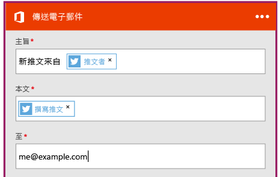

# 建立連接 SaaS 服務的新邏輯應用程式
本主題只花幾分鐘就能示範如何開始使用 [Azure Logic Apps](app-service-logic-what-are-logic-apps.md)。我們將逐步說明可讓您將有趣的推文傳送至您的電子郵件的簡單工作流程。

若要使用此案例，您需要：

* Azure 訂用帳戶
* Twitter 帳戶
* Outlook.com 或裝載的 Office 365 信箱

## 建立新的邏輯應用程式，以電子郵件傳送您的推文
1. 在 [Azure 入口網站儀表板](https://portal.azure.com)上選取 [新增]。
2. 在搜尋列中搜尋「邏輯應用程式」，然後選取 [邏輯應用程式]。您也可以選取 [新增]、[Web + 行動]，然後選取 [邏輯應用程式]。
3. 輸入邏輯應用程式的名稱，選取位置、資源群組，然後選取 [建立]。如果您選取 [釘選到儀表板]，邏輯應用程式將會在部署後自動開啟。
4. 第一次開啟邏輯應用程式之後，您可以從要啟動的範本進行選取。現在按一下 [空白邏輯應用程式]，從頭開始建置。
5. 您所需建立的第一個項目是觸發程序。這是將啟動邏輯應用程式的事件。在觸發搜尋方塊中搜尋 **twitter** 並加以選取。
6. 您現在會輸入據以觸發的搜尋詞彙。[頻率] 和 [間隔] 會決定邏輯應用程式檢查新推文 (以及傳回該時間範圍內的所有推文) 的頻率。
7. 選取 [新步驟] 按鈕，然後選擇 [新增動作] 或 [新增條件]
8. 當您選取 [新增動作] 時，您可以從[可用的連接器](../connectors/apis-list.md)搜尋以選擇動作。例如，您可以選取 [Outlook.com - 傳送電子郵件]，以從 outlook.com 位址傳送郵件︰
9. 您現在必須針對您要的電子郵件填寫參數：
10. 最後，您可以選取 [儲存]，以存留您的邏輯應用程式。

## 在建立後管理邏輯應用程式
現在，您的邏輯應用程式已啟動並執行。它會以輸入的搜尋詞彙定期檢查推文。當它找到符合的推文時，就會傳送郵件給您。最後，您將看到如何停用應用程式，或看到它的執行狀況。

1. 移至 [Azure 入口網站](https://portal.azure.com)。
2. 在螢幕左邊按一下 [瀏覽]，然後選取 [Logic Apps]。
3. 按一下您剛剛建立的新邏輯應用程式，以查看目前狀態和一般資訊。
4. 若要編輯新的邏輯應用程式，請按一下 [編輯]。
5. 若要關閉應用程式，請按一下命令列中的 [停用]。
6. 檢視當邏輯應用程式正在執行時所要監視的執行和觸發歷程記錄。您可以按一下 [重新整理] 來查看最新資料。

不到 5 分鐘的時間，您便能夠設定在雲端中執行的簡單邏輯應用程式。若要深入了解如何使用邏輯應用程式功能，請參閱[使用邏輯應用程式功能]。若要深入了解邏輯應用程式定義本身，請參閱[撰寫邏輯應用程式定義](app-service-logic-author-definitions.md)。

<!-- Shared links -->
[Azure portal]: https://portal.azure.com
[使用邏輯應用程式功能]: app-service-logic-create-a-logic-app.md

<!---HONumber=AcomDC_0803_2016-->