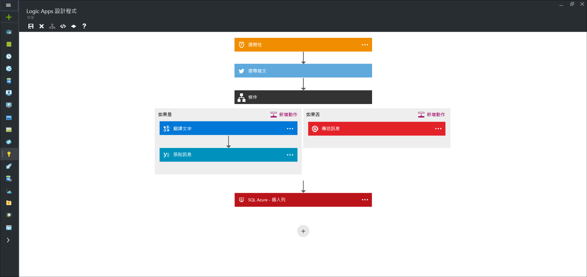

<properties 
	pageTitle="什麼是 Logic Apps？" 
	description="深入了解應用程式服務 Logic Apps" 
	authors="kevinlam1" 
	manager="dwrede" 
	editor="" 
	services="logic-apps" 
	documentationCenter=""/>

<tags
	ms.service="logic-apps"
	ms.workload="na"
	ms.tgt_pltfrm="na"
	ms.devlang="na"
	ms.topic="hero-article" 
	ms.date="07/12/2016"
	ms.author="klam"/>

#什麼是 Logic Apps？

Logic Apps 提供簡化和實作雲端中可擴充整合和工作流程的途徑。它提供視覺化設計工具，以一系列的步驟 (也稱為工作流程) 為您的程序建立模型並加以自動化。雲端和內部部署中有[許多連接器](../connectors/apis-list.md)可快速整合各項服務和通訊協定。邏輯應用程式是以觸發程序為開端 (如「當帳戶加入至 Dynamics CRM 時」)，而在觸發後可以開始處理各種組合的動作、轉換和條件邏輯。

使用 Logic Apps 的優點包括︰

- 使用易於了解的設計工具來設計複雜程序以節省時間
- 順暢地實作難以在程式碼中實作的模式和工作流程。
- 從範本快速開始使用
- 使用自己的自訂 API、程式碼和動作來自訂邏輯應用程式
- 連接並同步處理跨內部部署與雲端的不同系統
- 利用頂級整合支援打造 BizTalk Server、API 管理、Azure Functions 和 Azure 服務匯流排

Logic Apps 是完全受管理的 iPaaS (整合平台即服務)，可讓開發人員不必擔心建置裝載、延展性、可用性和管理。邏輯應用程式會自動相應增加以滿足需求。

如先前所述，您可以使用 Logic Apps 將商務程序自動化。以下是一些範例︰
 
* 將上傳至 FTP 伺服器的檔案移到 Azure 儲存體
* 處理並路由傳送跨內部部署與雲端系統的訂單
* 監視有關特定主題的所有推文、分析情感，以及針對需要後續追蹤的項目建立警示和工作。

這些案例都能從視覺化設計工具加以設定，無需撰寫程式碼。立即開始[建置邏輯應用程式][create]。撰寫後 - 邏輯應用程式可能會[快速部署並重新設定](app-service-logic-create-deploy-template.md)於多個環境和區域。

## 為什麼要使用 Logic Apps？

Logic Apps 可提高企業整合的速度和延展性。容易使用的設計工具、各種可用的觸發程序和動作以及強大的管理工具，均讓您的 API 集中管理比以往更簡單。隨著企業邁向數位化，Logic Apps 可讓您將舊版和最先進的系統連接在一起。

此外，透過我們的[企業整合帳戶][biztalk]，您可以利用 [XML 訊息][xml]、[交易夥伴管理][tpm]等的功能，擴展至成熟的整合案例。

- **容易使用的設計工具** - Logic Apps 可在瀏覽器中或使用 Visual Studio 工具端對端地設計。從觸發程序著手 - 從簡單的排程，以至建立 GitHub 問題時。然後，使用豐富的連接器資源庫協調任何數量的動作。

- **輕鬆連接 API** - 即使可輕鬆說明的撰寫工作，也很難在程式碼中實作。Logic Apps 可讓您輕鬆連接不同的系統。想要將您的雲端行銷解決方案連接到內部部署計費系統嗎？ 想要利用企業服務匯流排集中處理跨 API 與系統的訊息嗎？ 邏輯應用程式可用最快、最可靠方式，提供這些問題的解決方案。

- **從範本快速開始使用** - 為了方便您著手使用，我們提供[範本庫][templates]，讓您可快速建立一些常見的解決方案。從進階 B2B 解決方案到簡單的 SaaS 連線 (甚至只為了「好玩」) - 資源庫是開始使用Logic Apps 強大功能的最快方式。

- **現成可用的擴充性** - 找不到您所需要的連接器嗎？ Logic Apps 主要是用來處理您自己的 API 和程式碼。您可以輕鬆地建立自己的 API 應用程式以做為自訂連接器，或呼叫 [Azure 函式](https://functions.azure.com)以執行隨選程式碼片段。

- **真正的整合能力** - 入門容易，並且可依需求擴充。Logic Apps 可輕易地讓 Microsoft 領先業界的整合解決方案 BizTalk 發揮效益，使整合專業人員得以建置其所需的解決方案。深入了解[企業整合套件](./app-service-logic-enterprise-integration-overview.md)。

## 邏輯應用程式概念

以下是構成 Logic Apps 使用性的一些重要元素。

- **工作流程** - Logic Apps 提供圖形化的方式，以一系列的步驟或工作流程的形式為您的商務程序建立模型。
- **受管理連接器** - 邏輯應用程式需要存取資料和服務。受管理連接器是為了讓協助您連接及使用資料而特別設計的。請參閱[受管理連接器][managedapis]中目前提供的連接器清單。
- **觸發程序** - 某些受管理連接器也可以做為觸發程序。觸發程序會根據特定的事件建立新的工作流程執行個體，例如在電子郵件送達或您的 Azure 儲存體帳戶有所變更時。
-  **動作** - 工作流程中觸發程序後的每個步驟登稱為動作。每個動作通常會對應至受管理連接器或自訂 API 應用程式上的作業。
- **企業整合套件** - 在更進階的整合案例中，Logic Apps 會包含來自 BizTalk 的功能。BizTalk 是 Microsoft 領先業界的整合平台。「企業整合套件」連接器可讓您輕鬆地將驗證、轉換等項目納入邏輯應用程式工作流程中。

## 開始使用  

- 若要開始使用 Logic Apps，請遵循[建立 Logic Apps ][create]教學課程。
- [檢視常見的範例和案例](app-service-logic-examples-and-scenarios.md)
- [您可以使用 Logic Apps 自動化商務程序](http://channel9.msdn.com/Events/Build/2016/T694)
- [了解如何整合您的系統與 Logic Apps](http://channel9.msdn.com/Events/Build/2016/P462)

[biztalk]: app-service-logic-enterprise-integration-accounts.md
[appservice]: ../app-service/app-service-value-prop-what-is.md
[create]: app-service-logic-create-a-logic-app.md
[managedapis]: ../connectors/apis-list.md
[tpm]: app-service-logic-enterprise-integration-accounts.md
[xml]: app-service-logic-enterprise-integration-b2b.md
[templates]: app-service-logic-use-logic-app-templates.md

<!---HONumber=AcomDC_0803_2016-->