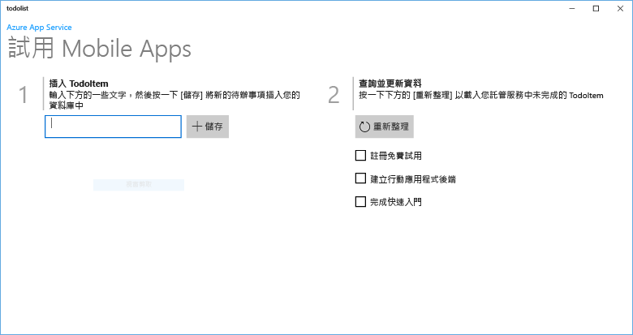
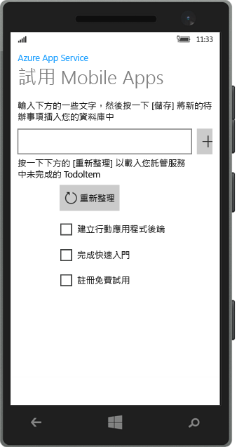

# 建立 Windows 應用程式
[!INCLUDE [app-service-mobile-selector-get-started](../../includes/app-service-mobile-selector-get-started.md)]

## 概觀
本教學課程顯示如何將雲端型後端服務新增到通用 Windows 平台 (UWP) 應用程式。 如需詳細資訊，請參閱 [什麼是 Mobile Apps？](app-service-mobile-value-prop.md)。 以下是已完成之應用程式的螢幕截圖：

   
在電腦桌面上執行。 

  
在手機上執行

完成本教學課程是 UWP 應用程式的所有其他行動應用程式教學課程的必要條件。 

## 必要條件
若要完成此教學課程，您需要下列項目：

* 使用中的 Azure 帳戶。 如果您沒有帳戶，可以註冊 Azure 試用版並取得最多 10 個免費的行動應用程式，即使在試用期結束之後仍可繼續使用這些應用程式。 如需詳細資訊，請參閱 [Azure 免費試用](https://azure.microsoft.com/pricing/free-trial/)。
* [Visual Studio Community 2015] 或更新版本。

> [!NOTE]
> 如果您想在註冊 Azure 帳戶之前先開始使用 Azure App Service，請前往 [試用 App Service](https://azure.microsoft.com/try/app-service/mobile/)。 您可以於該處，在 App Service 中立即建立短期的入門行動 app - 不需信用卡，不需任何承諾。
> 
> 

## 建立新的 Azure 行動應用程式後端
依照下列步驟建立新的行動應用程式後端。

[!INCLUDE [app-service-mobile-dotnet-backend-create-new-service](../../includes/app-service-mobile-dotnet-backend-create-new-service.md)]

您現在已佈建 Azure 行動應用程式後端，可供您的行動用戶端應用程式使用。 接下來，您將下載簡易「待辦事項清單」後端的伺服器專案，然後將專案發佈至 Azure。

## 設定伺服器專案
[!INCLUDE [app-service-mobile-configure-new-backend.md](../../includes/app-service-mobile-configure-new-backend.md)]

## 下載並執行用戶端專案
設定行動應用程式後端之後，您就可以建立新用戶端應用程式或修改現有的應用程式，以連接到 Azure。 在本節中，您會下載 UWP 應用程式範本專案，而該專案已自訂要連接到行動應用程式後端。

1. 回到行動應用程式後端的 [快速啟動] 刀鋒視窗中，按一下您的 [建立新的應用程式]  >  [下載]，然後解壓縮壓縮的專案檔案至本機電腦。
   
    
2. (選擇性) 將 UWP 應用程式專案加入至與伺服器專案相同的方案。 如此即可更輕鬆地在相同的 Visual Studio 方案中偵錯及測試應用程式和後端 (如果您選擇這麼做的話)。 若要將 UWP 應用程式專案加入方案，您必須使用 Visual Studio 2015 或更新版本。
3. 在使用 UWP 應用程式做為啟始專案時，按 F5 鍵來部署和執行應用程式。
4. 在應用程式的 [插入 TodoItem] 文字方塊中輸入有意義的文字 (例如「完成教學課程」(Complete the tutorial)」)，然後按一下 [儲存]。
   
    
   
    如此會傳送 POST 要求到 Azure 中代管的新行動應用程式後端。
5. (選擇性) 停止應用程式，並在不同的裝置或行動裝置模擬器上加以重新啟動。
   
    
   
    請注意，從先前步驟中儲存的資料，會在 UWP 應用程式啟動後從 Azure 載入。 

## 後續步驟
* [將驗證新增至應用程式中](app-service-mobile-windows-store-dotnet-get-started-users.md)  
  了解如何利用識別提供者來驗證應用程式的使用者。
* [將推播通知新增至應用程式中](app-service-mobile-windows-store-dotnet-get-started-push.md)  
  了解如何將推播通知支援新增至應用程式，並設定行動應用程式後端以使用 Azure 通知中樞傳送推播通知。
* [啟用應用程式的離線同步處理](app-service-mobile-windows-store-dotnet-get-started-offline-data.md)  
  了解如何使用行動應用程式後端，將離線支援新增至應用程式。 離線同步處理可讓使用者與行動應用程式進行互動&mdash;檢視、新增或修改資料&mdash;即使沒有網路連線進也可行。

<!-- Anchors. -->
<!-- Images. -->
<!-- URLs. -->
[Mobile App SDK]: http://go.microsoft.com/fwlink/?LinkId=257545
[Azure portal]: https://portal.azure.com/
[Visual Studio Community 2015]: https://go.microsoft.com/fwLink/p/?LinkID=534203

