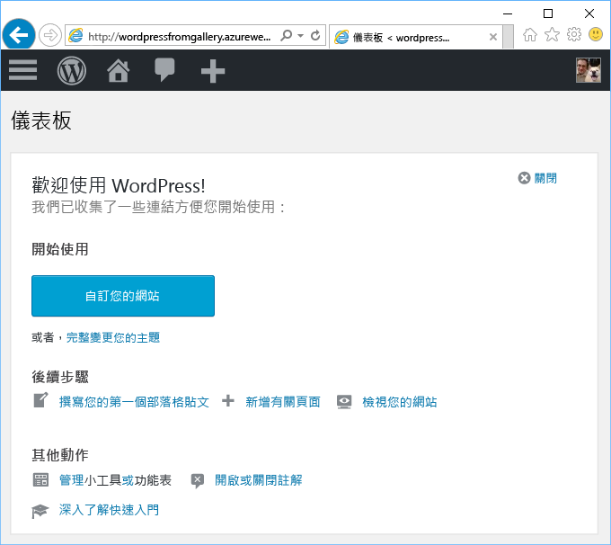

# 從 Azure Marketplace 建立 Web 應用程式
<!-- Note: This article replaces web-sites-php-web-site-gallery.md -->

[!INCLUDE [tabs](../../includes/app-service-web-get-started-nav-tabs.md)]

Azure Marketplace 所提供的各種熱門 Web Apps 是由開放原始碼軟體社群所開發，例如 WordPress 和 Umbraco CMS。 在本教學課程中，您將了解如何從 Azure Marketplace 建立 WordPress 應用程式。
這會建立 Azure Web 應用程式和 MySQL 資料庫。 

## 開始之前 

如果您沒有 Azure 訂用帳戶，請在開始前建立 [免費帳戶](https://azure.microsoft.com/free/?WT.mc_id=A261C142F) 。

## 從 Azure Marketplace 進行部署
請遵循下列步驟，從 Azure Marketplace 部署 WordPress。

### 登入 Azure
登入 [Azure 入口網站](https://portal.azure.com)。

### 部署 WordPress 範本
Azure Marketplace 提供的範本可設定資源，請設定 [WordPress](https://portal.azure.com/#create/WordPress.WordPress) 範本以開始使用。
   
輸入下列資訊可部署 WordPress 應用程式及其資源。

  

| 欄位         | 建議的值           | 說明  |
| ------------- |-------------------------|-------------|
| 應用程式名稱      | mywordpressapp          | 為您的 **Web 應用程式名稱**輸入唯一的應用程式名稱。 此名稱會用來作為應用程式 `<app_name>.azurewebsites.net` 預設 DNS 名稱的一部分，所以在 Azure 的所有應用程式中必須是唯一的名稱。 您稍後可先將自訂網域名稱對應至您的應用程式，再將它公開給使用者 |
| 訂用帳戶  | Pay-As-You-Go             | 選取 [訂用帳戶] 。 如果您有多個訂用帳戶，請選擇適當的訂用帳戶。 |
| 資源群組| mywordpressappgroup                 |    輸入**資源群組**。 資源群組是一個邏輯容器，可在其中部署與管理 Azure 資源 (例如 Web Apps、資料庫)。 您可以建立資源群組，或使用現有的資源群組 |
| App Service 方案 | myappplan          | App Service 方案代表用來裝載應用程式的實體資源集合。 選取 [位置] 和 [定價層]。 如需價格的詳細資訊，請參閱 [App Service 定價層](https://azure.microsoft.com/pricing/details/app-service/) |
| 資料庫      | mywordpressapp          | 選取適當的 MySQL 資料庫提供者。 Web Apps 支援 **ClearDB**、**適用於 MySQL 的 Azure 資料庫**和**應用程式內 MySQL**。 如需詳細資料，請參閱下列的[資料庫設定](#database-config)一節。 |
| Application Insights | ON 或 OFF          | 這是選擇性。 請按一下 [ON]，[Application Insights](https://azure.microsoft.com/en-us/services/application-insights/) 即可為您的 Web 應用程式提供監視服務。|

### 資料庫設定
請根據您所選擇的 MySQL 資料庫提供者，遵循下列步驟進行。  建議您將 Web 應用程式和 MySQL 資料庫放在相同的位置。

#### ClearDB 
[ClearDB](https://azuremarketplace.microsoft.com/en-us/marketplace/apps/SuccessBricksInc.ClearDBMySQLDatabase?tab=Overview) 是第三方解決方案，適用於 Azure 上完全整合的 MySQL 服務。 若要使用 ClearDB 資料庫，您必須將信用卡與您的 [Azure 帳戶](http://account.windowsazure.com/subscriptions)建立關聯。 如果您選取 ClearDB 資料庫提供者，就能檢視可供選擇的現有資料庫清單，或按一下 [新建] 按鈕來建立資料庫。

#### 適用於 MySQL 的 Azure 資料庫 (預覽)
[適用於 MySQL 的 Azure 資料庫](https://azure.microsoft.com/en-us/services/mysql)提供受管理的資料庫服務，可進行應用程式開發和部署，讓您在幾分鐘內就能在最信任的雲端上設定 MySQL 資料庫，並即時調整規模。 利用包含一切的價格模式，您無需額外付費，即可獲得所有想要的內建功能，例如高可用性、安全性和復原。 按一下 [定價層] 可選擇不同的[定價層](https://azure.microsoft.com/pricing/details/mysql)。 若要使用現有的資料庫或現有的 MySQL 伺服器，請使用伺服器所在的現有資源群組。 

> [!NOTE]
>  並非所有的區域都提供適用於 MySQL 的 Azure 資料庫 (預覽) 和 Linux 上的 Web 應用程式 (預覽)。 若要深入了解[適用於 MySQL 的 Azure 資料庫 (預覽)](https://docs.microsoft.com/en-us/azure/mysql) 和 [Linux 上的 Web 應用程式](./app-service-linux-intro.md)限制。 

#### 應用程式內 MySQL
[應用程式內 MySQL](https://blogs.msdn.microsoft.com/appserviceteam/2017/03/06/announcing-general-availability-for-mysql-in-app) 是一項 App Service 的功能，可讓您在平台上以原生方式執行 MySQL。 此版本的功能所支援的核心功能︰

- 與裝載網站的 web 伺服器並存之相同執行個體上執行的 MySQL 伺服器。 這可提升您應用程式的效能。
- 可在 MySQL 和您的 web 應用程式檔案之間共用儲存體。 請注意，在免費與共用方案中，當您根據所執行的動作使用網站時，可能會達到配額限制。 請查看[配額限制](https://azure.microsoft.com/en-us/pricing/details/app-service/plans/)，了解免費與共用方案。
- 您可以開啟緩慢查詢記錄和適用於 MySQL 的一般記錄。 請注意，這可能會影響網站效能，而且「不」應該保持開啟。 記錄功能可協助您調查任何應用程式的問題。 

如需詳細資料，請查看這篇[文章](https://blogs.msdn.microsoft.com/appserviceteam/2016/08/18/announcing-mysql-in-app-preview-for-web-apps/ )

當您在部署 WordPress 應用程式時，可以按一下入口網站頁面頂端的鐘型圖示查看進度。    

## 管理新的 Azure Web 應用程式

移至 Azure 入口網站，查看您剛建立的 Web 應用程式。

若要這麼做，請登入 [https://portal.azure.com](https://portal.azure.com)。

按一下左側功能表中的 [應用程式服務]，然後按一下 Azure Web 應用程式的名稱。

您已進入 Web 應用程式的_刀鋒視窗_ (水平開啟的入口網站頁面)。

根據預設，Web 應用程式的刀鋒視窗會顯示 [概觀] 頁面。 此頁面可讓您檢視應用程式的執行方式。 您也可以在這裡執行基本管理工作，像是瀏覽、停止、啟動、重新啟動及刪除。 刀鋒視窗左側的索引標籤會顯示您可開啟的各種設定頁面。

刀鋒視窗中的索引標籤會顯示您可以新增至 Web 應用程式的許多強大功能。 下表提供幾個可能性︰

* 對應自訂 DNS 名稱
* 繫結自訂 SSL 憑證
* 設定連續部署
* 相應增加和相應放大
* 新增使用者驗證

完成 5 分鐘的 WordPress 安裝精靈，即可啟動並執行 WordPress 應用程式。 請查看 [Wordpress 文件](https://codex.WordPress.org/)來開發 Web 應用程式。

## 設定您的應用程式 
在準備好將 WordPress 應用程式用於生產環境之前，需要進行多個步驟來管理 WordPress 應用程式。 請遵循下列步驟，將 WordPress 應用程式進行設定及管理︰

| 作法... | 目的... |
| --- | --- |
| **上傳或儲存大型檔案** |[使用 Blob 儲存體的 WordPress 外掛程式](https://wordpress.org/plugins/windows-azure-storage/)|
| **傳送電子郵件** |購買 [SendGrid](https://azuremarketplace.microsoft.com/en-us/marketplace/apps/SendGrid.SendGrid?tab=Overview) 電子郵件服務，並使用[使用 Blob 儲存體的 WordPress 外掛程式](https://wordpress.org/plugins/sendgrid-email-delivery-simplified/)加以設定|
| **自訂網域名稱** |[在 Azure App Service 中設定自訂網域名稱](app-service-web-tutorial-custom-domain.md) |
| **HTTPS** |[針對 Azure App Service 中的 Web 應用程式啟用 HTTPS](app-service-web-tutorial-custom-ssl.md) |
| **生產前驗證** |[針對 Azure App Service 中的 Web Apps 設定預備環境和開發環境](web-sites-staged-publishing.md)|
| **監視與疑難排解** |[針對 Azure App Service 中的 Web Apps 啟用診斷記錄功能](web-sites-enable-diagnostic-log.md)及[監視 Azure App Service 中的 Web Apps](app-service-web-tutorial-monitoring.md) |
| **部署您的網站** |[在 Azure App Service 中部署 Web 應用程式](app-service-deploy-local-git.md) |

## 保護您的應用程式 
在準備好將 WordPress 應用程式用於生產環境之前，需要進行多個步驟來管理 WordPress 應用程式。 請遵循下列步驟，將 WordPress 應用程式進行設定及管理︰

| 作法... | 目的... |
| --- | --- |
| **強式使用者名稱和密碼**|  經常變更密碼。 請勿使用常用的使用者名稱，例如 admin 或 wordpress 等。強制所有 WordPress 使用者使用唯一的使用者名稱和強式密碼。 |
| **隨時掌握最新資訊** | 將您的 WordPress 核心、佈景主題、外掛程式保持在最新狀態。 使用 Azure App Service 所提供的最新 PHP 執行階段 |
| **更新 WordPress 安全性金鑰** | 更新 [WordPress 安全性金鑰](https://codex.wordpress.org/Editing_wp-config.php#Security_Keys)，可提升儲存在 cookie 中的加密|

## 提升效能
雲端效能主要是透過快取和相應放大來達成。 不過，也應該要考量 Web Apps 主機的記憶體、頻寬與其他屬性。

| 作法... | 目的... |
| --- | --- |
| **了解 App Service 執行個體功能** |[定價詳細資料，包括 App Service 層的功能](https://azure.microsoft.com/en-us/pricing/details/app-service/)|
| **快取資源** |使用 [Azure Redis 快取](https://azure.microsoft.com/en-us/services/cache/)，或 [Azure 市集](https://azuremarketplace.microsoft.com) 中的其中一項快取產品 |
| **調整您的應用程式** |您需要調整 [Azure App Service 中的 web 應用程式](web-sites-scale.md)及/或 MySQL 資料庫。 應用程式內 MySQL 不支援相應放大，因此請選擇適用於 MySQL 的 ClearDB 或 Azure 資料庫 (預覽)。 [調整適用於 MySQL 的 Azure 資料庫 (預覽)](https://azure.microsoft.com/en-us/pricing/details/mysql/)，或者若是使用 [ClearDB 高可用性路由](http://w2.cleardb.net/faqs/)，則相應增加您的資料庫 |

## 可用性和災難復原
高可用性包含災害復原層面，可維護業務持續性。 必須要能夠快速辨識失敗，才能為雲端中發生的失敗和災害預作規劃。 這些解決方案可協助實作高可用性的策略。

| 作法... | 目的... |
| --- | --- |
| **負載平衡網站**或**異地發佈網站** |[使用 Azure 流量管理員將流量路由傳送](https://azure.microsoft.com/en-us/services/traffic-manager/) |
| **備份與還原** |[備份 Azure App Service 中的 Web 應用程式](web-sites-backup.md)及[還原 Azure App Service 中的 Web 應用程式](web-sites-restore.md) |

## 後續步驟
深入了解[要開發及調整的 App Service](/app-service-web/) 之各項功能。
