# 在您的第一個 Web 應用程式中新增功能
在[在&5; 分鐘內，將您的第一個 Web 應用程式部署至 Azure](app-service-web-get-started-cli-nodejs.md) 中，您已將範例 Web 應用程式部署至 [Azure App Service](../app-service/app-service-value-prop-what-is.md)。 在本文中，您將快速地在已部署的 Web 應用程式中新增一些很棒的功能。 您將在幾分鐘內︰

* 強制執行使用者驗證
* 自動調整您的應用程式
* 接收您應用程式的效能警示

不論您在前一篇文章中部署哪一個範例應用程式，您都可以依照本教學課程執行。

本教學課程中的三個活動，只是您在 App Service 中放入 Web 應用程式時所能獲得的許多實用功能的其中幾個範例。 其中有許多功能都可在 **免費** 層使用 (即您的第一個 Web 應用程式執行所在的定價層)，您可以使用試用額度來試用需要較高定價層的功能。 請放心，除非您明確地將 Web 應用程式變更為不同的定價層，否則它仍會留在 **免費** 層。

> [!NOTE]
> 您使用 Azure CLI 建立的 Web 應用程式會在 **免費** 層執行，其只允許一個具有資源配額的共用 VM 執行個體。 如需可在 **免費** 層獲得之資源的詳細資訊，請參閱 [App Service 限制](../azure-subscription-service-limits.md#app-service-limits)。
> 
> 

## 驗證您的使用者
現在，讓我們來看看，在應用程式中新增驗證有多麼簡單 (進一步的資訊請參閱 [App Service 驗證/授權](https://azure.microsoft.com/blog/announcing-app-service-authentication-authorization/))。

1. 在您應用程式的入口網站刀鋒視窗中，按一下 [設定] > [驗證 / 授權]。  
    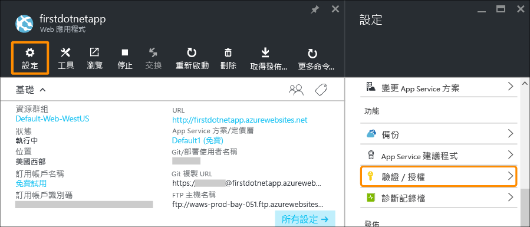
2. 按一下 [開啟]  以開啟驗證。  
3. 在 [驗證提供者] 中，按一下 [Azure Active Directory]。  
    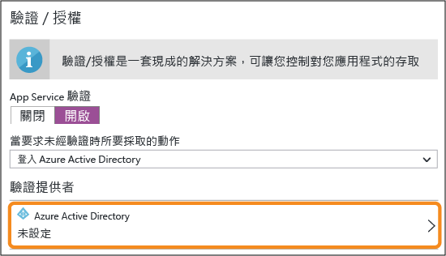
4. 在 [Azure Active Directory 設定] 刀鋒視窗中，按一下 [快速]，然後按一下 [確定]。 預設設定會在您的預設目錄中建立新的 Azure AD 應用程式。  
    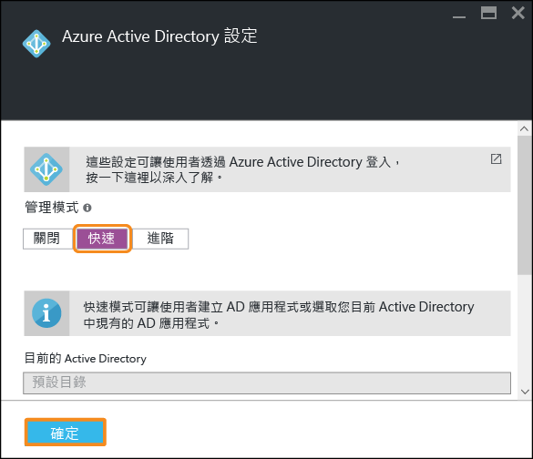
5. 按一下 [儲存] 。  
    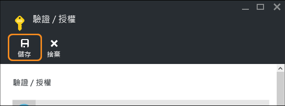
   
    成功變更之後，您會看到通知鈴變成綠色，以及一則清楚的訊息。
6. 回到您應用程式的入口網站刀鋒視窗，按一下 [URL] 連結 (或功能表列中的 [瀏覽])。 此連結是 HTTP 位址。  
    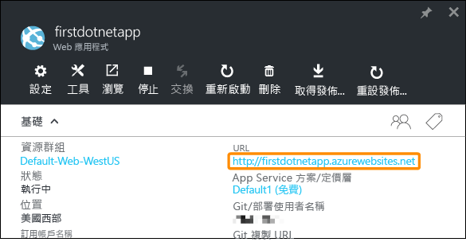  
    但是在新的索引標籤中開啟應用程式後，URL 方塊就會重新導向數次並透過 HTTPS 位址到達您的應用程式。 您會看到您已登入您的 Azure 訂用帳戶，而且您已自動在應用程式中進行驗證。  
    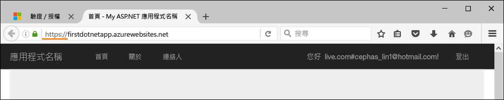  
    因此，如果您現在於不同瀏覽器中開啟未驗證的工作階段，當您瀏覽至相同 URL 時，將會看到登入畫面。  
    <!-- 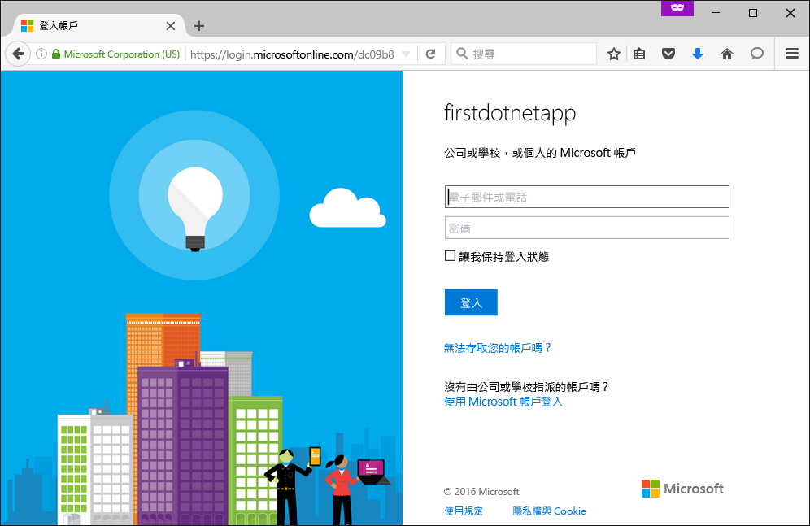  -->
    如果您從未使用 Azure Active Directory 執行任何作業，預設目錄可能沒有任何 Azure AD 使用者。 在此情況下，那裡唯一的帳戶可能是以您的 Azure 訂用帳戶登入的 Microsoft 帳戶。 這就是為什麼您先前會在相同的瀏覽器中自動登入此應用程式。
   您也可以使用相同的 Microsoft 帳戶登入此登入頁面。

恭喜，您已在驗證流向 Web 應用程式的所有流量。

您可能已注意到在 [驗證 / 授權]  刀鋒視窗中，您能做的不僅止於此，例如︰

* 啟用社交登入
* 啟用多個登入選項
* 變更當使用者第一次瀏覽至您的應用程式時的預設行為

App Service 會針對某些常見的驗證需求提供周全的解決方案，所以您不需要自行提供驗證邏輯。
如需詳細資訊，請參閱 [App Service 驗證/授權](https://azure.microsoft.com/blog/announcing-app-service-authentication-authorization/)。

## 自動根據需求調整您的應用程式
接下來，讓我們自動調整您的應用程式，讓它能自動調整容量以回應使用者的需求 (進一步的資訊請參閱[在 Azure 中相應增加您的應用程式](web-sites-scale.md)和[手動或自動調整執行個體計數](../monitoring-and-diagnostics/insights-how-to-scale.md))。

簡單地說，Web 應用程式有兩種調整方法︰

* [相應增加](https://en.wikipedia.org/wiki/Scalability#Horizontal_and_vertical_scaling)︰取得更多的 CPU、記憶體、磁碟空間和額外的功能，例如專用 VM、自訂網域和憑證、預備位置，以及自動調整等等。 您可以藉由變更應用程式所屬的 App Service 方案定價層來相應增加。
* [相應放大](https://en.wikipedia.org/wiki/Scalability#Horizontal_and_vertical_scaling)︰增加執行您的應用程式的 VM 執行個體數目。
  視您的定價層而定，最多可以相應放大至 50 個執行個體。

我們就不再贅言，馬上來設定自動調整。

1. 首先，相應增加以啟用自動調整。 在您應用程式的刀鋒視窗中，按一下 [設定] > [相應增加 (App Service 方案)]。  
    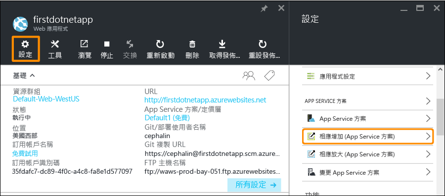
2. 捲動並選取 [S1 標準] 層 (這是支援自動調整的最低層 (如螢幕擷取畫面所圈選))，然後按一下 [選取]。  
    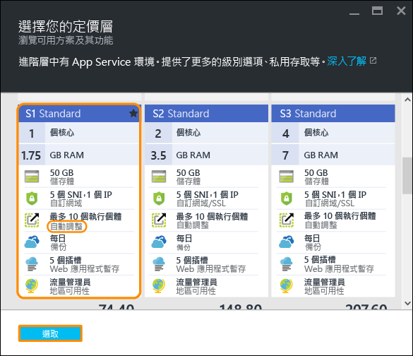
   
    您已完成相應增加。
   
   > [!IMPORTANT]
   > 這一層會耗用您的免費試用額度。 如果您有每次使用付費的帳戶，您的帳戶就會產生費用。
   > 
   > 
3. 接下來，設定自動調整。 在您應用程式的刀鋒視窗中，按一下 [設定] > [相應放大 (App Service 方案)]。  
    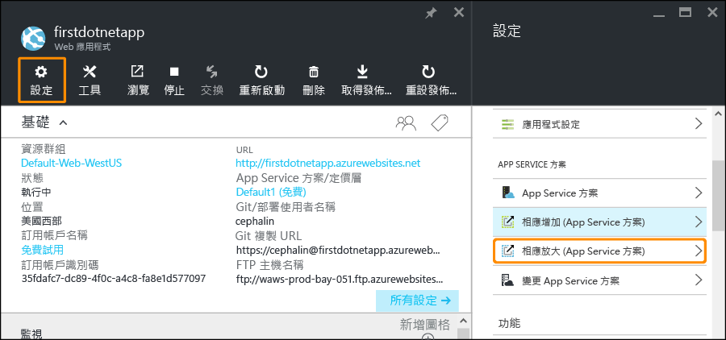
4. 將 [調整依據] 變更為 [CPU 百分比]。 下拉式清單之下的滑桿會跟著更新。 然後，定義介於 **1** 與 **2** 之間的 [執行個體] 範圍，以及介於 **40** 與 **80** 之間的 [目標範圍]。 做法為在方塊中輸入資料或移動滑桿。  
    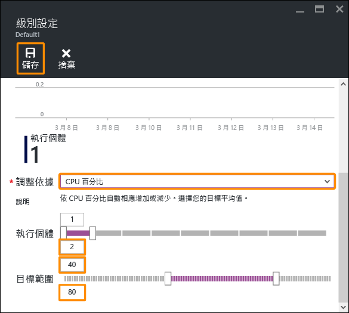
   
    根據此設定，當 CPU 使用率高於 80% 時，您的應用程式會自動相應放大，而當 CPU 使用率低於 40% 時則會相應縮小。
5. 按一下功能表列中的 [儲存]  。

恭喜，您的應用程式已在自動調整。

您可能已注意到在 [調整設定]  刀鋒視窗中，您還能︰

* 手動調整成特定的執行個體數目
* 依其他效能計量 (例如記憶體百分比或磁碟佇列) 調整
* 自訂觸發效能規則時的調整行為
* 根據排程自動調整
* 設定未來事件的自動調整行為

如需有關相應增加應用程式的詳細資訊，請參閱 [在 Azure 中相應增加您的應用程式](web-sites-scale.md)。 如需有關相應放大的詳細資訊，請參閱[手動或自動調整執行個體計數](../monitoring-and-diagnostics/insights-how-to-scale.md)。

## 接收應用程式的警示
現在，您的應用程式正在自動調整，當它達到最大執行個體計數 (2)，且 CPU 高於所需的使用率 (80%) 時，會發生什麼狀況？
您可以設定警示 (進一步的資訊請參閱[接收警示通知](../monitoring-and-diagnostics/insights-receive-alert-notifications.md)) 來通知您這種情況，以便您可以進一步相應增加/相應放大您的應用程式 (舉例來說)。 為此案例迅速設定警示。

1. 在您應用程式的刀鋒視窗中，按一下 [設定]  > 。  
    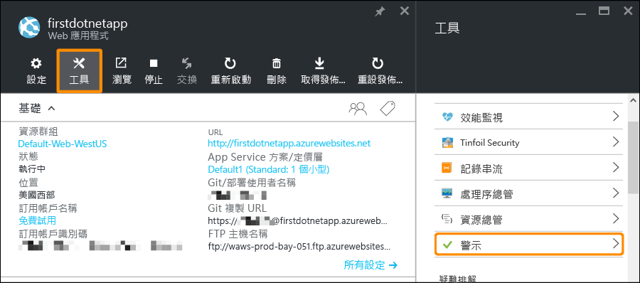
2. 按一下 [新增警示] 。 然後，在 [資源] 方塊中，選取結尾是 **(serverfarms)** 的資源。 這就是您的 App Service 方案。  
    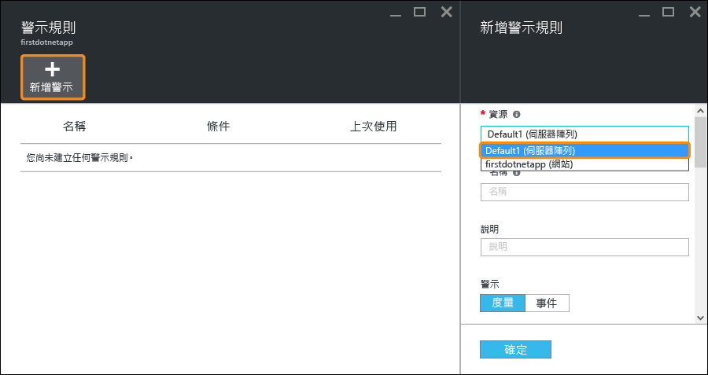
3. 將 [名稱] 指定為 `CPU Maxed`、[計量] 指定為 [CPU 百分比]，以及 [臨界值] 指定為 `90`，然後選取 [電子郵件擁有者、參與者和讀者]，再按一下 [確定]。   
    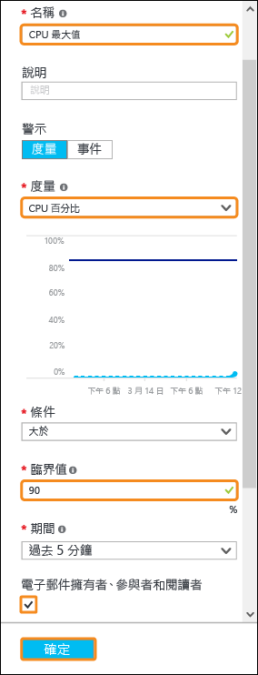
   
    當 Azure 完成警示建立時，您會在 [警示]  刀鋒視窗中看見該警示。  
    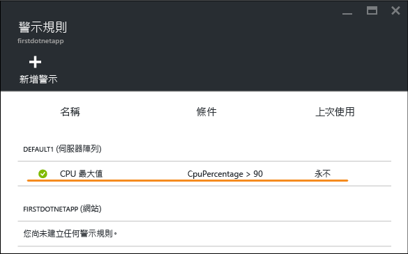

恭喜，您現已接收警示。

此警示設定會每隔&5; 分鐘檢查一次 CPU 使用率。 如果該數字高於 90%，您以及獲得授權的人員都會收到電子郵件警示。 若要查看有權接收警示的人員，請回到您應用程式的刀鋒視窗，然後按一下 [存取]  按鈕。  
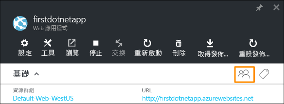

您應該會看到 [訂用帳戶管理員] 已經是應用程式的 [擁有者]。 如果您是 Azure 訂用帳戶 (如您的試用訂用帳戶) 的帳戶管理員，您就包含在此群組中。 如需 Azure 角色型存取控制的詳細資訊，請參閱 [Azure 角色型存取控制](../active-directory/role-based-access-control-configure.md)。

> [!NOTE]
> 警示規則是一項 Azure 功能。 如需詳細資訊，請參閱[接收警示通知](../monitoring-and-diagnostics/insights-receive-alert-notifications.md)。
> 
> 

## 後續步驟
當您設定警示時，可能已注意到 [工具]  刀鋒視窗中有一組豐富的工具。 您可以在此排解疑難問題、監視效能、測試弱點、管理資源、與 VM 主控台互動，以及新增實用的擴充功能。 我們邀請您按一下每一個工具，輕鬆探索這些簡單卻功能強大的工具。

了解如何以您部署的應用程式執行更多作業。 以下只是部分清單︰

* [購買並設定自訂網域名稱](custom-dns-web-site-buydomains-web-app.md) - 為您的 Web 應用程式購買引人注意的網域，而非 *.azurewebsites.net 網域。 或使用既有網域。
* [設定預備環境](web-sites-staged-publishing.md) - 先將應用程式部署至預備 URL，再將它放到生產環境。 放心地更新執行中的 Web 應用程式。 為精心規劃的 DevOps 方案設定多個部署位置。
* [設定連續部署](app-service-continuous-deployment.md) - 將應用程式部署整合至原始檔控制系統。 使用每個認可部署到 Azure。
* [存取內部部署資源](web-sites-hybrid-connection-get-started.md) - 存取現有的內部部署資料庫或 CRM 系統。
* [備份您的應用程式](web-sites-backup.md) - 為 Web 應用程式設定備份與還原。 為非預期的失敗做好準備，並從中復原。
* [啟用診斷記錄](web-sites-enable-diagnostic-log.md) - 讀取 Azure 或應用程式追蹤內的 IIS 記錄檔。 在串流中讀取記錄檔、下載記錄檔，或將記錄檔移植到 [Application Insights](../application-insights/app-insights-overview.md) 來進行周全分析。
* [掃描應用程式中的弱點](https://azure.microsoft.com/blog/web-vulnerability-scanning-for-azure-app-service-powered-by-tinfoil-security/) -
  使用 [Tinfoil Security](https://www.tinfoilsecurity.com/) 所提供的服務，掃描 Web 應用程式中是否有新型威脅。
* [執行背景工作](../azure-functions/functions-overview.md) - 執行資料處理、報告等工作。
* [了解 App Service 的運作方式](../app-service/app-service-how-works-readme.md)

