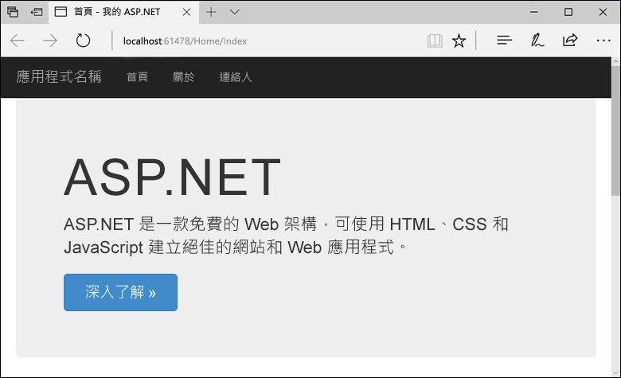

# <a name="create-an-aspnet-web-app-in-azure"></a>在 Azure 中建立 ASP.NET Web 應用程式

[Azure Web Apps](https://docs.microsoft.com/azure/app-service-web/app-service-web-overview) 提供可高度擴充、自我修復的 Web 主機服務。  本快速入門會顯示如何將第一個 ASP.NET Web 應用程式部署至 Azure Web Apps。 當您完成時，您會有已部署 Web 應用程式的資源群，其中包含 App Service 方案和 Azure Web 應用程式。

觀賞影片可觀看本快速入門動態版，然後自行遵循相關步驟，以在 Azure 上發佈您的第一個 .NET 應用程式。

> [!VIDEO https://channel9.msdn.com/Shows/Azure-for-NET-Developers/Create-a-NET-app-in-Azure-Quickstart/player]

## <a name="prerequisites"></a>必要條件

若要完成本教學課程：

* 使用下列工作負載安裝 [Visual Studio 2017](https://www.visualstudio.com/downloads/)：
    - **ASP.NET 和 Web 開發**
    - **Azure 開發**

    ![ASP.NET 和 Web 開發及 Azure 開發 (在 [Web 和雲端] 之下)](media/app-service-web-tutorial-dotnet-sqldatabase/workloads.png)

[!INCLUDE [quickstarts-free-trial-note](../../includes/quickstarts-free-trial-note.md)]

## <a name="create-an-aspnet-web-app"></a>建立 ASP.NET Web 應用程式

在 Visual Studio 中，選取 [檔案] > [新增] > [專案] 以建立專案。 

在 [新增專案] 對話方塊中，選取 [Visual C#] > [Web] > [ASP.NET Web 應用程式 (.NET Framework)]。

將應用程式命名為 _myFirstAzureWebApp_，然後選取 [確定]。
   


您可以將任何類型的 ASP.NET web 應用程式部署至 Azure。 在本快速入門中，選取 **MVC** 範本，並確定驗證設定為 [不需要驗證]。
      
選取 [確定] 。

![[新增 ASP.NET 專案] 對話方塊](./media/app-service-web-get-started-dotnet/select-mvc-template.png)

從功能表中，選取 [偵錯] > [啟動但不偵錯]，以在本機執行 Web 應用程式。



## <a name="publish-to-azure"></a>發佈至 Azure

在 [方案總管] 中，以滑鼠右鍵按一下 **myFirstAzureWebApp** 專案，然後選取 [發佈]。


確定已選取 [Microsoft Azure App Service]，然後選取 [發佈]。


這會開啟 [建立 App Service] 對話方塊，協助您建立在 Azure 中執行 ASP.NET Web 應用程式所需的 Azure 資源。

## <a name="sign-in-to-azure"></a>登入 Azure

在 [建立 App Service] 對話方塊中，選取 [新增帳戶]，然後登入您的 Azure 訂用帳戶。 如果您已登入，請從下拉式清單中選取包含所需訂用帳戶的帳戶。

> [!NOTE]
> 如果您已經登入，請勿選取 [建立]。
>
>
   


## <a name="create-a-resource-group"></a>建立資源群組

[!INCLUDE [resource group intro text](../../includes/resource-group.md)]

選取 [資源群組] 旁邊的 [新增]。

將資源群組命名為 **myResourceGroup**，然後選取 [確定]。

## <a name="create-an-app-service-plan"></a>建立應用程式服務方案

[!INCLUDE [app-service-plan](../../includes/app-service-plan.md)]

選取 [App Service 方案] 旁邊的 [新增]。 

在 [設定 App Service 方案] 對話方塊中，使用螢幕擷取畫面之後表格中的設定。


| 設定 | 建議的值 | 說明 |
|-|-|-|
|App Service 方案| myAppServicePlan | App Service 方案的名稱。 |
| 位置 | 西歐 | 裝載 Web 應用程式的資料中心。 |
| 大小 | 免費 | [定價層](https://azure.microsoft.com/pricing/details/app-service/)可決定裝載功能。 |

選取 [確定] 。

## <a name="create-and-publish-the-web-app"></a>建立和發佈 Web 應用程式

在 [Web 應用程式名稱] 中，輸入唯一的應用程式名稱 (有效字元為 `a-z`、`0-9` 和 `-`)，或接受自動產生的唯一名稱。 Web 應用程式的 URL 是 `http://<app_name>.azurewebsites.net`，其中 `<app_name>` 是您的 Web 應用程式名稱。

選取 [建立] 開始建立 Azure 資源。


精靈完成後，它會將 ASP.NET Web 應用程式發佈至 Azure，然後在預設瀏覽器中啟動該應用程式。


在[建立及發佈步驟](#create-and-publish-the-web-app)中指定的 Web 應用程式名稱會作為 URL 首碼，其格式為 `http://<app_name>.azurewebsites.net`。

恭喜您，您的 ASP.NET Web 應用程式在 Azure App Service 中即時執行。

## <a name="update-the-app-and-redeploy"></a>更新應用程式並重新部署

從 [方案總管]，開啟 _Views\Home\Index.cshtml_。

尋找頂端附近的 `<div class="jumbotron">` HTML 標籤，並以下列程式碼取代整個元素︰

```HTML
<div class="jumbotron">
    <h1>ASP.NET in Azure!</h1>
    <p class="lead">This is a simple app that we’ve built that demonstrates how to deploy a .NET app to Azure App Service.</p>
</div>
```

若要重新部署至 Azure，請在 [方案總管] 中，以滑鼠右鍵按一下 **myFirstAzureWebApp** 專案，然後選取 [發佈]。

在發佈頁面中，選取 [發佈]。

發佈完成時，Visual Studio 會啟動瀏覽器以前往 Web 應用程式的 URL。


## <a name="manage-the-azure-web-app"></a>管理 Azure Web 應用程式

請移至 <a href="https://portal.azure.com" target="_blank">Azure 入口網站</a>，以管理 Web 應用程式。

從左側功能表，選取 [應用程式服務]，然後選取 Azure Web 應用程式的名稱。


您會看到 Web 應用程式的 [概觀] 頁面。 您可以在這裡執行基本管理工作，像是瀏覽、停止、啟動、重新啟動及刪除。 


左側功能表提供不同的頁面來設定您的應用程式。 

[!INCLUDE [Clean-up section](../../includes/clean-up-section-portal.md)]

## <a name="next-steps"></a>後續步驟

> [!div class="nextstepaction"]
> [ASP.NET 搭配 SQL Database](app-service-web-tutorial-dotnet-sqldatabase.md)

