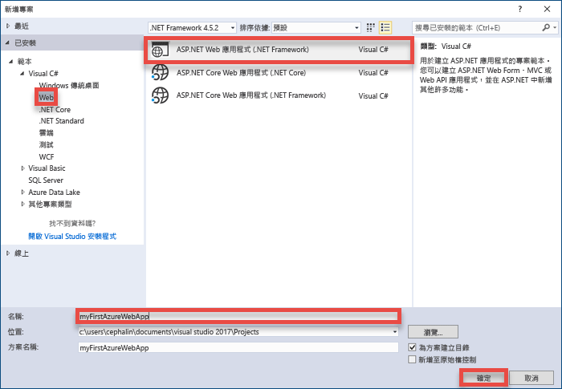
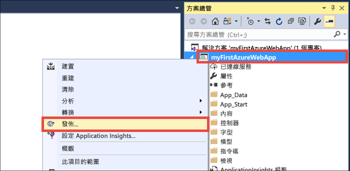
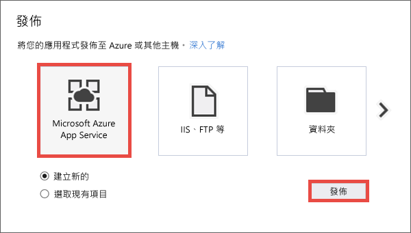
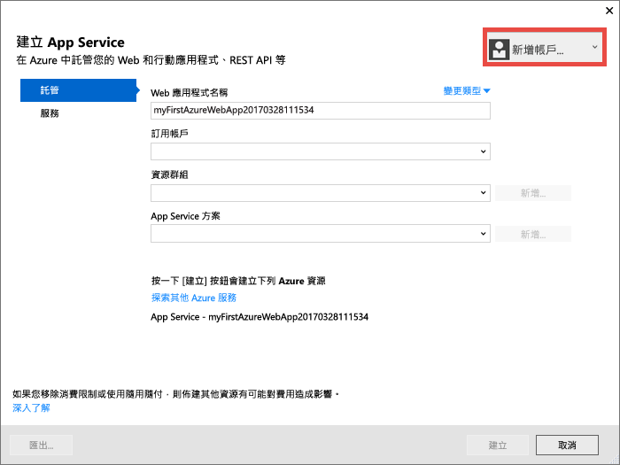
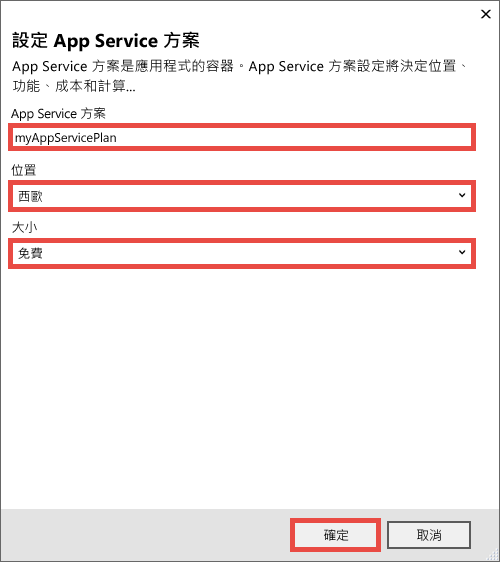
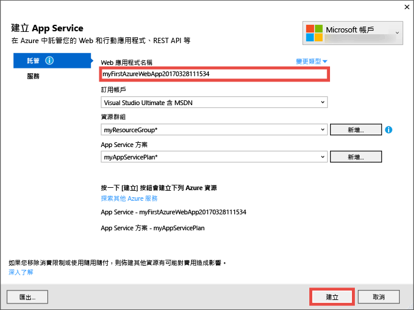
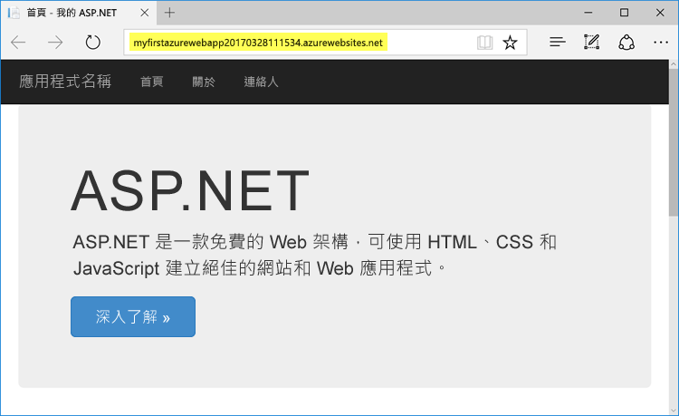
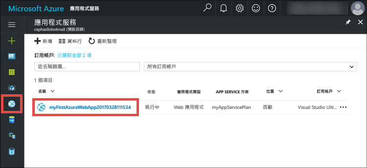
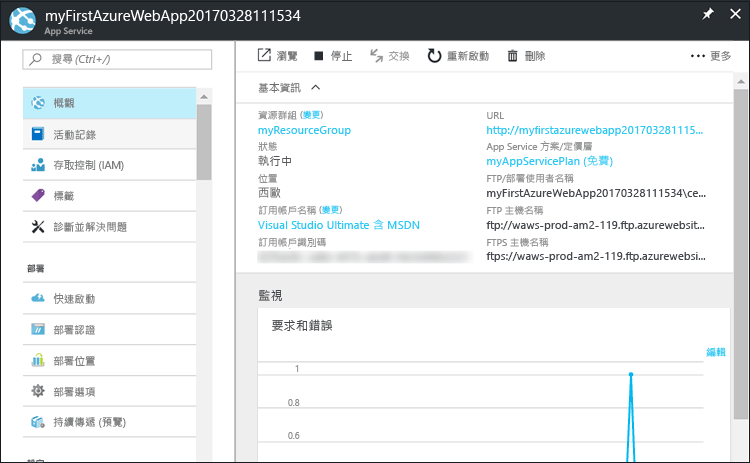

# <a name="create-your-first-aspnet-web-app-in-azure-in-five-minutes"></a>在 5 分鐘內，將您的第一個 ASP.NET Web 應用程式建立在 Azure 中

[!INCLUDE [app-service-web-selector-get-started](../../includes/app-service-web-selector-get-started.md)] 

本快速入門可幫助您在短短幾分鐘內將第一個 ASP.NET web 應用程式部署至 [Azure App Service](../app-service/app-service-value-prop-what-is.md)。 完成之後，您將有個簡單的 Web 應用程式在雲端中啟動並執行。


## <a name="prerequisites"></a>必要條件

本教學課程示範如何使用 Visual Studio 2017，建置 ASP.NET Web 應用程式並部署至 Azure。 如果尚未安裝 Visual Studio 2017，您可以下載並使用**免費的** [Visual Studio 2017 Community 版本](https://www.visualstudio.com/downloads/)。 務必在 Visual Studio 設定期間啟用 **Azure 開發**。

[!INCLUDE [quickstarts-free-trial-note](../../includes/quickstarts-free-trial-note.md)]

## <a name="create-an-aspnet-web-app"></a>建立 ASP.NET Web 應用程式

在 Visual Studio 中，使用 `Ctrl`+`Shift`+`N` 建立專案。

在 [新增專案] 對話方塊中，依序按一下 [Visual C#] > [Web] > [ASP.NET Web 應用程式 (.NET Framework)]。

將應用程式命名為 **myFirstAzureWebApp**，然後按一下 [確定]。
   


您可以將任何類型的 ASP.NET web 應用程式部署至 Azure。 在本教學課程中，選取 **MVC** 範本，並確定驗證設定為 [不需要驗證]。
      
按一下 [確定] 。

![[新增 ASP.NET 專案] 對話方塊](./media/app-service-web-get-started-dotnet/select-mvc-template.png)

## <a name="publish-to-azure"></a>發佈至 Azure

在 [方案總管] 中，以滑鼠右鍵按一下 **myFirstAzureWebApp** 專案，然後選取 [發佈]。



確定已選取 [Microsoft Azure App Service]，然後按一下 [發佈]。



這會開啟 [建立 App Service] 對話方塊，協助您建立在 Azure 中執行 ASP.NET Web 應用程式所需的所有 Azure 資源。

## <a name="sign-in-to-azure"></a>登入 Azure

在 [建立 App Service] 對話方塊中，按一下 [新增帳戶]，然後登入您的 Azure 訂用帳戶。 如果您已登入 Microsoft 帳戶，請確定該帳戶保留您的 Azure 訂用帳戶。 如果登入的 Microsoft 帳戶沒有 Azure 訂用帳戶，請按一下它來新增正確的帳戶。
   


登入之後，您即可在此對話方塊中建立 Azure Web 應用程式需要的所有資源。

## <a name="create-a-resource-group"></a>建立資源群組

首先，您需有_資源群組_。 

> [!NOTE] 
> 資源群組是一個邏輯容器，可在其中部署與管理 Azure 資源 (例如 Web 應用程式、資料庫和儲存體帳戶)。
>
>

按一下 [資源群組] 旁邊的 [新增]。

將您的資源群組命名為 **myResourceGroup**，然後按一下 [確定]。

## <a name="create-an-app-service-plan"></a>建立應用程式服務方案

[!INCLUDE [app-service-plan](../../includes/app-service-plan.md)]

按一下 [App Service 方案] 旁邊的 [新增]。 

在 [設定 App Service 方案] 對話方塊中，使用下列設定來設定新的 App Service 方案︰

- **App Service 方案**：輸入 **myAppServicePlan**。 
- **位置**︰選擇 [西歐]，或您附近的區域。
- **大小**︰選擇 [免費] 或其他[定價層](https://azure.microsoft.com/pricing/details/app-service/)。

按一下 [確定] 。



## <a name="create-and-publish-the-web-app"></a>建立和發佈 Web 應用程式

接下來只要為 Web 應用程式命名。 在 [Web 應用程式名稱] 中，輸入唯一的應用程式名稱。 此名稱將做為應用程式預設 DNS 名稱的一部分 (`<app_name>.azurewebsites.net`)，所以在 Azure 的所有應用程式中必須是唯一的名稱。 您稍後先將自訂網域名稱對應至您的應用程式，再將它公開給使用者。

您也可以接受自動產生的名稱 (已是唯一的)。

按一下 [建立] 開始建立 Azure 資源。



當精靈完成 Azure 資源建立時，就會自動將 ASP.NET Web 應用程式首度發佈至 Azure，然後在預設瀏覽器中啟動已發佈的 Azure Web 應用程式。



URL 會使用您稍早指定的 Web 應用程式名稱，其格式為 `http://<app_name>.azurewebsites.net`。 

恭喜您，第一個 ASP.NET web 應用程式在 Azure App Service 中即時執行。

## <a name="update-the-app-and-redeploy"></a>更新應用程式並重新部署

您可以很容易地更新並重新部署至 Azure。 讓我們對首頁進行更新。

從 [方案總管]，開啟 **Views\Home\Index.cshtml**。

尋找頂端附近的 `<div class="jumbotron">` HTML 標籤，並以下列程式碼取代整個標籤︰

```HTML
<div class="jumbotron">
    <h1>ASP.NET in Azure!</h1>
    <p class="lead">This is a simple app that we’ve built that demonstrates how to deploy a .NET app to Azure App Service.</p>
</div>
```

若要重新部署至 Azure，請在 [方案總管] 中，以滑鼠右鍵按一下 **myFirstAzureWebApp** 專案，然後選取 [發佈]。

在發佈頁面中，按一下 [發佈]。

當 Visual Studio 完成時，就會在瀏覽器中啟動已更新的 Azure Web 應用程式。


## <a name="manage-your-new-azure-web-app"></a>管理新的 Azure Web 應用程式

移至 Azure 入口網站，查看您剛建立的 Web 應用程式。 

若要這麼做，請登入 [https://portal.azure.com](https://portal.azure.com)。

按一下左側功能表中的 [應用程式服務]，然後按一下 Azure Web 應用程式的名稱。



您已進入 Web 應用程式的_刀鋒視窗_ (水平開啟的入口網站頁面)。 

根據預設，Web 應用程式的刀鋒視窗會顯示 [概觀] 頁面。 此頁面可讓您檢視應用程式的執行方式。 您也可以在這裡執行基本管理工作，像是瀏覽、停止、啟動、重新啟動及刪除。  



刀鋒視窗左側的索引標籤會顯示您可開啟的各種設定頁面。 下表提供幾個可能性︰

- 對應自訂 DNS 名稱
- 繫結自訂 SSL 憑證
- 設定連續部署
- 相應增加和相應放大
- 新增使用者驗證

## <a name="clean-up-resources"></a>清除資源

若要刪除第一個 Azure Web 應用程式，您可以在 [概觀] 頁面中按一下 [刪除]。 不過，若要刪除您在本快速入門中建立的所有項目，還有更好的方法。 從 Web 應用程式的 [概觀] 頁面，按一下資源群組以開啟其刀鋒視窗。 


在資源群組刀鋒視窗中，您可以看到 Visual Studio 為您建立的 App Service 方案和 App Service 應用程式。 

在刀鋒視窗的頂端，按一下 [刪除]。 

<!---->

在確認刀鋒視窗中，將資源群組名稱 **myResourceGroup** 輸入到文字方塊中進行確認，然後按一下 [刪除]。

## <a name="next-steps"></a>後續步驟

> [!div class="nextstepaction"]
> [了解如何在 Azure 中使用 SQL Database 建置 ASP.NET 應用程式](app-service-web-tutorial-dotnet-sqldatabase.md)

> [!div class="nextstepaction"]
> [探索範例 Web Apps PowerShell 指令碼](app-service-powershell-samples.md)

