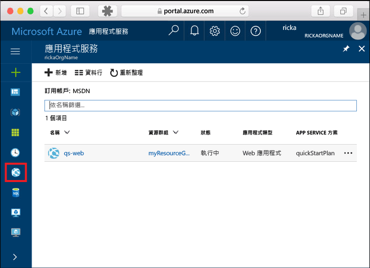
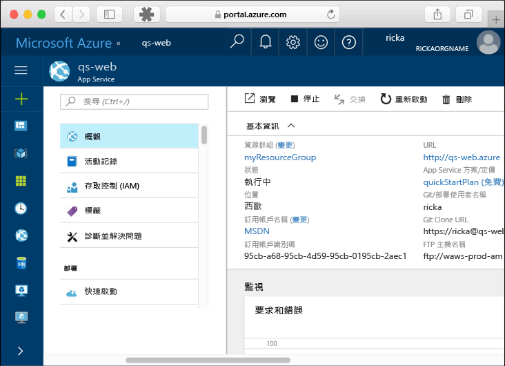

# <a name="create-a-static-html-web-app-in-azure"></a>在 Azure 中建立靜態 HTML Web 應用程式

[Azure Web Apps](https://docs.microsoft.com/azure/app-service-web/app-service-web-overview) 提供可高度擴充、自我修復的 Web 主機服務。  本快速入門顯示如何將基本 HTML+CSS 網站部署至 Azure Web Apps。 您可使用 [Azure CLI](https://docs.microsoft.com/cli/azure/get-started-with-azure-cli)建立 Web 應用程式，而且使用 Git 將範例 HTML 內容部署至 Web 應用程式。


您可以使用 Mac、Windows 或 Linux 電腦，依照下面步驟操作。 安裝先決條件後，大約需要 5 分鐘才能完成這些步驟。

## <a name="prerequisites"></a>必要條件

若要完成本快速入門：

- [安裝 Git](https://git-scm.com/)
[!INCLUDE [quickstarts-free-trial-note](../../includes/quickstarts-free-trial-note.md)]

[!INCLUDE [cloud-shell-try-it.md](../../includes/cloud-shell-try-it.md)]

如果您選擇在本機安裝和使用 CLI，本主題會要求您執行 Azure CLI 2.0 版或更新版本。 執行 `az --version` 以尋找版本。 如果您需要安裝或升級，請參閱[安裝 Azure CLI 2.0]( /cli/azure/install-azure-cli)。 

## <a name="download-the-sample"></a>下載範例

在終端機視窗中執行下列命令，將範例應用程式存放庫複製到本機電腦。

```bash
git clone https://github.com/Azure-Samples/html-docs-hello-world.git
```

您可使用這個終端機視窗來執行本快速入門中的所有命令。

## <a name="view-the-html"></a>HTML 檢視

瀏覽至包含範例 HTML 的目錄。 在瀏覽器中開啟 *index.html* 檔案。


[!INCLUDE [Log in to Azure](../../includes/login-to-azure.md)] 

[!INCLUDE [Configure deployment user](../../includes/configure-deployment-user.md)] 

[!INCLUDE [Create resource group](../../includes/app-service-web-create-resource-group.md)] 

[!INCLUDE [Create app service plan](../../includes/app-service-web-create-app-service-plan.md)] 

[!INCLUDE [Create web app](../../includes/app-service-web-create-web-app.md)] 


您已在 Azure 中建立空的新 Web 應用程式。

[!INCLUDE [Configure local git](../../includes/app-service-web-configure-local-git.md)] 

[!INCLUDE [Push to Azure](../../includes/app-service-web-git-push-to-azure.md)] 

```bash
Counting objects: 13, done.
Delta compression using up to 4 threads.
Compressing objects: 100% (11/11), done.
Writing objects: 100% (13/13), 2.07 KiB | 0 bytes/s, done.
Total 13 (delta 2), reused 0 (delta 0)
remote: Updating branch 'master'.
remote: Updating submodules.
remote: Preparing deployment for commit id 'cc39b1e4cb'.
remote: Generating deployment script.
remote: Generating deployment script for Web Site
remote: Generated deployment script files
remote: Running deployment command...
remote: Handling Basic Web Site deployment.
remote: KuduSync.NET from: 'D:\home\site\repository' to: 'D:\home\site\wwwroot'
remote: Deleting file: 'hostingstart.html'
remote: Copying file: '.gitignore'
remote: Copying file: 'LICENSE'
remote: Copying file: 'README.md'
remote: Finished successfully.
remote: Running post deployment command(s)...
remote: Deployment successful.
To https://<app_name>.scm.azurewebsites.net/<app_name>.git
 * [new branch]      master -> master
```

## <a name="browse-to-the-app"></a>瀏覽至應用程式

在瀏覽器中，移至 Azure Web 應用程式 URL：

```
http://<app_name>.azurewebsites.net
```

此頁面目前作為 Azure App Service Web 應用程式執行。


**恭喜！** 您已將第一個 HTML 應用程式部署至 App Service。

## <a name="update-and-redeploy-the-app"></a>更新和重新部署應用程式

在文字編輯器中開啟 *index.html* 檔案，並對標記進行變更。 例如，將 H1 標題從「Azure App Service - 範例靜態 HTML 網站」變更為只剩下「Azure App Service」。

在 Git 中認可您的變更，然後將程式碼變更推送至 Azure。

```bash
git commit -am "updated HTML"
git push azure master
```

完成部署後，重新整理瀏覽器以查看變更。


## <a name="manage-your-new-azure-web-app"></a>管理新的 Azure Web 應用程式

請移至 <a href="https://portal.azure.com" target="_blank">Azure 入口網站</a>，以管理您所建立的 Web 應用程式。

按一下左側功能表中的 [應用程式服務]，然後按一下 Azure Web 應用程式的名稱。



您會看到 Web 應用程式的 [概觀] 頁面。 您可以在這裡執行基本管理工作，像是瀏覽、停止、啟動、重新啟動及刪除。 



左側功能表提供不同的頁面來設定您的應用程式。 

[!INCLUDE [cli-samples-clean-up](../../includes/cli-samples-clean-up.md)]

## <a name="next-steps"></a>後續步驟

> [!div class="nextstepaction"]
> [對應自訂網域](app-service-web-tutorial-custom-domain.md)

