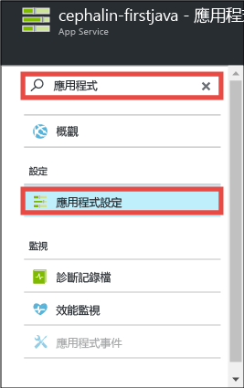
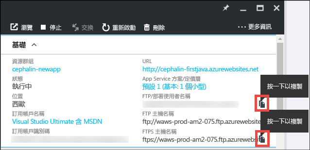
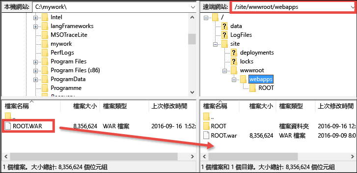

# 在 5 分鐘內，將您的第一個 Java Web 應用程式部署到 Azure
本教學課程將協助您部署一個簡單的 Java Web 應用程式至 [Azure App Service](../app-service/app-service-value-prop-what-is.md)。您可以使用 App Service 來建立 Web 應用程式、[行動應用程式後端](/documentation/learning-paths/appservice-mobileapps/)和 [API 應用程式](../app-service-api/app-service-api-apps-why-best-platform.md)。

您將：

* 在 Azure App Service 中建立 Web 應用程式。
* 部署範例 Java 應用程式。
* 看見您的程式碼在生產環境中即時執行。

## 必要條件
* 取得 FTP/FTPS 用戶端，例如 [FileZilla](https://filezilla-project.org/)。
* 取得 Microsoft Azure 帳戶。如果您沒有帳戶，可以[申請免費試用](/pricing/free-trial/?WT.mc_id=A261C142F)，或是[啟用自己的 Visual Studio 訂閱者權益](/pricing/member-offers/msdn-benefits-details/?WT.mc_id=A261C142F)。

> [!NOTE]
> 您可以[試用 App Service](http://go.microsoft.com/fwlink/?LinkId=523751)，而不需要 Azure 帳戶。建立入門 App，並試用長達一小時。不需要信用卡，也不需簽定合約。
> 
> 

## 建立 Web 應用程式
1. 使用您的 Azure 帳戶登入 [Azure 入口網站](https://portal.azure.com)。
2. 按一下左側功能表的 [新增] > [Web + 行動] > [Web 應用程式]。
   
    
3. 在 App 建立刀鋒視窗中，針對您新的 App 使用下列設定：
   
   * **應用程式名稱**：輸入唯一的名稱。
   * **資源群組**：選取 [新建] 並指定資源群組名稱。
   * **App Service 方案/位置**：按一下以進行設定，然後按一下 [新建] 來設定 App Service 方案的名稱、位置與定價層。請放心地使用 [免費] 定價層。
     
     完成時，App 建立刀鋒視窗應該如下所示：
     
     
4. 按一下底部的 [建立]。您可以按一下頂端的通知圖示來查看進度。
   
    
5. 部署完成時，您應該會看到此通知訊息。按一下訊息可開啟部署的刀鋒視窗。
   
    
6. 在 [部署成功] 刀鋒視窗中，按一下 [資源] 連結以開啟新的 Web 應用程式刀鋒視窗。
   
    

## 將 Java 應用程式部署到您的 Web 應用程式
現在，讓我們使用 FTPS 將 Java 應用程式部署至 Azure。

1. 在 Web 應用程式刀鋒視窗中，向下捲動至 [應用程式設定] 或搜尋「應用程式設定」，然後按一下它。
   
    
2. 在 [Java 版本] 中，選取 [Java 8]，然後按一下 [儲存]。
   
    
   
    當您收到「已成功更新 Web 應用程式設定」通知時，瀏覽至 http://*&lt;appname>*.azurewebsites.net 來查看預設 JSP Servlet 的實際運作。
3. 回到 Web 應用程式刀鋒視窗中，向下捲動至 [部署認證] 或搜尋「部署認證」，然後按一下它。
4. 設定您的部署認證，然後按一下 [儲存]。
5. 回到 [Web 應用程式] 刀鋒視窗中，按一下 [概觀]。在 [FTP/部署使用者名稱] 和 [FTPS 主機名稱] 旁邊，按一下 [複製] 按鈕來複製這些值。
   
    
   
    您現在可以開始用 FTPS 部署您的 Java 應用程式。
6. 在 FTP/FTPS 用戶端中，使用在上一步中複製的值登入 Azure Web 應用程式的 FTP 伺服器。使用您稍早之前建立的部署密碼。
   
    以下螢幕擷取畫面顯示使用 FileZilla 登入。
   
    
   
    您可能會看到 Azure 針對無法識別的 SSL 憑證所發出的安全性警告。請繼續進行。
7. 按一下[此連結](https://github.com/Azure-Samples/app-service-web-java-get-started/raw/master/webapps/ROOT.war)，將 WAR 檔案下載到您的本機電腦。
8. 在 FTP/FTPS 用戶端中，瀏覽到遠端站台中的 **/site/wwwroot/webapps**，並將下載到您本機電腦的 WAR 檔案拖放到該遠端目錄。
   
    
   
    按一下 [確定] 以覆寫 Azure 中的檔案。
   
   > [!NOTE]
   > 根據 Tomcat 的預設行為，/site/wwwroot/webapps 中的檔案名稱 **ROOT.war** 會提供您根 Web 應用程式 (http://*&lt;appname>*.azurewebsites.net)，而檔案名稱 ***&lt;anyname>*.war** 會提供您已命名的 Web 應用程式 (http://*&lt;appname>*.azurewebsites.net/*&lt;anyname>*)。
   > 
   > 

就這麼簡單！ 您的 Java 應用程式現在正在 Azure 中即時執行。在瀏覽器中，瀏覽至 http://*&lt;appname>*.azurewebsites.net 來查看其實際運作。

## 更新您的 App
每當您需要更新的時候，只要使用 FTP/FTPS 用戶端將新的 WAR 檔案上傳到相同的遠端目錄即可。

## 後續步驟
[使用 Azure Marketplace 中的範本建立 Java Web 應用程式](web-sites-java-get-started.md#marketplace)。您可以取得可完全自訂的 Tomcat 容器，以及熟悉的管理員 UI。

直接在 [IntelliJ](app-service-web-debug-java-web-app-in-intellij.md) 或 [Eclipse](app-service-web-debug-java-web-app-in-eclipse.md) 中，針對您的 Azure Web 應用程式進行偵錯。

或者，進一步運用您的第一個 Web 應用程式。例如：

* 嘗試[將程式碼部署至 Azure 的其他方法](web-sites-deploy.md)。例如，若要從您的其中一個 GitHub 儲存機制中部署，只需在 [部署選項] 中改為選取 [GitHub] 而不是 [本機 Git 儲存機制] 即可。
* 加強您 Azure App 的功能。驗證您的使用者。根據需求加以調整。設定一些效能警示。都只要點幾下滑鼠就能完成。請參閱[在您的第一個 Web 應用程式中新增功能](app-service-web-get-started-2.md)。

<!---HONumber=AcomDC_1005_2016-->