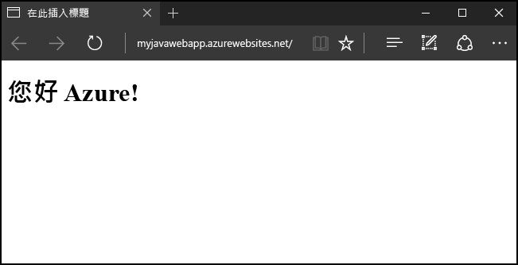
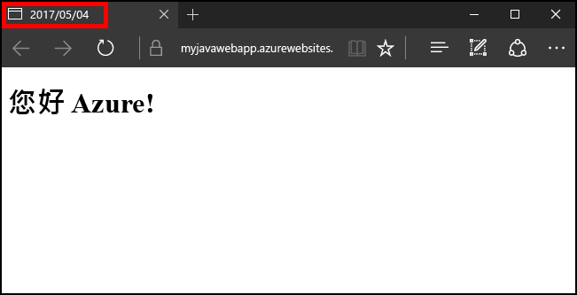

# <a name="create-your-first-java-web-app-in-azure-in-five-minutes"></a>在 5 分鐘內，將您的第一個 Java Web 應用程式建立在 Azure 中

[!INCLUDE [app-service-web-selector-get-started](../../includes/app-service-web-selector-get-started.md)] 

本快速入門可幫助您在短短幾分鐘內將第一個 Java Web 應用程式部署至 [Azure App Service](../app-service/app-service-value-prop-what-is.md)。 完成此教學課程之後，您將有個簡單的 Java 型 Web 應用程式在雲端中啟動並執行。



## <a name="before-you-begin"></a>開始之前

本教學課程示範如何使用 Eclipse IDE for Java EE Devlopers 來建置 Java Web 應用程式並將其部署至 Azure。 如果您尚未安裝 Eclipse，請從 http://www.eclipse.org/ 免費下載。

為了簡化將 Java Web 應用程式發佈至 Azure 的程序，本教學課程的步驟會使用[適用於 Eclipse 的 Azure 工具組](/azure/azure-toolkit-for-eclipse)。 如需如何安裝此工具組的指示，請參閱[安裝 Azure Toolkit for Eclipse](/azure/azure-toolkit-for-eclipse-installation)。

> [!NOTE]
>
> 您也可以使用 JetBrains 的 [IntelliJ IDEA](https://www.jetbrains.com/idea/) 來完成本教學課程的步驟。 此開發環境可能會有幾個步驟稍微不同，不過我們也提供了 [Azure Toolkit for IntelliJ](/azure/azure-toolkit-for-intellij) 以供您簡化該 IDE 的發佈程序。
>

您還需要 Azure 訂用帳戶才能完成此教學課程的步驟。 如果您還沒有 Azure 訂用帳戶，則可以啟用 [MSDN 訂戶權益](https://azure.microsoft.com/pricing/member-offers/msdn-benefits-details/)或註冊[免費的 Azure 帳戶](https://azure.microsoft.com/pricing/free-trial/)。

## <a name="create-a-dynamic-web-project-in-eclipse"></a>在 Eclipse 中建立動態 Web 專案

在 Eclipse IDE 中，依序按一下 [檔案]、[新增] 和 [動態 Web 專案]。


[動態 Web 專案] 對話方塊出現時，將應用程式命名為 **MyFirstJavaOnAzureWebApp**，然後按一下 [完成]。
   
![[動態 Web 專案] 對話方塊](./media/app-service-web-get-started-java/new-dynamic-web-project-dialog-box.png)

> [!NOTE]
>
> 如果您已安裝本機執行階段環境 (例如，[Apache Tomcat](https://tomcat.apache.org/))，您可以在 [目標執行階段] 欄位指定該環境。
>

建立動態 Web 專案之後，請在 [專案總管] 中展開您的專案，以滑鼠右鍵按一下 [WebContent] 資料夾，按一下 [新增]，然後按一下 [JSP 檔案]，以新增 JSP 頁面。

![[新增 JSP 檔案] 功能表](./media/app-service-web-get-started-java/new-jsp-file-menu.png)

[新增 JSP 檔案] 對話方塊出現時，將檔案命名為 **index.jsp**、繼續以 **MyFirstJavaOnAzureWebApp/WebContent** 作為父資料夾，然後按 [下一步]。

![[新增 JSP 檔案] 對話方塊](./media/app-service-web-get-started-java/new-jsp-file-dialog-box-page-1.png)

[新增 JSP 檔案] 對話方塊的第二頁出現時，將檔案命名為 **index.jsp**、繼續以 **MyFirstJavaOnAzureWebApp/WebContent** 作為父資料夾，然後按一下 [完成]。

![[新增 JSP 檔案] 對話方塊](./media/app-service-web-get-started-java/new-jsp-file-dialog-box-page-2.png)

當 Eclipse 開啟新的頁面時，請以下列程式碼取代現有的 `<body></body>` 區段︰

```jsp
<body>
<h1><% out.println("Java on Azure!"); %></h1>
</body>
```

儲存您對頁面所做的變更。


## <a name="publish-your-web-app-to-azure"></a>將您的 Web 應用程式發佈至 Azure

若要將 Web 應用程式部署至 Azure，您需要利用 Azure Toolkit for Eclipse 所提供的幾項功能。

若要讓發佈程序開始，請使用下列其中一個方法︰

* 在 Eclipse 的 [專案總管] 中，以滑鼠右鍵按一下您的專案，接著按一下 [Azure]，然後按一下 [發佈為 Azure Web 應用程式]。

   ![[發佈為 Azure Web 應用程式] 內容功能表](./media/app-service-web-get-started-java/publish-as-azure-web-app-context-menu.png)

* 在 Eclipse 工具列上按一下 [發佈] 圖示，然後按一下 [發佈為 Azure Web 應用程式]。

   ![[發佈為 Azure Web 應用程式] 下拉式功能表](./media/app-service-web-get-started-java/publish-as-azure-web-app-drop-down-menu.png)

如果您尚未登入 Azure 帳戶，系統會提示您登入。 若要這樣做，請使用下列步驟：

1. 有兩個不同的選項可供您登入 Azure 帳戶；本教學課程選擇 [互動式]。

   ![[Azure 登入] 對話方塊](./media/app-service-web-get-started-java/azure-signin-dialog-box.png)

1. 輸入您的 Azure 認證，然後按一下 [登入]。

   ![[Azure 登入] 對話方塊](./media/app-service-web-get-started-java/azure-login-dialog-box.png)

1. 選擇您的 Azure 訂用帳戶，然後按一下 [選取]。

   ![[Azure 登入] 對話方塊](./media/app-service-web-get-started-java/select-azure-subscriptions-dialog-box.png)

> [!NOTE]
>
> 如需有關**互動式**和**自動化**登入的詳細指示，請參閱[Azure Toolkit for Eclipse 的 Azure 登入指示](https://go.microsoft.com/fwlink/?linkid=846174)一文。
>

在您登入 Azure 帳戶後，[部署 Web 應用程式] 對話方塊會隨即出現。 如果您是第一次將 Web 應用程式發佈至 Azure，您應該不會看到其中列出任何應用程式服務。 如果情況是這樣，或您想要建立新的 App Service，則下一個步驟是建立新的 App Service。 若要這樣做，請按一下 [建立]。

![[部署 Web 應用程式] 對話方塊](./media/app-service-web-get-started-java/deploy-web-app-dialog-box.png)

當 [建立 App Service] 對話方塊出現時，您必須提供的初始資料是︰

* 唯一的 Web 應用程式名稱，此名稱會成為 Web 應用程式的 DNS 位址；例如︰**MyJavaWebApp** 會是 myjavawebapp.azurewebsites.net。

* Web 應用程式將會使用的 Web 容器；例如︰**Newest Tomcat 8.5**。

* 您的 Azure 訂用帳戶。

   ![[建立 App Service] 對話方塊](./media/app-service-web-get-started-java/create-app-service-dialog-box.png)

如果您沒有任何現有的 App Service 方案，或您想要建立新的服務方案，您就需要提供下列資訊︰

* 新服務方案的唯一名稱；日後當您使用 Azure Toolkit 發佈 Web 應用程式時，此名稱就會出現，而且當您管理帳戶時，此名稱也會在 [Azure 入口網站](https://portal.azure.com)中列出。

* 您要用來建立服務方案的地理位置。

* 您服務方案的定價層。

   

接下來，按一下 [資源群組] 索引標籤。 如果您沒有任何現有的資源群組，或是您想要建立新的資源群組，則必須為新的資源群組提供唯一的名稱；否則，請從下拉式功能表選擇現有的資源群組。


最後，按一下 [JDK] 索引標籤。 裡面列出了數個選項可供開發人員指定第三方或自訂的 Java 開發人員套件 (JDK)，但在本教學課程中，您應該選擇 [預設]，然後按一下 [建立]。


Azure Toolkit 會開始建立新的 App Service，並在進行處理時顯示進度對話方塊。


新的 App Service 建立好之後，您必須選擇的最後一個選項是，是否要將 Web 應用程式部署至新網站的根目錄。 例如，如果您有位於 wingtiptoys.azurewebsites.net 的 App Service，而您未將它部署至根目錄，則系統會將您名為 **MyFirstJavaOnAzureWebApp** 的 Web 應用程式部署至 wingtiptoys.azurewebsites.net/MyFirstJavaOnAzureWebApp。


完成上述所有步驟後，按一下 [部署] 以將 Web 應用程式發佈至 Azure。


恭喜！ 您已成功將 Web 應用程式部署至 Azure！ 您現在可以在 Azure 網站上預覽您的 Web 應用程式︰


## <a name="updating-your-web-app"></a>更新 Web 應用程式

成功將 Web 應用程式發佈至 Azure 後，更新 Web 應用程式的程序會變得更簡單，下列步驟會逐步引導您進行發佈 Web 應用程式變更的程序。

首先，變更前面的 JSP 程式碼範例，讓標題變成以當天的日期來取代︰

```jsp
<%@ page
    language="java"
    contentType="text/html; charset=ISO-8859-1"
    pageEncoding="ISO-8859-1"
    import="java.text.SimpleDateFormat"
    import="java.util.Date" %>
<!DOCTYPE html PUBLIC "-//W3C//DTD HTML 4.01 Transitional//EN" "http://www.w3.org/TR/html4/loose.dtd">
<html>
<head>
<meta http-equiv="Content-Type" content="text/html; charset=ISO-8859-1">
<% SimpleDateFormat date = new SimpleDateFormat("yyyy/MM/dd"); %>
<title><% out.println(date.format(new Date())); %></title>
</head>
<body>
<h1><% out.println("Java on Azure!"); %></h1>
</body>
</html>
```


儲存對頁面所做的變更之後，在 Eclipse 的 [專案總管] 中，以滑鼠右鍵按一下您的專案，接著按一下 [Azure]，然後按一下 [發佈為 Azure Web 應用程式]。


當 [部署 Web 應用程式] 對話方塊出現時，裡面便會列出您稍早的 App Service。 若要更新 Web 應用程式，您只需要醒目提示 App Service，然後按一下 [部署] 以發佈您的變更。


> [!NOTE]
>
> 如果您要將 Web 應用程式部署至 App Service 的根目錄，則必須在每次發佈變更時重新勾選 [部署到根目錄]。
>

在發佈變更之後，您會發現瀏覽器中的頁面標題已變更為當天的日期。



## <a name="deleting-your-web-app"></a>刪除 Web 應用程式

若要刪除 Web 應用程式，您可以使用 **Azure Explorer**，這是 Azure Toolkit 的一部分。 如果 Eclipse 中尚未顯示 **Azure Explorer** 檢視，請使用下列步驟來加以顯示︰

1. 依序按一下 [視窗]、[顯示檢視] 和 [其他]。

   ![[顯示檢視] 功能表](./media/app-service-web-get-started-java/show-azure-explorer-view-1.png)

2. 當 [顯示檢視] 對話方塊出現時，選取 [Azure Explorer]，然後按一下 [確定]。

   ![[顯示檢視] 對話方塊](./media/app-service-web-get-started-java/show-azure-explorer-view-2.png)

若要從 Azure Explorer 刪除 Web 應用程式，您必須展開 [Web Apps] 節點，然後以滑鼠右鍵按一下 Web 應用程式並選取 [刪除]。


當系統提示您即將刪除 Web 應用程式時，按一下 [確定]。

## <a name="next-steps"></a>後續步驟

如需適用於 Java IDE 的 Azure 套件組的詳細資訊，請參閱下列連結：

* [適用於 Eclipse 的 Azure 工具組 (本文)](../azure-toolkit-for-eclipse.md)
  * [適用於 Eclipse 的 Azure 工具組的新功能](../azure-toolkit-for-eclipse-whats-new.md)
  * [安裝 Azure Toolkit for Eclipse](../azure-toolkit-for-eclipse-installation.md)
  * [Azure Toolkit for Eclipse 的登入指示](https://go.microsoft.com/fwlink/?linkid=846174)
* [Azure Toolkit for IntelliJ](../azure-toolkit-for-intellij.md)
  * [適用於 IntelliJ 的 Azure 工具組新增功能](../azure-toolkit-for-intellij-whats-new.md)
  * [安裝 Azure Toolkit for IntelliJ](../azure-toolkit-for-intellij-installation.md)
  * [Azure Toolkit for IntelliJ 的登入指示](https://go.microsoft.com/fwlink/?linkid=846179)

如需有關使用 Azure 搭配 Java 的詳細資訊，請參閱 [Azure Java 開發人員中心](https://azure.microsoft.com/develop/java/)和[適用於 Visual Studio Team Services 的 Java 工具](https://java.visualstudio.com/)。

