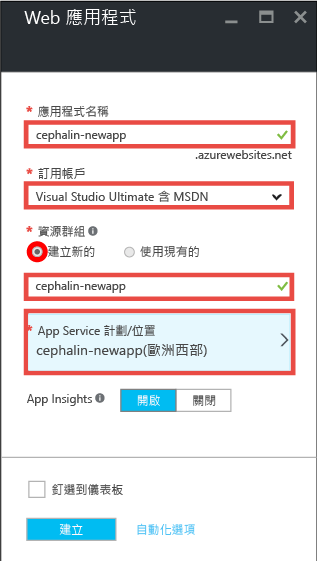
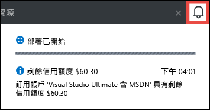
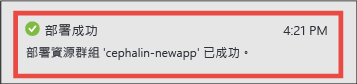
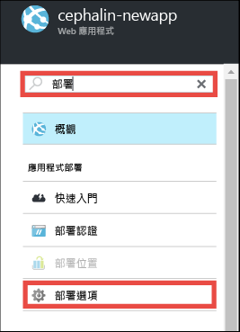
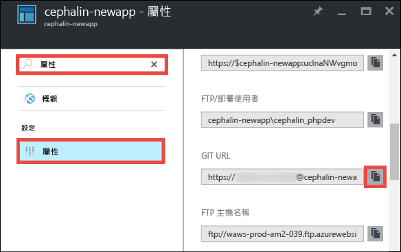
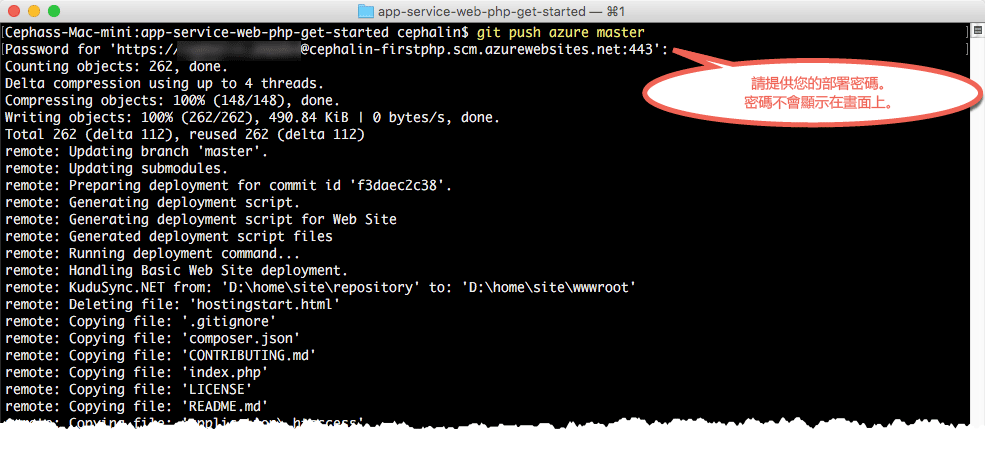

<properties 
	pageTitle="在 5 分鐘內，將您的第一個 PHP Web 應用程式部署到 Azure | Microsoft Azure" 
	description="藉由部署範例 App，了解在 App Service 中執行 Web 應用程式有多麼簡單。快速開始進行真正的開發，並立即查看結果。" 
	services="app-service\web"
	documentationCenter=""
	authors="cephalin"
	manager="wpickett"
	editor=""
/>

<tags
	ms.service="app-service-web"
	ms.workload="web"
	ms.tgt_pltfrm="na"
	ms.devlang="na"
	ms.topic="hero-article"
	ms.date="09/16/2016" 
	ms.author="cephalin"
/>
	
# 在 5 分鐘內，將您的第一個 PHP Web 應用程式部署到 Azure

本教學課程將協助您部署您的第一個 PHP Web 應用程式至 [Azure App Service](../app-service/app-service-value-prop-what-is.md)。您可以使用 App Service 來建立 Web 應用程式、[行動應用程式後端](/documentation/learning-paths/appservice-mobileapps/)和 [API 應用程式](../app-service-api/app-service-api-apps-why-best-platform.md)。

您將：

- 在 Azure App Service 中建立 Web 應用程式。
- 部署範例 PHP 程式碼。
- 看見您的程式碼在生產環境中即時執行。
- 以您[推送 Git 認可](https://git-scm.com/docs/git-push)的相同方式，更新 Web 應用程式。

## 必要條件

- [安裝 Git](http://www.git-scm.com/downloads)。從新的 Windows 命令提示字元、PowerShell 視窗、Linux 殼層或 OS X 終端機執行 `git --version`，確認您的安裝是否成功。
- 取得 Microsoft Azure 帳戶。如果您沒有帳戶，可以[申請免費試用](/pricing/free-trial/?WT.mc_id=A261C142F)，或是[啟用自己的 Visual Studio 訂閱者權益](/pricing/member-offers/msdn-benefits-details/?WT.mc_id=A261C142F)。

>[AZURE.NOTE] 您可以[試用 App Service](http://go.microsoft.com/fwlink/?LinkId=523751)，而不需要 Azure 帳戶。建立入門 App，並試用長達一小時。不需要信用卡，也不需簽定合約。

## 建立 Web 應用程式

1. 使用您的 Azure 帳戶登入 [Azure 入口網站](https://portal.azure.com)。

2. 按一下左側功能表的 [新增] > [Web + 行動] > [Web 應用程式]。

    

3. 在 App 建立刀鋒視窗中，針對您新的 App 使用下列設定：

    - **應用程式名稱**：輸入唯一的名稱。
    - **資源群組**：選取 [新建] 並指定資源群組名稱。
    - **App Service 方案/位置**：按一下以進行設定，然後按一下 [新建] 來設定 App Service 方案的名稱、位置與定價層。請放心地使用 [免費] 定價層。

    完成時，App 建立刀鋒視窗應該如下所示：

    

3. 按一下底部的 [建立]。您可以按一下頂端的通知圖示來查看進度。

    

4. 部署完成時，您應該會看到此通知訊息。按一下訊息可開啟部署的刀鋒視窗。

    

5. 在 [部署成功] 刀鋒視窗中，按一下 [資源] 連結以開啟新的 Web 應用程式刀鋒視窗。

    

## 將程式碼部署至 Web 應用程式

現在，我們使用 Git 來將程式碼部署到 Azure。

5. 在 Web 應用程式刀鋒視窗中，向下捲動至 [部署選項] 或搜尋「部署選項」，然後按一下它。

    

6. 按一下 [選擇來源] > [本機 Git 儲存機制] > [確定]。

7. 回到 Web 應用程式刀鋒視窗，按一下 [部署認證]。

8. 設定您的部署認證，然後按一下 [儲存]。

7. 回到 Web 應用程式刀鋒視窗，向下捲動至 [屬性] 或搜尋「屬性」，然後按一下它。按一下 [Git URL] 旁的 [複製] 按鈕。

    

    您現在可以開始使用 Git 部署程式碼。

1. 在命令列終端機中，變更至工作目錄 (`CD`)，並如下所示複製範例 App︰

        git clone https://github.com/Azure-Samples/app-service-web-php-get-started.git

    

    對於 &lt;github\_sample\_url>，使用下列其中一個 URL (視您所需的架構而定)：

2. 切換至範例 App 的儲存機制。例如，

        cd app-service-web-html-get-started

3. 針對您的 Azure App 設定 Git 遠端，其 Git URL 是您在前幾個步驟於入口網站中所複製。

        git remote add azure <giturlfromportal>

4. 將範例程式碼部署至 Azure App，如同使用 Git 推送任何程式碼一般︰

        git push azure master

    

    如果您已使用其中一個語言架構，則會看到不同的輸出。這是因為 `git push` 不僅會將程式碼放在 Azure 中，也會在部署引擎中觸發部署工作。如果您的專案 (儲存機制) 根目錄中有 package.json，部署指令碼會為您還原必要的套件。您也可以[啟用編輯器延伸模組](web-sites-php-mysql-deploy-use-git.md#composer)，以在 PHP 應用程式中自動處理 composer.json 檔案。

就這麼簡單！ 您的程式碼現在正在 Azure 中即時執行。在瀏覽器中，瀏覽至 http://*&lt;appname>*.azurewebsites.net 來查看其實際運作。

## 更新您的 App

您現在可以使用 Git 隨時從您的專案 (儲存機制) 根目錄進行推送，以更新即時網站。您可以使用第一次部署程式碼時的相同方式來執行這項作業。例如，每次您想要推送已在本機測試的新變更時，只需從專案 (儲存機制) 根目錄執行下列命令︰

    git add .
    git commit -m "<your_message>"
    git push azure master

## 後續步驟

[建立、設定及部署 Laravel Web 應用程式到 Azure](app-service-web-php-get-started.md)。遵循本教學課程，您將學習在 Azure 中執行任何 PHP Web 應用程式的基本技巧，例如：

- 從 PowerShell/Bash 在 Azure 中建立及設定 App。
- 設定 PHP 版本。
- 使用不在應用程式根目錄中的啟動檔案。
- 啟用 Commposer 自動化。
- 存取環境特有的變數。
- 針對常見錯誤進行疑難排解。

或者，進一步運用您的第一個 Web 應用程式。例如：

- 嘗試[將程式碼部署至 Azure 的其他方法](../app-service-web/web-sites-deploy.md)。例如，若要從您的其中一個 GitHub 儲存機制中部署，只需在 [部署選項] 中改為選取 [GitHub] 而不是 [本機 Git 儲存機制] 即可。
- 加強您 Azure App 的功能。驗證您的使用者。根據需求加以調整。設定一些效能警示。都只要點幾下滑鼠就能完成。請參閱[在您的第一個 Web 應用程式中新增功能](app-service-web-get-started-2.md)。

<!---HONumber=AcomDC_0920_2016-->