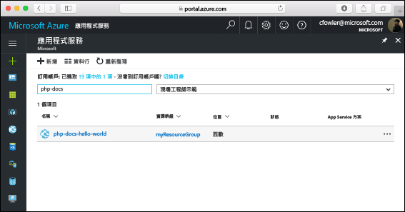

# <a name="create-a-php-web-app-in-azure"></a>在 Azure 中建立 PHP Web 應用程式

[Azure Web Apps](https://docs.microsoft.com/azure/app-service-web/app-service-web-overview) 提供可高度擴充、自我修復的 Web 主機服務。  本快速入門教學課程會顯示如何將 PHP 應用程式部署至 Azure Web Apps。 您可使用 [Azure CLI](https://docs.microsoft.com/cli/azure/get-started-with-azure-cli)建立 Web 應用程式，而且使用 Git 將範例 PHP 程式碼部署至 Web 應用程式。

![在 Azure 中執行的範例應用程式]](media/app-service-web-get-started-php/hello-world-in-browser.png)

您可以使用 Mac、Windows 或 Linux 電腦，依照下面步驟操作。 安裝先決條件後，大約需要 5 分鐘才能完成這些步驟。

## <a name="prerequisites"></a>必要條件

若要完成本快速入門：

* [安裝 Git](https://git-scm.com/)
* [安裝 PHP](https://php.net)

[!INCLUDE [quickstarts-free-trial-note](../../includes/quickstarts-free-trial-note.md)]

[!INCLUDE [cloud-shell-try-it.md](../../includes/cloud-shell-try-it.md)]

如果您選擇在本機安裝和使用 CLI，本主題會要求您執行 Azure CLI 2.0 版或更新版本。 執行 `az --version` 以尋找版本。 如果您需要安裝或升級，請參閱[安裝 Azure CLI 2.0]( /cli/azure/install-azure-cli)。 

## <a name="download-the-sample"></a>下載範例

在終端機視窗中執行下列命令，將範例應用程式存放庫複製到本機電腦。

```bash
git clone https://github.com/Azure-Samples/php-docs-hello-world
```

您可使用這個終端機視窗來執行本快速入門中的所有命令。

變更為包含範例程式碼的目錄。

```bash
cd php-docs-hello-world
```

## <a name="run-the-app-locally"></a>在本機執行應用程式

開啟終端機視窗並使用 `php` 命令來啟動內建 PHP Web 伺服器，以在本機執行應用程式。

```bash
php -S localhost:8080
```

開啟網頁瀏覽器，然後瀏覽至範例應用程式 (位於 http://localhost:8080 ) 。

您會看到來自範例應用程式的 **Hello World!** 訊息顯示在網頁中。


在終端機視窗中，按 **Ctrl+C** 結束 web 伺服器。

[!INCLUDE [Log in to Azure](../../includes/login-to-azure.md)] 

[!INCLUDE [Configure deployment user](../../includes/configure-deployment-user.md)] 

[!INCLUDE [Create resource group](../../includes/app-service-web-create-resource-group.md)] 

[!INCLUDE [Create app service plan](../../includes/app-service-web-create-app-service-plan.md)] 

[!INCLUDE [Create web app](../../includes/app-service-web-create-web-app.md)] 


您已在 Azure 中建立空的新 Web 應用程式。

[!INCLUDE [Configure local git](../../includes/app-service-web-configure-local-git.md)] 

[!INCLUDE [Push to Azure](../../includes/app-service-web-git-push-to-azure.md)] 

```bash
Counting objects: 2, done.
Delta compression using up to 4 threads.
Compressing objects: 100% (2/2), done.
Writing objects: 100% (2/2), 352 bytes | 0 bytes/s, done.
Total 2 (delta 1), reused 0 (delta 0)
remote: Updating branch 'master'.
remote: Updating submodules.
remote: Preparing deployment for commit id '25f18051e9'.
remote: Generating deployment script.
remote: Running deployment command...
remote: Handling Basic Web Site deployment.
remote: Kudu sync from: '/home/site/repository' to: '/home/site/wwwroot'
remote: Copying file: '.gitignore'
remote: Copying file: 'LICENSE'
remote: Copying file: 'README.md'
remote: Copying file: 'index.php'
remote: Ignoring: .git
remote: Finished successfully.
remote: Running post deployment command(s)...
remote: Deployment successful.
To https://<app_name>.scm.azurewebsites.net/<app_name>.git
   cc39b1e..25f1805  master -> master
```

## <a name="browse-to-the-app"></a>瀏覽至應用程式

使用 web 瀏覽器瀏覽至已部署的應用程式。

```bash
http://<app_name>.azurewebsites.net
```

PHP 範例程式碼正在 Azure App Service Web 應用程式中執行。


**恭喜！** 您已將第一個 PHP 應用程式部署至 App Service。

## <a name="update-and-redeploy-the-code"></a>更新和重新部署程式碼

使用本機文字編輯器，開啟 PHP 應用程式內的 `index.php` 檔案，並且對 `echo` 旁邊字串內的文字進行小幅變更：

```php
echo "Hello Azure!";
```

在 Git 中認可您的變更，然後將程式碼變更推送至 Azure。

```bash
git commit -am "updated output"
git push azure master
```

部署完成後，切換回在**瀏覽至應用程式**步驟中開啟的瀏覽器視窗，然後重新整理頁面。


## <a name="manage-your-new-azure-web-app"></a>管理新的 Azure Web 應用程式

請移至 <a href="https://portal.azure.com" target="_blank">Azure 入口網站</a>，以管理您所建立的 Web 應用程式。

按一下左側功能表中的 [應用程式服務]，然後按一下 Azure Web 應用程式的名稱。



您會看到 Web 應用程式的 [概觀] 頁面。 您可以在這裡執行基本管理工作，像是瀏覽、停止、啟動、重新啟動及刪除。 


左側功能表提供不同的頁面來設定您的應用程式。 

[!INCLUDE [cli-samples-clean-up](../../includes/cli-samples-clean-up.md)]

## <a name="next-steps"></a>後續步驟

> [!div class="nextstepaction"]
> [PHP with MySQL](app-service-web-tutorial-php-mysql.md)

