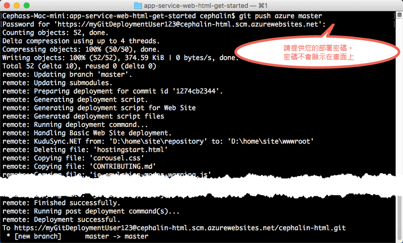
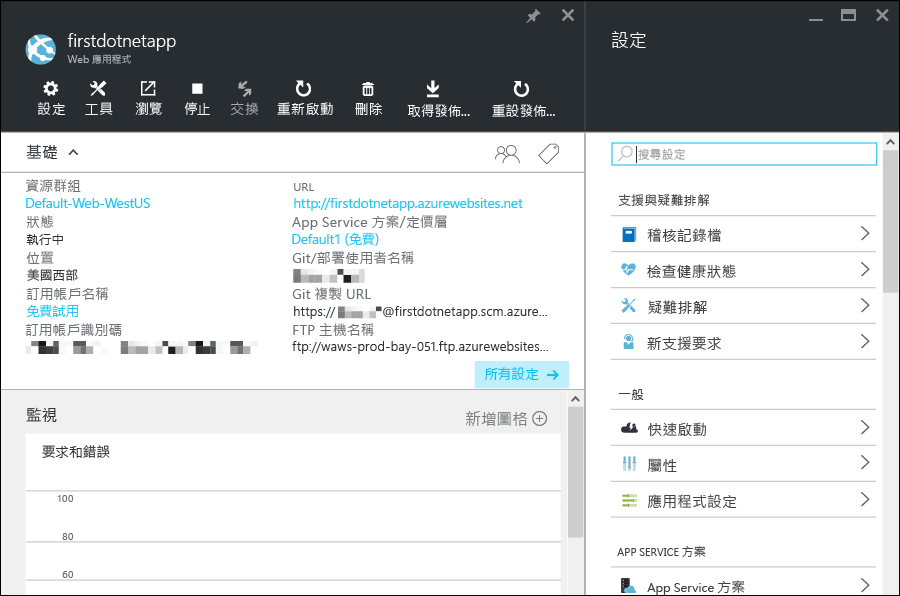

<properties
	pageTitle="在 5 分鐘內將第一個 Web 應用程式部署至 Azure 中 | Microsoft Azure"
	description="藉由只透過幾個步驟就部署好範例應用程式，了解在 App Service 中執行 Web 應用程式有多麼簡單。在 5 分鐘內開始進行真正的開發，並立即查看結果。"
	services="app-service\web"
	documentationCenter=""
	authors="cephalin"
	manager="wpickett"
	editor=""
/>

<tags
	ms.service="app-service-web"
	ms.workload="web"
	ms.tgt_pltfrm="na"
	ms.devlang="na"
	ms.topic="hero-article"
	ms.date="05/12/2016"
	ms.author="cephalin"
/>

# 在 5 分鐘內將第一個 Web 應用程式部署至 Azure 中

[AZURE.INCLUDE [索引標籤](../../includes/app-service-web-get-started-nav-tabs.md)]

本教學課程將協助您在 [Azure App Service](../app-service/app-service-value-prop-what-is.md) 中部署您的第一個 Web 應用程式。您可以使用 App Service 來建立 Web 應用程式、[行動應用程式後端](/documentation/learning-paths/appservice-mobileapps/)和 [API 應用程式](../app-service-api/app-service-api-apps-why-best-platform.md)。

您只需採取一些動作，就可以︰

- 部署範例 Web 應用程式 (在 ASP.NET、PHP、Node.js、Java 或 Python 之間選擇)。
- 在短短幾秒內看見您的應用程式即時執行。
- 以您推送 [Git](https://git-scm.com/docs/git-push) 認可的相同方式，更新 Web 應用程式。

您將第一次看到 [Azure 入口網站](https://portal.azure.com)並調查可用的功能。

## 必要條件

- [安裝 Git](http://www.git-scm.com/downloads)。
- [安裝 Azure CLI](../xplat-cli-install.md)。
- 取得 Microsoft Azure 帳戶。如果您沒有這類帳戶，可以[申請免費試用](/pricing/free-trial/?WT.mc_id=A261C142F)，或是[啟用自己的 Visual Studio 訂閱者權益](/pricing/member-offers/msdn-benefits-details/?WT.mc_id=A261C142F)。

>[AZURE.NOTE] 請看看作用中的 Web 應用程式。立即[試用 App Service](http://go.microsoft.com/fwlink/?LinkId=523751) 並建立短期的入門應用程式 -- 不需信用卡，不需任何承諾。

## 部署 Web 應用程式

將 Web 應用程式部署至 Azure App Service。

1. 開啟新的 Windows 命令提示字元、PowerShell 視窗、Linux Shell 或 OS X 終端機。執行 `git --version` 和 `azure --version`，確認電腦上已安裝 Git 和 Azure CLI。

    

    如果您尚未安裝工具，請參閱[必要條件](#Prerequisites)以取得下載連結。

1. 切換至工作目錄 (`CD`)，並如下所示複製範例應用程式︰

        git clone <github_sample_url>

    

    對於「&lt;github\_sample\_url>」，使用下列其中一個 URL (視您所需的架構而定)：

    - HTML+CSS+JS：[https://github.com/Azure-Samples/app-service-web-html-get-started.git](https://github.com/Azure-Samples/app-service-web-html-get-started.git)
    - ASP.NET：[https://github.com/Azure-Samples/app-service-web-dotnet-get-started.git](https://github.com/Azure-Samples/app-service-web-dotnet-get-started.git)
    - PHP (CodeIgniter)：[https://github.com/Azure-Samples/app-service-web-php-get-started.git](https://github.com/Azure-Samples/app-service-web-php-get-started.git)
    - Node.js (Express)：[https://github.com/Azure-Samples/app-service-web-nodejs-get-started.git](https://github.com/Azure-Samples/app-service-web-nodejs-get-started.git)
    - Java：[https://github.com/Azure-Samples/app-service-web-java-get-started.git](https://github.com/Azure-Samples/app-service-web-java-get-started.git)
    - Python (Django)：[https://github.com/Azure-Samples/app-service-web-python-get-started.git](https://github.com/Azure-Samples/app-service-web-python-get-started.git)

2. 切換至範例應用程式的儲存機制。例如：

        cd app-service-web-html-get-started

3. 如下所示，登入 Azure：

        azure login

    依照說明訊息進行來繼續登入程序。

    

4. 在 Azure 中使用下一個命令，建立具有唯一應用程式名稱的 App Service 應用程式資源。出現提示時，指定所需的區域數目。

        azure site create --git <app_name>

    

    >[AZURE.NOTE] 如果您從未設定 Azure 訂用帳戶的部署認證，系統將會提示您加以建立。App Service 只會將這些認證 (而不是您的 Azure 帳戶認證) 使用於 Git 部署與 FTP 登入。

    您的應用程式現在已建立於 Azure 中。此外，您目前的目錄也已進行 Git 初始化並連接到新的 App Service 應用程式而成為 Git 遠端。您可以瀏覽至應用程式 URL (http://&lt;app_name>.azurewebsites.net) 來查看美麗的預設 HTML 網頁，但您也可以立即實際取得自己的程式碼。

4. 將範例程式碼部署至新的 App Service 應用程式，如同使用 Git 推送任何程式碼一樣︰

        git push azure master

    

    如果您已使用其中一個語言架構，則會看到不同的輸出。這是因為 `git push` 不只將程式碼放在 Azure 中，也會在部署引擎中觸發部署工作。如果您的專案 (儲存機制) 根目錄中有任何 package.json (Node.js) 或 requirements.txt (Python) 檔案，或您的 ASP.NET 專案中有 packages.config 檔案，則部署指令碼會為您還原必要的封裝。您也可以[啟用編輯器延伸模組](web-sites-php-mysql-deploy-use-git.md#composer)，以在 PHP 應用程式中自動處理 composer.json 檔案。

恭喜，您的應用程式已部署至 Azure App Service。

## 看見您的應用程式即時執行

若要查看 Azure 中即時執行的應用程式，請從儲存機制中的任何目錄執行此命令︰

    azure site browse

## 更新您的應用程式

您現在可以使用 Git 隨時從您的專案 (儲存機制) 根目錄進行推送，以更新即時網站。您可以用第一次將應用程式部署至 Azure 時的相同方式來執行這項作業。例如，每次您想要推送已在本機測試的新變更時，從專案 (儲存機制) 根目錄執行下列命令︰

    git add .
    git commit -m "<your_message>"
    git push azure master

## 在 Azure 入口網站中查看您的應用程式

現在，讓我們前往 Azure 入口網站，查看您所建立的項目︰

1. 使用具有您的 Azure 訂用帳戶的 Microsoft 帳戶，登入 [Azure 入口網站](https://portal.azure.com)。

2. 在左列上，按一下 [應用程式服務]。

3. 按一下您剛建立的應用程式，以在入口網站中開啟其頁面 (稱為[刀鋒視窗](../azure-portal-overview.md))。[設定] 刀鋒視窗也已依預設開啟，方便您使用。

    

App Service 應用程式的入口網站刀鋒視窗會呈現一組豐富的設定和工具，協助您設定、監視和保護您的應用程式，以及排解應用程式的疑難問題。請花一點時間執行一些簡單的工作，讓自己熟悉此介面。(工作數目會對應至螢幕擷取畫面中的數字)。

1. 停止應用程式。
2. 重新啟動應用程式。
3. 按一下 [資源群組] 連結，以查看資源群組中部署的所有資源。
4. 按一下 [設定] > [屬性]，以查看有關您的應用程式的其他資訊。
5. 按一下 [工具] 以存取可供監視和進行疑難排解的實用工具。

## 後續步驟

- 提升您的 Azure 應用程式水準。使用驗證協助保護其安全。根據需求加以調整。設定一些效能警示。全部只要點選幾下滑鼠即可完成。請參閱[在您的第一個 Web 應用程式中新增功能](app-service-web-get-started-2.md)。
- 除了 Git 和 Azure CLI 之外，還有其他方法可在 Azure 中部署 Web 應用程式。請參閱[將您的應用程式部署至 Azure App Service](../app-service-web/web-sites-deploy.md)。請選取文章頂端的架構，為您的語言架構尋找慣用的開發和部署步驟。

<!---HONumber=AcomDC_0907_2016-->