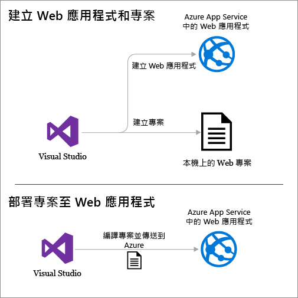
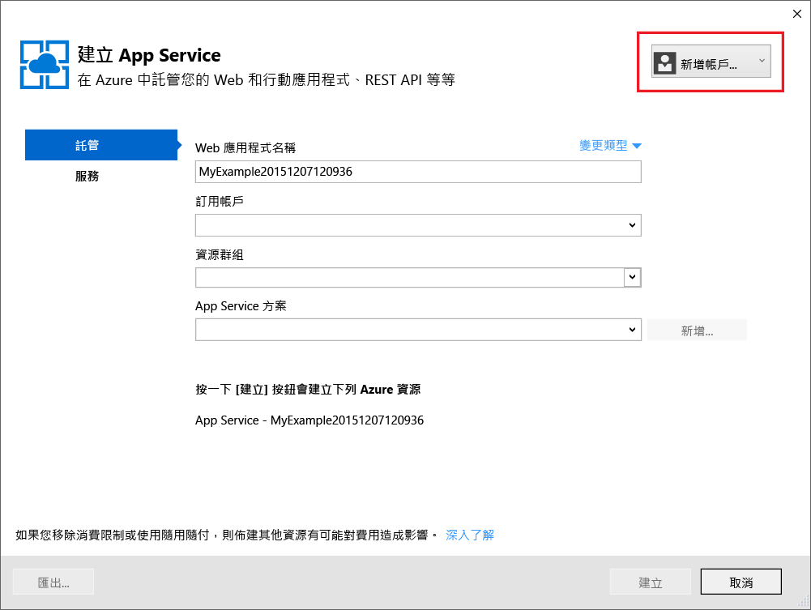
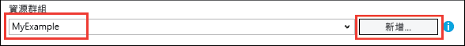
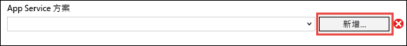

# 使用 Visual Studio 將 ASP.NET Web 應用程式部署至 Azure App Service
[!INCLUDE [tabs](../../includes/app-service-web-get-started-nav-tabs.md)]

## 概觀
本教學課程示範如何使用 Visual Studio 2015，將 ASP.NET Web 應用程式部署至 [Azure App Service 中的 Web 應用程式](app-service-web-overview.md) 。

本教學課程假設您是先前沒有 Azure 使用經驗的 ASP.NET 開發人員。 完成之後，您將有個簡單的 Web 應用程式已在雲端中啟動並執行。

您將了解：

* 如何在 Visual Studio 中建立新的 Web 專案時建立新的 App Service Web 應用程式。
* 如何使用 Visual Studio 將 Web 專案部署到 App Service Web 應用程式。

下圖說明您在本教學課程中執行的動作。

本教學課程最後的[疑難排解](#troubleshooting)一節會概述發生問題時的處理方式，而[後續步驟](#next-steps)一節則提供其他會更深入探討如何使用 Azure App Service 之教學課程的連結。

因為這是入門教學課程，所以 Web 專案會顯示部署是如何簡單的專案，其不會使用資料庫，也不會進行驗證或授權。 如需更多進階部署主題的連結，請參閱 [如何部署 Azure Web 應用程式](web-sites-deploy.md)。

除了安裝 Azure SDK for .NET 所需的時間，本教學課程需要大約 10-15 分鐘才能完成。

## 必要條件
* 本教學課程假設您已使用 ASP.NET MVC 和 Visual Studio。 如果您需要簡介，請參閱 [開始使用 ASP.NET MVC 5](http://www.asp.net/mvc/overview/getting-started/introduction/getting-started)。
* 您需要 Azure 帳戶。 您可以[申請免費 Azure 帳戶](https://azure.microsoft.com/pricing/free-trial/?WT.mc_id=A261C142F)或[啟用 Visual Studio 訂閱者權益](https://azure.microsoft.com/pricing/member-offers/msdn-benefits-details/?WT.mc_id=A261C142F)。 
  
    如果您想要在註冊 Azure 帳戶之前先開始使用 Azure App Service，請移至 [試用 App Service](http://go.microsoft.com/fwlink/?LinkId=523751)。 您可以於該處，在 App Service 中建立短期的入門應用程式 — 不需信用卡，不需任何承諾。

## 設定開發環境
本教學課程是特別為 Visual Studio 2015 (含 [Azure SDK for .NET](../dotnet-sdk.md) 2.9 或更新版本) 所撰寫。 

* [下載最新的 Azure SDK for Visual Studio 2015](http://go.microsoft.com/fwlink/?linkid=518003)。 如果還沒安裝 Visual Studio 2015，此 SDK 會加以安裝。
  
  > [!NOTE]
  > 視您的電腦上有多少 SDK 相依性而定，安裝 SDK 可能需要很長的時間 (從數分鐘到半小時以上不等)。
  > 
  > 

如果您有 Visual Studio 2013 而且想加以使用，您可以 [下載最新的 Azure SDK for Visual Studio 2013](http://go.microsoft.com/fwlink/?LinkID=324322)。 有些畫面看起來可能與插圖不同。

## 建立 Web 應用程式
下一個步驟是在 Visual Studio 和 Azure App Service 的 Web 應用程式中建立 Web 應用程式專案。 在教學課程的這一節中，您會設定新的 Web 專案。 

1. 開啟 Visual Studio 2015。
2. 按一下 [檔案] > [新增] > [專案]。
3. 在 [新增專案] 對話方塊中，依序按一下 [Visual C#] > [Web] > [ASP.NET Web 應用程式]。
4. 確定已選取 [.NET Framework 4.5.2]  來做為目標架構。
5. [Azure Application Insights](../application-insights/app-insights-overview.md) 會監視您 Web 應用程式的可用性、效能和使用情形。 在您安裝 Visual Studio 後第一次建立 Web 專案時，預設會勾選 [在專案中新增 Application Insights]  核取方塊。 如果您不想嘗試 Application Insights，但系統預設已勾選，請清除該核取方塊。
6. 將應用程式命名為 **MyExample**，然後按一下 [確定]。
   
    
7. 在 [新增 ASP.NET 專案] 對話方塊中，選取 [MVC] 範本，然後按一下 [變更驗證]。
   
    在本教學課程中，您可以部署 ASP.NET MVC Web 專案。 如果您想要了解如何部署 ASP.NET Web API 專案，請參閱 [後續步驟](#next-steps) 一節。 
   
    ![[新增 ASP.NET 專案] 對話方塊](./media/web-sites-dotnet-get-started/GS13changeauth.png)
8. 在 [變更驗證] 對話方塊中，按一下 [不需要驗證]，然後按一下 [確定]。
   
    
   
    在本快速入門教學課程中，您要部署不會進行使用者登入的簡單應用程式。
9. 在 [新建 ASP.NET 專案] 核取方塊中的 [Microsoft Azure] 區段，確認已選取 [在雲端託管]，並在下拉式清單中選取 [App Service]。
   
    ![[新增 ASP.NET 專案] 對話方塊](./media/web-sites-dotnet-get-started/GS13newaspnetprojdb.png)
   
    這些設定可指示 Visual Studio 為 Web 專案建立 Azure Web 應用程式。
10. 按一下 [確定] 

## 建立 Azure 資源
您現在告訴 Visual Studio 您想要建立的 Azure 資源。

1. 在 [建立 App Service] 對話方塊中，按一下 [新增帳戶]，然後以您用來管理 Azure 訂用帳戶的帳戶識別碼和密碼登入 Azure。
   
    
   
    如果您稍早已在同一部電腦上登入，您可能不會看到 [新增帳戶]  按鈕。 在此情況下，您可以略過此步驟，或可能需要重新輸入認證。
2. 輸入在 *azurewebsites.net* 網域中唯一的 [Web 應用程式名稱]。 例如，您可以將它命名為 MyExample 並於右邊加上數字，使其成為唯一的名稱，例如 MyExample810。 如果預設的 Web 名稱針對您所建立，則它將是唯一的，且您可以使用該名稱。
   
    如果有其他人使用了您輸入的名稱，您就會在右邊看到紅色驚嘆號，而不是綠色勾號，這代表您必須輸入不同的名稱。
   
    您應用程式的 URL 是這個名稱加上 .azurewebsites.net 。 例如，若名稱為 `MyExample810`，則 URL 是 `myexample810.azurewebsites.net`。
   
    您也可以使用自訂網域搭配 Azure Web 應用程式。 如需詳細資訊，請參閱 [在 Azure App Service 中設定自訂網域名稱](web-sites-custom-domain-name.md)。
3. 按一下 [資源群組] 方塊旁邊的 [新增] 按鈕，然後輸入 "MyExample" 或其他您偏好的名稱。 
   
    
   
    資源群組是 Azure 資源的集合，例如 Web 應用程式、資料庫和 VM。 在本教學課程中，最好建立新的資源群組，因為這麼做即可在一個步驟中輕鬆刪除您為本教學課程建立的所有 Azure 資源。 如需詳細資訊，請參閱 [Azure Resource Manager 概觀](../azure-resource-manager/resource-group-overview.md)。
4. 按一下 [App Service 方案] 下拉式清單旁邊的 [新增] 按鈕。
   
    
   
    [設定 App Service 方案]  對話方塊隨即出現。
   
    
   
    在下列步驟中，您會為新的資源群組設定 App Service 方案。 App Service 方案會指定 Web 應用程式執行所在的計算資源。 例如，如果您選擇免費層，則 API 應用程式會在共用 VM 上執行，若為某些付費層，它則會在專用 VM 上執行。 如需詳細資訊，請參閱 [App Service 方案概觀](../app-service/azure-web-sites-web-hosting-plans-in-depth-overview.md)。
5. 在 [設定 App Service 方案]  對話方塊中，輸入 "MyExamplePlan" 或其他您偏好的名稱。
6. 在 [位置]  下拉式清單中，選擇最接近您的位置。
   
    這個設定會指定應用程式將執行所在的 Azure 資料中心。 您可以在本教學課程中選取任何區域，這不會造成顯著的差異。 但是對於生產用的應用程式，您的伺服器應盡可能靠近存取該應用程式的用戶端，以將 [延遲](http://www.bing.com/search?q=web%20latency%20introduction&qs=n&form=QBRE&pq=web%20latency%20introduction&sc=1-24&sp=-1&sk=&cvid=eefff99dfc864d25a75a83740f1e0090)降到最低。
7. 在 [大小] 下拉式清單中，按一下 [免費]。
   
    在本教學課程中，免費定價層會提供夠好的效能。
8. 在 [設定 App Service 方案] 對話方塊中，按一下 [確定]。
9. 在 [建立 App Service] 對話方塊中，按一下 [建立]。

## 檢查 Visual Studio 中的 Azure 資源
通常在不到一分鐘的時間內，Visual Studio 就會建立 Web 專案和 Web 應用程式。  

[方案總管]  視窗會顯示新專案中的檔案和資料夾。

[Azure App Service 活動] 視窗會顯示已在 API 中建立 Azure App Service。 您可以按一下這裡的連結，立即開始發佈新的專案。 不過，本教學課程稍後會示範如何隨時發佈您的檔案。

![在 [Azure App Service 活動] 視窗中建立的 Web 應用程式](./media/web-sites-dotnet-get-started/GS13sitecreated1.png)

[雲端總管]  視窗可讓您檢視和管理 Azure 資源，包括您剛建立的新 web 應用程式。

![在 [雲端總管] 中建立的 Web 應用程式](./media/web-sites-dotnet-get-started/siteinse.png)

## 將 Web 專案部署至 Azure
在本節中，您會將 Web 專案部署至您在 Azure App Service中建立的 Web 應用程式資源。

1. 在 [方案總管] 中以滑鼠右鍵按一下專案，再選擇 [發佈]。
   
    ![在 Visual Studio 功能表中選擇 [發佈]](./media/web-sites-dotnet-get-started/choosepublish.png)
   
    [發佈 Web]  精靈會在幾秒鐘後出現。 此精靈會開啟某個 *發佈設定檔* ，其中包含能將 Web 專案部署到新 Web 應用程式的設定。
   
    > [!TIP] 
    > 發佈設定檔包含用於部署的使用者名稱和密碼。  這些認證已事先為您產生，因此您不需要加以輸入。 密碼會加密並存放在 `Properties\PublishProfiles` 資料夾的使用者專屬隱藏檔案中。
    >
    >
2. 在 [發佈 Web] 精靈的 [連線] 索引標籤中，按 [下一步]。
   
    ![在 [發佈 Web] 精靈的 [連線] 索引標籤中按 [下一步]](./media/web-sites-dotnet-get-started/GS13ValidateConnection.png)
   
    按一下 [設定]  索引標籤。 您可以在此變更組建組態，以部署用於 [遠端偵錯](web-sites-dotnet-troubleshoot-visual-studio.md#remotedebug)的偵錯組建。 此索引標籤也會提供數個 [檔案發佈選項](https://msdn.microsoft.com/library/dd465337.aspx#Anchor_2)。
3. 在 [設定] 索引標籤上，按 [下一步]。
   
   ![[發佈 Web] 精靈的 [設定] 索引標籤](./media/web-sites-dotnet-get-started/GS13SettingsTab.png)
   
   接下來按一下 [預覽]  索引標籤。 您可以查看即將從您的專案複製到 API 應用程式的檔案。 當您將專案部署至您先前已部署至的 API 應用程式時，只會複製已變更的檔案。 如果您想要查看即將複製的項目清單，可以按一下 [開始預覽]  按鈕。
4. 在 [預覽] 索引標籤上，按一下 [發佈]。
   
   ![[發佈 Web] 精靈的 [預覽] 索引標籤](./media/web-sites-dotnet-get-started/GS13previewoutput.png)
   
   當您按一下 [發佈] 時，Visual Studio 就會開始將檔案複製至 Azure 伺服器。 這可能需要數分鐘的時間。
   
   [輸出] 與 [Azure App Service 活動] 視窗會顯示已採取的部署動作，並回報部署作業已順利完成。
   
   ![報告部署成功的 Visual Studio [輸出] 視窗](./media/web-sites-dotnet-get-started/PublishOutput.png)
   
   部署成功時，即會自動在預設瀏覽器中開啟已部署之 Web 應用程式的 URL，而您建立的應用程式現在正在雲端中執行。 瀏覽器網址列中的 URL 會顯示 Web 應用程式是從網際網路載入。
   
   
   
   > [!TIP]
   > 您可以啟用 [Web 單鍵發佈] 工具列來加快部署速度。 按一下 [檢視] > [工具列]，然後選取 [Web 單鍵發佈]。 您可以使用工具列來選取設定檔、按一下按鈕來發佈，或按一下按鈕來開啟 [發佈 Web] 精靈。
   > 
   > 
   > 

## 疑難排解
如果您在進行本教學課程時遇到問題，請確定您使用的是最新版 Azure SDK for .NET。 若要這麼做，最簡單的方式是 [下載 Azure SDK for Visual Studio 2015](http://go.microsoft.com/fwlink/?linkid=518003)。 如果您已安裝最新版本，Web Platform Installer 會指出不需要進行安裝。

如果您位於公司網路內，並嘗試透過防火牆部署至 Azure App Service，請確定連接埠 443 和 8172 已針對 Web Deploy 開啟。 如果您無法開啟這些連接埠，請參閱下面的＜後續步驟＞一節以了解其他部署選項。

在 Azure App Service 中執行 ASP .NET Web 應用程式之後，您可能會想要深入了解可簡化疑難排解步驟的 Visual Studio 功能。 如需記錄和遠端偵錯等功能的相關資訊，請參閱[在 Visual Studio 中針對 Azure Web 應用程式進行疑難排解](web-sites-dotnet-troubleshoot-visual-studio.md)。

## 後續步驟
在本教學課程中，您已了解如何建立簡易的 Web 應用程式，並將其部署至 Azure Web 應用程式。 以下是有助於您深入了解 Azure App Service 的一些相關主題和資源。

* 在 [Azure 入口網站](https://portal.azure.com/)中監控及管理 Web 應用程式。 
  
    如需詳細資訊，請參閱 [Azure 入口網站概觀](/services/management-portal/)和[在 Azure App Service 中設定 Web 應用程式](web-sites-configure.md)。
* 使用 Visual Studio 將現有 Web 專案部署至新的 Web 應用程式
  
    在 [方案總管] 中以滑鼠右鍵按一下專案，然後按一下 [發佈]。 選擇 [Microsoft Azure App Service] 做為發佈目標，然後按一下 [新增]。 而對話方塊與您在本教學課程中所見的相同。
* 從原始檔控制部署 Web 專案
  
    如需了解從[原始檔控制系統](http://www.asp.net/aspnet/overview/developing-apps-with-windows-azure/building-real-world-cloud-apps-with-windows-azure/source-control)來[自動化部署](http://www.asp.net/aspnet/overview/developing-apps-with-windows-azure/building-real-world-cloud-apps-with-windows-azure/continuous-integration-and-continuous-delivery)，請參閱[在 Azure App Service 中開始使用 Web 應用程式](app-service-web-get-started.md)和[如何部署 Azure Web 應用程式](web-sites-deploy.md)。
* 在 Azure App Service 中將 ASP.NET Web API 部署至 API 應用程式
  
    您已了解如何建立主要目的為託管網站的 Azure App Service 執行個體。 App Service 也會提供裝載 Web API 的功能，例如用戶端程式碼產生的 CORS 支援與 API 中繼資料支援。 您可以在 Web 應用程式中使用 API 功能，但如果您主要想在 App Service 的執行個體中裝載 API，[API 應用程式]  會是比較好的選擇。 如需詳細資訊，請參閱 [在 Azure App Service 中開始使用 API Apps 和 ASP.NET](../app-service-api/app-service-api-dotnet-get-started.md)。 
* 新增自訂網域名稱和 SSL
  
    如需如何使用 SSL 和您自己的網域 (例如 www.contoso.com，而非 contoso.azurewebsites.net) 的相關資訊，請參閱下列資源：
  
  * [在 Azure App Service 中設定自訂網域名稱](web-sites-custom-domain-name.md)
  * [對 Azure 網站啟用 HTTPS](web-sites-configure-ssl-certificate.md)
* 當您不再使用 Web 應用程式及任何相關 Azure 資源時，請刪除包含這些資源的資源群組。
  
    如需有關如何在 Azure 入口網站使用資源群組的資訊，請參閱 [使用 Resource Manager 範本與 Azure 入口網站來部署資源](../azure-resource-manager/resource-group-template-deploy-portal.md)。   
* 如需在 App Service 中建立 ASP.NET Web 應用程式的範例，請參閱 [HealthClinic.biz 2015](https://github.com/Microsoft/HealthClinic.biz) Connect [示範](https://blogs.msdn.microsoft.com/visualstudio/2015/12/08/connectdemos-2015-healthclinic-biz/)中的[在 Azure App Service 中建立和部署 ASP.NET Web 應用程式](https://github.com/Microsoft/HealthClinic.biz/wiki/Create-and-deploy-an-ASP.NET-web-app-in-Azure-App-Service)和[在 Azure App Service 中建立和部署行動應用程式](https://github.com/Microsoft/HealthClinic.biz/wiki/Create-and-deploy-a-mobile-app-in-Azure-App-Service)。 如需來自 HealthClinic.biz 示範的更多快速入門，請參閱 [Azure 開發人員工具快速入門](https://github.com/Microsoft/HealthClinic.biz/wiki/Azure-Developer-Tools-Quickstarts)。

<!--HONumber=Dec16_HO3-->

