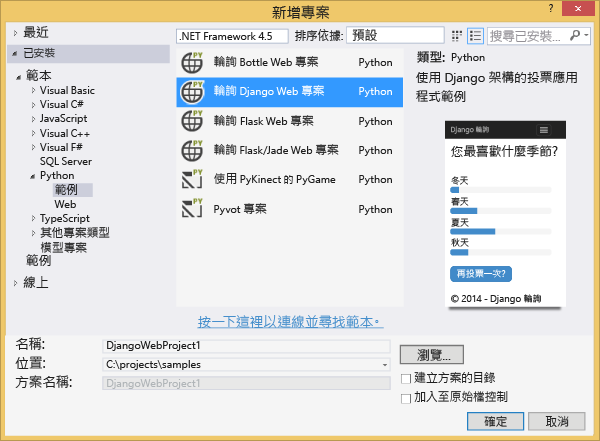
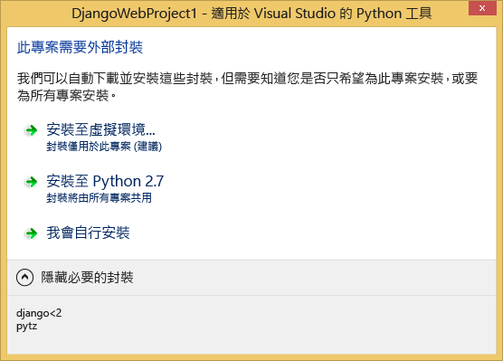
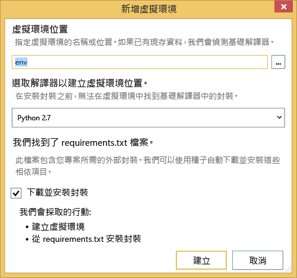
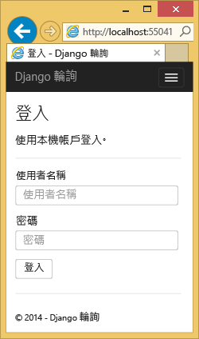
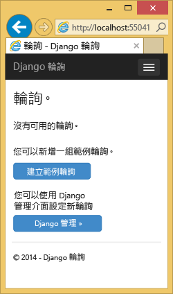
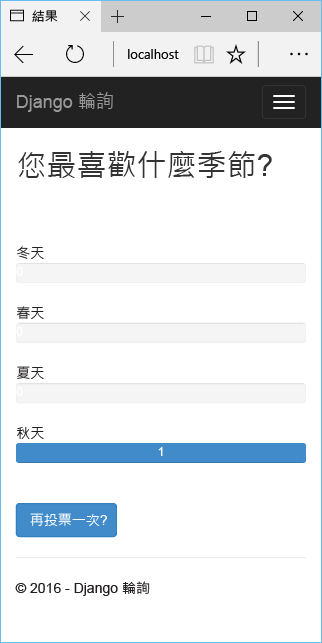
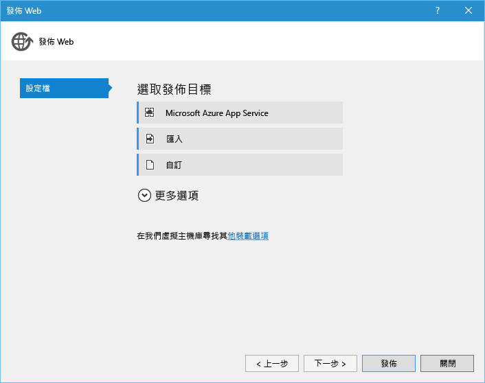
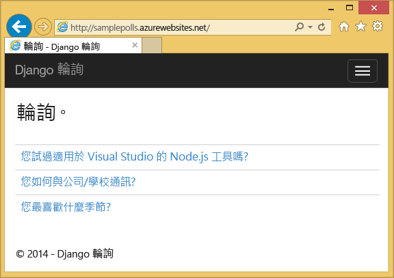

# Azure 上使用 Python Tools 2.2 for Visual Studio 的 Django 和 MySQL
[!INCLUDE [tabs](../../includes/app-service-web-get-started-nav-tabs.md)]

在此教學課程中，您將使用 [Python Tools for Visual Studio](https://www.visualstudio.com/vs/python)，並使用其中一個 PTVS 範例範本來建立簡單的民調 Web 應用程式。 您將學習如何使用在 Azure 上裝載的 MySQL 服務、如何設定 Web 應用程式使用 MySQL，以及如何將 Web 應用程式發佈至 [Azure App Service Web Apps](http://go.microsoft.com/fwlink/?LinkId=529714)。

> [!NOTE]
> 本教學課程中所包含的資訊也可在下列影片中取得︰
> 
> [PTVS 2.1：Django 應用程式與 MySQL][影片]
> 
> 

如需更多相關文章 (說明透過使用 Bottle、Flask 和 Django 架構的 PTVS、透過 Azure 資料表儲存體、MySQL 和 SQL Database 服務進行 Azure App Service Web Apps 開發)，請參閱 [Python 開發人員中心] 。 雖然本文著重於 App Service，但其開發步驟類似於開發 [Azure 雲端服務]。

## 必要條件
* Visual Studio 2015
* [Python 2.7 32 位元]或 [Python 3.4 32 位元]
* [Python Tools 2.2 for Visual Studio]
* [Python Tools 2.2 for Visual Studio 範例 VSIX]
* [Azure SDK Tools for VS 2015]
* Django 1.9 或更新版本

[!INCLUDE [create-account-and-websites-note](../../includes/create-account-and-websites-note.md)]

<!-- This note should not render as part of the the previous include. -->

> [!NOTE]
> 如果您想在註冊 Azure 帳戶前開始使用 Azure App Service，請移至 [試用 App Service](http://go.microsoft.com/fwlink/?LinkId=523751)，即可在 App Service 中立即建立短期入門 Web 應用程式。 不需要信用卡，無需承諾。
> 
> 

## 建立專案
在這一節中，您將使用範例範本建立 Visual Studio 專案。 您將建立虛擬環境並安裝必要的套件。 您將使用 sqlite 建立本機資料庫。 然後會在本機執行此應用程式。

1. 在 Visual Studio 中，選取 [檔案]、[新增專案]。
2. 在 [Python]、[範例] 之下可取得 [Python Tools 2.2 for Visual Studio 範例 VSIX] 中的專案範本。 選取 [Polls Django Web Project]  ，然後按一下 [確定] 以建立專案。
   
    
3. 系統會提示您安裝外部套件。 選取 [安裝到虛擬環境] 。
   
    
4. 選取 [Python 2.7] 或 [Python 3.4] 作為基礎解譯器。
   
    
5. 在 [方案總管] 中，以滑鼠右鍵按一下專案節點並選取 [Python]，然後選取 [Django 移轉]。  然後選取 [Django 建立超級使用者] 。
6. 這樣會開啟 Django 管理主控台，並在專案資料夾中建立 sqlite 資料庫。 依照提示建立使用者。
7. 按 `F5`確認應用程式可運作。
8. 按一下頂端導覽列中的 [登入]  。
   
    
9. 為您在同步處理資料庫時建立的使用者輸入認證。
   
    
10. 按一下 [Create Sample Polls] 。
    
     
11. 按一下民調並進行投票。
    
     

## 建立 MySQL Database
對於資料庫，您將在 Azure 上建立 ClearDB MySQL 主控的資料庫。

或者，您可以為自己建立在 Azure 中執行的虛擬機器，然後自行安裝和管理 MySQL。

您可以依照下列步驟，透過免費計畫建立資料庫。

1. 登入 [Azure 入口網站]。
2. 在導覽窗格的頂端，依序按一下 [新增]、[資料 + 儲存體] 和 [MySQL 資料庫]。
3. 設定新的 MySQL 資料庫，做法是建立新的資源群組，然後為其選取一個適當的位置。
4. 建立 MySQL 資料庫後，請按一下資料庫刀鋒視窗中的 [屬性]  。
5. 使用 [複製] 按鈕將 **CONNECTION STRING** 的值複製到剪貼簿上。

## 設定專案
在這一節中，您會將 Web 應用程式設定為使用剛才建立的 MySQL 資料庫。 您也將安裝搭配使用 MySQL 資料庫與 Django 所需的其他 Python 套件。 接著，在本機執行 Web 應用程式。

1. 在 Visual Studio 中，從 **ProjectName**資料夾開啟 *settings.py* 。 暫時在編輯器中貼上連接字串。 連接字串的格式如下：
   
        Database=<NAME>;Data Source=<HOST>;User Id=<USER>;Password=<PASSWORD>
   
    變更預設資料庫 **ENGINE** 以使用 MySQL，並設定 **CONNECTIONSTRING** 中 **NAME**、**USER**、**PASSWORD** 和 **HOST** 的值。
   
        DATABASES = {
            'default': {
                'ENGINE': 'django.db.backends.mysql',
                'NAME': '<Database>',
                'USER': '<User Id>',
                'PASSWORD': '<Password>',
                'HOST': '<Data Source>',
                'PORT': '',
            }
        }
2. 在 [方案總管] 的 [Python 環境] 之下，在虛擬環境上按一下滑鼠右鍵並選取 [安裝 Python 封裝]。
3. 使用 **pip** 安裝 `mysqlclient` 封裝。
   
    
4. 在 [方案總管] 中，以滑鼠右鍵按一下專案節點並選取 [Python]，然後選取 [Django 移轉]。  然後選取 [Django 建立超級使用者] 。
   
    此舉會為您在上一節中建立的 MySQL 資料庫建立資料表。 依照提示建立使用者，該使用者不需符合在本文第一節中建立之 sqlite 資料庫中的使用者。
5. 使用 `F5`執行應用程式。 使用 [Create Sample Polls]  建立的民調以及投票所提交的資料將會在 MySQL 資料庫中序列化。

## 將 Web 應用程式發佈至 Azure App Service
Azure .NET SDK 提供簡單的方法將 Web 應用程式部署至 Azure App Service。

1. 在 [方案總管] 中，以滑鼠右鍵按一下專案節點並選取 [發佈]。
   
    
2. 按一下 [Microsoft Azure App Service] 。
3. 按一下 [新增]  以建立新的 Web 應用程式。
4. 填寫下列欄位，然後按一下 [建立] ：
   
   * **Web 應用程式名稱**
   * **App Service 計劃**
   * **資源群組**
   * **區域**
   * 讓「資料庫伺服器」維持設定為「沒有資料庫」
5. 接受所有其他預設值並按一下 [發佈] 。
6. 您的 Web 瀏覽器將會自動開啟到已發佈的 Web 應用程式。 您應該會看到 Web 應用程式如預期般運作，並使用 Azure 上裝載的 **MySQL** 資料庫。
   
    
   
    恭喜！ 您已成功將以 MySQL 為基礎的 Web 應用程式發佈至 Azure。

## 後續步驟
請遵循下列連結以深入了解 Python Tools for Visual Studio、Django 和 MySQL。

* [Python Tools for Visual Studio 說明文件]
  * [Web 專案]
  * [雲端服務專案]
  * [在 Microsoft Azure 上進行遠端偵錯]
* [Django 說明文件]
* [MySQL]

如需詳細資訊，請參閱 [Python 開發人員中心](/develop/python/)。

<!--Link references-->

[Python 開發人員中心]: /develop/python/
[Azure 雲端服務]: ../cloud-services/cloud-services-python-ptvs.md

<!--External Link references-->

[Azure 入口網站]: https://portal.azure.com
[Python Tools for Visual Studio]: https://www.visualstudio.com/vs/python/
[Python Tools 2.2 for Visual Studio]: http://go.microsoft.com/fwlink/?LinkID=624025
[Python Tools 2.2 for Visual Studio 範例 VSIX]: http://go.microsoft.com/fwlink/?LinkID=624025
[Azure SDK Tools for VS 2015]: http://go.microsoft.com/fwlink/?LinkId=518003
[Python 2.7 32 位元]: http://go.microsoft.com/fwlink/?LinkId=517190
[Python 3.4 32 位元]: http://go.microsoft.com/fwlink/?LinkId=517191
[Python Tools for Visual Studio 說明文件]: http://aka.ms/ptvsdocs
[在 Microsoft Azure 上進行遠端偵錯]: http://go.microsoft.com/fwlink/?LinkId=624026
[Web 專案]: http://go.microsoft.com/fwlink/?LinkId=624027
[雲端服務專案]: http://go.microsoft.com/fwlink/?LinkId=624028
[Django 說明文件]: https://www.djangoproject.com/
[MySQL]: http://www.mysql.com/
[影片]: http://youtu.be/oKCApIrS0Lo

<!--HONumber=Nov16_HO2-->

