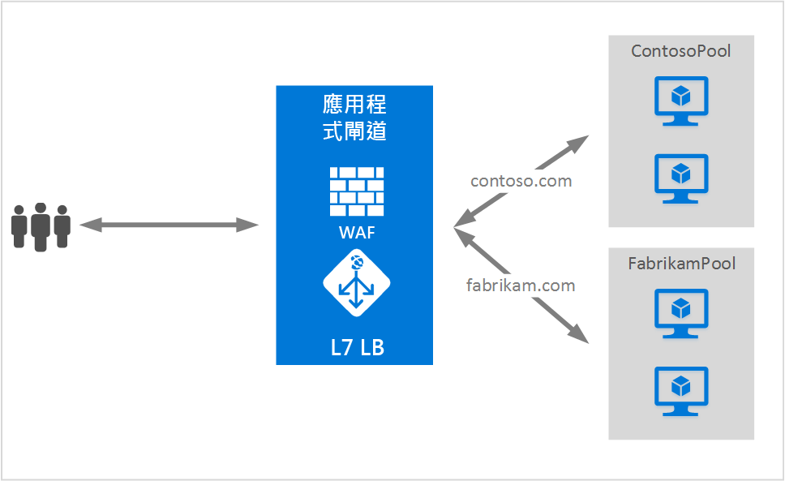

# 在應用程式閘道上啟用 SSL 原則和端對端 SSL
## Overview
應用程式閘道支援在閘道上終止 SSL，之後流量通常會以未加密狀態流至後端伺服器。 這可讓 Web 伺服器不必再負擔昂貴的加密/解密成本。 但對某些客戶來說，對後端伺服器進行未加密的通訊並非可接受的選項。 原因可能是有安全性/法務遵循方面的需求，或應用程式可能只接受安全連線。 對於這類應用程式，應用程式閘道現在可支援端對端 SSL 加密。

端對端 SSL 可讓您將機密資料以加密方式安全地傳輸到後端，同時又可利用應用程式閘道提供的第 7 層負載平衡功能的好處，例如 Cookie 同質性、URL 型路由、支援根據網站來進行路由，或能夠插入 X-Forwarded-* 標頭。

當設定為端對端 SSL 通訊模式時，應用程式閘道會在閘道上終止使用者的 SSL 工作階段，並解密使用者流量。 然後，它會套用所設定的規則來選取要將流量路由傳送到的適當後端集區執行個體。 應用程式閘道接著再起始連往後端伺服器的新 SSL 連線，並先使用後端伺服器的公開金鑰憑證重新加密資料，再將要求傳輸至後端。 若要啟用端對端 SSL，請將 BackendHTTPSetting 中的通訊協定設為 Https，接著再套用到後端集區。 已啟用端對端 SSL 之後端集區中的每個後端伺服器，都必須設有憑證以便能夠進行安全通訊。

在此範例中，https://contoso.com 的要求可以透過 HTTP 路由傳送至 ContosoServerPool，而 https://fabrikam.com 則會使用端對端 SSL 透過 HTTPS 路由傳送至 FabrikamServerPool。

## 端對端 SSL 和憑證白名單
應用程式閘道只會與已知的後端執行個體通訊，後者已將其憑證加入到應用程式閘道的白名單。 若要啟用憑證白名單，您必須將後端伺服器憑證的公開金鑰上傳至應用程式閘道。 之後便只有連往已加入白名單之已知後端的連線會受到允許，其餘連線則會導致閘道錯誤。 自我簽署憑證僅供測試之用，並不建議用於生產工作負載。 這類憑證也必須如上所述加入到應用程式閘道的白名單之中，然後才可供使用。

## 應用程式閘道 SSL 原則
應用程式閘道也支援使用者可設定的 SSL 交涉原則，這可讓客戶更加精細地控制應用程式閘道上的 SSL 連線。

1. 所有應用程式閘道都會強制停用 SSL 2.0 和 3.0。 您無法對其進行任何設定。
2. SSL 原則定義可讓您選擇停用下列 3 個通訊協定中的任一個：TLSv1_0、TLSv1_1、TLSv1_2。
3. 如果未定義任何 SSL 原則，則這三個 (TLSv1_0、TLSv1_1、TLSv1_2) 皆會啟用。

## 後續步驟
了解端對端 SSL 和 SSL 原則後，請移至 [在應用程式閘道上啟用端對端 SSL](application-gateway-end-to-end-ssl-powershell.md) ，以建立能夠將流量以加密形式傳送到後端的應用程式閘道。

<!--HONumber=Oct16_HO2-->

