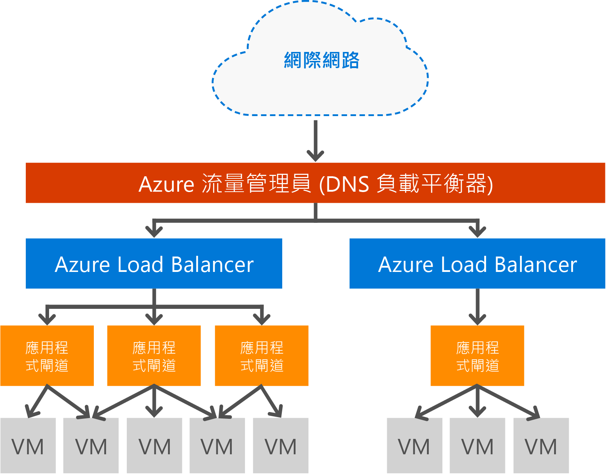

# 應用程式閘道的概觀

Microsoft Azure 應用程式閘道是專用的虛擬設備，會以服務形式提供應用程式傳遞控制器 (ADC)，為您的應用程式提供各種第 7 層負載平衡功能。 它會將 CPU 密集 SSL 終止卸載至應用程式閘道，讓客戶最佳化 Web 伺服陣列的產能。 它也提供其他第 7 層路由功能，包括循環配置連入流量、以 Cookie 為基礎的工作階段同質、URL 路徑型路由，以及在單一應用程式閘道背後代管多個網站的能力。 Web 應用程式防火牆 (WAF) 也會在應用程式閘道 WAF SKU 中提供，它會保護 Web 應用程式免於遭遇常見的 Web 弱點和攻擊。 應用程式閘道可以設定為面向網際網路的閘道、內部專用閘道或兩者混合。 

## 特性

應用程式閘道目前提供下列功能：

* **[Web 應用程式防火牆](application-gateway-webapplicationfirewall-overview.md)** - Azure 應用程式閘道中的 Web 應用程式防火牆 (WAF) 可保護 Web 應用程式，不致遭受常見的 Web 型攻擊，例如 SQL 插入式攻擊、跨網站指令碼攻擊和工作階段攔截。
* **HTTP 負載平衡** - 應用程式閘道提供循環配置資源負載平衡。 負載平衡會在第 7 層進行，而且只會用於 HTTP(S) 流量。
* **以 Cookie 為基礎的工作階段同質性** - 當您想要在同一個後端保留使用者工作階段時，此功能非常有用。 使用受閘道管理的 Cookie，應用程式閘道即可將來自使用者工作階段的後續流量導向至同一個後端進行處理。 當使用者工作階段的工作階段狀態是儲存在後端伺服器本機上時，這項功能很重要。
* **[安全通訊端層 (SSL) 卸載](application-gateway-ssl-arm.md)** - 這項功能讓您的 Web 伺服器免除將 HTTPS 流量解密的高成本工作。 在應用程式閘道終止 SSL 連線並將要求轉送到未加密的伺服器，Web 伺服器便不需承擔解密。  應用程式閘道會將回應重新加密，再將它傳送回用戶端。 在後端位於與 Azure 中的應用程式閘道相同的安全虛擬網路的情況下，這項功能很有用。
* **[端對端 SSL](application-gateway-backend-ssl.md)** - 應用程式閘道支援為流量進行端對端加密。 應用程式閘道用來進行此作業的方法是，在應用程式閘道終止 SSL 連線。 閘道接著會對流量套用路由規則、重新加密封包，並根據所定義的路由規則將封包轉送至適當的後端。 任何來自 Web 伺服器的回應都會經歷相同的程序而回到使用者端。
* **[以 URL 為基礎的內容路由](application-gateway-url-route-overview.md)** - 這項功能能夠使用不同的後端伺服器來處理不同的流量。 不論是 Web 伺服器上的資料夾，或是 CDN，流量可路由傳送至不同的後端，讓不處理特定內容的後端得以減少不必要的負載。
* **[多網站路由](application-gateway-multi-site-overview.md)** - 應用程式閘道可讓您在單一應用程式閘道上最多合併 20 個網站。
* **[Websocket 支援](application-gateway-websocket.md)** - 應用程式閘道的另一個絕佳功能就是 Websocket 的原生支援。
* **[狀況監視](application-gateway-probe-overview.md)** -應用程式閘道提供預設的後端資源狀況監視，以及用來監視較特定案例的自訂探查。
* **[要求重新導向](application-gateway-redirect-overview.md)** -這項功能可讓您將 HTTP 要求重新導向至 HTTPS 接聽程式。
* **[進階診斷](application-gateway-diagnostics.md)** - 應用程式閘道提供完整的診斷和存取記錄檔。 防火牆記錄檔可供已啟用 WAF 的應用程式閘道資源使用。

## 優點

應用程式閘道對於下列項目很實用：

* 需要要求來自相同使用者/用戶端工作階段，才能到達相同後端虛擬機器的應用程式。 這些應用程式的範例包括購物車應用程式和網頁郵件伺服器。
* 移除 Web 伺服器陣列的 SSL 終止負荷。
* 在同一個長時間執行的 TCP 連線上必須要有多個 HTTP 要求才能路由傳送至或負載平衡至不同後端伺服器的應用程式 (例如內容傳遞網路)。
* 支援 Websocket 流量的應用程式
* 保護 Web 應用程式不致遭受常見的 Web 型攻擊，例如 SQL 插入式攻擊、跨網站指令碼攻擊和工作階段攔截。
* 以不同路由準則 (例如 url 路徑或網域標頭) 為基礎的邏輯流量分配。

應用程式閘道完全由 Azure 管理、可調整且可用性極高。 它提供一組豐富的診斷和記錄功能，很好管理。 當您建立應用程式閘道時，將會有一個端點 (公用 VIP 或內部 ILB IP) 形成關聯，並用於輸入網路流量。 此 VIP 或 ILB IP 由 Azure Load Balancer 提供，此負載平衡器在傳輸層級 (TCP/UDP) 運作，並將所有連入的網路流量平均分散到應用程式閘道背景工作角色執行個體。 接著，應用程式閘道會根據其組態 (無論是虛擬機器、雲端服務、內部或外部 IP 位址) 路由傳送 HTTP/HTTPS 流量。

應用程式閘道負載平衡為 Azure 管理服務，可允許將第 7 層負載平衡器佈建在 Azure 軟體負載平衡器之後。 流量管理員可用來完成如下圖所示的案例，其中的流量管理員會提供不同區域中多個應用程式閘道資源流量的重新導向和可用性，而應用程式閘道會提供跨區域的第 7 層負載平衡。 此案例的範例位於︰[在 Azure 雲端使用負載平衡服務](../traffic-manager/traffic-manager-load-balancing-azure.md)

[!INCLUDE [load-balancer-compare-tm-ag-lb-include.md](../../includes/load-balancer-compare-tm-ag-lb-include.md)]

## 閘道大小和執行個體

應用程式閘道目前提供三種大小：**小型**、**中型**和**大型**。 小型執行個體大小是針對開發和測試案例。

每一訂用帳戶您可以建立最多 50 個應用程式閘道，而且每一應用程式閘道最多可以有 10 個執行個體。 每個應用程式閘道可以包含 20 個 http 接聽程式。 如需應用程式閘道限制的完整清單，請瀏覽[應用程式閘道服務限制](../azure-subscription-service-limits.md?toc=%2fazure%2fapplication-gateway%2ftoc.json#application-gateway-limits)。

下表顯示每個應用程式閘道執行個體，在啟用 SSL 卸載時的平均效能輸送量：

| 後端頁面回應 | 小型 | 中型 | 大型 |
| --- | --- | --- | --- |
| 6K |7.5 Mbps |13 Mbps |50 Mbps |
| 100K |35 Mbps |100 Mbps |200 Mbps |

> [!NOTE]
> 這些值是應用程式閘道輸送量的近似值。 實際的輸送量會依據不同的環境詳細資料而有所不同，例如平均頁面大小、後端執行個體位置，以及提供一個頁面所需的處理時間。 如需實際效能數字，您需自行執行測試。 這些值僅供容量規劃指引使用。

## 健康狀況監視

Azure 應用程式閘道會透過基本或自訂健全狀態探測，自動監視後端執行個體的健全狀態。 藉由使用健全狀況探查，如此可確保只有狀況良好的主機回應流量。 如需詳細資訊，請參閱 [應用程式閘道健全狀況監視概觀](application-gateway-probe-overview.md)。

## 設定和管理

對於其端點，應用程式閘道可以有公用 IP、私人 IP 或兩者 (若已設定)。 應用程式閘道會設定於自己的子網路中的虛擬網路內。 應用程式閘道建立或使用的子網路不能包含任何其他類型的資源，子網路中唯獨允許的資源是其他應用程式閘道。 若要保護後端資源，您可以將後端伺服器包含在與應用程式閘道相同之虛擬網路中的不同子網路內。 後端應用程式不需要這個額外的子網路，只要應用程式閘道可以連線到 IP 位址，應用程式閘道就能為後端伺服器提供 ADC 功能。 

您可以藉由使用 REST API、PowerShell Cmdlet、Azure CLI 或 [Azure 入口網站](https://portal.azure.com/)來建立和管理應用程式閘道。 如有應用程式閘道的其他問題，請造訪[應用程式閘道常見問題集](application-gateway-faq.md)以檢視常見問題清單。

## 價格

價格是以每小時的閘道器執行個體費用和資料處理費用為基礎。 WAF SKU 的每小時閘道價格不同於標準 SKU 費用，您可在[應用程式閘道價格詳細資料](https://azure.microsoft.com/pricing/details/application-gateway/)找到。 資料處理費用維持不變。

## 常見問題集

如需應用程式閘道的常見問題集，請參閱[應用程式閘道常見問題集](application-gateway-faq.md)。

## 後續步驟

了解應用程式閘道之後，您可以[建立應用程式閘道](application-gateway-create-gateway-portal.md)，或是[建立應用程式閘道 SSL 卸載](application-gateway-ssl-arm.md)來為 HTTPS 連線進行負載平衡。

若要了解如何使用 URL 型內容路由來建立應用程式閘道，請移至 [使用 URL 型路由建立應用程式閘道](application-gateway-create-url-route-arm-ps.md) 以取得詳細資訊。

