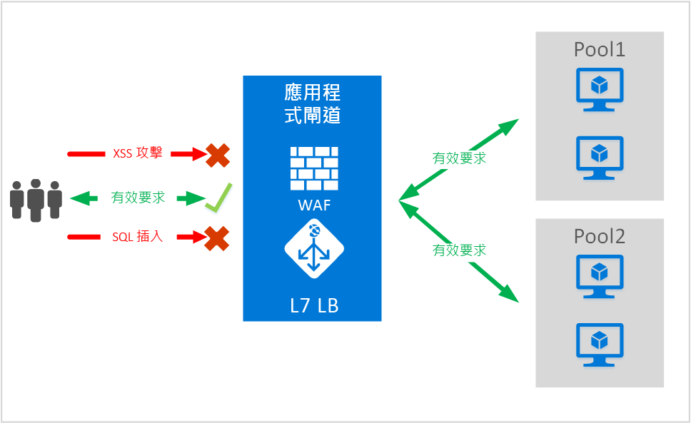
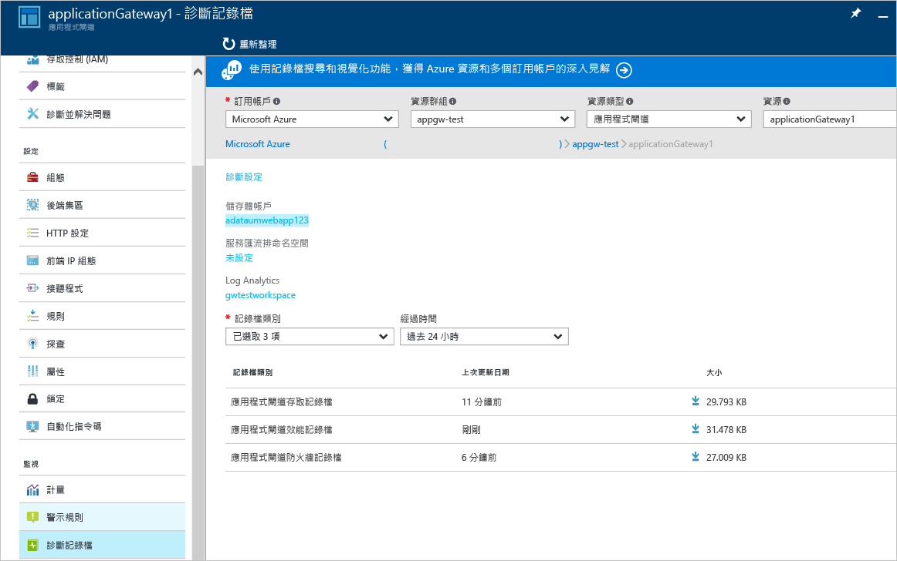

<properties
   pageTitle="應用程式閘道 Web 應用程式防火牆 | Microsoft Azure"
   description="本頁面提供應用程式閘道 Web 應用程式防火牆功能的概觀。"
   documentationCenter="na"
   services="application-gateway"
   authors="amsriva"
   manager="rossort"
   editor="amsriva"/>
<tags
   ms.service="application-gateway"
   ms.devlang="na"
   ms.topic="hero-article"
   ms.tgt_pltfrm="na"
   ms.workload="infrastructure-services"
   ms.date="09/26/2016"
   ms.author="amsriva"/>

# 應用程式閘道 Web 應用程式防火牆 (預覽)

Web 應用程式已逐漸成為利用常見已知弱點的惡意攻擊目標。 這些攻擊中最常見的是 SQL 插入式攻擊、跨網站指令碼攻擊等等。
想要防止應用程式的程式碼受到這類攻擊會非常困難，而且可能需要對多層次的應用程式拓撲執行嚴格的維護、修補和監視工作。 集中式 Web 攻擊保護可簡化安全性管理作業，並更加確保應用程式能夠對抗入侵威脅。 相較於保護每個個別的 Web 應用程式，WAF 方案還可透過在中央位置修補已知弱點來更快地因應安全性威脅。

應用程式閘道可做為應用程式傳遞控制器來運作，並提供 SSL 終止、Cookie 型工作階段同質、循環配置資源負載分配、內容型路由，以及裝載多個網站和安全性增強功能的能力。 應用程式閘道提供的安全性增強功能包括 SSL 原則管理和端對端 SSL 支援。 我們正在透過引進直接整合到 ADC 供應項目的 WAF (Web 應用程式防火牆)，來加強服務的應用程式安全性功能。 這可讓您輕鬆地設定要管理的中央位置，並保護 Web 應用程式來對抗常見的 Web 弱點。

在應用程式閘道設定 WAF 可為您提供下列好處︰

- 不需修改後端程式碼就能保護 Web 應用程式不受 Web 弱點和攻擊的威脅。
- 在應用程式閘道背後同時保護多個 Web 應用程式。 應用程式閘道可在單一閘道背後支援裝載最多 20 個網站，並且全都受到免於 Web 攻擊的保護。
- 使用應用程式閘道 WAF 記錄所產生的即時報告，監視 Web 應用程式對抗攻擊。
- 某些法務遵循控制需要由 WAF 方案保護所有網際網路對向端點。 使用已啟用 WAF 的應用程式閘道，您就可以符合這些法務遵循需求。

## Overview

應用程式閘道 WAF 是以新的 SKU (WAF SKU) 來提供，並已預先設定 ModSecurity 和 OWASP 核心規則集，以提供可對抗大部分 OWASP 前 10 大常見 Web 弱點的基準保護。

- SQL 插入式攻擊保護
- 跨網站指令碼保護
- 常見 Web 攻擊保護，例如命令插入式攻擊、HTTP 要求走私、HTTP 回應分割和遠端檔案包含攻擊
- 防範 HTTP 通訊協定違規
- 防範 HTTP 通訊協定異常行為，例如遺漏主機使用者代理程式和接受標頭
- HTTP DoS 保護，包括 HTTP 氾濫和緩慢的 HTTP DoS 預防
- 防範 Bot、編目程式和掃描器
- 偵測一般應用程式錯誤組態 (也就是 Apache、IIS 等)

## WAF 模式

應用程式閘道 WAF 可以設定為在下列兩種模式中執行︰

- **偵測模式** – 當設定為在偵測模式中執行時，應用程式閘道 WAF 會監視所有威脅警示並記錄到記錄檔。 您必須確保已使用 [診斷] 區段開啟應用程式閘道的記錄診斷。 您也必須確保已選取並開啟 WAF 記錄檔。
- **防止模式** – 當設定為在防止模式中執行時，應用程式閘道會主動封鎖其規則偵測到的入侵和攻擊。 攻擊者會收到 403 未經授權存取例外狀況，且連線會終止。 防止模式會繼續將這類攻擊記錄在 WAF 記錄檔中。

## 應用程式閘道 WAF 報告

應用程式閘道 WAF 提供其偵測到之每個威脅的詳細報告。 記錄會與 Azure 診斷記錄檔整合，而且警示會以 JSON 格式來記錄。

    {
        "resourceId": "/SUBSCRIPTIONS/<subscriptionId>/RESOURCEGROUPS/<resourceGroupName>/PROVIDERS/MICROSOFT.NETWORK/APPLICATIONGATEWAYS/<applicationGatewayName>",
        "operationName": "ApplicationGatewayFirewall",
        "time": "2016-09-20T00:40:04.9138513Z",
        "category": "ApplicationGatewayFirewallLog",
        "properties":     {
            "instanceId":"ApplicationGatewayRole_IN_0",
            "clientIp":"108.41.16.164",
            "clientPort":1815,
            "requestUri":"/wavsep/active/RXSS-Detection-Evaluation-POST/",
            "ruleId":"OWASP_973336",
            "message":"XSS Filter - Category 1: Script Tag Vector",
            "action":"Logged",
            "site":"Global",
            "message":"XSS Filter - Category 1: Script Tag Vector",
            "details":{"message":" Warning. Pattern match "(?i)(<script","file":"/owasp_crs/base_rules/modsecurity_crs_41_xss_attacks.conf","line":"14"}}
    }

## 應用程式閘道 WAF SKU 價格

預覽期間可免費使用應用程式閘道 WAF。 我們會繼續向您收取現有的基本 SKU 費用。 我們會在正式推出時公告 WAF SKU 費用。 已選擇在 WAF SKU 中部署應用程式閘道的客戶，會在宣佈正式推出後才開始產生 WAF SKU 價格。

## 後續步驟

深入了解 WAF 的功能之後，請瀏覽 [如何在應用程式閘道上設定 Web 應用程式防火牆](application-gateway-web-application-firewall-portal.md)。

<!--HONumber=Oct16_HO2-->

