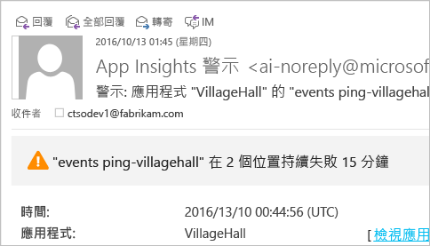

# <a name="set-up-application-insights-for-aspnet"></a>設定 ASP.NET 的 Application Insights
[Azure Application Insights](app-insights-overview.md) 監視您的即時應用程式，協助您[偵測並診斷效能問題和例外狀況](app-insights-detect-triage-diagnose.md)，同時[探索應用程式的使用情況](app-insights-overview-usage.md)。  這適用於裝載在專屬內部部署 IIS 伺服器或雲端 VM 上的應用程式，以及 Azure Web 應用程式。

## <a name="before-you-start"></a>開始之前
您需要：

* Visual Studio 2013 Update 3 或更新版本。 越新版越好。
* [Microsoft Azure](http://azure.com)訂用帳戶。 如果您的小組或組織擁有 Azure 訂用帳戶，擁有者就可以使用您的 [Microsoft 帳戶](http://live.com)將您加入。 

如果您對下列內容感興趣，請查看其他文章︰

* [在執行階段檢測 Web 應用程式](app-insights-monitor-performance-live-website-now.md)
* [Azure 雲端服務](app-insights-cloudservices.md)

## <a name="a-nameidea-1-add-application-insights-sdk"></a><a name="ide"></a> 1.加入 Application Insights SDK
### <a name="if-its-a-new-project"></a>對於新專案
當您在 Visual Studio 中建立新專案時，請務必選取 Application Insights。 


### <a name="-or-if-its-an-existing-project"></a>... 對於現有專案
在 [方案總管] 中以滑鼠右鍵按一下專案，然後選擇 [新增 Application Insights 遙測] 或 [設定 Application Insights]。


* ASP.NET Core 專案嗎？ - [遵循這些指示來修正幾行程式碼](https://github.com/Microsoft/ApplicationInsights-aspnetcore/wiki/Getting-Started#add-application-insights-instrumentation-code-to-startupcs)。 

## <a name="a-nameruna-2-run-your-app"></a><a name="run"></a> 2.執行您的應用程式
利用 F5 執行應用程式並立即試用：開啟不同的頁面來產生一些遙測。

在 Visual Studio 中，您可以看見已記錄的事件計數。 

![在 Visual Studio 中，[Application Insights] 按鈕會在偵錯期間顯示。](./media/app-insights-asp-net/54.png)

## <a name="3-see-your-telemetry"></a>3.查看遙測...
### <a name="-in-visual-studio"></a>... 在 Visual Studio 中
在 Visual Studio 中開啟 [Application Insights] 視窗︰按一下 [Application Insights] 按鈕，或以滑鼠右鍵按一下 [方案總管] 中的專案︰

![在 Visual Studio 中，[Application Insights] 按鈕會在偵錯期間顯示。](./media/app-insights-asp-net/55.png)

此檢視 (來自偵錯工作階段的資料) 會顯示應用程式的伺服器端所產生的遙測。 試驗篩選器，然後按一下任何事件以查看更多詳細資料。

* *沒有資料？請確定時間範圍正確無誤，然後按一下 [搜尋] 圖示。*

[深入了解 Visual Studio 中的 Application Insights 工具](app-insights-visual-studio.md)。

<a name="monitor"></a> 

### <a name="-in-the-portal"></a>... 在入口網站中
除非您選擇 [僅安裝 SDK]  ，否則您也可以在 Application Insights Web 入口網站查看遙測。 

此入口網站中的圖表、分析工具和儀表板比 Visual Studio 還多。 

開啟 Application Insights 資源 - 登入 [Azure 入口網站](https://portal.azure.com/)並找到它，或以滑鼠右鍵按一下 Visual Studio 中的專案並讓它帶您前往。


* *存取錯誤？如果您有一組以上的 Microsoft 認證，您可能會以錯誤的組合登入。在入口網站中，登出後重新登入。*

入口網站會從應用程式開啟遙測檢視︰

按一下任何圖格或圖表以查看詳細資料。

### <a name="more-detail-in-the-portal"></a>入口網站的詳細資料

* [**即時計量串流**](app-insights-metrics-explorer.md#live-metrics-stream)幾乎可立即顯示遙測。

    ![從 [概觀] 刀鋒視窗按一下 [即時串流]](./media/app-insights-asp-net/livestream.png)

    當您的應用程式正在執行時，開啟即時串流，允許其連線。

    即時串流只會在遙測傳送後顯示遙測一分鐘後。 如需更多歷史調查，請使用 [搜尋]、[計量瀏覽器] 和 [分析]。 資料可能需要數分鐘才會出現在上述位置。

* [**搜尋**](app-insights-diagnostic-search.md)會顯示個別事件，例如要求、例外狀況和頁面檢視。 您可以依照事件類型、相符詞彙和屬性值進行篩選。 按一下任何事件以查看其屬性和相關事件。 

    ![從 [概觀] 刀鋒視窗按一下 [搜尋]](./media/app-insights-asp-net/search.png)

 * 在開發模式中，您可能會看到許多相依性 (AJAX) 事件。 這些是在瀏覽器與伺服器模擬器之間的同步處理。 若要隱藏它們，請按一下 [相依性] 篩選器。
* [**彙總計量**](app-insights-metrics-explorer.md) (例如要求和失敗率) 會出現在圖表中。 按一下任何圖表即可開啟內含更多詳細資料的刀鋒視窗。 按一下任何圖表的 [編輯] 標籤，以設定篩選器、大小等等。
    
    ![從 [概觀] 刀鋒視窗按一下任何圖表](./media/app-insights-asp-net/metrics.png)

[深入了解在 Azure 入口網站中使用 Application Insights](app-insights-dashboards.md)。

## <a name="4-publish-your-app"></a>4.發佈您的應用程式
將您的應用程式發佈至 IIS 伺服器或 Azure。 監看 [即時計量串流](app-insights-metrics-explorer.md#live-metrics-stream) 以確定一切順利執行。

您會在 Application Insights 入口網站看到遙測累積，您還可以在此監視計量，搜尋您的遙測，以及設定 [儀表板](app-insights-dashboards.md)。 您也可以使用功能強大的 [分析查詢語言](app-insights-analytics.md) 來分析使用狀況和效能或尋找特定事件。 

您也可以繼續在 [Visual Studio](app-insights-visual-studio.md) 中以診斷搜尋和[趨勢](app-insights-visual-studio-trends.md)等工具來分析您的遙測。

> [!NOTE]
> 如果應用程式傳送足夠的遙測資料達到[節流限制](app-insights-pricing.md#limits-summary)，則會切換為自動[取樣](app-insights-sampling.md)。 取樣可減少從應用程式傳送的遙測數量，同時為供診斷之用保留相互關聯的資料。
> 
> 

## <a name="a-namelanda-what-did-add-application-insights-do"></a><a name="land"></a> 「加入 Application Insights」執行了哪些動作？
Application Insights 會將應用程式的遙測傳送至 Application Insights 入口網站 (裝載於 Microsoft Azure)︰


因此命令會執行三項工作︰

1. 將 Application Insights Web SDK NuGet 封裝加入您的專案。 若要在 Visual Studio 中看到它，請以滑鼠右鍵按一下專案，然後選擇 [管理 NuGet 封裝]。
2. 在 [Azure 入口網站](https://portal.azure.com/)中建立 Application Insights 資源。 這是您會看到您的資料的位置。 它會擷取可識別資源的「檢測金鑰」  。
3. 在 `ApplicationInsights.config`中插入檢測金鑰，讓 SDK 可以將遙測傳送至入口網站。

如果您想要的話，可以為 [ASP.NET 4](app-insights-windows-services.md) 或 [ASP.NET 核心](https://github.com/Microsoft/ApplicationInsights-aspnetcore/wiki/Getting-Started)手動進行這些步驟。

### <a name="to-upgrade-to-future-sdk-versions"></a>若要升級至未來的 SDK 版本
若要升級至 [新版的 SDK](https://github.com/Microsoft/ApplicationInsights-dotnet-server/releases)，請再次開啟 NuGet 封裝管理員，並篩選出已安裝的封裝。 選取 Microsoft.ApplicationInsights.Web 然後選擇 [升級]。

如果您已對 ApplicationInsights.config 進行任何的自訂，請在升級前儲存複本，並在升級後合併您的變更到新版本中。

## <a name="add-more-telemetry"></a>新增更多遙測
### <a name="web-pages-and-single-page-apps"></a>網頁和單一頁面應用程式
1. [新增 JavaScript 程式碼片段](app-insights-javascript.md)網頁，添加頁面檢視、載入時間、瀏覽器例外狀況、AJAX 呼叫效能、使用者和工作階段計數等相關資料，讓 [瀏覽器] 和 [使用量] 刀鋒視窗變得更生動。
2. [撰寫自訂事件](app-insights-api-custom-events-metrics.md)以計數、計時或測量使用者動作。

### <a name="dependencies-exceptions-and-performance-counters"></a>相依性、例外狀況和效能計數器
在每一部伺服器電腦上[安裝狀態監視器](app-insights-monitor-performance-live-website-now.md)，以取得有關應用程式的其他遙測。 您會得到下列資料：

* [效能計數器](app-insights-performance-counters.md) - 
  有關應用程式的 CPU、記憶體、磁碟和其他效能計數器。 
* [例外狀況](app-insights-asp-net-exceptions.md) - 某些例外狀況更詳細的遙測。
* [相依性](app-insights-asp-net-dependencies.md) - REST API 或 SQL 服務的呼叫。 了解外部元件回應緩慢是否造成應用程式的效能問題。 (如果您的應用程式在 .NET 4.6 上執行，您不需要狀態監視器來取得此遙測)。

### <a name="diagnostic-code"></a>診斷程式碼
有問題嗎？ 如果想要在應用程式中插入程式碼以協助診斷，您有幾種選項：

* [擷取記錄追蹤](app-insights-asp-net-trace-logs.md)︰如果您已經使用 Log4N、NLog 或 System.Diagnostics.Trace 來記錄追蹤事件，則可以將輸出傳送至 Application Insights，以便與要求相互關聯、搜尋它及分析它。 
* [自訂事件和度量](app-insights-api-custom-events-metrics.md)︰在伺服器或網頁程式碼中使用 trackevent() 和 trackmetric()。
* [將遙測標記其他屬性](app-insights-api-filtering-sampling.md#add-properties)

使用 [搜尋](app-insights-diagnostic-search.md)來尋找特定事件並使之相互關聯，使用[分析](app-insights-analytics.md)執行更強大的查詢。

## <a name="alerts"></a>Alerts
搶先知道應用程式發生問題。 (別等到使用者告訴您！) 

* [建立 Web 測試](app-insights-monitor-web-app-availability.md)，確保網路上看得見您的網站。
* [主動診斷](app-insights-proactive-diagnostics.md)會執行自動 (如果您的應用程式有一定的最少流量)。 不需要採取任何動作來設定它們。 它們會讓您知道應用程式是否有不尋常的失敗要求率。
* [設定度量警示](app-insights-alerts.md)，當度量超出臨界值時警告您。 您可以在撰寫於程式碼中的自訂度量上設定它們。

根據預設，警示通知會傳送至 Azure 訂用帳戶的擁有者。 



## <a name="version-and-release-tracking"></a>版本和版次追蹤
### <a name="track-application-version"></a>追蹤應用程式版本
請確定 `buildinfo.config` 是藉由您的 MSBuild 處理序所產生。 在您的 .csproj 檔案中加入：  

```XML

    <PropertyGroup>
      <GenerateBuildInfoConfigFile>true</GenerateBuildInfoConfigFile>    <IncludeServerNameInBuildInfo>true</IncludeServerNameInBuildInfo>
    </PropertyGroup> 
```

當它有組建資訊時，Application Insights Web 模組會自動新增 **應用程式版本** ，做為每個遙測項目的屬性。 如此可讓您在執行[診斷搜尋](app-insights-diagnostic-search.md)或在[探索度量](app-insights-metrics-explorer.md)時，依據版本來篩選。 

但請注意，組建版本號碼只能由 MS 組建產生，不是 Visual Studio 中的開發人員組建產生。

### <a name="release-annotations"></a>版本註解
如果您使用 Visual Studio Team Services，您可以[取得註解標記](app-insights-annotations.md) (每當發行新版本時，這會新增至您的圖表)。


## <a name="next-steps"></a>後續步驟
|  |
| --- | --- |
| **在 Visual Studio 中使用 Application Insights[](app-insights-visual-studio.md)**<br/> 使用遙測來偵錯、診斷搜尋、鑽研程式碼。 |
| **[使用 Application Insights 入口網站](app-insights-dashboards.md)**<br/>儀表板、功能強大的診斷和分析工具、警示、即時的應用程式相依性對應，以及遙測匯出等功能。 |
| **新增更多測試[](app-insights-asp-net-more.md)**<br/>監視使用狀況、可用性、相依性、例外狀況。 整合來自記錄架構的追蹤。 撰寫自訂遙測。 |


<!--HONumber=Dec16_HO3-->


