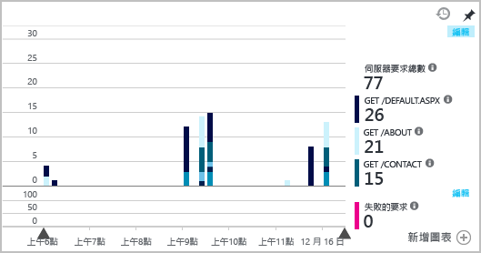

# <a name="set-up-application-insights-for-your-aspnet-website"></a>設定 ASP.NET 網站的 Application Insights
[Azure Application Insights](app-insights-overview.md) 監視您的即時應用程式，協助您[偵測並診斷效能問題和例外狀況](app-insights-detect-triage-diagnose.md)。 也可協助您[探索應用程式的使用情況](app-insights-overview-usage.md)。 這適用於 Azure App Service 的 Web Apps 功能，以及裝載於您自己的內部部署 IIS 伺服器或雲端 VM 上的應用程式。

## <a name="before-you-start"></a>開始之前
您需要：

* Visual Studio 2013 Update 3 或更新版本。 越新版越好。
* [Microsoft Azure](http://azure.com)訂用帳戶。 如果您的小組或組織擁有 Azure 訂用帳戶，擁有者就可以使用您的 [Microsoft 帳戶](http://live.com)將您加入。

如果您對下列內容感興趣，請查看其他主題︰

* [在執行階段檢測 Web 應用程式](app-insights-monitor-performance-live-website-now.md)
* [Azure 雲端服務](app-insights-cloudservices.md)

## <a name="a-nameidea-step-1-add-the-application-insights-sdk"></a><a name="ide"></a>步驟 1：新增 Application Insights SDK

在 [方案總管] 中以滑鼠右鍵按一下 Web 應用程式，然後選擇 [新增]、[Application Insights 遙測] 或 [設定 Application Insights]。

![[方案總管] 的螢幕擷取畫面，其中已醒目提示 [新增 Application Insights 遙測]](./media/app-insights-asp-net/appinsights-03-addExisting.png)

(在 Visual Studio 2015 中，[新增專案] 對話方塊中也有選項可新增 Application Insights。)

繼續移至 Application Insights 設定頁面︰

![[向 Application Insights 註冊您的應用程式] 頁面的螢幕擷取畫面](./media/app-insights-asp-net/visual-studio-register-dialog.png)

1. 選取您用來存取 Azure 的帳戶和訂用帳戶。
2. 在 Azure 中選取資源，以查看來自應用程式的資料。 通常您會為每個應用程式建立個別的資源。 如果您想要設定資源群組，或資料的儲存位置，請按一下 [進行設定]。 資源群組用來控制資料的存取。 例如，如果您有數個應用程式組成相同系統時，您可能會將其 Application Insights 資料放在相同的資源群組中。
3. 在一定的遙測數量之內，Application Insights 免費。 您可以規定數量上限，以避免產生費用。 建立資源之後，您可以在入口網站中開啟 [功能 + 定價]、[資料量管理]、[每日用量上限]，以變更您的選擇。
4. 按一下 [註冊]，繼續設定 Web 應用程式的 Application Insights。 在偵錯期間和您發佈應用程式之後，遙測會傳送至 [Azure 入口網站](https://portal.azure.com)。
5. 或者，您可以只是將 Application Insights SDK 新增至應用程式。 在此情況下，您在 Visual Studio 中偵錯時可以看到遙測。 稍後，您可以回到此設定頁面，或等到部署您的應用程式之後，[在執行階段開啟遙測](app-insights-monitor-performance-live-website-now.md)。


## <a name="a-nameruna-step-2-run-your-app"></a><a name="run"></a> 步驟 2︰執行您的應用程式
按 F5 執行您的應用程式。 開啟不同的頁面來產生一些遙測。

在 Visual Studio 中，您可以看見已記錄的事件計數。


## <a name="step-3-see-your-telemetry-in-visual-studio-or-application-insights"></a>步驟 3：在 Visual Studio 或 Application Insights 中查看遙測
您可以在 Visual Studio 或 Application Insights Web 入口網站中看到遙測。

**在 Visual Studio 中**，開啟 Application Insights 視窗。 按一下 [Application Insights] 按鈕，或以滑鼠右鍵按一下 [方案總管] 中的專案﹐選取 [Application Insights]﹐然後按一下 [搜尋即時遙測]。

在 Visual Studio 的 [Application Insights 搜尋] 視窗中，利用 [偵錯工作階段中的資料] 檢視，查看應用程式的伺服器端所產生的遙測。 試驗篩選器，然後按一下任何事件以查看更多詳細資料。

![[Application Insights] 視窗中 [偵錯工作階段中的資料] 檢視的螢幕擷取畫面。](./media/app-insights-asp-net/55.png)

> [!NOTE]
> 如果您沒有看到任何資料，請確定時間範圍正確，然後按一下 [搜尋] 圖示。

[深入了解 Visual Studio 中的 Application Insights 工具](app-insights-visual-studio.md)。

<a name="monitor"></a>
### <a name="the-application-insights-web-portal"></a>Application Insights Web 入口網站
除非您選擇只安裝 SDK，否則，您也可以**在 Application Insights Web 入口網站中**看到遙測。 此入口網站中的圖表、分析工具和儀表板比 Visual Studio 還多。

開啟 Application Insights 資源。 登入 [Azure 入口網站](https://portal.azure.com/)並找到它，或以滑鼠右鍵按一下 Visual Studio 中的專案並讓它帶您前往。


> [!NOTE]
> 如果您收到存取錯誤，表示您可能有一組以上的 Microsoft 認證，而且您可能以錯誤的組合登入。 在入口網站中，登出後重新登入。

入口網站會從您的應用程式開啟遙測檢視。


按一下任何圖格或圖表以查看詳細資料。

### <a name="more-details-in-the-application-insights-web-portal"></a>Application Insights Web 入口網站中的更多詳細資料
以下是入口網站為您提供更多詳細資料的一些範例。

* [**即時計量串流**](app-insights-live-stream.md)幾乎可立即顯示遙測。

    ![入口網站的螢幕擷取畫面。 從 [概觀] 刀鋒視窗按一下 [即時串流]。](./media/app-insights-asp-net/livestream.png)

    當您的應用程式正在執行時，開啟 [即時計量串流]，允許其連線。

    [即時計量串流] 只會在遙測傳送後顯示遙測一分鐘。 如需更多歷史調查，請使用 [搜尋]、[計量瀏覽器] 和 [分析]。 資料可能需要數分鐘才會出現在上述位置。

* [**搜尋**](app-insights-diagnostic-search.md)會顯示個別事件，例如要求、例外狀況和頁面檢視。 您可以依照事件類型、相符詞彙和屬性值進行篩選。 按一下任何事件以查看其屬性和相關事件。

    ![入口網站的螢幕擷取畫面。 從 [概觀] 刀鋒視窗按一下 [搜尋]。](./media/app-insights-asp-net/search.png)

 * 在開發模式中，您可能會看到許多相依性 (AJAX) 事件。 這些是在瀏覽器與伺服器模擬器之間的同步處理。 若要隱藏它們，請按一下 [相依性] 篩選。
* [**彙總計量**](app-insights-metrics-explorer.md) (例如要求和失敗率) 會出現在圖表中。 按一下任何圖表即可開啟內含更多詳細資料的刀鋒視窗。 按一下任何圖表的 [編輯] 標籤，以設定篩選和大小。

    

[深入了解在 Azure 入口網站中使用 Application Insights](app-insights-dashboards.md)。

## <a name="step-4-publish-your-app"></a>步驟 4：發佈您的應用程式
將您的應用程式發佈至 IIS 伺服器或 Azure。 監看 [即時計量串流](app-insights-metrics-explorer.md#live-metrics-stream) 以確定一切順利執行。

您的遙測會累積在 Application Insights 入口網站，您可以在此監視計量，搜尋您的遙測，以及設定[儀表板](app-insights-dashboards.md)。 您也可以使用功能強大的[分析查詢語言](app-insights-analytics.md)，分析使用狀況和效能或尋找特定事件。

您也可以繼續在 [Visual Studio](app-insights-visual-studio.md) 中，以診斷搜尋和[趨勢](app-insights-visual-studio-trends.md)等工具來分析您的遙測。

> [!NOTE]
> 如果應用程式傳送足夠的遙測資料達到[節流限制](app-insights-pricing.md#limits-summary)，則會切換為自動[取樣](app-insights-sampling.md)。 取樣可減少從應用程式傳送的遙測數量，同時為供診斷之用保留相互關聯的資料。
>
>

## <a name="a-namelanda-what-does-the-add-application-insights-command-do"></a><a name="land"></a>「新增 Application Insights」命令有何作用？
Application Insights 會將應用程式的遙測傳送至 Application Insights 入口網站 (裝載於 Azure)。


此命令會執行三項工作︰

1. 將 Application Insights Web SDK NuGet 封裝加入您的專案。 若要在 Visual Studio 中看到它，請以滑鼠右鍵按一下專案，然後選擇 [管理 NuGet 套件]。
2. 在 [Azure 入口網站](https://portal.azure.com/)中建立 Application Insights 資源。 這是您會看到資料的位置。 它會擷取可識別資源的「檢測金鑰」。
3. 在 `ApplicationInsights.config`中插入檢測金鑰，讓 SDK 可以將遙測傳送至入口網站。

如果您想要的話，可以為 [ASP.NET 4](app-insights-windows-services.md) 或 [ASP.NET 核心](https://github.com/Microsoft/ApplicationInsights-aspnetcore/wiki/Getting-Started)手動進行這些步驟。

### <a name="upgrade-to-future-sdk-versions"></a>升級至未來的 SDK 版本
若要升級至[新版的 SDK](https://github.com/Microsoft/ApplicationInsights-dotnet-server/releases)，請再次開啟 **NuGet 套件管理員**，並篩選出已安裝的套件。 選取 **Microsoft.ApplicationInsights.Web**，然後選擇 [升級]。

如果您已對 ApplicationInsights.config 進行任何的自訂，請在升級前儲存複本。 然後，將您的變更合併至新版本中。

## <a name="add-more-telemetry"></a>新增更多遙測
以下是您可以新增的其他遙測類型。
### <a name="dependencies-exceptions-and-performance-counters"></a>相依性、例外狀況和效能計數器

在每一部 IIS 伺服器電腦上[安裝狀態監視器](http://go.microsoft.com/fwlink/?LinkId=506648)，以取得有關 Web 應用程式的其他遙測。 如果已經安裝，您就不需要採取任何動作。 (您可能已經使用狀態監視器，在執行階段開始監視應用程式。)

藉由在建置階段 SDK 以外使用狀態監視器，可取得一組更完整的遙測資料，其中包括︰

* [效能計數器](app-insights-performance-counters.md)：有關應用程式的 CPU、記憶體、磁碟和其他效能計數器。
* [例外狀況](app-insights-asp-net-exceptions.md)：某些例外狀況更詳細的遙測。
* [相依性](app-insights-asp-net-dependencies.md)：包括傳回值。

### <a name="webpages-and-single-page-apps"></a>網頁和單一頁面應用程式
1. 在您的網頁中[新增 JavaScript 程式碼片段](app-insights-javascript.md)，以顯示頁面檢視、載入時間、瀏覽器例外狀況、AJAX 呼叫效能及使用者和工作階段計數等相關資料。 這些會顯示在 [瀏覽器] 和 [使用情況] 刀鋒視窗中。
2. [撰寫自訂事件](app-insights-api-custom-events-metrics.md)以計數、計時或測量使用者動作。


### <a name="diagnostic-code"></a>診斷程式碼
有問題嗎？ 如果想要在應用程式中插入程式碼以協助診斷，您有幾種選項：

* [擷取記錄追蹤](app-insights-asp-net-trace-logs.md)︰如果您已經使用 Log4N、NLog 或 System.Diagnostics.Trace 來記錄追蹤事件，則可以將輸出傳送至 Application Insights。 您可以將此輸出與要求相互關聯、搜尋它，並進行分析。
* [自訂事件和計量](app-insights-api-custom-events-metrics.md)︰在伺服器或網頁程式碼中使用 TrackEvent() 和 TrackMetric()。
* [將遙測標記其他屬性](app-insights-api-filtering-sampling.md#add-properties)。

使用 [搜尋](app-insights-diagnostic-search.md)來尋找特定事件並使之相互關聯，使用[分析](app-insights-analytics.md)執行更強大的查詢。

## <a name="alerts"></a>Alerts
搶先知道應用程式發生問題。

* [可用性測試](app-insights-monitor-web-app-availability.md)：建立測試，以確保網路上看得見您的網站。
* [智慧型診斷](app-insights-proactive-diagnostics.md)︰這些測試會自動執行，您不需要採取任何動作來設定它們。 它們會讓您知道應用程式是否有不尋常的失敗要求率。
* [計量警示](app-insights-alerts.md)：設定這些警示，當計量超出臨界值時警告您。 您可以在撰寫於程式碼中的自訂度量上設定它們。

根據預設，警示通知會傳送至 Azure 訂用帳戶的擁有者。


## <a name="version-and-release-tracking"></a>版本和版次追蹤
若要追蹤應用程式版本，請確定您的 Microsoft Build Engine 程序已產生 `buildinfo.config`。 在您的 .csproj 檔案中加入：  

```XML

    <PropertyGroup>
      <GenerateBuildInfoConfigFile>true</GenerateBuildInfoConfigFile>    <IncludeServerNameInBuildInfo>true</IncludeServerNameInBuildInfo>
    </PropertyGroup>
```

當它有組建資訊時，Application Insights Web 模組會自動新增 **應用程式版本** ，做為每個遙測項目的屬性。 如此可讓您在執行[診斷搜尋](app-insights-diagnostic-search.md)或在[探索計量](app-insights-metrics-explorer.md)時，依據版本來篩選。

但請注意，組建版本號碼只由 Microsoft Build Engine 產生，而不是由 Visual Studio 中的開發人員組建產生。

### <a name="release-annotations"></a>版本註解
如果您使用 Visual Studio Team Services，您可以[取得註解標記](app-insights-annotations.md) (每當發行新版本時，這會新增至您的圖表)。 下圖顯示此標記的顯示方式。


## <a name="next-steps"></a>後續步驟
**在 Visual Studio 中使用 Application Insights[](app-insights-visual-studio.md)**<br/>包括使用遙測來偵錯、診斷搜尋及鑽研程式碼的相關資訊。

**[使用 Application Insights 入口網站](app-insights-dashboards.md)**<br/> 包括儀表板、功能強大的診斷和分析工具、警示、即時的應用程式相依性對應，以及遙測匯出的相關資訊。

