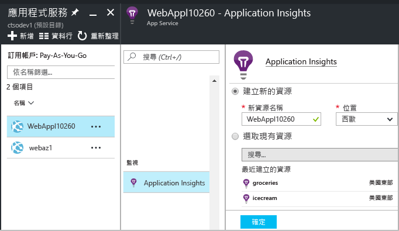
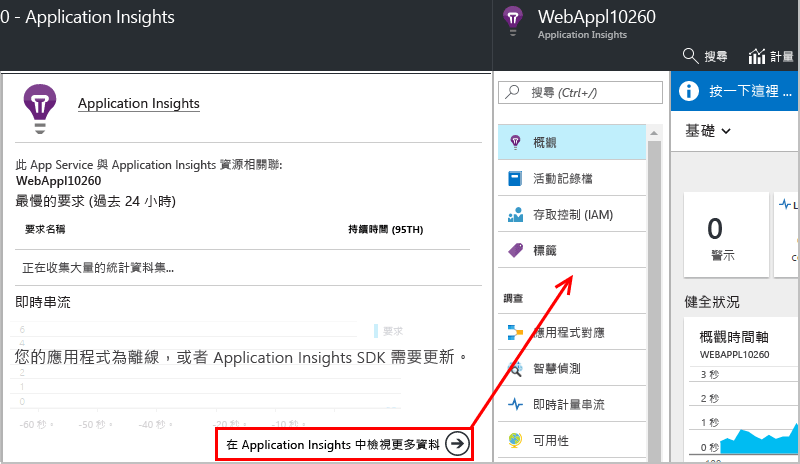
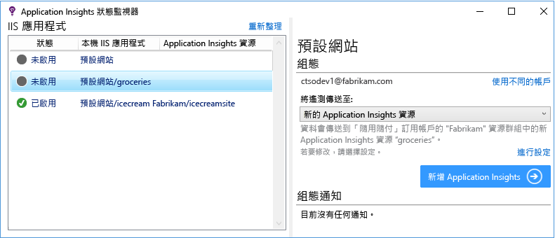

# 在執行階段使用 Application Insights 檢測 Web 應用程式

您可以使用 Azure Application Insights 檢測即時 Web 應用程式，而不需修改或重新部署您的程式碼。 如果您的應用程式是由內部部署 IIS 伺服器裝載，請安裝狀態監視器。 如果這些是 Azure Web 應用程式或在 Azure VM 中執行，您可以從 Azure 控制台切換為 Application Insights 監視。 (我們還提供有關檢測[即時 J2EE Web 應用程式](app-insights-java-live.md)和 [Azure 雲端服務](app-insights-cloudservices.md)的個別文章)。您需要 [Microsoft Azure](http://azure.com) 訂用帳戶。

下列三種途徑均可讓您將 Application Insights 套用至 .NET Web 應用程式：

* **建置階段：**[新增 Application Insights SDK][greenbrown] 至您的 Web 應用程式程式碼。
* **執行階段︰** 如下所述，檢測伺服器上的 Web 應用程式，而不需重建並重新部署程式碼。
* **兩者︰** 將 SDK 建置到您的 Web 應用程式程式碼中，同時套用執行階段延伸模組。 集合兩者之優點。

以下是您可在每種途徑中取得的優勢摘要︰

|  | 建置階段 | 執行階段 |
| --- | --- | --- |
| 要求和例外狀況 |是 |是 |
| [更詳細的例外狀況](app-insights-asp-net-exceptions.md) | |是 |
| [相依性診斷](app-insights-asp-net-dependencies.md) |在 .Net 4.6 + 上，但較少細節 |是，完整詳細資料︰結果碼、SQL 命令文字、HTTP 指令動詞|
| [系統效能計數器](app-insights-performance-counters.md) |是 |是 |
| [自訂遙測的 API][api] |是 | |
| [追蹤記錄檔整合](app-insights-asp-net-trace-logs.md) |是 | |
| [頁面檢視和使用者資料](app-insights-javascript.md) |是 | |
| 不需要重建程式碼 |否 | |

## 監視即時 Azure Web 應用程式

如果您的應用程式是以 Azure Web 服務的形式執行，以下是如何開始監視的方法︰

* 在 Azure 中於應用程式控制台選取 [Application Insights]。

    
* 當 [Application Insights 摘要] 頁面開啟時，按一下頁面底部的連結以開啟完整的 Application Insights 資源。

    

[監視雲端和 VM 應用程式](app-insights-azure.md)。

## 監視即時 IIS Web 應用程式

如果您的應用程式裝載於 IIS 伺服器上，請使用狀態監視器來啟用 Application Insights。

1. 在 IIS Web 伺服器上，以系統管理員認證登入。
2. 如果尚未安裝 Application Insights 狀態監視器，請下載並執行[狀態監視器安裝程式](http://go.microsoft.com/fwlink/?LinkId=506648) (或執行 [Web Platform Installer](https://www.microsoft.com/web/downloads/platform.aspx) 並在其中搜尋 Application Insights 狀態監視器)。
3. 在狀態監視器中，選取您想要監視的已安裝 Web 應用程式或網站。 利用您的 Azure 認證登入。

    在 Application Insights 入口網站中設定您要在其中檢視結果的資源。 (通常最好建立新的資源。 如果您已經為此應用程式設定 [Web 測試][availability]或[用戶端監視][client]，請選取現有的資源。) 

    

4. 重新啟動 IIS。

    ![選擇對話方塊頂端的 [重新啟動]。](./media/app-insights-monitor-performance-live-website-now/appinsights-036-restart.png)

    您的 Web 服務會中斷一小段時間。

## 自訂監視選項

啟用 Application Insights 可將 DLL 和 ApplicationInsights.config 新增至您的 Web 應用程式。 您可以[編輯 .config 檔案](app-insights-configuration-with-applicationinsights-config.md)﹐以變更某些選項。

## 當您重新發佈您的應用程式時，請重新啟用 Application Insights。

重新發佈您的應用程式之前，請考慮[將 Application Insights 新增至 Visual Studio 中的程式碼][greenbrown]。 您將取得更詳細的遙測，並且能夠撰寫自訂遙測。

如果您想要重新發行，但不將 Application Insights 新增至程式碼，請留意部署程序可能會從已發佈的網站中刪除 DLL 和 ApplicationInsights.config。 因此：

1. 如果您已編輯 ApplicationInsights.config，請在重新發佈應用程式前複製一份。
2. 重新發佈您的應用程式。
3. 重新啟用 Application Insights 監視功能。 (使用適當的方法︰Azure Web 應用程式控制台或 IIS 主機上的狀態監視器。)
4. 恢復您在 .config 檔案上執行的所有編輯。

## 針對 Application Insights 的執行階段組態進行疑難排解

### 無法連接？ 沒有遙測資料？

* 在伺服器的防火牆中開啟[必要的傳出連接埠](app-insights-ip-addresses.md#outgoing-ports)，以允許狀態監視器運作。

* 開啟狀態監視器，然後選取左窗格中的應用程式。 檢查 [設定通知] 區段中是否有任何關於此應用程式的診斷訊息：

  ![開啟 [效能] 刀鋒視窗，即可查看要求、回應時間、相依性和其他資料](./media/app-insights-monitor-performance-live-website-now/appinsights-status-monitor-diagnostics-message.png)
* 如果您在伺服器上看到有關「權限不足」的訊息，請嘗試下列操作：
  * 在 IIS 管理員中，選取應用程式集區，開啟 [進階設定]，並記下 [處理序模型] 下的身分識別。
  * 在電腦的管理控制台中，將此身分識別加入至效能監試器使用者群組。
* 如果您的伺服器上已安裝 MMA/SCOM (Microsoft Operations Management Suite)，某些版本可能會發生衝突。 解除安裝 SCOM 和狀態監視器，重新安裝最新版本。
* 請參閱[疑難排解][qna]。

## 系統需求
支援伺服器上 Application Insights 狀態監視器的作業系統：

* Windows Server 2008
* Windows Server 2008 R2
* Windows Server 2012
* Windows Server 2012 R2
* Windows Server 2016

(含最新版 SP 和 .NET Framework 4.5)

在用戶端 Windows 7、8、8.1 和 10 上，一樣需含有 .NET Framework 4.5

IIS 支援：IIS 7、7.5、8、8.5 (需要有 IIS)

## 使用 PowerShell 進行自動化
您可以在 IIS 伺服器上使用 PowerShell 啟動和停止監視。

先匯入 Application Insights 模組︰

`Import-Module 'C:\Program Files\Microsoft Application Insights\Status Monitor\PowerShell\Microsoft.Diagnostics.Agent.StatusMonitor.PowerShell.dll'`

找出受監視的應用程式︰

`Get-ApplicationInsightsMonitoringStatus [-Name appName]`

* `-Name` (選擇性) Web 應用程式的名稱。
* 顯示此 IIS 伺服器中每個 Web 應用程式 (或具名應用程式) 的 Application Insights 監視狀態。
* 傳回每個應用程式的 `ApplicationInsightsApplication`︰

  * `SdkState==EnabledAfterDeployment`︰應用程式正受到監視，並已在執行階段透過「狀態監視器」工具或 `Start-ApplicationInsightsMonitoring` 進行檢測。
  * `SdkState==Disabled`︰不會針對 Application insights 檢測應用程式。 應用程式從未接受檢測，或「狀態監視器」工具或 `Stop-ApplicationInsightsMonitoring`已停用執行階段監視。
  * `SdkState==EnabledByCodeInstrumentation`︰已透過將 SDK 加入至原始程式碼來檢測應用程式。 其 SDK 無法更新或停止。
  * `SdkVersion` 會顯示正用來監視此應用程式的版本。
  * `LatestAvailableSdkVersion`會顯示 NuGet 資源庫上目前可用的版本。 若要將應用程式升級至此版本，請使用 `Update-ApplicationInsightsMonitoring`。

`Start-ApplicationInsightsMonitoring -Name appName -InstrumentationKey 00000000-000-000-000-0000000`

* `-Name` 應用程式在 IIS 中的名稱
* `-InstrumentationKey` 您想要在其中顯示結果之 Application Insights 資源的 ikey。
* 這個 Cmdlet 只會影響尚未檢測的應用程式，也就是 SdkState==NotInstrumented。

    這個 Cmdlet 不會影響已經過檢測的應用程式。 不論是在建置階段透過將 SDK 新增至程式碼，還是在執行階段透過先前使用的這個 Cmdlet，都沒有影響。

    用來檢測應用程式的 SDK 版本是最常下載到此伺服器的版本。

    若要下載最新版本，請使用 Update-ApplicationInsightsVersion。
* 成功時會傳回 `ApplicationInsightsApplication` 。 如果失敗，則會在 stderr 記錄追蹤。

          Name                      : Default Web Site/WebApp1
          InstrumentationKey        : 00000000-0000-0000-0000-000000000000
          ProfilerState             : ApplicationInsights
          SdkState                  : EnabledAfterDeployment
          SdkVersion                : 1.2.1
          LatestAvailableSdkVersion : 1.2.3

`Stop-ApplicationInsightsMonitoring [-Name appName | -All]`

* `-Name` 應用程式在 IIS 中的名稱
* `-All` 停止監視此 IIS 伺服器中所有 `SdkState==EnabledAfterDeployment` 的應用程式
* 停止監視指定應用程式並移除檢測。 它僅適用於已在執行階段使用「狀態監視器」工具或 Start-ApplicationInsightsApplication 進行檢測的應用程式。 (`SdkState==EnabledAfterDeployment`)
* 傳回 ApplicationInsightsApplication。

`Update-ApplicationInsightsMonitoring -Name appName [-InstrumentationKey "0000000-0000-000-000-0000"`]

* `-Name`：Web 應用程式在 IIS 中的名稱。
* `-InstrumentationKey` (選擇性)。使用此參數可變更應用程式的遙測所要傳送至的資源。
* 此 Cmdlet：
  * 將具名應用程式升級至最近下載到這台電腦之 SDK 的版本。 (僅適用於 `SdkState==EnabledAfterDeployment`時)
  * 如果您提供檢測金鑰，具名應用程式會重新設定為將遙測傳送至具有該索引鍵的資源。 (適用於 `SdkState != Disabled`時)

`Update-ApplicationInsightsVersion`

* 將最新的 Application Insights SDK 下載至伺服器。

## 狀態監視器的相關問題

### 什麼是狀態監視器？

您在 IIS Web 伺服器中安裝的桌面應用程式。 它可協助您檢測和設定 Web 應用程式。 

### 如何使用狀態監視器？

* 檢測在 IIS 伺服器上執行的任何 Web 應用程式 - 即使它已在執行中。
* 針對已在編譯階段[使用 Application Insights SDK 建置](app-insights-asp-net.md)的 Web 應用程式，啟用其他遙測。 

### 是否可以在執行之後將它關閉？

是。 檢測您選取的網站之後，您可以將它關閉。

它本身不會收集遙測資料。 它只會設定 Web 應用程式和設定一些權限。

### 狀態監視器有何作用？

當您選取 Web 應用程式以供狀態監視器檢測時︰

* 下載 Application Insights 組件和 .config 檔案並且放置於 Web 應用程式的 binaries 資料夾中。
* 修改 `web.config` 以新增 Application Insights HTTP 追蹤模組。
* 啟用 CLR 剖析以收集相依性呼叫。

### 每次更新應用程式時，是否需要執行狀態監視器？

如果您是以累加方式重新部署，則不需要。 

如果您在發佈程序中選取 [刪除現有的檔案] 選項，則必須重新執行狀態監視器才能設定 Application Insights。

### 會收集哪些遙測資料？

對於只會在執行階段使用狀態監視器檢測的應用程式︰

* HTTP 要求
* 相依性呼叫
* 例外狀況
* 效能計數器

對於在編譯階段已經過檢測的應用程式︰

 * 處理程序計數器。
 * 相依性呼叫 (.NET 4.5)；在相依性呼叫中傳回值 (.NET 4.6)。
 * 例外狀況堆疊追蹤值。

[深入了解](http://apmtips.com/blog/2016/11/18/how-application-insights-status-monitor-not-monitors-dependencies/)

## 影片

> [!VIDEO https://channel9.msdn.com/events/Connect/2016/100/player]

## 接續步驟

檢視遙測：

* [探索計量](app-insights-metrics-explorer.md)以監視效能和使用量
* [搜尋事件和記錄][diagnostic]以診斷問題
* 更多進階查詢的[分析](app-insights-analytics.md)
* [建立儀表板](app-insights-dashboards.md)

新增更多遙測：

* [建立 Web 測試][availability]，確定您的網站保持即時狀態。
* [新增 Web 用戶端遙測][usage]，以查看網頁程式碼中的例外狀況，並讓您插入追蹤呼叫。
* [將 Application Insights SDK 新增至您的程式碼][greenbrown]，以便插入追蹤和記錄呼叫

<!--Link references-->

[api]: app-insights-api-custom-events-metrics.md
[availability]: app-insights-monitor-web-app-availability.md
[client]: app-insights-javascript.md
[diagnostic]: app-insights-diagnostic-search.md
[greenbrown]: app-insights-asp-net.md
[qna]: app-insights-troubleshoot-faq.md
[roles]: app-insights-resources-roles-access-control.md
[usage]: app-insights-javascript.md

