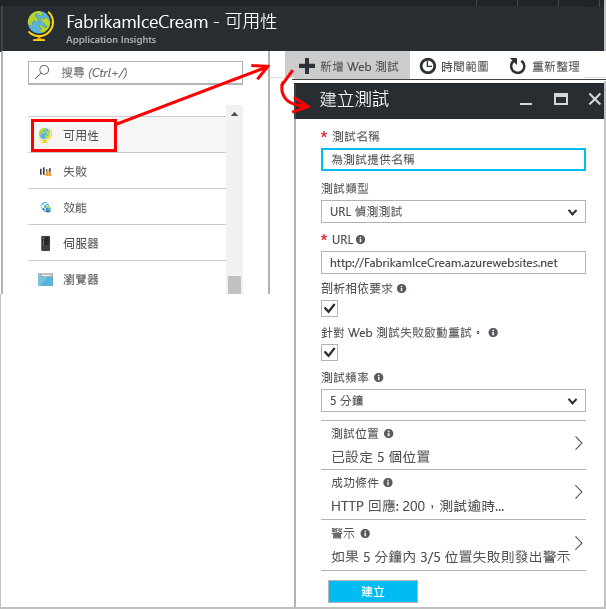

# 監視任何網站的可用性和回應性
將 Web 應用程式或網站部署至任何伺服器之後，您可以設定測試來監視其可用性和回應性。 [Azure Application Insights](app-insights-overview.md) 會將來自全球各地的 Web 要求定期傳送給您的應用程式。 如果應用程式沒有回應或回應太慢，則會警告您。

您可以為公用網際網路可存取的任何 HTTP 或 HTTPS 端點設定可用性測試。 您不需要在您測試的網站上加入任何東西。 甚至不必是您的網站︰您可以測試您依賴的 REST API 服務。

可用性測試有兩種：

* [URL Ping 測試](#create)：您可以在 Azure 入口網站中建立的簡單測試。
* [多步驟 Web 測試](#multi-step-web-tests)：您可以在 Visual Studio Enterprise 中建立並上傳至入口網站的測試。

每個應用程式資源最多可以建立 25 項可用性測試。

## 1.開啟可用性測試報告的資源

**如果您已針對應用程式設定 Application Insights**，請在 [Azure 入口網站](https://portal.azure.com)中開啟其 Application Insights 資源。

**或者，如果您想要在新的資源中查看報告，**請註冊 [Microsoft Azure](http://azure.com)，並移至 [Azure 入口網站](https://portal.azure.com)，然後建立 Application Insights 資源。

按一下 [所有資源]  ，以開啟新資源的 [概觀] 刀鋒視窗。

## 2.建立 URL Ping 測試
開啟 [可用性] 刀鋒視窗並新增一項測試。

* **URL** 可以是您想要測試的任何網頁，但必須可從公用網際網路看見它。 URL 可以包含查詢字串。 例如，您可以訓練一下您的資料庫。 如果 URL 解析為重新導向，我們會跟隨它，最多 10 個重新導向。
* **剖析相依要求**︰若已核取這個選項，測試會要求影像、指令碼、樣式檔案以及其他屬於受測試網頁的檔案。 記錄的回應時間包含取得這些檔案所需的時間。 如果無法在逾時內為整個測試成功下載所有這些資源，則測試將會失敗。 

    如果未核取這個選項，測試只會要求您指定之 URL 中的檔案。
* **啟用重試**：若已核取這個選項，就會在短時間內進行重試。 只有在連續三次重試失敗後，才會回報失敗。 後續測試則會以一般測試頻率執行。 重試會暫時停止，直到下次成功為止。 此規則可個別套用在每個測試位置。 我們建議使用這個選項。 平均來說，大約 80% 失敗會在重試後消失。
* **測試頻率**：設定從每個測試位置執行測試的頻率。 頻率為 5 分鐘且有五個測試位置，則您的網站平均每一分鐘會執行測試。
* **測試位置** 是我們的伺服器將 Web 要求傳送至您的 URL 的位置。 請選擇多個位置，以便區分網站問題與網路問題。 您最多可以選取 16 個位置。
* **成功準則**：

    **測試逾時**：減少此值以警示回應變慢。 如果未在這段時間內收到您網站的回應，則測試會視為失敗。 如果已選取 [剖析相依要求] ，則必須在這段時間內收到所有映像、樣式檔、指令碼和其他相依資源。

    **HTTP 回應**：視為成功的回覆狀態碼。 200 是表示已傳回標準 Web 網頁的代碼。

    **內容比對**：字串，例如「歡迎！ 我們會測試每個回應中的區分大小寫完全相符。 必須是單純字串，不含萬用字元。 別忘了，如果頁面內容變更，則可能需要更新。
*  傳送給您。 某個位置的失敗很可能是網路問題，而不是您的網站發生問題。 但您可以將臨界值變更為更敏感或更不敏感，也可以變更應該將電子郵件傳送給哪一個人。

    您可以設定會在產生警示時呼叫的 [webhook](../monitoring-and-diagnostics/insights-webhooks-alerts.md)。 (不過請注意，查詢參數目前不會當作屬性傳遞)。

### 測試更多 URL
加入更多測試。 例如，除了測試首頁以外，您也可以測試搜尋的 URL 來確定資料庫在執行中。

## 3.查看可用性測試結果

數分鐘之後，按一下 [重新整理] 來查看測試結果。 

散佈圖會顯示測試結果的範例，其中包含診斷測試步驟詳細資料。 測試引擎會儲存失敗測試的診斷詳細資料。 對於成功的測試，系統會儲存執行子集的診斷詳細資料。 將滑鼠停留在任何綠點/紅點上，以查看測試時間戳記、測試持續期間、位置和測試名稱。 點選散佈圖中的任何點以查看測試結果的詳細資料。  

選取特定測試、位置，或縮短時間週期，以查看更多有關感興趣時間週期的結果。 使用 [搜尋總管] 以查看所有執行的結果，或使用分析查詢對此資料執行自訂報告。

除了未經處理的結果，[計量瀏覽器] 中有兩個可用性計量︰ 

1. 可用性︰所有測試執行中測試成功的百分比。 
2. 測試持續期間︰所有測試執行中的平均測試持續期間。

您可以對測試名稱、位置套用篩選條件，以分析特定測試及/或位置的趨勢。

##  檢查和編輯測試

從摘要頁面中，選取特定測試。 您可以在該頁面中看見其特定結果，並加以編輯或暫時將它停用。

當您對服務執行維護時，您可能會想要停用可用性測試或與其相關聯的警示規則。 

## 如果您看到失敗
按一下一個紅點。

從可用性測試結果，您可以：

* 檢查從伺服器收到的回應。
* 在處理失敗的要求執行個體時，開啟應用程式伺服器所傳送的遙測。
* 在 Git 或 VSTS 中記錄問題或工作項目來追蹤問題。 Bug 將包含此事件的連結。
* 在 Visual Studio 中開啟 Web 測試結果。

*看起來正常，但回報為失敗？* 請檢查所有映像、指令碼、樣式表和頁面載入的任何其他檔案。 如果其中有任何一個失敗，即使主要的 html 頁面載入正常，測試皆會回報為失敗。

沒有相關項目？ 如果您已針對伺服器端應用程式設定 Application Insights，這可能是因為正在進行[取樣](app-insights-sampling.md)。 

## 多重步驟 Web 測試
您可以監視涉及一連串 URL 的案例。 例如，如果您正在監視銷售網站，您可以測試將項目加入購物車正確運作。

> [!NOTE] 
> 進行多步驟 Web 測試此會收取費用。 [價格方案](http://azure.microsoft.com/pricing/details/application-insights/)。
> 

若要建立多重步驟測試，您可以使用 Visual Studio Enterprise 來記錄案例，然後將記錄結果上傳至 Application Insights。 Application Insights 會不時地重新執行案例，並確認回應。

> [!NOTE]
> 您無法在測試中使用已編碼的函式或迴圈。 測試必須完全包含於 .webtest 指令碼中。 不過，您可以使用標準外掛程式。
>

#### 1.記錄案例
使用 Visual Studio Enterprise 來記錄 Web 工作階段。

1. 建立 Web 效能測試專案。

    

 * *沒看見 Web 效能和負載測試範本嗎？* - 關閉 Visual Studio Enterprise。 開啟 [Visual Studio 安裝程式] 以修改 Visual Studio Enterprise 安裝。 在 [個別元件] 之下，選取 [Web 效能和負載測試工具]。

2. 開啟 .webtest 檔案，並開始記錄。

    ![開啟 .webtest 檔案，然後按一下 [記錄]。](./media/app-insights-monitor-web-app-availability/appinsights-71webtest-multi-vs-start.png)
3. 執行您想要在測試中模擬的使用者動作：開啟網站、將產品加入購物車等等。 然後停止測試。

    

    不要讓案例太長。 以 100 個步驟和 2 分鐘為限。
4. 編輯本測試以進行下列事項：

   * 加入驗證以檢查收到的文字和回應碼。
   * 移除任何多餘的互動。 您也可以移除圖片或廣告或追蹤網站的相依要求。

     請記住您只能編輯此測試指令碼 - 您無法加入自訂程式碼或呼叫其他 Web 測試。 請勿在此測試中插入迴圈。 您可以使用標準 Web 測試的外掛程式。
5. 在 Visual Studio 中執行測試，以確定可以運作。

    Web 測試執行器會開啟網頁瀏覽器，並重複您已記錄的動作。 請確定運作如您所預期。

    ![在 Visual Studio 中，開啟 .webtest 檔案，並按一下 [執行]。](./media/app-insights-monitor-web-app-availability/appinsights-71webtest-multi-vs-run.png)

#### 2.將 Web 測試上傳至 Application Insights
1. 在 Application Insights 入口網站中，建立 Web 測試。

    ![在 [Web 測試] 刀鋒視窗中，選擇 [加入]。](./media/app-insights-monitor-web-app-availability/16-another-test.png)
2. 選取多重步驟測試，並上傳 .webtest 檔案。

    ![選取 [多步驟 Web 測試]。](./media/app-insights-monitor-web-app-availability/appinsights-71webtestUpload.png)

    以進行 ping 測試的相同方式設定測試位置、頻率及警示參數。

#### 3.查看結果

就像在單一 URL 測試中一樣，以相同的方式檢視您的測試結果和任何失敗項目。

此外，您可以下載測試結果，以在 Visual Studio 中檢視。

#### 太多失敗項目？

* 失敗的常見原因是在測試執行太長。 不可執行超過兩分鐘。

* 別忘了，必須正確載入頁面的所有資源，測試才能成功 (包括指令碼、樣式表、映像等等)。

* Web 測試必須完全包含在 .webtest 指令碼中：您無法在測試中使用編碼的函式。

### 將時間和隨機數字插入多重步驟測試中
假設您要測試的工具會從外部來源取得與時間相關的資料 (例如股票)。 當您記錄 Web 測試時，您必須使用特定的時間，但您將它們設為測試的參數：StartTime 和 EndTime。

當您執行測試時，希望 EndTime 永遠為目前時間，而 StartTime 為 15 分鐘前。

Web 測試外掛程式提供將時間參數化的方法。

1. 針對您想要的每個變數參數值，各加入一個 Web 測試外掛程式。 在 Web 測試工具列中，選擇 [加入 Web 測試外掛程式] 。

    ![選擇 [加入 Web 測試外掛程式]，然後選取類型。](./media/app-insights-monitor-web-app-availability/appinsights-72webtest-plugins.png)

    在此範例中，我們會使用兩個日期時間外掛程式執行個體。 一個執行個體設定為 "15 minutes ago"，另一個則設定為 "now"。
2. 開啟每個外掛程式的屬性。 為屬性命名，然後將它設為使用目前時間。 對其中一個，設定 [加入分鐘] = -15。

    ![設定 [名稱]、[使用目前時間] 和 [加入分鐘]。](./media/app-insights-monitor-web-app-availability/appinsights-72webtest-plugin-parameters.png)
3. 在 Web 測試參數中，使用 {{plug-in name}} 來參考外掛程式名稱。

    

現在將您的測試上傳至入口網站。 在每次執行測試時，它會使用動態值。

## 處理登入
如果使用者登入您的應用程式，您有許多模擬登入的選項，以便在登入後方測試頁面。 您使用的方法取決於應用程式所提供的安全性類型。

在所有情況下，您應該只為了測試用途在您的應用程式中建立帳戶。 可能的話，限制此測試帳戶的權限，讓 Web 測試不可能影響實際使用者。

### 簡單的使用者名稱和密碼
以一般方式記錄 Web 測試。 先刪除 Cookie。

### SAML 驗證
使用適用於 Web 測試的 SAML 外掛程式。

### 用戶端密碼
如果應用程式的登入路由牽涉到用戶端密碼，請使用此路由。 Azure Active Directory (AAD) 是可提供用戶端密碼登入的服務範例。 在 AAD 中，用戶端密碼是應用程式金鑰。

以下是使用應用程式金鑰之 Azure Web 應用程式的 Web 測試範例︰

1. 從使用用戶端密鑰 (AppKey) 的 AAD 取得權杖。
2. 從回應中擷取持有人權杖。
3. 使用授權標頭中的持有人權杖呼叫 API。

請確定 Web 測試是實際的用戶端 (也就是，在 AAD 中具有自己的應用程式) 並使用其 clientId + appkey。 您測試中的服務在 AAD 中也有自己的應用程式︰此應用程式的 appID URI 會反映於 [資源] 欄位中的 Web 測試。

### 開放驗證
使用您的 Microsoft 或 Google 帳戶登入即是開放驗證的範例。 許多使用 OAuth 的應用程式都提供替代用戶端密碼，第一個技巧就是調查該可能性。

如果您的測試必須使用 OAuth 登入，則常用的方式是：

* 使用 Fiddler 等工具來檢查網頁瀏覽器、驗證網站及您的應用程式之間的流量。
* 使用不同的電腦或瀏覽器，或以較長時間間隔 (讓權杖過期) 執行兩次以上的登入。
* 藉由比較不同的工作階段，識別從驗證網站傳回的權杖，登入之後此權杖會傳遞至您的應用程式伺服器。
* 使用 Visual Studio 記錄 Web 測試。
* 將權杖參數化，當驗證器傳回權杖時設定參數，然後在查詢網站時使用參數。
  (Visual Studio 會嘗試將測試參數化，但不會正確地將權杖參數化。)

## 效能測試
您可以在網站上執行負載測試。 例如可用性測試，您可以從我們在全球各地的點傳送簡單要求或多個步驟的要求。 不同於可用性測試，許多要求傳送時會同時模擬多位使用者。

從 [概觀] 刀鋒視窗，開啟 [設定]、[效能測試]。 當建立測試時，您會受邀連接或建立 Visual Studio Team 服務帳戶。

測試完成時，會為您顯示回應時間和成功率。

> [!TIP]
> 若要觀察效能測試的影響，請使用[即時串流](app-insights-live-stream.md)和[分析工具](app-insights-profiler.md)。
>

## 自動化
* [使用 PowerShell 指令碼自動設定可用性測試](app-insights-powershell.md#add-an-availability-test)。
* 設定會在產生警示時呼叫的 [webhook](../monitoring-and-diagnostics/insights-webhooks-alerts.md)。

## 有疑問嗎？ 有問題嗎？
* *可以從我的 Web 測試呼叫程式碼嗎？*

    否。 測試步驟必須在 .webtest 檔案中。 而且您不能呼叫其他 Web 測試或使用迴圈。 但是這裡有一些您會覺得有用的外掛程式。
* *是否支援 HTTPS？*

    我們支援 TLS 1.1 和 TLS 1.2。
* *「Web 測試」和「可用性測試」之間有任何差異嗎？*

    這兩個詞彙可能會交替參考。 可用性測試是更廣泛的詞彙，除了多重步驟 Web 測試以外，還包含單一 URL ping 測試。
* *我想要在位於防火牆後面執行的內部伺服器上使用可用性測試。*

    有兩個可能的解決方案：
    
    * 設定防火牆以允許來自[我們 Web 測試代理程式的 IP 位址](app-insights-ip-addresses.md)所發出的內送要求。
    * 撰寫您自己的程式碼以定期測試您的內部伺服器。 執行程式碼作為您防火牆後方測試伺服器上的背景處理序。 您的測試處理序可以使用核心 SDK 套件中的 [TrackAvailability()](https://docs.microsoft.com/dotnet/api/microsoft.applicationinsights.telemetryclient.trackavailability) API，將其結果傳送至 Application Insights。 這需要測試伺服器具有 Application Insights 內嵌端點的連出存取，但這比起替代的允許連入要求是較小的安全性風險。 結果不會出現在 [可用性 web 測試] 刀鋒視窗中，但會在分析、搜尋和計量瀏覽器中出現作為可用性結果。
* *上傳多步驟 Web 測試失敗*

    有 300 K 的大小限制。

    不支援迴圈。

    不支援其他 Web 測試的參考。

    不支援資料來源。
* *多步驟測試未完成*

    每個測試有 100 個要求的限制。

    如果執行時間超過兩分鐘，就會停止測試。
* *如何使用用戶端憑證執行測試？*

    很抱歉，我們不支援此功能。

## 接續步驟
[搜尋診斷記錄][diagnostic]

[疑難排解][qna]

[Web 測試代理程式的 IP 位址](app-insights-ip-addresses.md)

<!--Link references-->

[azure-availability]: ../insights-create-web-tests.md
[diagnostic]: app-insights-diagnostic-search.md
[qna]: app-insights-troubleshoot-faq.md
[start]: app-insights-overview.md
