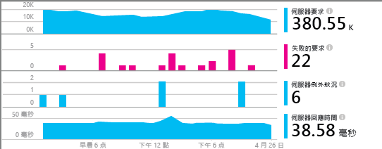
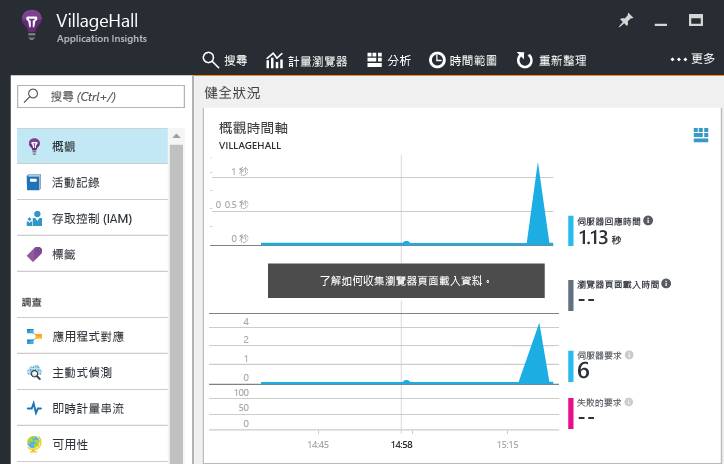

# <a name="monitor-your-nodejs-services-and-apps-with-application-insights"></a>使用 Application Insights 監視 Node.js 服務和應用程式

[Azure Application Insights](app-insights-overview.md) 會在您部署後端服務和元件之後加以監視，協助您[探索並快速診斷效能和其他問題](app-insights-detect-triage-diagnose.md)。 將它使用於任何地方裝載的 Node.js 服務︰您的資料中心、Azure VM 和 Web Apps，甚至式其他公用雲端。

若要接收、儲存和探索您的監視資料，請遵循下列指示，在您的程式碼中包含代理程式，並且在 Azure 中設定對應的 Application Insights 資源。 代理程式會將資料傳送至該資源，進行進一步的分析和探索。

Node.js 代理程式可以自動監視傳入和傳出 HTTP 要求、數個系統計量及例外狀況。 從 v0.20 開始，也可以監視一些常見的第三方套件，例如 `mongodb`、`mysql` 和 `redis`。 與傳入 HTTP 要求相關的所有事件都會相互關聯，以進行快速疑難排解。

使用稍後說明的代理程式 API 進行手動檢測，即可監視應用程式和系統的多個部分。



## <a name="getting-started"></a>開始使用

讓我們逐步設定應用程式或服務的監視。

### <a name="resource"></a>設定 App Insights 資源

**開始之前**，請確定您有 Azure 訂用帳戶或[免費取得一個新訂用帳戶][azure-free-offer]。 如果您的組織已經有 Azure 訂用帳戶，系統管理員可以依照 [這些指示][add-aad-user] 將您新增至該訂用帳戶。

[azure-free-offer]: https://azure.microsoft.com/en-us/free/
[add-aad-user]: https://docs.microsoft.com/en-us/azure/active-directory/active-directory-users-create-azure-portal

現在登入 [Azure 入口網站][portal]並建立 Application Insights 資源，如下所示 - 按一下 [新增] > [開發人員工具] > [Application Insights]。 此資源包含用於接收遙測資料的端點、此資料的儲存體、已儲存的報告和儀表板、規則和警示組態等等。


在資源建立頁面上，從 [應用程式類型] 下拉式清單中選擇 [Node.js 應用程式]。 應用程式類型可決定為您建立的預設儀表板和報告集合。 別擔心，任何 App Insights 資源實際上都可以從任何語言和平台收集資料。


### <a name="agent"></a> 設定 Node.js 代理程式

現在可以在您的應用程式中包含代理程式，以便蒐集資料。
如下所示，從入口網站複製資源的檢測金鑰 (以下稱為您的 `ikey`)。 App Insights 系統會使用此金鑰將資料對應至 Azure 資源，因此您必須在環境變數或您的程式碼中加以指定，以便代理程式使用。  


接著透過 package.json，將 Node.js 代理程式庫新增至您應用程式的相依性。 從您應用程式的根資料夾，執行︰

```bash
npm install applicationinsights --save
```

您現在需要在您的程式碼中明確地載入此程式庫。 因為代理程式會將檢測插入其他許多程式庫中，所以您應該儘早將它載入，甚至插入在其他 `require` 陳述式之前。 若要開始，請在第一個 .js 檔案頂端新增︰

```javascript
const appInsights = require("applicationinsights");
appInsights.setup("<instrumentation_key>");
appInsights.start();
```

`setup` 方法會針對所有追蹤的項目，設定預設要使用的檢測金鑰 (以及 Azure 資源)。 在設定完成後呼叫 `start`，開始蒐集和傳送遙測資料。

您也可以透過環境變數 APPINSIGHTS\_INSTRUMENTATIONKEY 提供 ikey，而非以手動方式將它傳遞至 `setup()` 或 `getClient()`。 這種做法可讓您將 ikeys 保留在認可的原始程式碼之外，並針對不同的環境指定不同的 ikey。

其他設定選項如以下述。

您可以將檢測金鑰設定為非空白字串，在不傳送遙測的情況下嘗試代理程式。

### <a name="monitor"></a> 監視您的應用程式

代理程式會自動蒐集有關 Node.js 執行階段和一些常見第三方模組的遙測。 現在使用您的應用程式來產生一些資料。

然後，在 [Azure 入口網站][portal]中瀏覽至您稍早建立的 Application Insights 資源，並且在 [概觀時間表] 中尋找您的前幾個資料點，如下圖所示。 逐一點選各個圖表以取得詳細資料。



按一下 [應用程式對應] 按鈕，以檢視針對您的應用程式找到的拓撲，如下列圖所示。 逐一點選對應中的各個元件，以取得詳細資料。


使用 [調查] 區段下其他可用的檢視，深入了解您的應用程式並針對問題進行疑難排解。


#### <a name="no-data"></a>沒有資料？

因為代理程式會分批提交資料，所以項目可能會延遲顯示在入口網站中。 如果您未在您的資源中看到資料，請嘗試以下一些修正方式︰

* 多使用一下應用程式；採取更多動作，以產生更多遙測。
* 按一下入口網站資源檢視中的 [重新整理]。 圖表會自動定期重新整理，但重新整理會強制此動作立即發生。
* 確認[所需的連出連接埠](app-insights-ip-addresses.md)已開啟。
* 開啟 [搜尋](app-insights-diagnostic-search.md) 圖格來查看個別事件。
* 查看[常見問題集][]。


## <a name="agent-configuration"></a>代理程式組態

以下是代理程式的設定方法及其預設值。

若要使服務中的事件完全相互關聯，請務必設定 `.setAutoDependencyCorrelation(true)`。 這可讓代理程式追蹤 Node.js 中所有非同步回呼的內容。

```javascript
const appInsights = require("applicationinsights");
appInsights.setup("<instrumentation_key>")
    .setAutoDependencyCorrelation(false)
    .setAutoCollectRequests(true)
    .setAutoCollectPerformance(true)
    .setAutoCollectExceptions(true)
    .setAutoCollectDependencies(true)
    .start();
```

## <a name="agent-api"></a>代理程式 API

<!-- TODO: Fully document agent API. -->

[這裡](app-insights-api-custom-events-metrics.md)有 .NET 代理程式 API 的完整說明。

您可以使用 Application Insights Node.js 用戶端來追蹤任何要求、事件、計量或例外狀況。 下列範例示範一些可用的 API。

```javascript
let appInsights = require("applicationinsights");
appInsights.setup().start(); // assuming ikey in env var
let client = appInsights.getClient();

client.trackEvent("my custom event", {customProperty: "custom property value"});
client.trackException(new Error("handled exceptions can be logged with this method"));
client.trackMetric("custom metric", 3);
client.trackTrace("trace message");

let http = require("http");
http.createServer( (req, res) => {
  client.trackRequest(req, res); // Place at the beginning of your request handler
});
```

### <a name="track-your-dependencies"></a>追蹤相依項目

```javascript
let appInsights = require("applicationinsights");
let client = appInsights.getClient();

var success = false;
let startTime = Date.now();
// execute dependency call here....
let duration = Date.now() - startTime;
success = true;

client.trackDependency("dependency name", "command name", duration, success);
```

### <a name="add-a-custom-property-to-all-events"></a>將自訂屬性新增至所有事件

```javascript
appInsights.client.commonProperties = {
    environment: process.env.SOME_ENV_VARIABLE
};
```

### <a name="track-http-get-requests"></a>追蹤 HTTP GET 要求

```javascript
var server = http.createServer((req, res) => {
    if ( req.method === "GET" ) {
            appInsights.client.trackRequest(req, res);
    }
    // other work here....
    res.end();
});
```

### <a name="track-server-startup-time"></a>追蹤伺服器啟動時間

```javascript
let start = Date.now();
server.on("listening", () => {
    let duration = Date.now() - start;
    appInsights.client.trackMetric("server startup time", duration);
});
```

## <a name="more-resources"></a>其他資源

* [在入口網站中監視遙測](app-insights-dashboards.md)
* [寫您的遙測的分析查詢](app-insights-analytics-tour.md)

<!--references-->

[portal]: https://portal.azure.com/
[常見問題集]: app-insights-troubleshoot-faq.md

