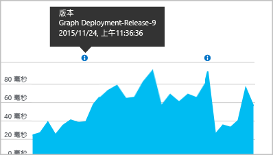

# <a name="separating-telemetry-from-development-test-and-production"></a>區分開發、測試及生產環境的遙測

當您在開發下一版 Web 應用程式時，您不會想看到新版與已發行版本的 [Application Insights](app-insights-overview.md) 遙測混合在一起。 為了避免混淆，請將不同開發階段的遙測，以不同的檢測金鑰 (ikey) 傳送到不同的 Application Insights 資源。 為了能夠在版本移到另一個階段時更輕鬆地變更檢測金鑰，您可以將 ikey 設定在程式碼中 (而不是設定在組態檔中)。 

(如果您的系統是「Azure 雲端服務」，有[另一個設定個別 ikey 的方法](app-insights-cloudservices.md))。

## <a name="about-resources-and-instrumentation-keys"></a>關於資源和檢測金鑰

在為 Web 應用程式設定 Application Insights 監視時，您會在 Microsoft Azure 中建立 Application Insights 資源。 您可以在 Azure 入口網站開啟此資源，以便查看並分析從應用程式中收集到的遙測資料。 透過「檢測金鑰」(iKey) 即可識別資源。 當您安裝 Application Insights 套件來監視應用程式時，您必須為它設定檢測金鑰，以便讓它知道要將遙測資料傳送到哪裡。

在不同情況下，您一般可以選擇使用不同資源或單一的共用資源︰

* 獨立的不同應用程式 - 為每個應用程式使用不同的資源和 ikey。
* 單一商務應用程式的多個元件或角色 - 為所有元件應用程式使用[單一的共用資源](app-insights-monitor-multi-role-apps.md)。 透過 cloud_RoleName 屬性即可篩選或區隔遙測。
* 開發、測試和發行 - 在生產「戳記」或階段，為各個系統版本使用不同的資源和 ikey。
* A | B 測試 - 使用單一資源。 建立 TelemetryInitializer 即可在遙測中新增屬性來識別變體。


## <a name="dynamic-ikey"></a> 動態檢測金鑰

若要能夠在程式碼歷經不同生產階段時更輕鬆地變更 ikey，請將 ikey 設定在程式碼中 (而不是設定在組態檔中)。

在初始化方法中設定金鑰，例如 ASP.NET 服務中的 global.aspx.cs：

*C#*

    protected void Application_Start()
    {
      Microsoft.ApplicationInsights.Extensibility.
        TelemetryConfiguration.Active.InstrumentationKey = 
          // - for example -
          WebConfigurationManager.AppSettings["ikey"];
      ...

在此範例中，不同資源的 ikeys 會放置在不同版本的 Web 組態檔中。 交換 Web 組態檔 (您可以在發行指令碼中進行) 將會交換目標資源。

### <a name="web-pages"></a>網頁
iKey 也會用在您的應用程式網頁中，在 [您從快速啟動刀鋒視窗取得的指令碼](app-insights-javascript.md)中。 不要按其原義編寫至指令碼，請從伺服器狀態產生。 例如，在 ASP.NET 應用程式中：

*Razor 中的 JavaScript*

    <script type="text/javascript">
    // Standard Application Insights web page script:
    var appInsights = window.appInsights || function(config){ ...
    // Modify this part:
    }({instrumentationKey:  
      // Generate from server property:
      "@Microsoft.ApplicationInsights.Extensibility.
         TelemetryConfiguration.Active.InstrumentationKey"
    }) // ...


## <a name="create-additional-application-insights-resources"></a>建立其他 Application Insights 資源
若要區分不同應用程式元件的遙測，或區分相同元件的不同戳記 (開發/測試/生產) 的遙測，則必須建立新的 Application Insights 資源。

在 [portal.azure.com](https://portal.azure.com)中新增 Application Insights 資源：

![按一下 [新增]，然後按一下 [Application Insights]](./media/app-insights-separate-resources/01-new.png)

* **應用程式類型** 會影響您在 [概觀] 刀鋒視窗中看到的內容，以及 [計量瀏覽器](app-insights-metrics-explorer.md)中提供的屬性。 如果沒有看到您的應用程式類型，請針對網頁選擇其中一個 Web 類型。
* **資源群組** 可讓您輕鬆管理屬性，例如 [存取控制](app-insights-resources-roles-access-control.md)。 您可以對開發、測試和生產環境使用不同的資源群組。
* **訂用帳戶** 是您在 Azure 中的付款帳戶。
* **位置** 是我們保留您資料的地方。 目前無法變更位置。 
* **新增至儀表板** 可在 Azure 首頁上放置資源的快速存取圖格。 

建立資源需要幾秒鐘。 完成時，您會看到警示。

(您可以撰寫 [PowerShell 指令碼](app-insights-powershell-script-create-resource.md)來自動建立資源)。

### <a name="getting-the-instrumentation-key"></a>取得檢測金鑰
檢測金鑰會識別您所建立的資源。 

![按一下 [基本功能]，按一下 [檢測金鑰]，CTRL+C](./media/app-insights-separate-resources/02-props.png)

您將需要您的應用程式會將資料傳送至其中的所有資源的檢測金鑰。

## <a name="filter-on-build-number"></a>篩選組建編號
當您發佈新的 App 版本時，希望能夠將不同組建的遙測分開。

您可以設定 [應用程式版本] 屬性，如此便能篩選[搜尋](app-insights-diagnostic-search.md)和[計量總管](app-insights-metrics-explorer.md)的結果。


設定 [應用程式版本] 屬性有幾種不同的方法。

* 直接設定：

    `telemetryClient.Context.Component.Version = typeof(MyProject.MyClass).Assembly.GetName().Version;`
* 在 [遙測初始設定式](app-insights-api-custom-events-metrics.md#defaults) 中將該行換行，以確保會以一致性方式設定所有 TelemetryClient 執行個體。
* [ASP.NET] 在 `BuildInfo.config`中設定版本。 Web 模組將會從 BuildLabel 節點取得版本。 在您的專案中包含此檔案， 而且記得要在 [方案總管] 中設定 [永遠複製] 屬性。

    ```XML

    <?xml version="1.0" encoding="utf-8"?>
    <DeploymentEvent xmlns:xsi="http://www.w3.org/2001/XMLSchema-instance" xmlns:xsd="http://www.w3.org/2001/XMLSchema" xmlns="http://schemas.microsoft.com/VisualStudio/DeploymentEvent/2013/06">
      <ProjectName>AppVersionExpt</ProjectName>
      <Build type="MSBuild">
        <MSBuild>
          <BuildLabel kind="label">1.0.0.2</BuildLabel>
        </MSBuild>
      </Build>
    </DeploymentEvent>

    ```
* [ASP.NET] 在 MSBuild 中自動產生 BuildInfo.config。 若要這樣做，請先在 `.csproj` 檔案中加入幾行：

    ```XML

    <PropertyGroup>
      <GenerateBuildInfoConfigFile>true</GenerateBuildInfoConfigFile>    <IncludeServerNameInBuildInfo>true</IncludeServerNameInBuildInfo>
    </PropertyGroup>
    ```

    這會產生一個稱為 *yourProjectName*.BuildInfo.config 的檔案。 發佈程序會將這個檔案重新命名為 BuildInfo.config。

    當您使用 Visual Studio 建置時，組建標籤會包含預留位置 (AutoGen_...)。 但是當使用 MSBuild 建立時，則會填入正確的版本號碼。

    若要允許 MSBuild 產生版本號碼，請在 AssemblyReference.cs 中設定類似 `1.0.*` 的版本

## <a name="version-and-release-tracking"></a>版本和版次追蹤
若要追蹤應用程式版本，請確定您的 Microsoft Build Engine 程序已產生 `buildinfo.config`。 在您的 .csproj 檔案中加入：  

```XML

    <PropertyGroup>
      <GenerateBuildInfoConfigFile>true</GenerateBuildInfoConfigFile>    <IncludeServerNameInBuildInfo>true</IncludeServerNameInBuildInfo>
    </PropertyGroup>
```

當它有組建資訊時，Application Insights Web 模組會自動新增 **應用程式版本** ，做為每個遙測項目的屬性。 如此可讓您在執行[診斷搜尋](app-insights-diagnostic-search.md)或在[探索計量](app-insights-metrics-explorer.md)時，依據版本來篩選。

但請注意，組建版本號碼只由 Microsoft Build Engine 產生，而不是由 Visual Studio 中的開發人員組建產生。

### <a name="release-annotations"></a>版本註解
如果您使用 Visual Studio Team Services，您可以[取得註解標記](app-insights-annotations.md) (每當發行新版本時，這會新增至您的圖表)。 下圖顯示此標記的顯示方式。


## <a name="next-steps"></a>後續步驟

* [多個角色的共用資源](app-insights-monitor-multi-role-apps.md)
* [建立遙測初始設定式來區分 A |B 變體](app-insights-api-filtering-sampling.md#add-properties)

