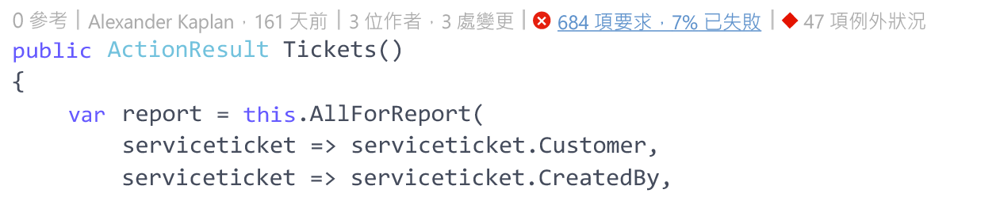
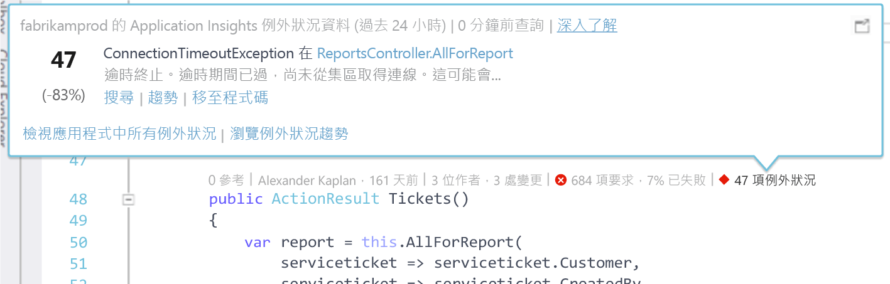
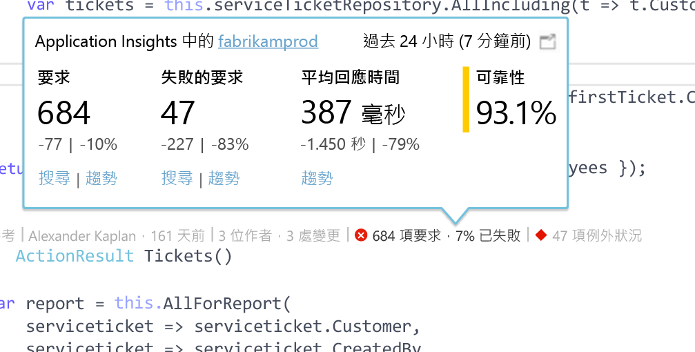

# Visual Studio CodeLens 中的 Application Insights 遙測
Web 應用程式的程式碼方法可透過遙測資料來標註出執行階段及要求回應時間。 如果您在應用程式中安裝 [Visual Studio Application Insights](app-insights-overview.md)，遙測會出現在 Visual Studio [CodeLens](https://msdn.microsoft.com/library/dn269218.aspx) - 各函式頂端的註解，也就是您慣於查看有否實用資訊之處，例如參考函式的位置數或上次編輯函式的人員。

> [!NOTE]
> CodeLens 中的 Application Insights 可用於 Visual Studio 2015 Update 3 及更新版本，或適用於最新版的 [開發人員分析工具延伸模組](https://visualstudiogallery.msdn.microsoft.com/82367b81-3f97-4de1-bbf1-eaf52ddc635a)。 CodeLens 適用於 Visual Studio 的 Enterprise 和 Professional 版本。
> 
> 

## 何處尋找 Application Insights 資料
請前往 Web 應用程式的公用要求方法，Application Insights 遙測資料可在其 CodeLens 指標中找到。 CodeLens 指標會顯示於 C# 和 Visual Basic 程式碼中的方法和其他宣告上方。 如果 Application Insights 資料可用於某個方法，您將會看到要求和例外狀況的指標，例如「100 個要求，%1 個失敗」或「10 個例外狀況」。 如需詳細資料，按一下 CodeLens 指標。 

> [!TIP]
> 在其他 CodeLens 指標出現後，Application Insights 要求和例外狀況指標可能需要額外幾秒鐘才能載入。
> 
> 

## CodeLens 中的例外狀況

例外狀況 CodeLens 指標在透過方法處理要求時，也會一面顯示過去 24 小時內您應用程式中 15 個最頻繁發生的例外狀況數目。

若要查看更多詳細資料，請按一下例外狀況 CodeLens 指標︰

* 最近 24 小時 (相對於前 24 小時) 內例外狀況數目的百分比變化
* 選擇 [移至程式碼]  可瀏覽至擲回例外狀況之函數的原始程式碼
* 選擇 [搜尋]  可查詢過去 24 小時內發生此例外狀況的所有執行個體
* 選擇 [趨勢]  可檢視過去 24 小時內此例外狀況的發生次數的趨勢視覺效果
* 選擇 [檢視此應用程式中的所有例外狀況]  可查詢過去 24 小時內發生的所有例外狀況
* 選擇 [探索例外狀況區域]  可檢視過去 24 小時內發生的所有例外狀況的趨勢視覺效果。 

> [!TIP]
> 如果您在 CodeLens 中看到「0 個例外狀況」，但您知道應該有例外狀況，請檢查並確定已在 CodeLens 中選取正確的 Application Insights 資源。 若要選取其他資源，請在 [方案總管] 中以滑鼠右鍵按一下您的專案，然後選擇 [Application Insights] > [選擇遙測來源]。 CodeLens 只會顯示過去 24 小時內您的應用程式中 15 個最頻繁發生的例外狀況，所以如果某例外狀況的發生頻率是第 16 位或更不常發生，您將會看到「0 個例外狀況」。 ASP.NET 檢視中的例外狀況可能不會出現在產生這些檢視的控制器方法上。
> 
> [!TIP]
> 如果您在 CodeLens 中看到「？ 個例外狀況」，您需要建立您的 Azure 帳戶與 Visual Studio 的關聯，否則您的 Azure 帳戶認證可能會過期。 在任一種情況下，按一下「？ 個例外狀況」，然後選擇 [新增帳戶...]  以輸入認證。
> 
> 

## CodeLens 中的要求

要求 CodeLens 指標會顯示過去 24 小時內方法已提供服務的 HTTP 要求數目，加上這些要求失敗的百分比。

若要查看更多詳細資料，請按一下要求 CodeLens 指標︰

* 過去 24 小時 (相較於前 24 小時) 內要求數目、失敗的要求或平均回應時間的絕對值和百分比變更
* 方法的可靠性，該值的計算方式為過去 24 小時內未失敗的要求百分比
* 選擇 [搜尋]  要求或失敗的要求，以查詢過去 24 小時內發生的所有 (失敗) 要求
* 選擇 [趨勢]  可檢視過去 24 小時內要求、失敗的要求或平均回應時間的趨勢視覺效果。
* 選擇 CodeLens 詳細資料檢視左上角的 Application Insights 資源名稱，以變更哪個資源是 CodeLens 資料的來源。

## 接續步驟
|  |  |
| --- | --- |
| **在 Visual Studio 中使用 Application Insights** 搜尋遙測、查看 CodeLens 中的資料，以及設定 Application Insights。 盡在 Visual Studio 中。 |![以滑鼠右鍵按一下專案，然後選擇 [Application Insights]、[搜尋]](./media/app-insights-visual-studio-codelens/34.png) |
| **新增更多測試** 監視使用狀況、可用性、相依性、例外狀況。 整合來自記錄架構的追蹤。 撰寫自訂遙測。 | |
| **[使用 Application Insights 入口網站](app-insights-dashboards.md)** 儀表板、功能強大的診斷和分析工具、警示、即時的應用程式相依性對應，以及遙測匯出等功能。 | |

<!--HONumber=Nov16_HO2-->

