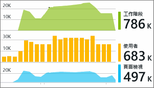

# 在 Visual Studio 中使用 Azure Application Insights 進行應用程式偵錯
在 Visual Studio (2015 和更新版本) 中，您可以使用 [Azure Application Insights](app-insights-overview.md) 的遙測，在偵錯時和在生產環境中分析 ASP.NET Web 應用程式的效能並診斷問題。

如果您使用 Visual Studio 2017 或更新版本建立 ASP.NET web 應用程式，它已經有 Application Insights SDK。 否則，如果您尚未這麼做，[將 Application Insights 新增至您的應用程式](app-insights-asp-net.md)。

若要監視實際運作的應用程式，您通常可在 [Azure 入口網站](https://portal.azure.com)中檢視 Application Insights 遙測，您可以在其中設定警示及套用功能強大的監視工具。 但若要進行偵錯，您也可以在 Visual Studio 中搜尋和分析遙測資料。 您可以使用 Visual Studio 分析來自您的生產網站以及來自開發電腦上偵錯執行的遙測。 在後者的情況下，即使您尚未設定 SDK 將遙測傳送至 Azure 入口網站，仍可以分析偵錯執行。 

##  偵錯您的專案
使用 F5，在本機偵錯模式下執行 Web 應用程式。 開啟不同的頁面來產生一些遙測。

在 Visual Studio 中，您可以看見 Application Insights 模組在您的專案中記錄的事件計數。

![在 Visual Studio 中，[Application Insights] 按鈕會在偵錯期間顯示。](./media/app-insights-visual-studio/appinsights-09eventcount.png)

按一下此按鈕以搜尋遙測。 

## Application Insights 搜尋
[Application Insights 搜尋] 視窗會顯示已記錄的事件。 (如果您在設定 Application Insights 時登入至 Azure，即可在 Azure 入口網站搜尋相同的事件。)

![以滑鼠右鍵按一下專案，然後選擇 [Application Insights]、[搜尋]](./media/app-insights-visual-studio/34.png)

> [!NOTE] 
> 選取或取消選取篩選條件之後，按一下文字搜尋欄位結尾的 [搜尋] 按鈕。
>

任意文字搜尋適用於事件中的任何欄位。 例如，搜尋頁面的 URL 的一部分；或者如用戶端城市的屬性值；或者追蹤記錄檔中的特定單字。

按一下任何事件以查看其詳細屬性。

對於 Web 應用程式的要求，您可以點閱程式碼。

![在 [要求詳細資料] 之下，點閱程式碼。](./media/app-insights-visual-studio/31.png)

您也可以開啟相關項目，協助診斷失敗的要求或例外狀況。

![在 [要求詳細資料] 之下，向下捲動相關項目](./media/app-insights-visual-studio/41.png)

## 檢視例外狀況和失敗的要求
例外狀況報告會顯示在 [搜尋] 視窗中。 (在某些較舊的 ASP.NET 應用程式類型中，您必須[設定例外狀況監視](app-insights-asp-net-exceptions.md)，以查看架構所處理的例外狀況。)

按一下例外狀況以取得堆疊追蹤。 如果應用程式的程式碼在 Visual Studio 中開啟，您可以從堆疊追蹤點選至程式碼的相關程式碼行。

## 檢視程式碼中的要求和例外狀況摘要
在每個處理常式方法之上的 Code Lens 行中，您會看到過去 24 小時內由 Application Insights 記錄的要求和例外狀況計數。

> [!NOTE] 
> 只有在您[設定應用程式以將遙測傳送至 Application Insights 入口網站](app-insights-asp-net.md)後，Code Lens 才會顯示 Application Insights 資料。
>

[深入了解 Code Lens 中的 Application Insights](app-insights-visual-studio-codelens.md)

## 趨勢
趨勢是用來將應用程式一段時間內行為方式進行視覺化的工具。 

從 Application Insights 工具列按鈕或 [Application Insights 搜尋] 視窗選擇 [探索遙測趨勢]  。 選擇五種常見查詢的其中一個，以便開始使用。 您可以根據遙測類型、時間範圍和其他屬性，分析不同的資料集。 

若要尋找資料中的異常狀況，請選擇 [檢視類型] 下拉式清單底下的其中一個異常選項。 視窗底部的篩選選項可讓您輕鬆地全神貫注於特定的遙測子集。

[深入了解趨勢](app-insights-visual-studio-trends.md)。

## 本機監視
(從 Visual Studio 2015 Update 2 開始) 如果您尚未設定 SDK 以將遙測傳送至 Application Insights 入口網站 (以便讓 ApplicationInsights.config 中沒有任何檢測金鑰)，則 [診斷] 視窗會顯示來自最新偵錯工作階段的遙測。 

如果您已發佈過應用程式先前的版本，這是比較好的做法。 您不會想讓來自偵錯工作階段的遙測與 Application Insights 入口網站中來自已發佈之應用程式的遙測混在一起。

如果您在將遙測傳送至入口網站之前有一些 [自訂遙測](app-insights-api-custom-events-metrics.md) 想要偵錯，它也很有用。

* 首先，我完全設定 Application Insights 將遙測傳送至入口網站。但是現在我只想要查看在 Visual Studio 中的遙測。
  
  * 在 [搜尋] 視窗的 [設定] 中，即使您的應用程式將遙測傳送至入口網站，也有選項可搜尋本機診斷。
  * 若要停止將遙測傳送至入口網站，請將 ApplicationInsights.config 中的 `<instrumentationkey>...` 程式行註解化。 當您準備再次將遙測傳送至入口網站時，請取消註解。

## 後續步驟
|  |  |
| --- | --- |
| **[新增更多測試](app-insights-asp-net-more.md)** 監視使用狀況、可用性、相依性、例外狀況。 整合來自記錄架構的追蹤。 撰寫自訂遙測。 | |
| **[使用 Application Insights 入口網站](app-insights-dashboards.md)** 檢視儀表板、功能強大的診斷和分析工具、警示、即時的應用程式相依性對應，以及匯出的遙測資料。 | |

