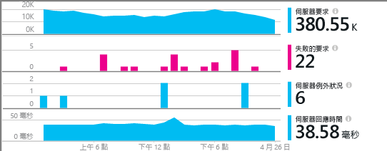
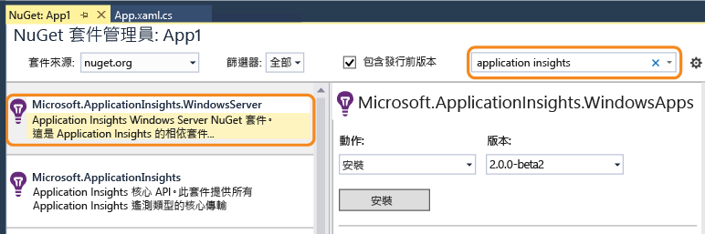
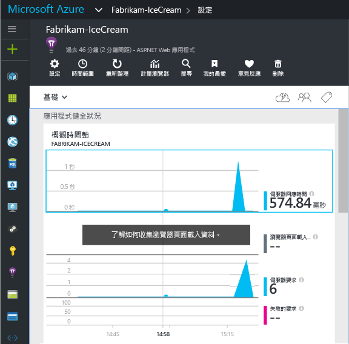
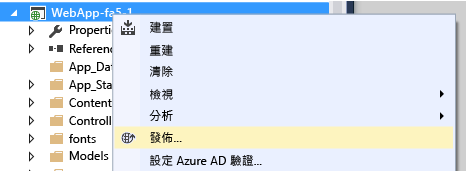

# 為 ASP.NET 應用程式手動設定 Application Insights
[Application Insights](app-insights-overview.md) 是一項可延伸的工具，可供 Web 開發人員監視即時應用程式的效能和使用情形。 您可以手動進行設定，以監視 Windows 伺服器、背景工作角色和其他 ASP.NET 應用程式。 對於 Web 應用程式，Visual Studio 提供手動設定作為 [自動設定](app-insights-asp-net.md) 的替代方法。

#### 開始之前
您需要：

* [Microsoft Azure](http://azure.com)訂用帳戶。 如果您的小組或組織擁有 Azure 訂用帳戶，擁有者就可以使用您的 [Microsoft 帳戶](http://live.com)將您加入。
* Visual Studio 2013 或更新版本。

## 1.建立 Application Insights 資源
登入 [Azure 入口網站](https://portal.azure.com/)，並建立新的 Application Insights 資源。 選擇 ASP.NET 做為應用程式類型。

![按一下 [新增]，然後按一下 [Application Insights]](./media/app-insights-windows-services/01-new-asp.png)

Azure 中的 [資源](app-insights-resources-roles-access-control.md) 是服務的執行個體。 此資源是來自您應用程式的遙測將經過分析並呈現的地方。

應用程式類型的選擇會設定 [計量瀏覽器](app-insights-metrics-explorer.md)中可見的資源刀鋒視窗和屬性的預設內容。

#### 複製檢測金鑰
該金鑰識別資源，您很快就會將它安裝在 SDK 中，以將資源導向資料。

![按一下 [屬性]，選取金鑰，然後按下 CTRL+C](./media/app-insights-windows-services/02-props-asp.png)

您剛才所完成用來建立新資源的步驟是開始監視任何應用程式的好方法。 現在您可以將資料傳送給它。

## 2.在您的應用程式中安裝 Application Insights 套件
安裝和設定 Application Insights 套件會因您所正在使用的平台而有所不同。 對於 ASP.NET 應用程式而言，這非常輕鬆。

1. 在 Visual Studio 中，編輯 Web 應用程式專案的 NuGet 套件。
   
    ![以滑鼠右鍵按一下專案，然後選取 [管理 NuGet 套件]](./media/app-insights-windows-services/03-nuget.png)
2. 針對 Windows Server 應用程式安裝 Application Insights 套件。
   
    
   
    *可以使用其他封裝嗎？*
   
    是。 如果您只想要使用 API 來傳送您自己的遙測，請選擇核心 API (Microsoft.ApplicationInsights)。 Windows Server 封裝會自動包含核心 API 及其他封裝，例如效能計數器收集和相依性監視。 

#### 升級至未來的套件版本
我們隨時會發行新版的 SDK。

若要升級至[新版的套件](https://github.com/Microsoft/ApplicationInsights-dotnet-server/releases/)，請再次開啟 NuGet 套件管理員，並篩選出已安裝的套件。 選取 **Microsoft.ApplicationInsights.WindowsServer**，然後選擇 [升級]。

如果您已對 ApplicationInsights.config 進行任何的自訂，請在升級前儲存複本，並在升級後合併您的變更到新版本中。

## 3.傳送遙測
**如果您只安裝核心 API 封裝︰**

* 在程式碼中設定檢測金鑰，例如在 `main()`中： 
  
    `TelemetryConfiguration.Active.InstrumentationKey = "`您的金鑰 `";` 
* [使用 API 撰寫自己的遙測](app-insights-api-custom-events-metrics.md#ikey)。

**如果您安裝了其他 Application Insights 封裝** ，您可以視需要使用 .config 檔案來設定檢測金鑰︰

* 編輯 ApplicationInsights.config (已由 NuGet 安裝加入)。 在結尾標記前面插入此內容：
  
    `<InstrumentationKey>`您複製的檢測金鑰 `</InstrumentationKey>`
* 確定 [方案總管] 中 ApplicationInsights.config 的屬性已設定為 [建置動作] = [內容]、[複製到輸出目錄] = [複製] 。

如果您想要[針對不同建置組態切換金鑰](app-insights-separate-resources.md)，在程式碼中設定檢測金鑰便很實用。 如果您在程式碼中設定金鑰，您不必在 `.config` 檔案中設定它。

##  執行專案
使用 **F5** 執行應用程式並立即試用：開啟不同的頁面來產生一些遙測。

在 Visual Studio 中，您可以看見已傳送到的事件計數。

##  檢視遙測
返回 [Azure 入口網站](https://portal.azure.com/) ，並且瀏覽至您的 Application Insights 資源。

在 [概觀] 圖表中尋找資料。 剛開始的時候，您只會看見一或兩個資料點。 例如：

按一下任何圖表以查看詳細度量。 [深入了解度量。](app-insights-web-monitor-performance.md)

#### 沒有資料？
* 使用應用程式、開啟不同頁面，以產生一些遙測。
* 開啟 [ [搜尋](app-insights-diagnostic-search.md) ] 磚來查看個別事件。 有時候，事件通過計量管線所需的時間較長。
* 請稍等片刻，然後按一下 [重新整理 ]。 圖表會定期自行重新整理，但是如果您在等待一些要顯示的資料，您可以手動重新整理。
* 請參閱 [疑難排解](app-insights-troubleshoot-faq.md)。

## 發佈您的應用程式
現在將應用程式部署至您的伺服器或 Azure，並觀看資料累積情形。

以偵錯模式執行時，系統會透過管線迅速傳送遙測資料，因此您應該可以在幾秒內看見資料。 以發行組態部署應用程式時，資料累積會較為緩慢。

#### 發佈資料到伺服器之後，卻沒有資料？
請在您的伺服器防火牆中，開啟這些連出流量的連接埠：

* `dc.services.visualstudio.com:443`
* `f5.services.visualstudio.com:443`

#### 組建伺服器發生問題？
請參閱 [此疑難排解項目](app-insights-asp-net-troubleshoot-no-data.md#NuGetBuild)。

> [!NOTE]
> 如果您的應用程式會產生大量遙測 (且您使用的是 ASP.NET SDK 版本 2.0.0-beta3 或較新)，調適性取樣模型會自動藉由僅傳送事件代表性片段，以減少傳送到入口網站的量。 不過，與同一個要求相關的事件會選取或取消選取為群組，讓您可以在相關事件之間瀏覽。 
> [了解取樣](app-insights-sampling.md)。
> 
> 

## 影片

> [!VIDEO https://channel9.msdn.com/events/Connect/2016/100/player]

## 後續步驟
* [新增更多遙測](app-insights-asp-net-more.md) 可取得應用程式的完整 360 度檢視。

