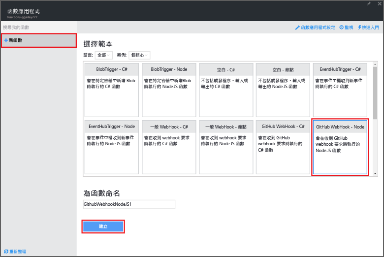
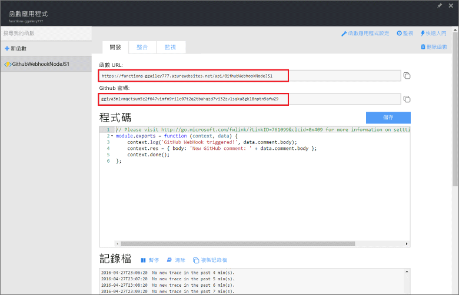
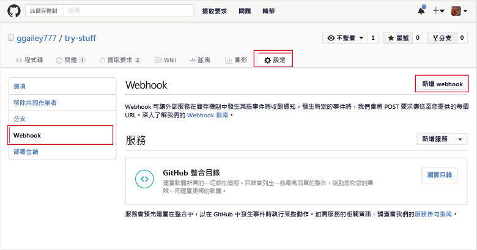
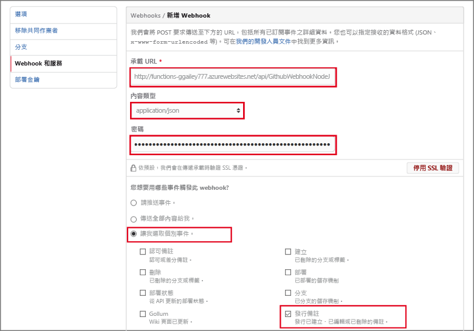

<properties
   pageTitle="建立 Web 攔截或 API Azure 函數 | Microsoft Azure"
   description="使用 Azure Functions 建立 WebHook 或 API 呼叫所叫用的函數。"
   services="azure-functions"
   documentationCenter="na"
   authors="ggailey777"
   manager="erikre"
   editor=""
   tags=""
   />

<tags
   ms.service="functions"
   ms.devlang="multiple"
   ms.topic="get-started-article"
   ms.tgt_pltfrm="multiple"
   ms.workload="na"
   ms.date="05/07/2016"
   ms.author="glenga"/>
   
# 建立 Webhook 或 API Azure 函式

Azure Functions 是事件驅動、依需求計算的體驗，可讓您建立以各種程式設計語言實作的已排程或觸發的程式碼單位。若要深入了解 Azure Functions，請參閱 [Azure Functions 概觀](functions-overview.md)。

本主題說明如何建立由 GitHub Webhook 叫用的新 Node.js 函式。新的函式是根據 Azure Functions 入口網站中的預先定義範本所建立。您也可以觀賞短片，了解如何在入口網站中執行這些步驟。

## 觀賞影片

下列影片顯示如何在本教學課程中執行基本步驟

[AZURE.VIDEO create-a-web-hook-or-api-azure-function]

##從範本建立 Webhook 觸發函式

函式應用程式可在 Azure 中主控函式的執行。您必須先具備有效的 Azure 帳戶，才可以建立函式。如果您還沒有 Azure 帳戶，[可以使用免費帳戶](https://azure.microsoft.com/free/)。

1. 移至 [Azure Functions 入口網站](https://functions.azure.com/signin)，然後以您的 Azure 帳戶登入。

2. 如果您要使用現有的函式應用程式，請從 [Your function apps] \(函式應用程式) 中選取，然後按一下 [開啟]。若要建立新的函式應用程式，請輸入新函式應用程式的唯一 [名稱] 或接受所產生的名稱，選取您偏好的 [區域]，然後按一下 [Create + get started] \(建立 + 開始)。

3. 在函式應用程式中，依序按一下 [+ New Function] \(+ 新增函式) > [GitHub Webhook - Node] \(GitHub Webhook - 節點) > [建立]。這會根據指定的範本以預設名稱建立函式。

	

4. 在 [開發] 索引標籤上，注意 [程式碼] 視窗中的範例 express.js 函式。這個函式從問題註解 Webhook 接收 GitHub 要求、記錄問題文字，將回應傳送到 Webhook 當做 `New GitHub comment: <Your issue comment text>`。

	

5. 複製 [函式 URL] 和 [GitHub 密碼] 值。當您在 GitHub 中建立 Webhook 時，您會需要它們。

6. 向下捲動至 [執行]，注意要求主體中問題註解之預先定義的 JSON 主體，然後按一下 [執行]。
 
	只要提供所有預期主體的 JSON 資料，然後按一下 [執行] 按鈕，就可以在 [開發] 索引標籤中測試新的範本函式。這樣範本就有問題註解的預先定義主體。
 
接下來，您要在 GitHub 儲存機制中建立實際的 Webhook。

##設定 Webhook

1. 在 GitHub 中，瀏覽至您擁有的儲存機制，這包括您分岔的任何儲存機制。
 
2. 按一下 [設定] > [Webhooks & services] \(Webhooks 和服務) > [Add Webhook] \(加入 Webhook)。

	

3. 將您的函式 URL 和密碼貼入 [Payload URL] \(承載 URL) 和 [密碼]，然後按一下 [Let me select individual events] \(讓我選擇個別事件)，選取 [問題註解] 並按一下 [Add Webhook] \(加入 Webhook)。

	

此時，GitHub Webhook 會設定成在加入新的問題註解時觸發您的函式。現在，請測試它。

##測試函式

1. 在 GitHub 儲存機制中的新瀏覽器視窗中開啟 [問題] 索引標籤，按一下 [新增問題]，輸入標題，然後按一下 [Submit new issue] \(提交新問題)。您也可以開啟現有的問題。

2. 在問題中輸入註解，然後按一下 [註解]。此時，您可以回到 GitHub 的新 Webhook，在 [Recent Deliveries] \(最近的傳遞) 下查看已傳送的 Webhook 要求及 `New GitHub comment: <Your issue comment text>` 回應本文。

3. 回到 Functions 入口網站，向下捲動至記錄檔，查看已觸發的函式和已寫入資料流記錄檔的值 `New GitHub comment: <Your issue comment text>`。

##後續步驟

如需 Azure Functions 的詳細資訊，請參閱下列主題。

+ [Azure Functions 開發人員參考](functions-reference.md) 可供程式設計人員撰寫函式程式碼時參考。
+ [測試 Azure Functions](functions-test-a-function.md) 說明可用於測試函式的各種工具和技巧。
+ [如何調整 Azure 函式](functions-scale.md)討論 Azure Functions 可用的服務方案，包括動態服務方案，以及如何選擇正確的方案。  

[AZURE.INCLUDE [開始使用注意事項](../../includes/functions-get-help.md)]

<!---HONumber=AcomDC_0615_2016-->